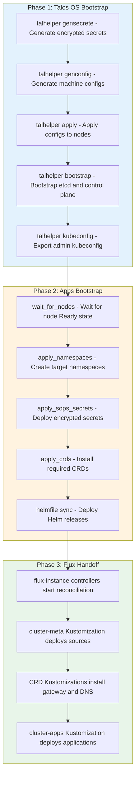
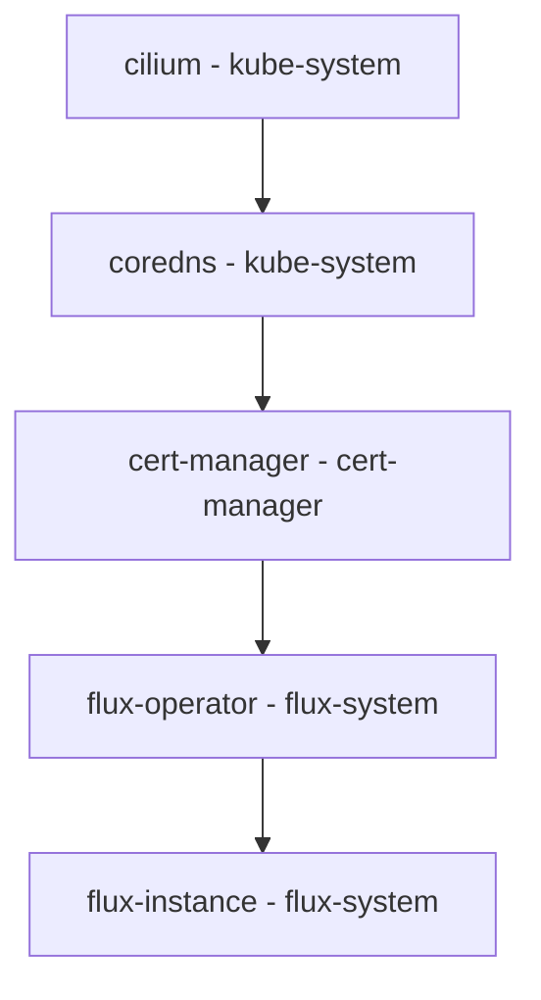
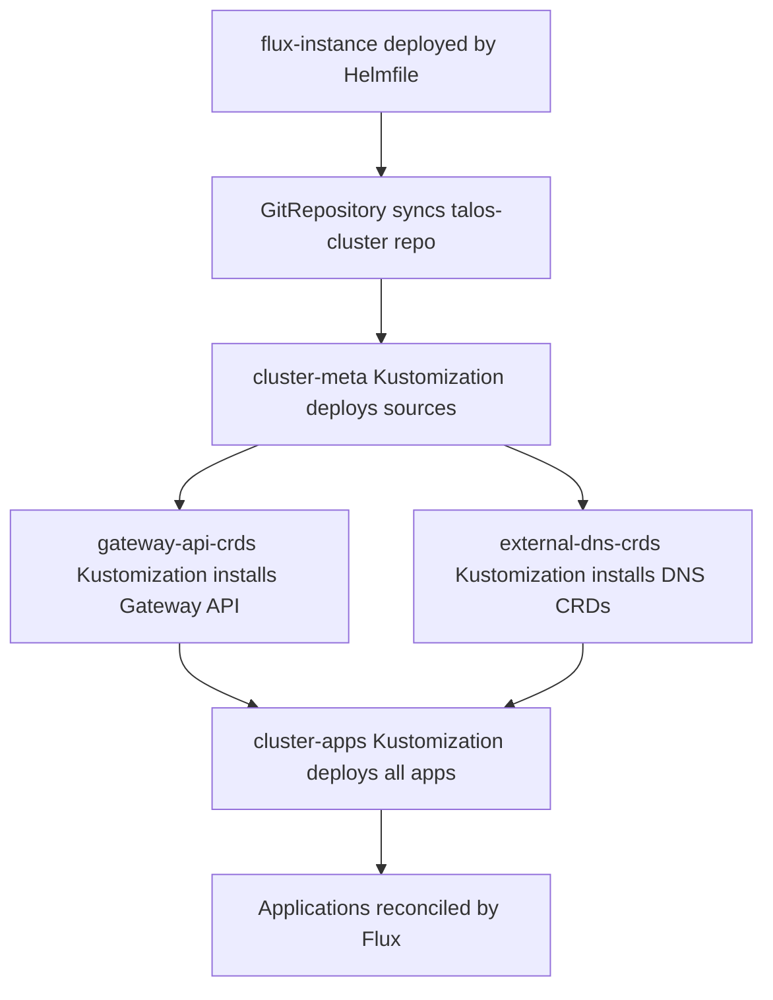

# Bootstrap Flow

The cluster bootstrap process transforms bare-metal hardware into a fully operational GitOps-managed Kubernetes cluster through a three-phase approach. Phase 1 establishes the Talos Linux control plane using talhelper, Phase 2 installs critical infrastructure components via Helmfile, and Phase 3 hands off continuous reconciliation to Flux.

## Bootstrap Overview

*Figure: Complete bootstrap sequence showing the three phases from Talos initialization through Flux-controlled GitOps*

## Phase 1: Talos OS Bootstrap

The Talos bootstrap phase creates the Kubernetes control plane on bare-metal hardware using talhelper as the orchestration tool.

### Task Execution

The `task bootstrap:talos` command (`.taskfiles/bootstrap/Taskfile.yaml#L7-L20`) executes the following steps:

1. **Secret Generation** (`.taskfiles/bootstrap/Taskfile.yaml#L11`)
   - Checks for existing `talsecret.sops.yaml`
   - If missing, generates Talos cluster secrets via `talhelper gensecret`
   - Encrypts secrets using SOPS with age and saves to `talos/talsecret.sops.yaml`

2. **Config Generation** (`.taskfiles/bootstrap/Taskfile.yaml#L12`)
   - Runs `talhelper genconfig` to produce machine configurations
   - Reads from `talos/talconfig.yaml` as the source definition
   - Generates node-specific configs in `talos/clusterconfig/`

3. **Node Apply** (`.taskfiles/bootstrap/Taskfile.yaml#L13`)
   - Executes `talhelper gencommand apply` with `--insecure` flag
   - Applies machine configurations to target nodes via Talos API
   - Establishes initial node state

4. **Bootstrap** (`.taskfiles/bootstrap/Taskfile.yaml#L14`)
   - Retries `talhelper gencommand bootstrap` until successful
   - Initializes etcd and Kubernetes control plane components
   - Transforms nodes into a functioning cluster

5. **Kubeconfig Export** (`.taskfiles/bootstrap/Taskfile.yaml#L15`)
   - Runs `talhelper gencommand kubeconfig` with `--force` flag
   - Exports admin kubeconfig to `./kubeconfig`
   - Enables Kubernetes API access for Phase 2

### Talos Configuration

The `talos/talconfig.yaml` file defines cluster topology and node specifications:

**Cluster Settings** (`talos/talconfig.yaml#L3-L15`)
- Cluster name: `kubernetes`
- Endpoint: `https://192.168.50.10:6443` (VIP address)
- Pod network: `10.42.0.0/16`
- Service network: `10.43.0.0/16`
- CNI: `none` (Cilium installed separately)

**Node Definition** (`talos/talconfig.yaml#L22-L64`)
- Single control-plane node with secure-boot enabled
- Static IP configuration with VIP assignment
- Custom kernel modules (LVM, Intel GPU drivers)
- User volume provisioning for local-path-provisioner

### Prerequisites

The bootstrap task enforces these preconditions (`.taskfiles/bootstrap/Taskfile.yaml#L16-L20`):
- SOPS configuration exists (`.sops.yaml`)
- Age private key available (`SOPS_AGE_KEY_FILE`)
- Talconfig file present (`talos/talconfig.yaml`)
- Required CLI tools installed (talhelper, talosctl, sops)

## Phase 2: Apps Bootstrap

Once Talos is operational, the `task bootstrap:apps` command (`.taskfiles/bootstrap/Taskfile.yaml#L22-L30`) executes `scripts/bootstrap-apps.sh` to install critical infrastructure before Flux takes over.

### Node Availability Check

The `wait_for_nodes` function (`scripts/bootstrap-apps.sh#L10-L24`) handles Talos node state transitions:

- Skips waiting if all nodes are already `Ready=True`
- Waits for nodes to reach `Ready=False` state, which Talos requires before resource application
- Retries every 10 seconds with logging

### Namespace Creation

The `apply_namespaces` function (`scripts/bootstrap-apps.sh#L27-L54`) creates required namespaces:

- Scans `kubernetes/apps/` directory for namespace directories
- Creates each namespace using `kubectl create namespace` with `--dry-run=client`
- Applies with `--server-side` flag to avoid conflicts
- Skips existing namespaces to prevent errors

### SOPS Secrets Deployment

The `apply_sops_secrets` function (`scripts/bootstrap-apps.sh#L57-L85`) deploys encrypted secrets required by Helm releases:

**Secret Sources** (`scripts/bootstrap-apps.sh#L60-L64`)
- `bootstrap/github-deploy-key.sops.yaml` - Git authentication for Flux
- `kubernetes/components/common/sops/cluster-secrets.sops.yaml` - Cluster-wide configuration secrets
- `kubernetes/components/common/sops/sops-age.sops.yaml` - Age decryption key for Flux

**Decryption Process**
- Uses `sops exec-file` to decrypt each secret in-memory
- Pipes decrypted content to `kubectl apply` with `--server-side`
- Applies to `flux-system` namespace
- Checks for changes using `kubectl diff` before applying

**Encryption Rules** (`.sops.yaml#L6-L9`)
- Pattern: `(bootstrap|kubernetes)/.*\.sops\.ya?ml`
- Encrypts only `data` and `stringData` fields
- Maintains YAML structure for Git readability
- Uses age recipient: `age1shkd7fsr66cnpkutpmpf7ffylcc2x4c9tlsdkapv6nmu5ceu0dzqdjtqc5`

### CRD Installation

The `apply_crds` function (`scripts/bootstrap-apps.sh#L88-L118`) installs Custom Resource Definitions required by Helm charts:

**CRD Sources** (`scripts/bootstrap-apps.sh#L91-L105`)
- **External DNS CRDs** (v0.21.0) - Required for external-dns
  - Also managed by Flux but duplicated for bootstrap safety
  - Source: `dnsendpoints.externaldns.k8s.io.yaml`
- **Gateway API CRDs** (v1.6.1) - Required for Cilium Gateway API integration
  - Experimental features enabled
  - Also managed by Flux but duplicated for bootstrap safety
  - Source: `experimental-install.yaml`

**Installation Process**
- Checks `kubectl diff` for existing CRDs
- Applies with `--server-side` flag
- Skips if already up-to-date
- Comments note that Prometheus Operator CRDs are managed by Flux, not bootstrap

### Helmfile Synchronization

The `sync_helm_releases` function (`scripts/bootstrap-apps.sh#L121-L135`) uses Helmfile to deploy critical infrastructure:

**Helmfile Configuration** (`bootstrap/helmfile.yaml`)

**Release Order** (with dependency graph):

**Release Details** (`bootstrap/helmfile.yaml#L14-L52`):

1. **Cilium** (`bootstrap/helmfile.yaml#L14-L19`)
   - Chart: `cilium/cilium` v1.20.0
   - Namespace: `kube-system`
   - Values: `../kubernetes/apps/kube-system/cilium/app/helm/values.yaml`
   - Atomic: true (rollback on failure)

2. **CoreDNS** (`bootstrap/helmfile.yaml#L21-L27`)
   - Chart: `oci://ghcr.io/coredns/charts/coredns` v1.47.0
   - Namespace: `kube-system`
   - Depends on: `kube-system/cilium`
   - Values: `../kubernetes/apps/kube-system/coredns/app/helm/values.yaml`

3. **cert-manager** (`bootstrap/helmfile.yaml#L30-L36`)
   - Chart: `oci://quay.io/jetstack/charts/cert-manager` v1.21.1
   - Namespace: `cert-manager`
   - Depends on: `kube-system/coredns`
   - Values: `../kubernetes/apps/cert-manager/cert-manager/app/helm/values.yaml`

4. **flux-operator** (`bootstrap/helmfile.yaml#L38-L44`)
   - Chart: `oci://ghcr.io/controlplaneio-fluxcd/charts/flux-operator` v0.57.0
   - Namespace: `flux-system`
   - Depends on: `cert-manager/cert-manager`
   - Values: `../kubernetes/apps/flux-system/flux-operator/app/helm/values.yaml`

5. **flux-instance** (`bootstrap/helmfile.yaml#L46-L52`)
   - Chart: `oci://ghcr.io/controlplaneio-fluxcd/charts/flux-instance` v0.57.0
   - Namespace: `flux-system`
   - Depends on: `flux-system/flux-operator`
   - Values: `../kubernetes/apps/flux-system/flux-instance/app/helm/values.yaml`

**Helmfile Settings** (`bootstrap/helmfile.yaml#L4-L7`)
- `cleanupOnFail: true` - Remove resources on failure
- `wait: true` - Wait for releases to be ready
- `waitForJobs: true` - Wait for jobs to complete

## Phase 3: Flux Handoff

Once flux-instance is deployed by Helmfile, Flux controllers begin reconciling the cluster state from the Git repository.

### Flux Instance Configuration

The flux-instance Helm chart configures the reconciliation behavior (`kubernetes/apps/flux-system/flux-instance/app/helm/values.yaml#L15-L19`):

**Sync Settings** (`kubernetes/apps/flux-system/flux-instance/app/helm/values.yaml#L15-L19`)
- Kind: `GitRepository`
- URL: `https://github.com/tomyail/talos-cluster.git`
- Branch: `refs/heads/main`
- Path: `kubernetes/flux/cluster`

**Components** (`kubernetes/apps/flux-system/flux-instance/app/helm/values.yaml#L8-L14`)
- source-controller
- kustomize-controller
- helm-controller
- notification-controller
- image-reflector-controller
- image-automation-controller

### Reconciliation Entry Point

Flux begins reconciliation from `kubernetes/flux/cluster/ks.yaml`, which defines the Kustomization hierarchy:

**cluster-meta** (`kubernetes/flux/cluster/ks.yaml#L5-L23`)
- First Kustomization to execute
- Deploys source repositories from `kubernetes/flux/meta`
- Enables SOPS decryption using `sops-age` secret
- Hardcodes `flux-system` namespace for Renovate compatibility
- Interval: 1 hour

**gateway-api-crds** (`kubernetes/flux/cluster/ks.yaml#L29-L44`)
- Depends on: `cluster-meta`
- Installs Gateway API experimental CRDs
- Source: Gateway API GitRepository
- Timeout: 5 minutes

**external-dns-crds** (`kubernetes/flux/cluster/ks.yaml#L50-L65`)
- Depends on: `cluster-meta`
- Installs External DNS standard CRDs
- Source: external-dns-crds GitRepository
- Timeout: 5 minutes

**cluster-apps** (`kubernetes/flux/cluster/ks.yaml#L71-L94`)
- Depends on: `cluster-meta`, `gateway-api-crds`, `external-dns-crds`
- Deploys all applications from `kubernetes/apps`
- Enables SOPS decryption for application secrets
- Interval: 1 hour
- Timeout: 5 minutes

### Dependency Ordering

The Flux reconciliation order ensures correct dependency satisfaction:

*Figure: Flux reconciliation flow showing how bootstrap handoff transitions to GitOps control*

## Bootstrap Prerequisites

Both bootstrap phases require these prerequisites to be satisfied:

### Environment Variables

The root Taskfile sets required environment variables (`Taskfile.yaml#L16-L19`):
- `KUBECONFIG: ./kubeconfig` - Kubernetes admin access
- `SOPS_AGE_KEY_FILE: ./age.key` - Age decryption private key
- `TALOSCONFIG: ./talos/clusterconfig/talosconfig` - Talos admin access

### CLI Tools

Required tools are managed via mise (`.mise.toml`):
- `talhelper` - Talos configuration generation
- `talosctl` - Talos cluster management
- `kubectl` - Kubernetes API interaction
- `helmfile` - Helm release orchestration
- `sops` - Secret encryption/decryption
- `age` - Age encryption operations
- `yq` - YAML processing

### Secret Keys

The bootstrap process requires these encryption keys:
- Age private key for SOPS decryption (`age.key`)
- Talos cluster secrets (generated or existing `talos/talsecret.sops.yaml`)
- GitHub deploy key (for Flux GitRepository authentication)

## Bootstrap Verification

After completing both bootstrap phases, the cluster enters GitOps-managed state:

**Success Indicators**
- All nodes show `Ready=True` status
- Flux controllers are running in `flux-system` namespace
- Kustomizations show `Ready=True` with latest revision
- Applications from `kubernetes/apps/` are deployed
- No failing HelmReleases or Kustomizations

**Post-Bootstrap Operations**
- All cluster changes go through Git commits
- Flux automatically reconciles repository changes
- ImageUpdateAutomation handles image updates
- Manual reconciliation available via `task reconcile`

## Failure Recovery

Bootstrap failures can occur at several points:

**Talos Bootstrap Failures**
- Node unreachable: Check network connectivity and IP configuration
- Bootstrap timeout: Verify node hardware meets requirements
- Config apply failure: Validate `talconfig.yaml` syntax

**Apps Bootstrap Failures**
- Secret decryption failure: Verify `SOPS_AGE_KEY_FILE` is correct
- CRD conflicts: Check for pre-existing CRDs from previous installations
- Helmfile sync failure: Check chart availability and values syntax

**Flux Handoff Failures**
- GitRepository sync failure: Verify GitHub authentication and repository access
- Kustomization dependency errors: Ensure all dependencies are satisfied
- SOPS decryption in Flux: Verify `sops-age` secret is correctly deployed

## Related Documentation

- [Flux GitOps Architecture](/openwiki/concepts/flux-architecture.md) - Detailed Flux reconciliation and Kustomization structure
- [Cluster Bootstrap Workflow](/openwiki/workflows/bootstrap.md) - Step-by-step bootstrap execution guide
- [Quick Start Guide](/openwiki/quickstart.md) - Repository overview and initial setup
