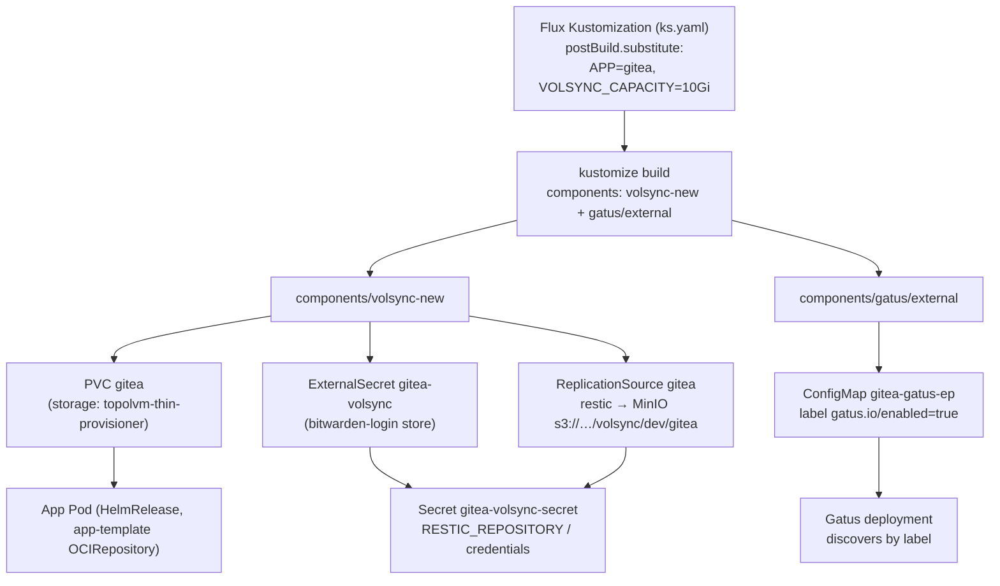

# Shared Component Library (kubernetes/components)

The `kubernetes/components/` tree holds small, self-contained
[kustomize components](https://kubectl.docs.kubernetes.io/guides/config_management/components/)
(`kind: Component`, `kustomize.config.k8s.io/v1alpha1`) that individual Flux
`Kustomization` resources (one per app, defined in a `ks.yaml`) opt into via the
`spec.components:` list. Components template everything on `${APP}` /
`${NAMESPACE}`-style variables supplied through Flux `postBuild.substitute`
(and `substituteFrom: cluster-secrets`), so a single shared definition fans out
into per-app instances of namespaces, OCI chart repos, Gatus checks, image
automation objects, and VolSync backup/restore resources.

## Component catalog

| Path | Kind of thing it adds per app |
| --- | --- |
| `components/common` | Shared namespace scaffolding, `app-template` OCIRepository, SOPS-decrypted `cluster-secrets` / `sops-age` |
| `components/gatus/external` | A Gatus external HTTPS endpoint check |
| `components/gatus/guarded` | A Gatus DNS-A-record "guarded domain" check |
| `components/gatus/external-tailscale` | A Tailscale-flavored external check |
| `components/image-automation` | ExternalSecret (registry creds), ImageRepository, ImagePolicy |
| `components/volsync` | PVC that seeds from a ReplicationDestination + restic ReplicationSource + destination (restore-capable) |
| `components/volsync-new` | Same, but the PVC is a plain volume claim (no restore bootstrap) |

## common — namespace, chart repo, and SOPS

`common/kustomization.yaml` composes three sub-parts
(`repo://kubernetes/components/common/kustomization.yaml`):

- `namespace.yaml` declares a placeholder namespace named `not-used` annotated
  `kustomize.toolkit.fluxcd.io/prune: disabled` and enforcing the `privileged`
  Pod Security profile. Because target namespaces are typically created
  elsewhere, this resource exists mainly so Flux pruning will never delete the
  real namespace while the component is in the build.
- `repos/app-template` pins the community app chart as a Flux `OCIRepository`
  named `app-template` from `oci://ghcr.io/bjw-s-labs/helm/app-template`, tag
  `5.1.0`, selecting the Helm-chart tarball layer. App HelmReleases then point
  `spec.chartRef` at this shared OCIRepository instead of each declaring their
  own chart source.
- `sops` ships the SOPS-encrypted `cluster-secrets` (e.g. `SECRET_DOMAIN`,
  `TIMEZONE`) and `sops-age` (the age key used as Flux decryption secret)
  resources, keeping the values the other components' templates depend on
  (`${SECRET_DOMAIN}` in Gatus URLs) out of plaintext.

## gatus — uptime checks via labeled ConfigMaps

Each Gatus variant is a component whose `kustomization.yaml` uses a
`configMapGenerator` to emit a ConfigMap named `${APP}-gatus-ep` carrying the
variant's `config.yaml`, labeled `gatus.io/enabled: "true"`. The Gatus
deployment itself discovers these ConfigMaps by that label
(`LABEL: gatus.io/enabled` in `kubernetes/apps/observability/gatus/app/helmrelease.yaml`),
so an app gets a monitoring entry simply by adding the component — no change to
the observability stack.

The variants differ in what they probe (`config.yaml` in each directory):

- **external** — HTTP check of
  `https://${GATUS_SUBDOMAIN:=${APP}}.${SECRET_DOMAIN}${GATUS_PATH:=/}` in group
  `external`, resolved through `tcp://223.5.5.5:53`, expecting
  `[STATUS] == ${GATUS_STATUS:=200}` every minute.
- **guarded** — DNS query for the A record of
  `${GATUS_SUBDOMAIN:=${APP}}.${SECRET_DOMAIN}` against `223.5.5.5`, asserting
  `len([BODY]) == 0` (i.e. the domain is **not** publicly resolvable) in group
  `guarded`, with hostname and URL hidden in the UI.
- **external-tailscale** — an external check variant for services exposed only
  over Tailscale.

Apps can override `GATUS_SUBDOMAIN`, `GATUS_PATH`, and `GATUS_STATUS` through
`postBuild.substitute`; defaults fall back to `${APP}` and `/`.

## image-automation — Flux image update plumbing

Adding `../../../../components/image-automation` to an app's `ks.yaml` plus the
substitutes documented in its `README.md` (`APP`, `NAMESPACE`, `REGISTRY_URL`,
`REGISTRY_HOST`, `BW_ID`) yields three objects:

1. An **ExternalSecret** pulling registry credentials from Bitwarden (via the
   `BW_ID` project id) — `registry-externalsecret.yaml`.
2. An **ImageRepository** scanning the registry for tags every minute —
   `imagerepository.yaml`.
3. An **ImagePolicy** (`imagepolicy.yaml`) with a `numerical` policy whose
   `filterTags` pattern `^.+-[a-f0-9]+-(?P<ts>[0-9]+)$` extracts a timestamp, so
   the newest timestamped SHA tag wins.

Apps consume the policy result in their HelmRelease image tag via the Flux
marker `{"$imagepolicy": "NAMESPACE:APP:tag"}`. The ImagePolicy is labeled
`image-automation: enabled`, which is how the repo's single unified
`ImageUpdateAutomation` discovers it; per-app policy objects do not need their
own write-back controller.

## volsync vs volsync-new — backup, restore, and capacity

Both variants bundle, per app, three resources from `claim.yaml` and
`minio.yaml` (the commented `r2.yaml` slot hints at a future Cloudflare R2
destination):

1. A **PVC** named `${APP}`, capacity `${VOLSYNC_CAPACITY:-1Gi}`, storage class
   `${VOLSYNC_STORAGECLASS:-topolvm-thin-provisioner}`.
2. An **ExternalSecret** `${APP}-volsync` (from the `bitwarden-login`
   ClusterSecretStore) templating a restic repository secret that points at the
   self-hosted MinIO at `s3:http://192.168.50.220:9010/volsync/dev/${APP}`, with
   `RESTIC_PASSWORD` from the `volsync-minio-template` Bitwarden item and S3
   credentials from the `cold-minio` item.
3. A **ReplicationSource** named `${APP}` running restic backups of
   `sourcePVC: ${APP}` on schedule `0 */6 * * *` (every 6 h), retaining 24
   hourly / 7 daily / 5 weekly snapshots, pruning every 7 days, with cache
   capacity `${VOLSYNC_CACHE_CAPACITY:-1Gi}` on `local-path` storage.

The **difference** is the PVC's relationship to restore:

- `volsync/claim.yaml` adds `dataSourceRef: {kind: ReplicationDestination,
  name: volsync-dst-${APP}}`, pairing with the **ReplicationDestination**
  `volsync-dst-${APP}` in `minio.yaml` whose trigger is
  `manual: restore-once`. On first reconcile the destination restores the
  latest restic snapshot from MinIO into a temp volume (capacity
  `${VOLSYNC_CAPACITY:-1Gi}`, snapshot copy method
  `${VOLSYNC_COPYMETHOD:-Snapshot}`), and the PVC is seeded from it — an app
  migrated or re-created elsewhere recovers its data automatically. The
  destination also sets `cleanupCachePVC`/`cleanupTempPVC: true` and
  `enableFileDeletion: true`, and uses `${APP_UID:-1000}` / `${APP_GID:-1000}`
  for the mover security context.
- `volsync-new/claim.yaml` creates the PVC without a `dataSourceRef`, i.e. a
  fresh empty claim for newly onboarded apps, while `volsync-new/minio.yaml`
  still ships the same ExternalSecret and ReplicationSource (and retains the
  ReplicationDestination with the same `manual: restore-once` trigger, so it can
  be used to restore on demand). Its ReplicationSource also pins the restic
  cache to `${VOLSYNC_CACHE_SNAPSHOTCLASS:-local-path}`.

Because both templates default to `1Gi`, apps sized differently pass
`VOLSYNC_CAPACITY` in `postBuild.substitute` — see the gitea example below.

Both variants are in active use: e.g. `atuin`, `jellyfin`, `navidrome`,
`qbittorrent` use `components/volsync`; `gitea`, `pgadmin`, `linkwarden`,
`prowlarr`, `playwright` use `components/volsync-new`.

## How apps consume components: ks.yaml example

Each app's `ks.yaml` is a Flux `Kustomization` (per app) that lists components
with a repo-relative path and provides the variables the components template.
`kubernetes/apps/default/gitea/ks.yaml`:

```yaml
apiVersion: kustomize.toolkit.fluxcd.io/v1
kind: Kustomization
metadata:
  name: &app gitea
  namespace: &namespace default
spec:
  targetNamespace: *namespace
  components:
    - ../../../../components/volsync-new
    - ../../../../components/gatus/external
  dependsOn:
    - name: topolvm
      namespace: storage
    - name: external-secrets
      namespace: external-secrets
    - name: cloudnative-pg-cluster
      namespace: database
  decryption:
    provider: sops
    secretRef:
      name: sops-age
  postBuild:
    substituteFrom:
      - name: cluster-secrets
        kind: Secret
    substitute:
      APP: *app
      VOLSYNC_CAPACITY: 10Gi
```

Key mechanics:

- YAML anchors (`&app` / `*app`) keep the app name consistent across the
  `Kustomization` name and the substituted `APP` variable that every component
  template expands.
- `components:` paths are relative to the ks.yaml's directory (four `..` hops
  up to `kubernetes/` then into `components/`), and are applied by kustomize at
  postBuild-render time — the same substitution pass, so component templates see
  `APP=gitea`, `VOLSYNC_CAPACITY=10Gi`, and cluster secrets like
  `SECRET_DOMAIN`.
- `dependsOn` encodes the components' real runtime dependencies: `topolvm` for
  the PVC storage class, `external-secrets` for the ExternalSecrets, and (for
  gitea) its Postgres cluster.

## Dependency flow



Reading the diagram left to right: the Flux Kustomization supplies variables
through postBuild substitution; kustomize merges the referenced components; the
volsync component's ExternalSecret materializes the restic credentials that the
ReplicationSource consumes for the 6-hourly MinIO backups, while its PVC is
mounted by the app's HelmRelease; and the gatus component's generated labeled
ConfigMap is picked up by the central Gatus instance, which starts checking the
app's public endpoint every minute.

## Invariants and operational notes

- Every component is parameterized purely by postBuild substitution; an app
  that references a component without supplying its required variables (e.g.
  `APP`) will fail at render time or produce misnamed resources.
- The volsync components require the `bitwarden-login` ClusterSecretStore and
  reachability of the MinIO endpoint at `192.168.50.220:9010`; the ExternalSecret
  blocks and the ReplicationSource/destination back off if credentials or
  storage are unavailable — which is why app ks.yaml files declare
  `dependsOn: external-secrets` and `dependsOn: topolvm`.
- Choose `volsync` (restore-seeded PVC) for apps being migrated or re-created
  with existing restic snapshots, and `volsync-new` for fresh deployments.
- Gatus checks are centralized: apps never touch the observability stack; the
  `gatus.io/enabled: "true"` label on the generated ConfigMap is the only
  contract.
- SOPS-encrypted values (`SECRET_DOMAIN`, age key) live in
  `components/common/sops` and decrypt only because each app Kustomization sets
  `decryption.provider: sops` with the `sops-age` secret.
