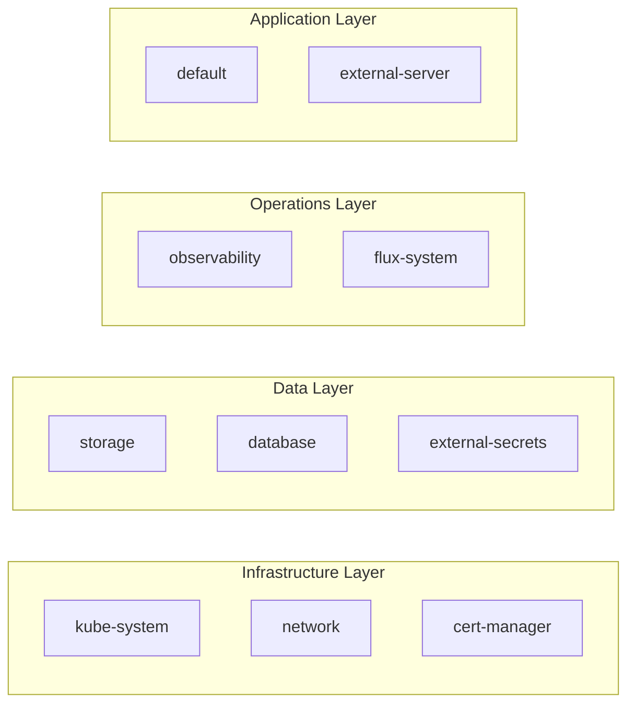
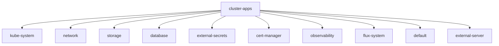

# Namespace and Application Organization

Applications are organized into domain-specific namespaces under `kubernetes/apps/`, with each namespace containing related applications and services. This structure enables logical grouping, shared resource management, and ordered deployment through Flux Kustomization dependencies.

## Namespace Organization

The cluster uses the following namespace strategy to segregate workloads by domain:



*Figure: Namespace organization by functional layer, showing dependency flow from infrastructure through applications*

### Namespace Definitions

Each namespace groups related functionality and enforces appropriate pod security standards:

- **kube-system** (`kubernetes/apps/kube-system/`) - Core cluster infrastructure including Cilium CNI, CoreDNS, node utilities, and system upgrade controllers
- **network** (`kubernetes/apps/network/`) - Networking services including Cloudflare DNS/tunnel, k8s-gateway, AdGuard DNS, SMTP relay, and Tailscale
- **storage** (`kubernetes/apps/storage/`) - Storage infrastructure including TopoLVM, snapshot-controller, local-path-provisioner, VolSync, and CSI drivers
- **database** (`kubernetes/apps/database/`) - Database operators and instances including CloudNative-PG and Dragonfly
- **external-secrets** (`kubernetes/apps/external-secrets/`) - External Secrets Operator and secret synchronization (Bitwarden Connect)
- **cert-manager** (`kubernetes/apps/cert-manager/`) - TLS certificate provisioning via cert-manager
- **observability** (`kubernetes/apps/observability/`) - Monitoring stack including Prometheus, Grafana, Loki, and alerting tools
- **flux-system** (`kubernetes/apps/flux-system/`) - Flux GitOps operator components (flux-instance, flux-operator, image-automation, notification)
- **default** (`kubernetes/apps/default/`) - User-facing applications and services (media, home automation, development tools)
- **external-server** (`kubernetes/apps/external-server/`) - External workloads and server applications

## Flux Reconciliation Flow

The `cluster-apps` Kustomization in `kubernetes/flux/cluster/ks.yaml` reconciles all namespace-level Kustomizations under `kubernetes/apps/`, creating a hierarchical deployment pattern:



*Figure: Flux reconciliation flow from cluster-apps through namespace-level Kustomizations to individual applications*

The `cluster-apps` Kustomization specifies:
- **path**: `./kubernetes/apps` - Scans all namespace directories
- **decryption**: SOPS provider for encrypted secrets
- **dependsOn**: Waits for `cluster-meta`, `gateway-api-crds`, and `external-dns-crds` before reconciling applications

## Namespace Kustomization Pattern

Each namespace follows a consistent Kustomization pattern defined in its `kustomization.yaml`:

```yaml
apiVersion: kustomize.config.k8s.io/v1beta1
kind: Kustomization
namespace: <namespace-name>
components:
  - ../../components/common
resources:
  - ./app1/ks.yaml
  - ./app2/ks.yaml
  - ./app3/ks.yaml
```

### Components

The `../../components/common` reference injects shared resources into every namespace:

- **namespace.yaml** - Namespace definition with pod security labels and prune-disabled annotation
- **repos/** - HelmRepository and OCIRepository sources for charts
- **sops/** - SOPS decryption secrets (sops-age, cluster-secrets)

From `kubernetes/components/common/kustomization.yaml`:
```yaml
kind: Component
resources:
  - ./namespace.yaml
  - ./repos
  - ./sops
```

The `namespace.yaml` component applies pod security policies:
- `pod-security.kubernetes.io/enforce: privileged` for storage, kube-system
- `pod-security.kubernetes.io/enforce: baseline` for database
- `kustomize.toolkit.fluxcd.io/prune: disabled` annotation prevents namespace deletion

### Resources

Each application under the namespace is referenced as a Flux Kustomization (`./<app>/ks.yaml`), not as raw Kustomize resources. This enables:
- Per-application reconciliation intervals
- Individual dependency management via `dependsOn`
- Component injection for cross-cutting concerns (monitoring, backup)

## Application Kustomization Pattern

Every application uses a Flux Kustomization (`ks.yaml`) with this standard structure:

```yaml
apiVersion: kustomize.toolkit.fluxcd.io/v1
kind: Kustomization
metadata:
  name: &app <app-name>
  namespace: &namespace <namespace>
spec:
  targetNamespace: *namespace
  commonMetadata:
    labels:
      app.kubernetes.io/name: *app
  path: ./kubernetes/apps/<namespace>/<app>/app
  sourceRef:
    kind: GitRepository
    name: flux-system
    namespace: flux-system
  interval: 1h
  retryInterval: 2m
  timeout: 5m
  prune: true
  wait: true
```

### Key Elements

- **path**: Points to the application's Kustomize directory (typically `./app/`)
- **targetNamespace**: Deploys resources to the namespace specified
- **commonMetadata**: Adds `app.kubernetes.io/name` label to all resources
- **sourceRef**: References the flux-system GitRepository
- **interval**: Reconciliation frequency (1 hour standard)
- **prune**: Enables garbage collection of removed resources
- **wait**: Waits for resources to be healthy before marking ready

### Optional Configuration

Applications may include:

**dependsOn** - Explicit dependency ordering:
```yaml
dependsOn:
  - name: topolvm
    namespace: storage
  - name: external-secrets
    namespace: external-secrets
```

**decryption** - SOPS for encrypted secrets:
```yaml
decryption:
  provider: sops
  secretRef:
    name: sops-age
```

**postBuild** - Variable substitution:
```yaml
postBuild:
  substituteFrom:
    - name: cluster-secrets
      kind: Secret
  substitute:
    APP: *app
    VOLSYNC_CAPACITY: 2Gi
```

**components** - Reusable component injection:
```yaml
components:
  - ../../../../components/volsync-new
  - ../../../../components/gatus/guarded
```

## App-Template OCI Pattern

Most applications use the bjw-s app-template Helm chart sourced via OCIRepository, enabling consistent deployment patterns across applications.

### OCIRepository Definition

From `kubernetes/components/common/repos/app-template/ocirepository.yaml`:
```yaml
apiVersion: source.toolkit.fluxcd.io/v1
kind: OCIRepository
metadata:
  name: app-template
spec:
  interval: 1h
  url: oci://ghcr.io/bjw-s-labs/helm/app-template
  ref:
    tag: 5.0.1
```

### HelmRelease Pattern

Applications reference the OCIRepository in their HelmRelease:

```yaml
apiVersion: helm.toolkit.fluxcd.io/v2
kind: HelmRelease
metadata:
  name: <app-name>
spec:
  interval: 1h
  chartRef:
    kind: OCIRepository
    name: app-template
  values:
    controllers:
      <app-name>:
        containers:
          app:
            image:
              repository: ghcr.io/<image>
              tag: <version>
```

The app-template provides:
- Standardized controller, container, service, and persistence structures
- Built-in probes, security contexts, and resource management
- Gateway API (HTTPRoute) and Traefik IngressRoute support
- ServiceMonitor integration for Prometheus

### Application Directory Structure

Each application follows this structure:
```
kubernetes/apps/<namespace>/<app>/
├── ks.yaml                 # Flux Kustomization
└── app/
    ├── kustomization.yaml  # Kustomize resources
    ├── helmrelease.yaml    # HelmRelease using app-template
    └── values.yaml         # Optional: additional Helm values
```

Some apps may use additional subdirectories for multiple releases (e.g., `cilium/app/` and `cilium/gateway/`).

## Component Reuse

Shared functionality is provided through components in `kubernetes/components/`:

### Common Components

- **components/common** - Namespace, repositories, SOPS secrets (included in all namespace Kustomizations)
- **components/gatus** - Gatus monitoring endpoints (external, guarded, external-tailscale variants)
- **components/volsync** - VolSync backup configuration (claim, minio)
- **components/volsync-new** - Updated VolSync component for new deployments
- **components/image-automation** - ImageRepository and ImagePolicy for automated updates

### Component Injection

Applications include components via the Flux Kustomization `components` field:

```yaml
components:
  - ../../../../components/volsync-new
  - ../../../../components/gatus/guarded
```

Components are Kustomize components (`kind: Component`) that generate ConfigMaps, Secrets, or other resources merged into the application's Kustomize build.

## HelmRepository Management

Helm chart sources are defined in `kubernetes/flux/meta/repos/` and reconciled by the `cluster-meta` Kustomization:

```yaml
apiVersion: source.toolkit.fluxcd.io/v1
kind: HelmRepository
metadata:
  name: <repo-name>
  namespace: flux-system
spec:
  interval: 1h
  url: https://<chart-repo>/
```

These repositories are available cluster-wide for HelmReleases to reference. The bjw-s repository is defined as OCI for the app-template:
```yaml
apiVersion: source.toolkit.fluxcd.io/v1
kind: HelmRepository
metadata:
  name: bjw-s
  namespace: flux-system
spec:
  type: oci
  interval: 1h
  url: oci://ghcr.io/bjw-s/helm
```

## Dependency Management

Applications declare dependencies via `dependsOn` in their Flux Kustomization to enforce ordering:

**Example: prowlarr depends on storage and database**
```yaml
dependsOn:
  - name: topolvm
    namespace: storage
  - name: external-secrets
    namespace: external-secrets
  - name: cloudnative-pg-cluster
    namespace: database
```

**Example: grafana depends on monitoring stack**
```yaml
dependsOn:
  - name: kube-prometheus-stack
    namespace: observability
  - name: thanos
    namespace: observability
```

Flux waits for dependencies to be ready before reconciling the dependent application, ensuring proper startup sequence.

## Namespace Resource Isolation

Each namespace may include additional resources beyond applications in its `namespace.yaml`:

**Storage namespace** (`kubernetes/apps/storage/namespace.yaml`):
- Namespace with `volsync.backube/privileged-movers: "true"` annotation
- AlertManager Provider for HelmRelease failure notifications
- Alert resource for error events

**Database namespace** (`kubernetes/apps/database/namespace.yaml`):
- Namespace with `pod-security.kubernetes.io/enforce: baseline`
- AlertManager Provider and Alert configuration

These namespace-level resources provide per-domain configuration for monitoring, security policies, and integration points.
