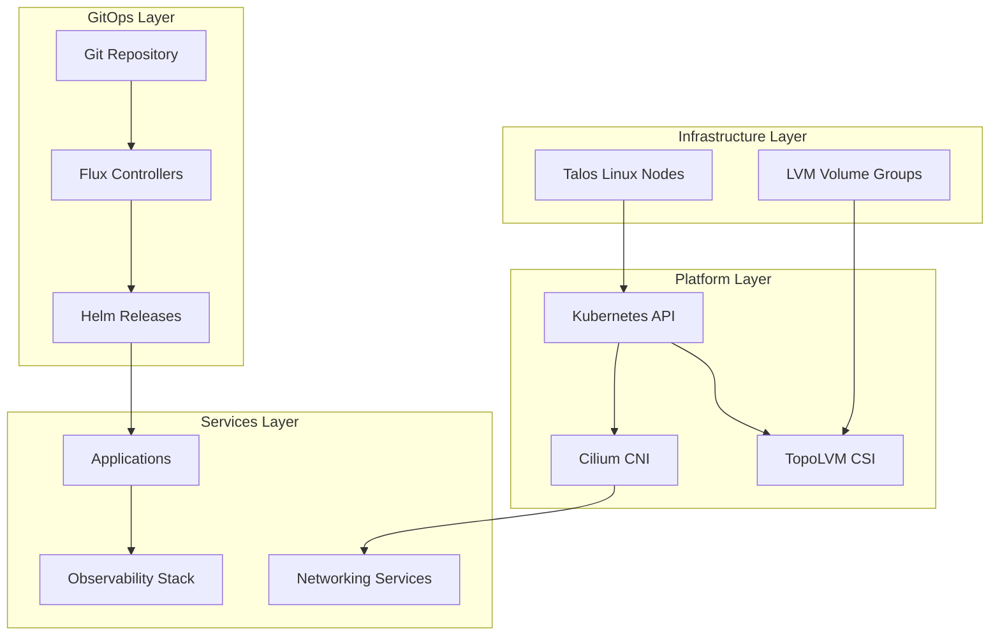

# Architecture Overview

This page describes the cluster architecture, GitOps patterns, and how major components interact across the infrastructure, platform, GitOps, and services layers.

## Layered Architecture



## Cluster Foundation

### Talos Linux

The cluster runs on Talos Linux, an immutable OS designed for Kubernetes:

- **Secure boot**: Enabled on all nodes via custom factory image (`talosImageURL` in `talos/talconfig.yaml`)
- **Node configuration**: Managed through `talhelper` which generates machine configs
- **Control plane**: Single-node control plane (master0-nuc at 192.168.50.145) with VIP at 192.168.50.10
- **Disk management**: Uses install disk selectors (≤256GB SSD) and custom volume provisioning
- **Kernel modules**: Preloads `dm_thin_pool`, `dm_mod`, `i915` (Intel GPU), `drm`, `drm_kms_helper`
- **System extensions**: Includes `i915`, `intel-ucode`, `thunderbolt` extensions

### Platform Components

**Kubernetes**:
- Pod network: 10.42.0.0/16
- Service network: 10.43.0.0/16
- API endpoint: https://192.168.50.10:6443 (VIP)
- CNI: Cilium (Talos built-in CNI disabled)

**Cilium**:
- Replaces kube-proxy with eBPF-based data plane
- Provides BGP for load balancing, network policies, and L7 awareness
- Deployed via Helm in bootstrap phase before Flux
- Version 1.20.0 from official Helm repository

**TopoLVM**:
- CSI provisioner for dynamic LVM volume management
- Uses `lvm_vg` volume group with thin provisioning
- Storage class `topolvm-thin-provisioner` (default, XFS)
- Embedded lvmd daemon on storage nodes
- Overprovision ratio: 10.0

## Networking Stack

<!-- openwiki: mermaid parse failed and this diagram was converted to a text fence so it does not break rendering. Fix the diagram source and restore the mermaid fence. Parser error: Heuristic: an unescaped angle bracket inside a label breaks rendering; rephrase the label. -->
```text
flowchart TB
    External[External Traffic]
    
    subgraph Ingress["Ingress Layer"]
        CFTunnel[Cloudflare Tunnel]
        Gateway[k8s-gateway<br/>192.168.50.11]
    end
    
    subgraph CNI["CNI Layer"]
        CiliumNB[Cilium CNI<br/>BGP/LB]
    end
    
    subgraph DNS["DNS Layer"]
        AdGuard[AdGuard DNS]
        CoreDNS[CoreDNS]
    end
    
    subgraph VPN["VPN Layer"]
        Tailscale[Tailscale]
    end
    
    External --> CFTunnel
    External --> Gateway
    CFTunnel --> CiliumNB
    Gateway --> CiliumNB
    CiliumNB --> Pods[Application Pods]
    AdGuard --> CoreDNS
    Tailscale --> Pods
```

**Key components**:
- **Cilium**: Replaces default kube-proxy, provides BGP, network policies, and load balancing
- **Cloudflare Tunnel**: Exposes selected services publicly without open ports
- **k8s-gateway**: Internal Gateway API controller for DNS-based routing (LoadBalancer IP 192.168.50.11)
- **AdGuard DNS**: Local DNS resolver with ad blocking
- **Tailscale**: VPN for secure remote access to cluster services

### Storage Architecture

<!-- openwiki: mermaid parse failed and this diagram was converted to a text fence so it does not break rendering. Fix the diagram source and restore the mermaid fence. Parser error: Heuristic: an unescaped angle bracket inside a label breaks rendering; rephrase the label. -->
```text
flowchart TB
    Apps[Applications<br/>PVCs]
    
    subgraph Provisioners["Storage Provisioners"]
        TopoLVMSC[TopoLVM CSI<br/>LVM thin volumes]
        NFSCSI[NFS CSI<br/>External NFS]
        LocalPath[local-path<br/>hostPath]
    end
    
    subgraph Backup["Backup & Replication"]
        VolSync[VolSync<br/>Rclone/Restic]
    end
    
    subgraph StorageTargets["Storage Targets"]
        MinIO[MinIO<br/>Local backups]
        B2[Backblaze B2<br/>Cloud backups]
    end
    
    subgraph Snapshots["Snapshots"]
        SnapshotCtrl[snapshot-controller<br/>CSI snapshots]
    end
    
    Apps --> TopoLVMSC
    Apps --> NFSCSI
    Apps --> LocalPath
    Apps --> VolSync
    Apps --> SnapshotCtrl
    VolSync --> MinIO
    VolSync --> B2
```

**Storage provisioners**:
- **TopoLVM**: Dynamic LVM volumes on `/dev/disk/by-id` with thin provisioning
- **NFS CSI**: NFS shares from external server
- **local-path**: hostPath for small/ephemeral data

**Backup & replication**:
- **VolSync**: ReplicationDestination/Source with MinIO and B2 targets
- **snapshot-controller**: CSI volume snapshots

## GitOps Architecture

### Flux Reconciliation Flow

<!-- openwiki: mermaid parse failed and this diagram was converted to a text fence so it does not break rendering. Fix the diagram source and restore the mermaid fence. Parser error: Heuristic: an unescaped angle bracket inside a label breaks rendering; rephrase the label. -->
```text
flowchart TD
    GitRepo[Git Repository<br/>tomyail/talos-cluster]
    
    subgraph FluxSource["Flux Source"]
        GitRes[GitRepository<br/>flux-system]
        OCIRepos[OCIRepositories]
        HelmRepos[HelmRepositories]
    end
    
    subgraph FluxKustomizations["Flux Kustomizations"]
        Meta[cluster-meta<br/>./kubernetes/flux/meta]
        Apps[cluster-apps<br/>./kubernetes/apps]
        CRDs[gateway-api-crds<br/>external-dns-crds]
        Namespaces[Namespace Kustomizations]
    end
    
    subgraph Resources["Kubernetes Resources"]
        HelmReleases[HelmReleases<br/>app-template pattern]
        Objects[Kubernetes Objects]
    end
    
    GitRepo --> GitRes
    GitRes --> Meta
    Meta --> OCIRepos
    Meta --> HelmRepos
    Meta --> CRDs
    CRDs --> Apps
    Apps --> Namespaces
    Namespaces --> HelmReleases
    HelmReleases --> Objects
```

### Bootstrap vs GitOps Management

**Bootstrap phase** (one-time cluster initialization):
- Installed via `helmfile` from `bootstrap/helmfile.yaml`
- Components: Cilium, CoreDNS, cert-manager, flux-operator, flux-instance
- Purpose: Establish GitOps foundation before Flux takes over

**GitOps phase** (ongoing management):
- Flux watches Git repository main branch
- All applications managed through HelmRelease resources
- Pattern: OCIRepository → HelmRelease → Kubernetes resources

### Kustomization Structure

**Root-level Kustomizations** (`kubernetes/flux/cluster/ks.yaml`):
1. **cluster-meta**: Installs OCI/Helm repositories from `kubernetes/flux/meta/`
   - SOPS decryption enabled
   - Dependency for all other Kustomizations
2. **gateway-api-crds**: Gateway API CRDs from external OCI repository
3. **external-dns-crds**: External DNS CRDs from external OCI repository
4. **cluster-apps**: All namespace-level Kustomizations from `kubernetes/apps/`
   - Depends on cluster-meta, gateway-api-crds, external-dns-crds
   - SOPS decryption enabled
   - Prunes resources on removal

**Namespace-level Kustomizations**:
Each namespace (kube-system, network, observability, storage, database, external-secrets, default, external-server) has its own Kustomization managing app-specific resources.

### Application Resource Pattern

Standard application structure:
```
kubernetes/apps/<namespace>/<app>/
  ks.yaml                # Flux Kustomization
  app/
    helmrelease.yaml     # HelmRelease (app-template)
    externalsecret.yaml  # ExternalSecret (optional)
    kustomization.yaml   # Kustomize resources
    [pvc.yaml]           # PVC definition (optional)
  [sub-app/]             # Additional components (optional)
```

**HelmRelease pattern**:
```yaml
apiVersion: helm.toolkit.fluxcd.io/v2
kind: HelmRelease
metadata:
  name: my-app
spec:
  chartRef:
    kind: OCIRepository
    name: app-template
  values:
    # App-specific values
```

All apps share the same `app-template` chart defined in `kubernetes/components/common/repos/app-template/`.

### Reusable Components

Located in `kubernetes/components/`:

**`common/`** - Included in every namespace:
- Namespace definition
- SOPS age secret (for Flux decryption)
- OCIRepository for app-template

**`gatus/`** - Monitoring components:
- `external` - External endpoint monitoring
- `external-tailscale` - Tailscale endpoint checks
- `guarded` - Internal service health checks

**`volsync-new/`** - VolSync backup templates:
- ReplicationDestination/Source with MinIO target
- Configurable capacity and retention

**`image-automation/`** - Flux image automation:
- ImageRepository (OCI registries)
- ImagePolicy (semver filtering)
- ImageUpdateAutomation (auto-update HelmReleases)

## Secret Management

### SOPS + age

<!-- openwiki: mermaid parse failed and this diagram was converted to a text fence so it does not break rendering. Fix the diagram source and restore the mermaid fence. Parser error: Heuristic: an unescaped angle bracket inside a label breaks rendering; rephrase the label. -->
```text
flowchart LR
    Local[Local Developer<br/>age.key]
    GitRepo[Git Repository]
    
    subgraph Encrypted["Encrypted in Git"]
        TalosSecrets[talos/*.sops.yaml<br/>Whole-file]
        AppSecrets[kubernetes/**/*.sops.yaml<br/>data/stringData only]
    end
    
    subgraph Cluster["Cluster Secrets"]
        FluxSecret[flux-system/sops-age<br/>Flux decryption key]
        AppK8sSecrets[Decrypted Kubernetes Secrets]
    end
    
    Local -->|Encrypt| Encrypted
    Encrypted --> GitRepo
    FluxSecret -->|Decrypt| AppK8sSecrets
```

**Key locations**:
- `age.key` - Local-only decryption key (never committed)
- `flux-system/sops-age` Secret - Flux decryption key in cluster
- `.sops.yaml` - Encryption rules and recipient age public key

### External Secrets Operator

Bitwarden Connect integration:
<!-- openwiki: mermaid parse failed and this diagram was converted to a text fence so it does not break rendering. Fix the diagram source and restore the mermaid fence. Parser error: Heuristic: an unescaped angle bracket inside a label breaks rendering; rephrase the label. -->
```text
flowchart LR
    BW[Bitwarden Vault]
    
    subgraph ESO["External Secrets Operator"]
        Provider[Bitwarden Provider<br/>bitwarden-cli]
    end
    
    subgraph K8s["Kubernetes Resources"]
        ExternalSecret[ExternalSecret resources]
        K8sSecret[Kubernetes Secrets]
    end
    
    BW --> Provider
    Provider --> ExternalSecret
    ExternalSecret --> K8sSecret
```

**Pattern**:
```yaml
apiVersion: external-secrets.io/v1beta1
kind: ExternalSecret
metadata:
  name: my-app-secrets
spec:
  refreshInterval: 1h
  secretStoreRef:
    name: bitwarden-connect
  target:
    name: my-app-secret
  data:
    - secretKey: PASSWORD
      remoteRef:
        key: "my-app-password"
```

## Observability Stack

### Monitoring Pipeline

<!-- openwiki: mermaid parse failed and this diagram was converted to a text fence so it does not break rendering. Fix the diagram source and restore the mermaid fence. Parser error: Heuristic: an unescaped angle bracket inside a label breaks rendering; rephrase the label. -->
```text
flowchart LR
    subgraph Sources["Metrics Sources"]
        Pods[Application Pods]
        Nodes[Nodes<br/>smartctl-exporter]
        K8sAPI[Kubernetes API]
        Kubelet[Kubelet]
    end
    
    subgraph Prometheus["Prometheus Operator"]
        KPS[kube-prometheus-stack]
    end
    
    subgraph Storage["Long-term Storage"]
        Thanos[Thanos<br/>Deduplication]
    end
    
    subgraph Visualization["Visualization"]
        Grafana[Grafana]
    end
    
    Pods --> KPS
    Nodes --> KPS
    K8sAPI --> KPS
    Kubelet --> KPS
    KPS --> Thanos
    Thanos --> Grafana
    KPS --> Grafana
```

**Components**:
- **Prometheus Operator**: Scrapes metrics from pods/nodes
- **Thanos**: Long-term storage, deduplication, query federation
- **Grafana**: Visualization and dashboards
- **smartctl-exporter**: Disk health metrics
- **Kromgo**: Kubernetes metrics export endpoint

### Logging Pipeline

<!-- openwiki: mermaid parse failed and this diagram was converted to a text fence so it does not break rendering. Fix the diagram source and restore the mermaid fence. Parser error: Heuristic: an unescaped angle bracket inside a label breaks rendering; rephrase the label. -->
```text
flowchart LR
    subgraph Sources["Log Sources"]
        Journals[Node Journals]
    end
    
    subgraph Collection["Collection"]
        Promtail[Promtail<br/>On each node]
    end
    
    subgraph Aggregation["Aggregation"]
        Loki[Loki<br/>Log aggregation]
    end
    
    subgraph Query["Query & Visualize"]
        GrafanaLogs[Grafana<br/>Log queries]
    end
    
    Journals --> Promtail
    Promtail --> Loki
    Loki --> GrafanaLogs
```

**Components**:
- **Promtail**: Reads journal logs on each node
- **Loki**: Log aggregation with label-based indexing
- **Grafana**: Log queries and inspection

### Uptime Monitoring

- **Gatus**: Active endpoint monitoring with alerts (external, tailscale, guarded endpoints)
- **Uptime Kuma**: Status page for external monitoring
- **Kubernetes endpoint**: [status-dev.tomyail.com](https://status-dev.tomyail.com)

## Ingress & Routing

### Gateway API Hierarchy

<!-- openwiki: mermaid parse failed and this diagram was converted to a text fence so it does not break rendering. Fix the diagram source and restore the mermaid fence. Parser error: Heuristic: an unescaped angle bracket inside a label breaks rendering; rephrase the label. -->
```text
flowchart TB
    subgraph Gateway["Gateway - kube-system"]
        Internal[internal listener<br/>192.168.50.12]
        External[external listener<br/>Cloudflare Tunnel]
    end
    
    subgraph Routes["HTTPRoutes"]
        InternalRoutes[Internal Routes<br/>*.tomyail.com]
        PublicRoutes[Public Routes<br/>*.tomyail.com]
    end
    
    subgraph Backends["Backends"]
        Services[Application Services]
    end
    
    Internal --> InternalRoutes
    External --> PublicRoutes
    InternalRoutes --> Services
    PublicRoutes --> Services
```

**Route configuration pattern**:
```yaml
apiVersion: gateway.networking.k8s.io/v1
kind: HTTPRoute
metadata:
  name: my-app
spec:
  parentRefs:
    - name: internal
      namespace: kube-system
  hostnames:
    - "my-app.tomyail.com"
  rules:
    - backendRefs:
        - name: my-app
          port: 80
```

**DNS routing**:
- k8s-gateway watches HTTPRoute and Service resources
- Automatically creates DNS records for Gateway routes
- TTL: 1 second
- LoadBalancer IP: 192.168.50.11 (assigned via Cilium BGP)

## Dependency Updates

### Renovate Bot

Auto-updates tracked dependencies:

- **Container images**: From `image:` tags in YAML
- **Helm charts**: From OCI repositories
- **GitHub releases**: Tracked via `# renovate: datasource=github-tags`
- **mise tools**: From `.mise.toml`
- **GitHub Actions**: From workflow files

**Schedule**: Runs every weekend
**Auto-merge**: Patch updates for GHA and mise tools
**Grouping**: Major components grouped (cert-manager, CoreDNS, Flux)

## Key Architecture Decisions

1. **Talos over standard Linux**: Immutable OS reduces configuration drift and attack surface
2. **Flux over Helm directly**: GitOps provides change history and rollback capability
3. **Cilium over default CNI**: Advanced networking features (BGP, L7 awareness)
4. **SOPS + age over SealedSecrets**: Git-friendly secrets with simple key management
5. **TopoLVM over hostPath/emptyDir**: Dynamic volume management with LVM flexibility
6. **VolSync over Velero**: Application-level backup with remote sync support
7. **Gateway API over Ingress**: Modern routing standard with better CRD support
8. **OCIRepository over GitRepository for charts**: Immutable chart storage with better caching
9. **Bootstrap then GitOps**: Helmfile establishes foundation, Flux maintains state
10. **Bitwarden for external secrets**: Centralized secret management with self-hosting option
