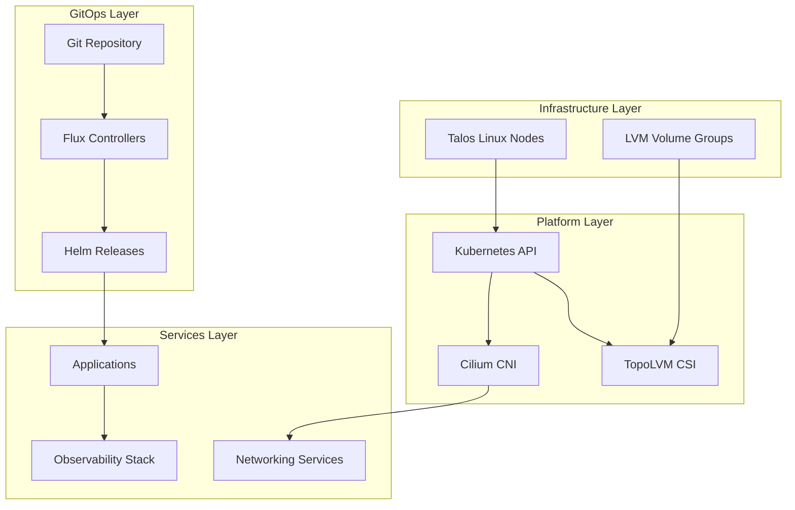
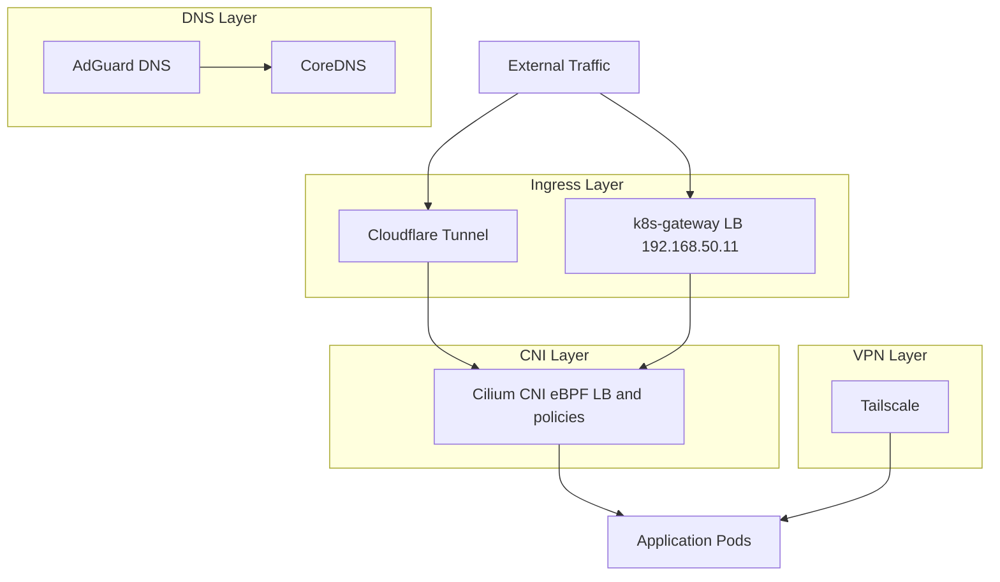
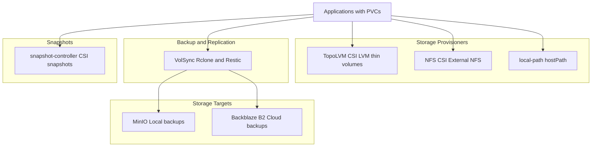
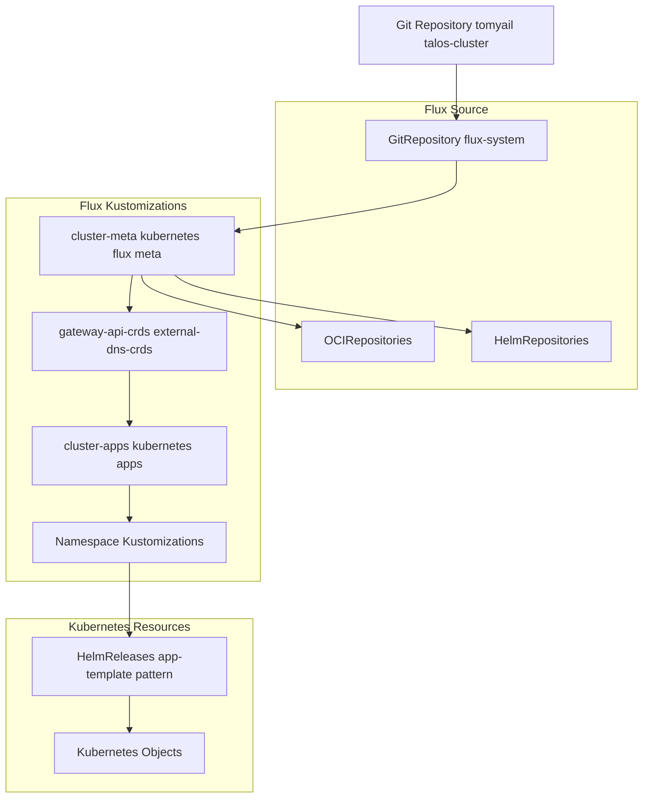
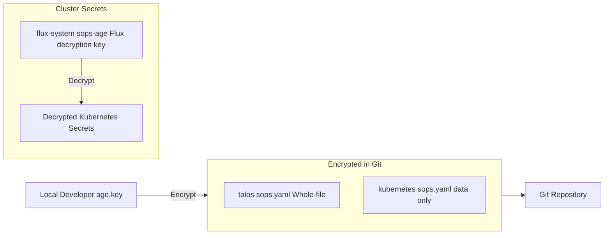
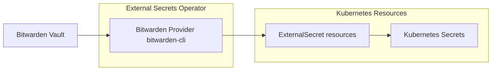
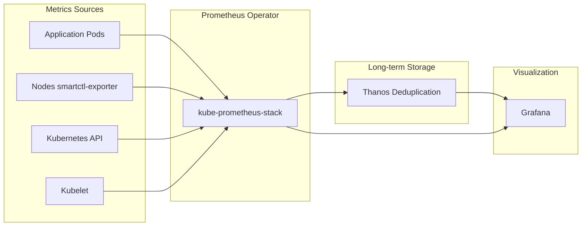
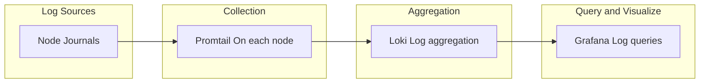
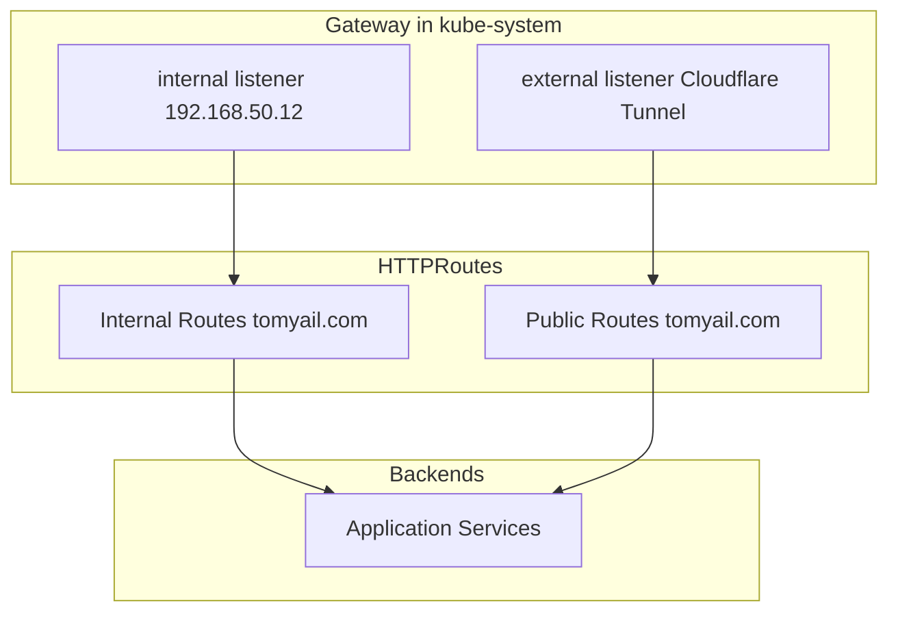

# Architecture Overview

This page describes the cluster architecture, GitOps patterns, and how major components interact across the infrastructure, platform, GitOps, and services layers.

## Layered Architecture


```mermaid
flowchart TB
    subgraph Infra["Infrastructure Layer"]
        Talos[Talos Linux Nodes]
        LVM[LVM Volume Groups]
    end
    
    subgraph Platform["Platform Layer"]
        K8s[Kubernetes API]
        Cilium[Cilium CNI]
        TopoLVM[TopoLVM CSI]
    end
    
    subgraph GitOps["GitOps Layer"]
        Git[Git Repository]
        Flux[Flux Controllers]
        Helm[Helm Releases]
    end
    
    subgraph Services["Services Layer"]
        Network[Networking Services]
        Observability[Observability Stack]
        Apps[Applications]
    end
    
    Talos --> K8s
    LVM --> TopoLVM
    K8s --> Cilium
    K8s --> TopoLVM
    Git --> Flux
    Flux --> Helm
    Helm --> Apps
    Cilium --> Network
    Apps --> Observability
```

*Figure: Four-layer architecture showing infrastructure foundation, platform services, GitOps management, and application services.*

## Cluster Foundation

### Talos Linux

The cluster runs on Talos Linux, an immutable OS designed for Kubernetes:

- **Secure boot**: Enabled on all nodes via custom factory image
- **Node configuration**: Managed through talhelper which generates machine configs
- **Control plane**: Single-node control plane (master0-nuc12 at 192.168.50.145) with VIP at 192.168.50.10
- **Disk management**: Uses install disk selectors (≤256GB SSD) and custom volume provisioning
- **Kernel modules**: Preloads dm_thin_pool, dm_mod, i915 (Intel GPU), drm, drm_kms_helper
- **System extensions**: Includes i915, intel-ucode, thunderbolt extensions

### Platform Components

**Kubernetes**:
- Pod network: 10.42.0.0/16
- Service network: 10.43.0.0/16
- API endpoint: https://192.168.50.10:6443 (VIP)
- CNI: Cilium (Talos built-in CNI disabled)

**Cilium**:
- Replaces kube-proxy with eBPF-based data plane
- Provides BGP for load balancing, network policies, and L7 awareness
- Deployed via Helm in bootstrap phase before Flux
- Version 1.20.0 from official Helm repository

**TopoLVM**:
- CSI provisioner for dynamic LVM volume management
- Uses lvm_vg volume group with thin provisioning
- Storage class topolvm-thin-provisioner (default, XFS)
- Embedded lvmd daemon on storage nodes
- Overprovision ratio: 10.0

## Networking Stack


```mermaid
flowchart TB
    External[External Traffic]
    
    subgraph Ingress["Ingress Layer"]
        CFTunnel[Cloudflare Tunnel]
        Gateway[k8s-gateway LB 192.168.50.11]
    end
    
    subgraph CNI["CNI Layer"]
        CiliumNB[Cilium CNI eBPF LB and policies]
    end
    
    subgraph DNS["DNS Layer"]
        AdGuard[AdGuard DNS]
        CoreDNS[CoreDNS]
    end
    
    subgraph VPN["VPN Layer"]
        Tailscale[Tailscale]
    end
    
    External --> CFTunnel
    External --> Gateway
    CFTunnel --> CiliumNB
    Gateway --> CiliumNB
    CiliumNB --> Pods[Application Pods]
    AdGuard --> CoreDNS
    Tailscale --> Pods
```

*Figure: Network traffic flow from external sources through ingress and CNI layers to application pods.*

**Key components**:
- **Cilium**: Replaces default kube-proxy, provides BGP, network policies, and load balancing
- **Cloudflare Tunnel**: Exposes selected services publicly without open ports. It deploys via `chartRef` to the shared `app-template` OCIRepository with a single `cloudflare-tunnel` controller running the `cloudflared` image (tag 2026.9.3) with `tunnel run` args and HTTP/2 transport (`TUNNEL_TRANSPORT_PROTOCOL=http2`). Its config file is mounted read-only from the `cloudflare-tunnel-configmap` ConfigMap, the tunnel credentials come from the `cloudflare-tunnel-secret` Secret (`envFrom`), and metrics/health probes are served on `0.0.0.0:8080` with `/ready` probes plus a ServiceMonitor for Prometheus scraping. Reloader annotations restart the pod automatically when the config or secret changes.
- **k8s-gateway**: Internal Gateway API controller for DNS-based routing (LoadBalancer IP 192.168.50.11)
- **AdGuard DNS**: Local DNS resolver with ad blocking
- **Tailscale**: VPN for secure remote access to cluster services

## Storage Architecture


```mermaid
flowchart TB
    Apps[Applications with PVCs]
    
    subgraph Provisioners["Storage Provisioners"]
        TopoLVMSC[TopoLVM CSI LVM thin volumes]
        NFSCSI[NFS CSI External NFS]
        LocalPath[local-path hostPath]
    end
    
    subgraph Backup["Backup and Replication"]
        VolSync[VolSync Rclone and Restic]
    end
    
    subgraph StorageTargets["Storage Targets"]
        MinIO[MinIO Local backups]
        B2[Backblaze B2 Cloud backups]
    end
    
    subgraph Snapshots["Snapshots"]
        SnapshotCtrl[snapshot-controller CSI snapshots]
    end
    
    Apps --> TopoLVMSC
    Apps --> NFSCSI
    Apps --> LocalPath
    Apps --> VolSync
    Apps --> SnapshotCtrl
    VolSync --> MinIO
    VolSync --> B2
```

*Figure: Storage provisioning, backup, and snapshot flow from applications to storage targets.*

**Storage provisioners**:
- **TopoLVM**: Dynamic LVM volumes on /dev/disk/by-id with thin provisioning
- **NFS CSI**: NFS shares from external server
- **local-path**: hostPath for small/ephemeral data

**Backup and replication**:
- **VolSync**: ReplicationDestination/Source with MinIO and B2 targets
- **snapshot-controller**: CSI volume snapshots

## GitOps Architecture

### Flux Reconciliation Flow


```mermaid
flowchart TD
    GitRepo[Git Repository tomyail talos-cluster]
    
    subgraph FluxSource["Flux Source"]
        GitRes[GitRepository flux-system]
        OCIRepos[OCIRepositories]
        HelmRepos[HelmRepositories]
    end
    
    subgraph FluxKustomizations["Flux Kustomizations"]
        Meta[cluster-meta kubernetes flux meta]
        Apps[cluster-apps kubernetes apps]
        CRDs[gateway-api-crds external-dns-crds]
        Namespaces[Namespace Kustomizations]
    end
    
    subgraph Resources["Kubernetes Resources"]
        HelmReleases[HelmReleases app-template pattern]
        Objects[Kubernetes Objects]
    end
    
    GitRepo --> GitRes
    GitRes --> Meta
    Meta --> OCIRepos
    Meta --> HelmRepos
    Meta --> CRDs
    CRDs --> Apps
    Apps --> Namespaces
    Namespaces --> HelmReleases
    HelmReleases --> Objects
```

*Figure: Flux reconciliation hierarchy from Git repository through Kustomizations to deployed resources.*

### Reconcile Chain

Everything is anchored to a single Flux `GitRepository` named `flux-system` that points at this repo's `main` branch. The reconcile chain is:

<!-- openwiki: mermaid parse failed and this diagram was converted to a text fence so it does not break rendering. Fix the diagram source and restore the mermaid fence. Parser error: Heuristic: a semicolon inside a label breaks rendering; rephrase the label. -->
```text
flowchart TD
    GR["GitRepository flux-system"] --> CM["Kustomization cluster-meta"]
    CM --> GAR["gateway-api-crds"]
    CM --> EDC["external-dns-crds"]
    GAR --> CA["Kustomization cluster-apps"]
    EDC --> CA
    CA --> NS["Namespace kustomizations<br/>kubernetes/apps/*/kustomization.yaml"]
    NS --> APP["Per-app Kustomizations<br/>kubernetes/apps/&lt;ns&gt;/&lt;app&gt;/ks.yaml"]
    APP --> HR["HelmRelease / resources"]
```

*Figure: Flux dependency graph. `cluster-meta` gates everything; `cluster-apps` waits on both CRD kustomizations.*

1. **GitRepository `flux-system`** — Flux watches the repo; `cluster-meta` (path `./kubernetes/flux/meta`, SOPS-decrypted, `wait: true`) reconciles the source definitions under `kubernetes/flux/meta/repos/`, which materialize `OCIRepository` and `HelmRepository` objects (app-template, prometheus-community, grafana, backube, etc.).
2. **`gateway-api-crds` and `external-dns-crds`** — both depend on `cluster-meta` and pull CRDs from their own external Git sources, so CRDs exist before any app references them.
3. **`cluster-apps`** (path `./kubernetes/apps`) depends on all three above, is SOPS-decrypted, prunes removed resources, and `wait: true` blocks until everything is healthy.
4. **Per-app `ks.yaml`** — each `kubernetes/apps/<namespace>/<app>/ks.yaml` defines a Flux Kustomization with `sourceRef` back to the same `flux-system` GitRepository, `targetNamespace` pinned to its namespace, SOPS decryption, `postBuild.substituteFrom` of the `cluster-secrets` Secret plus `substitute` values (e.g. `APP`, `VOLSYNC_CAPACITY`), and `dependsOn` entries on other apps such as `topolvm` (storage) or `external-secrets`.

### Bootstrap vs GitOps Management

**Bootstrap phase** (one-time cluster initialization):
- Installed via helmfile from bootstrap/helmfile.yaml
- Components: Cilium, CoreDNS, cert-manager, flux-operator, flux-instance
- Purpose: Establish GitOps foundation before Flux takes over

**GitOps phase** (ongoing management):
- Flux watches Git repository main branch
- All applications managed through HelmRelease resources
- Pattern: OCIRepository → HelmRelease → Kubernetes resources

### Kustomization Structure

**Root-level Kustomizations** (kubernetes/flux/cluster/ks.yaml):
1. **cluster-meta**: Installs OCI/Helm repositories from kubernetes/flux/meta/
   - SOPS decryption enabled
   - Dependency for all other Kustomizations
2. **gateway-api-crds**: Gateway API CRDs from external OCI repository
3. **external-dns-crds**: External DNS CRDs from external OCI repository
4. **cluster-apps**: All namespace-level Kustomizations from kubernetes/apps/
   - Depends on cluster-meta, gateway-api-crds, external-dns-crds
   - SOPS decryption enabled
   - Prunes resources on removal

**Namespace-level Kustomizations**:
Each namespace (kube-system, flux-system, network, observability, storage, database, cert-manager, external-secrets, default, external-server) has its own Kustomization managing app-specific resources.

### Namespace-per-App Layout and Cross-Namespace Ordering

Every Kubernetes namespace is provisioned by a single kustomization root at `kubernetes/apps/<namespace>/kustomization.yaml`, which sets `namespace: <name>` and includes the shared `../../components/common` component (namespace definition, SOPS age secret, app-template OCIRepository). Each app under that namespace has its own `ks.yaml` declaring a Flux `Kustomization` with `targetNamespace` pinned to its namespace, so nothing is deployed outside its owning namespace.

Because apps consume infrastructure from other namespaces, ordering is enforced with explicit `dependsOn` entries that can cross namespace boundaries. For example, the `cloudnative-pg` operator Kustomization depends on `external-secrets` (namespace `external-secrets`), and the `cloudnative-pg-cluster` Kustomization depends on both `cloudnative-pg` (same namespace) and `topolvm` (namespace `storage`). Each `Kustomization` also sets `wait: true`, so dependents only reconcile after their dependencies' resources are fully healthy — this makes the storage and secrets layers hard prerequisites for any stateful application.

### Application Resource Pattern

Standard application structure:
```
kubernetes/apps/<namespace>/<app>/
  ks.yaml                # Flux Kustomization
  app/
    helmrelease.yaml     # HelmRelease (app-template)
    externalsecret.yaml  # ExternalSecret (optional)
    kustomization.yaml   # Kustomize resources
    [pvc.yaml]           # PVC definition (optional)
  [sub-app/]             # Additional components (optional)
```

**HelmRelease pattern**:
```yaml
apiVersion: helm.toolkit.fluxcd.io/v2
kind: HelmRelease
metadata:
  name: my-app
spec:
  chartRef:
    kind: OCIRepository
    name: app-template
  values:
    # App-specific values
```

All apps share the same app-template chart (version 5.2.1 from `oci://ghcr.io/bjw-s-labs/helm/app-template`) defined in kubernetes/components/common/repos/app-template/. Every namespace kustomization includes `../../components/common`, which supplies the namespace definition, the SOPS age secret, and this OCIRepository, so each app's `chartRef` resolves locally.

**Example: gitea with a sub-app** (kubernetes/apps/default/gitea/ks.yaml) defines two Kustomizations:
- `gitea` — path `./kubernetes/apps/default/gitea/app`, `dependsOn` on `topolvm` (storage), `external-secrets`, and `cloudnative-pg-cluster` (database), plus components `../../../../components/volsync-new` (backup claim) and `../../../../components/gatus/external` (health monitoring).
- `gitea-runner` — path `./kubernetes/apps/default/gitea/runner`, an optional sub-app Kustomization that depends on the same storage/secrets prerequisites and reconciles CI runner resources independently of the main gitea release.

**Install/upgrade remediation policy (platform-wide convention)**: HelmReleases across all namespaces share a uniform remediation policy: `install.remediation.retries: -1` (retry installs indefinitely until they succeed) and `upgrade.remediation.retries: 3` with `cleanupOnFail: true` (clean up failed upgrade state and retry up to three times before the release is marked failed). This convention is applied consistently in app helmreleases such as cloudflare-tunnel, cilium, cert-manager, kube-prometheus-stack, and default-namespace apps, so Flux self-heals bootstrap-time install failures and bounds upgrade retry loops.

### Reusable Components

Located in kubernetes/components/:

**common/** - Included in every namespace:
- Namespace definition
- SOPS age secret (for Flux decryption)
- OCIRepository for app-template

**gatus/** - Monitoring components:
- external - External endpoint monitoring
- external-tailscale - Tailscale endpoint checks
- guarded - Internal service health checks

**volsync-new/** - VolSync backup templates:
- ReplicationDestination/Source with MinIO target
- Configurable capacity and retention

**image-automation/** - Flux image automation:
- ImageRepository (OCI registries)
- ImagePolicy (semver filtering)
- ImageUpdateAutomation (auto-update HelmReleases)

## Secret Management

### SOPS + age


```mermaid
flowchart LR
    Local[Local Developer age.key]
    GitRepo[Git Repository]
    
    subgraph Encrypted["Encrypted in Git"]
        TalosSecrets[talos sops.yaml Whole-file]
        AppSecrets[kubernetes sops.yaml data only]
    end
    
    subgraph Cluster["Cluster Secrets"]
        FluxSecret[flux-system sops-age Flux decryption key]
        AppK8sSecrets[Decrypted Kubernetes Secrets]
    end
    
    Local -->|Encrypt| Encrypted
    Encrypted --> GitRepo
    FluxSecret -->|Decrypt| AppK8sSecrets
```

*Figure: SOPS encryption flow from local development through Git to cluster decryption.*

**Key locations**:
- age.key - Local-only decryption key (never committed)
- flux-system/sops-age Secret - Flux decryption key in cluster
- .sops.yaml - Encryption rules and recipient age public key

### External Secrets Operator

Bitwarden Connect integration:

```mermaid
flowchart LR
    BW[Bitwarden Vault]
    
    subgraph ESO["External Secrets Operator"]
        Provider[Bitwarden Provider bitwarden-cli]
    end
    
    subgraph K8s["Kubernetes Resources"]
        ExternalSecret[ExternalSecret resources]
        K8sSecret[Kubernetes Secrets]
    end
    
    BW --> Provider
    Provider --> ExternalSecret
    ExternalSecret --> K8sSecret
```

*Figure: External Secrets Operator integration with Bitwarden Vault.*

**Pattern**:
```yaml
apiVersion: external-secrets.io/v1beta1
kind: ExternalSecret
metadata:
  name: my-app-secrets
spec:
  refreshInterval: 1h
  secretStoreRef:
    name: bitwarden-connect
  target:
    name: my-app-secret
  data:
    - secretKey: PASSWORD
      remoteRef:
        key: "my-app-password"
```

## Observability Stack

### Monitoring Pipeline


```mermaid
flowchart LR
    subgraph Sources["Metrics Sources"]
        Pods[Application Pods]
        Nodes[Nodes smartctl-exporter]
        K8sAPI[Kubernetes API]
        Kubelet[Kubelet]
    end
    
    subgraph Prometheus["Prometheus Operator"]
        KPS[kube-prometheus-stack]
    end
    
    subgraph Storage["Long-term Storage"]
        Thanos[Thanos Deduplication]
    end
    
    subgraph Visualization["Visualization"]
        Grafana[Grafana]
    end
    
    Pods --> KPS
    Nodes --> KPS
    K8sAPI --> KPS
    Kubelet --> KPS
    KPS --> Thanos
    Thanos --> Grafana
    KPS --> Grafana
```

*Figure: Metrics flow from cluster components through Prometheus to long-term storage and visualization.*

**Components**:
- **Prometheus Operator**: Scrapes metrics from pods/nodes
- **Thanos**: Long-term storage, deduplication, query federation
- **Grafana**: Visualization and dashboards
- **smartctl-exporter**: Disk health metrics
- **Kromgo**: Kubernetes metrics export endpoint

### Logging Pipeline


```mermaid
flowchart LR
    subgraph Sources["Log Sources"]
        Journals[Node Journals]
    end
    
    subgraph Collection["Collection"]
        Promtail[Promtail On each node]
    end
    
    subgraph Aggregation["Aggregation"]
        Loki[Loki Log aggregation]
    end
    
    subgraph Query["Query and Visualize"]
        GrafanaLogs[Grafana Log queries]
    end
    
    Journals --> Promtail
    Promtail --> Loki
    Loki --> GrafanaLogs
```

*Figure: Log collection flow from node journals through Promtail to Loki and Grafana.*

**Components**:
- **Promtail**: Reads journal logs on each node
- **Loki**: Log aggregation with label-based indexing
- **Grafana**: Log queries and inspection

### Uptime Monitoring

- **Gatus**: Active endpoint monitoring with alerts (external, tailscale, guarded endpoints)
- **Uptime Kuma**: Status page for external monitoring
- **Kubernetes endpoint**: status-dev.tomyail.com

## Ingress and Routing

### Gateway API Hierarchy


```mermaid
flowchart TB
    subgraph Gateway["Gateway in kube-system"]
        Internal[internal listener 192.168.50.12]
        External[external listener Cloudflare Tunnel]
    end
    
    subgraph Routes["HTTPRoutes"]
        InternalRoutes[Internal Routes tomyail.com]
        PublicRoutes[Public Routes tomyail.com]
    end
    
    subgraph Backends["Backends"]
        Services[Application Services]
    end
    
    Internal --> InternalRoutes
    External --> PublicRoutes
    InternalRoutes --> Services
    PublicRoutes --> Services
```

*Figure: Gateway API routing hierarchy from listeners through HTTPRoutes to backend services.*

**Route configuration pattern**:
```yaml
apiVersion: gateway.networking.k8s.io/v1
kind: HTTPRoute
metadata:
  name: my-app
spec:
  parentRefs:
    - name: internal
      namespace: kube-system
  hostnames:
    - "my-app.tomyail.com"
  rules:
    - backendRefs:
        - name: my-app
          port: 80
```

**DNS routing**:
- k8s-gateway watches HTTPRoute and Service resources
- Automatically creates DNS records for Gateway routes
- TTL: 1 second
- LoadBalancer IP: 192.168.50.11 (assigned via Cilium BGP)

## Dependency Updates

### Renovate Bot

Auto-updates tracked dependencies:

- **Container images**: From image tags in YAML
- **Helm charts**: From OCI repositories
- **GitHub releases**: Tracked via renovate datasource tags
- **mise tools**: From .mise.toml
- **GitHub Actions**: From workflow files

**Schedule**: Runs every weekend
**Auto-merge**: Patch updates for GHA and mise tools
**Grouping**: Major components grouped (cert-manager, CoreDNS, Flux)

## Key Architecture Decisions

1. **Talos over standard Linux**: Immutable OS reduces configuration drift and attack surface
2. **Flux over Helm directly**: GitOps provides change history and rollback capability
3. **Cilium over default CNI**: Advanced networking features (eBPF kube-proxy replacement, L2 load balancing, L7 awareness)
4. **SOPS + age over SealedSecrets**: Git-friendly secrets with simple key management
5. **TopoLVM over hostPath/emptyDir**: Dynamic volume management with LVM flexibility
6. **VolSync over Velero**: Application-level backup with remote sync support
7. **Gateway API over Ingress**: Modern routing standard with better CRD support
8. **OCIRepository over GitRepository for charts**: Immutable chart storage with better caching
9. **Bootstrap then GitOps**: Helmfile establishes foundation, Flux maintains state
10. **Bitwarden for external secrets**: Centralized secret management with self-hosting option
