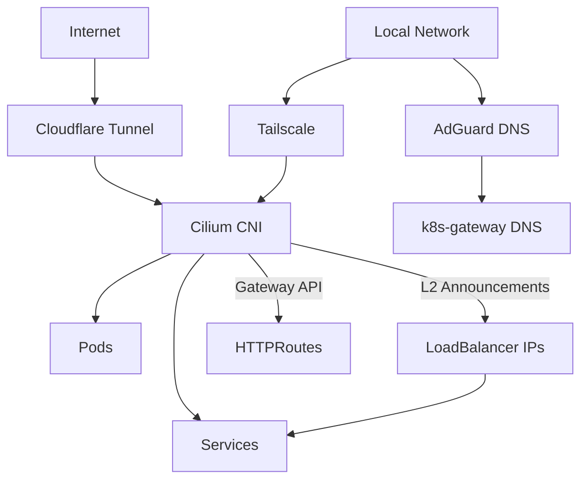
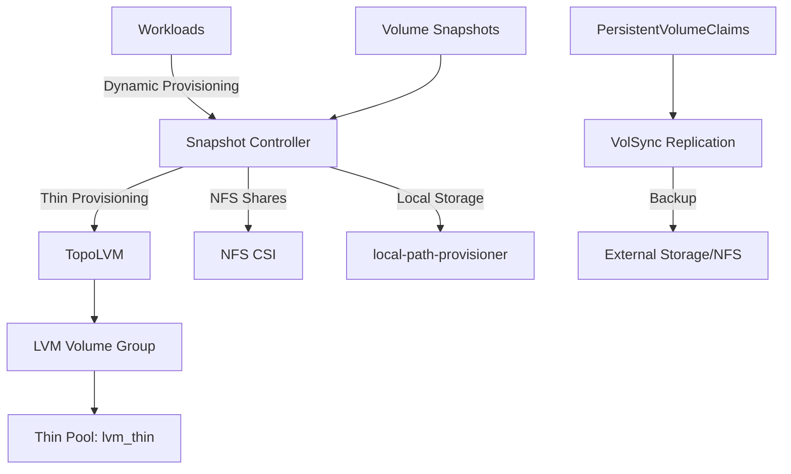
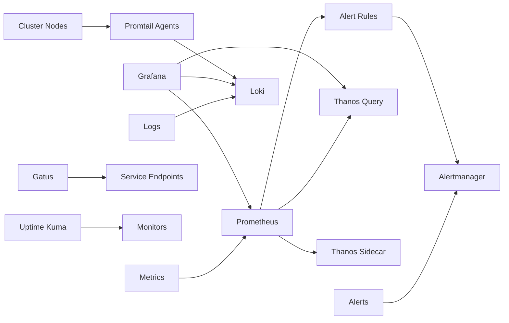

# Cluster Architecture Overview

This document describes the overall architecture of the Talos Linux Kubernetes cluster, including the control plane setup, networking stack, storage layers, observability infrastructure, and security mechanisms.

## Control Plane Architecture

The cluster runs a **single-node control plane** with a Virtual IP (VIP) for high availability within the control plane itself. This design is suitable for homelab environments where a single control plane node provides sufficient availability.

### Control Plane Configuration

- **Control Plane Node**: `master0-nuc12` (192.168.50.145)
- **Virtual IP (VIP)**: 192.168.50.10
- **API Endpoint**: https://192.168.50.10:6443
- **Secure Boot**: Enabled on all nodes
- **Scheduling**: Control plane nodes allow workload scheduling (`allowSchedulingOnControlPlanes: true`)

The VIP is managed by Talos and ensures that the Kubernetes API server remains accessible at the fixed IP address regardless of the underlying node's physical address.

### Kubernetes Components

The cluster uses Kubernetes v1.35.4 with several built-in components customized or disabled:

- **CoreDNS**: Disabled (replaced by custom CoreDNS installation)
- **kube-proxy**: Disabled (replaced by Cilium's kube-proxy replacement)
- **etcd**: Advertised on 192.168.50.0/24 subnet with metrics enabled
- **API Server**: Aggregator routing enabled for service mesh integration
- **Controller Manager & Scheduler**: Bound to 0.0.0.0 for monitoring

### Cluster Network CIDRs

- **Pod Network**: 10.42.0.0/16
- **Service Network**: 10.43.0.0/16

## Networking Stack

The networking layer combines multiple technologies to provide ingress, egress, service discovery, and secure external access.

### Cilium (CNI)

Cilium serves as the cluster's Container Network Interface with advanced features:

- **Kube-proxy Replacement**: Fully replaces kube-proxy with eBPF-based service forwarding
- **IPAM Mode**: Kubernetes-native IP address management
- **Routing Mode**: Native routing with IPv4 native routing CIDR (10.42.0.0/16)
- **Load Balancing**: Maglev algorithm with Direct Server Return (DSR) mode
- **Gateway API**: Enabled for Kubernetes Gateway API CRDs
- **L2 Announcements**: Enabled for LoadBalancer IP advertisement without kube-proxy
- **Egress Gateway**: Enabled for controlled egress traffic routing
- **Socket LB**: Host namespace only for optimal performance
- **Hubble**: Currently disabled (network observability layer)

Key capabilities:
- Automatic node-to-node encryption (via WireGuard or IPsec)
- Network policies for microservices segmentation
- Visibility into pod-to-pod traffic (when Hubble enabled)

### Cloudflare Tunnel

The Cloudflare Tunnel (`cloudflared`) provides secure inbound access to cluster services without opening ports:

- **Image**: docker.io/cloudflare/cloudflared:2026.7.3
- **Protocol**: HTTP/2 with tunnel metrics on 0.0.0.0:8080
- **Origin HTTP/2**: Enabled for better performance
- **Security Context**: Non-root, read-only filesystem, all capabilities dropped
- **Resources**: 10m CPU request, 256Mi memory limit

Services exposed through Cloudflare Tunnel are accessed via Cloudflare's edge network, which terminates TLS and forwards traffic to the tunnel. The tunnel configuration is managed via a ConfigMap and secrets.

### Tailscale

Tailscale provides secure mesh networking for cluster access:

- **Operator**: tailscale-operator v1.98.9
- **API Server Proxy**: Enabled for Kubernetes API access via Tailscale
- **OAuth**: Client credentials from `tailscale-secret`
- **Relay**: DERP mesh network for NAT traversal

Tailscale enables secure access to cluster services from external networks without VPN configuration.

### DNS Infrastructure

The cluster runs a multi-tier DNS system:

1. **k8s-gateway**: DNS-based service discovery using Gateway API
   - Exposes services via DNS records under `${SECRET_DOMAIN}`
   - LoadBalancer service with Cilium IPAM (192.168.50.11)
   - Watches HTTPRoute and Service resources
   - TTL: 1 second for rapid updates

2. **AdGuard DNS**: External DNS integration with AdGuard Home
   - Webhook provider for AdGuard Home API
   - Connects to AdGuard at 192.168.50.1:3000
   - Credentials stored in `adguard-dns-secret`

3. **Cloudflare DNS**: External DNS management for public domains
   - Managed via External DNS Operator
   - CRDs installed during bootstrap

## Storage Architecture

The cluster employs a multi-layer storage strategy to support different workload requirements:

### TopoLVM (Primary Storage)

TopoLVM provides dynamic thin-provisioned storage using LVM:

- **Version**: 16.1.1
- **Device Class**: `thin` (default class)
- **Volume Group**: `lvm_vg`
- **Thin Pool**: `lvm_thin` with 10x overprovisioning ratio
- **Spare GB**: 10GB reserved for emergencies
- **Filesystem**: XFS
- **Volume Binding Mode**: Immediate
- **Storage Class Name**: `topolvm-thin-provisioner` (default)

The LVM setup requires manual disk formatting documented in `lvm-format-manual.yaml`:
1. NVMe disk wipe and format
2. Physical volume creation: `pvcreate /dev/nvme0n1`
3. Volume group creation: `vgcreate lvm_vg /dev/nvme0n1`
4. Thin pool creation: `lvcreate --thinpool -l 100%FREE -n lvm_thin lvm_vg`

TopoLVM runs with an embedded lvmd daemon on each storage node, managed as a DaemonSet with a single controller replica.

### NFS CSI Driver

For network-attached storage requirements:

- **Version**: 4.13.4
- **Controller Replicas**: 1
- **External Snapshotter**: Disabled (snapshot-controller handles this)

The NFS CSI enables provisioning of NFS-based PersistentVolumes for workloads requiring shared storage across multiple pods.

### Local Path Provisioner

For simple local storage needs:

- **Version**: 0.0.37
- **Host Path**: `/var/mnt/local-path-provisioner`
- **Scope**: Non-listed nodes use DEFAULT_PATH

This provisioner is suitable for development workloads and applications that don't require replication or high availability.

### VolSync (Replication & Backup)

VolSync provides asynchronous data replication for disaster recovery:

- **Version**: 0.16.0
- **CRD Management**: Managed by VolSync
- **Metrics**: Authentication disabled for local scraping

VolSync replication is configured per-application (e.g., Nextcloud, Calibre Web) using `volsync-nfs.yaml` specifications to sync data to NFS storage.

### Snapshot Controller

Volume snapshot capabilities:

- **Version**: 5.2.0
- **CRD Management**: CreateReplace strategy
- **Webhook**: Disabled
- **Service Monitor**: Enabled for Prometheus scraping

The snapshot controller creates VolumeSnapshot CRDs and implements the CSI snapshotter sidecar, enabling on-demand volume snapshots for backup and migration.

## Observability Stack

The cluster maintains comprehensive observability with metrics, logs, uptime monitoring, and dashboards.

### Prometheus (kube-prometheus-stack)

Centralized metrics collection and alerting:

- **Version**: 88.1.3
- **Components**: Prometheus, Alertmanager, node-exporter, kube-state-metrics
- **Scraping Targets**: Kubelet, API server, controller manager (disabled), scheduler (disabled), etcd (disabled), kube-proxy (disabled)
- **Storage**: TopoLVM-provisioned PVs for Prometheus TSDB
- **Thanos Integration**: Sidecar enabled for long-term metrics storage

Key features:
- **High Cardinality Label Dropping**: Removes `uid`, `id`, `name` labels to reduce metric cardinality
- **Request Duration Bucket Exclusion**: Drops high-cardity `_bucket` metrics for REST clients
- **Alertmanager**: Route configuration for alerts via internal Gateway API

### Grafana

Visualization and dashboard platform:

- **Version**: 10.5.15
- **Admin Credentials**: Stored in `grafana-admin-secret`
- **Root URL**: https://grafana-dev.${SECRET_DOMAIN}
- **Deployment Strategy**: Recreate (no rolling updates)
- **Plugins**: natel-discrete-panel, pr0ps-trackmap-panel, panodata-map-panel allowed
- **Analytics**: All update checks and reporting disabled

### Loki

Log aggregation system:

- **Version**: 7.2.0
- **Deployment Mode**: SingleBinary (all-in-one)
- **Storage**: Filesystem-based (no object storage configured)
- **Chunk Encoding**: Snappy compression
- **Replication Factor**: 1 (no HA)
- **Resources**: 10m CPU / 256Mi memory request, 4Gi memory limit

Logs are shipped to Loki by Promtail agents running on each node.

### Thanos

Long-term metrics storage and querying:

- **Version**: 17.3.1 (Binary v0.42.4)
- **Components**: Query, Query Frontend, Store (sidecar), Compactor, Ruler
- **Query Frontend**: Enabled for query parallelization and caching
- **Replica Label**: `__replica__` for deduplication
- **Object Storage**: Configured via `thanos-secret` (S3-compatible)

Thanos enables global querying across Prometheus instances and long-term metric retention beyond local TSDB limits.

### Gatus

Endpoint health monitoring and uptime tracking:

- **Version**: v5.36.0
- **Configuration**: Auto-discovered from resources labeled `gatus.io/enabled`
- **Init Container**: k8s-sidecar watches for ConfigMaps/Secrets with Gatus configuration
- **Resources**: 10m CPU / 64Mi memory request, 512Mi memory limit

Gatus provides HTTP/HTTPS/TCP endpoint monitoring with configurable thresholds, alerting, and status page generation.

### Additional Observability Tools

- **Promtail**: Log agent for shipping container logs to Loki
- **Uptime Kuma**: Self-hosted monitoring tool (alternative/supplement to Gatus)
- **smartctl-exporter**: Disk health metrics via S.M.A.R.T.
- **node-feature-discovery**: Hardware feature discovery for GPU/intel-iodriver scheduling

## Security Layers

The cluster implements defense-in-depth with multiple security mechanisms.

### Talos Linux Security

- **Secure Boot**: Enabled on all nodes (factory.talos.dev installer)
- **Immutable OS**: No shell or package manager, minimal attack surface
- **API Server Cert SANs**: 127.0.0.1, 192.168.50.10, 192.168.50.145
- **Machine Cert SANs**: Same as API server for node authentication

### Secret Management

The cluster uses a layered secret management approach:

1. **SOPS + age**: Git-encrypted secrets with age encryption
   - Talos secrets (`talos/*.sops.yaml`): Whole-file encryption
   - Kubernetes secrets (`bootstrap/`, `kubernetes/`): `data`/`stringData` only
   - Age key: `age1shkd7fsr66cnpkutpmpf7ffylcc2x4c9tlsdkapv6nmu5ceu0dzqdjtqc5`

2. **External Secrets Operator**: Synchronizes external secrets into Kubernetes
   - **Bitwarden Connect**: Integration with Bitwarden for credential management
   - **OAuth Clients**: Tailscale, Cloudflare credentials from external vault

3. **Kubernetes Secrets**: Runtime secrets for applications
   - Flux decryption via SOPS provider with `sops-age` secret

### Network Security

- **Cilium Network Policies**: Microservices segmentation (when configured)
- **AdGuard DNS**: DNS-level filtering and ad blocking
- **Tailscale**: Private, encrypted mesh network
- **Cloudflare Tunnel**: No open ports, inbound-only via Cloudflare's edge

### Pod Security

Most applications run with restricted security contexts:
- **Non-root users**: runAsNonRoot: true, runAsUser: 65534
- **Read-only root filesystems**: Where supported
- **Capability dropping**: All capabilities dropped where possible
- **Privilege escalation**: Disabled by default

## GitOps with Flux

Flux provides continuous deployment and cluster management:

- **Flux Operator**: v0.57.0
- **Flux Instance**: v0.57.0
- **Source**: GitRepository pointing to this repository
- **SOPS Integration**: Age-based decryption for secrets

### Flux Kustomizations

The cluster is managed via multiple Kustomizations for dependency management:

1. **cluster-meta**: Repositories and CRDs (gateway-api, external-dns)
2. **gateway-api-crds**: Gateway API experimental CRDs
3. **external-dns-crds**: External DNS standard CRDs
4. **cluster-apps**: All applications under `kubernetes/apps/`

Dependencies ensure CRDs exist before applications attempt to use them.

## Bootstrap Process

The cluster follows a three-phase bootstrap:

1. **Talos Bootstrap** (`task bootstrap:talos`):
   - Generate Talos machine configs with talhelper
   - Apply machine configs to nodes
   - Bootstrap etcd and control plane
   - Export kubeconfig

2. **App Bootstrap** (`task bootstrap:apps`):
   - Wait for nodes to be available
   - Create namespaces
   - Apply SOPS secrets (GitHub deploy key, cluster secrets, age key)
   - Install CRDs (Gateway API, External DNS)
   - Deploy base charts via helmfile (Cilium, CoreDNS, cert-manager, Flux)

3. **Flux Sync**:
   - Flux operator reconciles `kubernetes/apps/`
   - Namespaced Kustomizations deploy applications
   - Continuous reconciliation keeps cluster in sync with git

## Upgrade Strategy

The cluster supports rolling upgrades at multiple layers:

- **Talos Upgrades**: Per-node via `task talos:upgrade-node IP=<ip>`
- **Kubernetes Upgrades**: Cluster-wide via `task talos:upgrade-k8s` (edits `talenv.yaml`)
- **Application Upgrades**: Automated via Flux HelmRelease reconciliation
- **System Upgrades**: Talos system-upgrade-controller for coordinated node upgrades

Version pins are maintained in `talenv.yaml` with Renovate annotations for automated dependency tracking.
