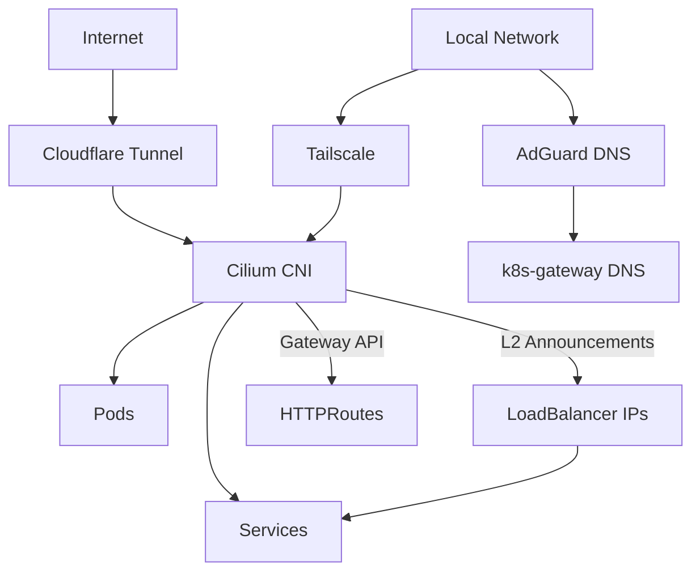
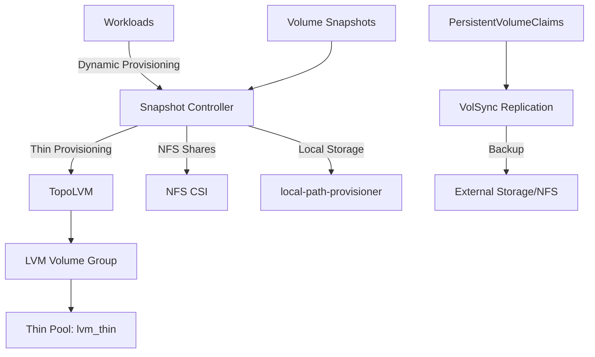
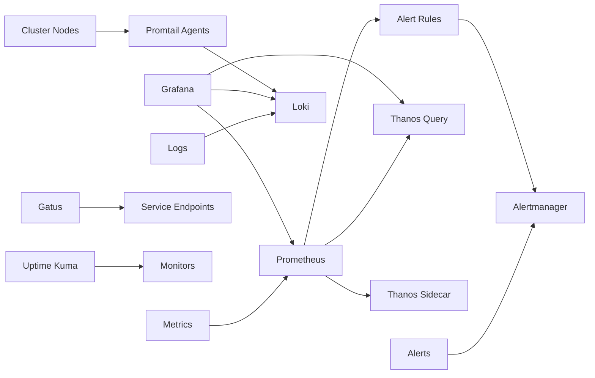

# Cluster & Talos Architecture

This document describes the cluster's Talos Linux layer — node roles, hardware inventory, the talhelper configuration pipeline, and Talos machine patches — and how that layer underpins the Kubernetes control plane, networking stack, storage layers, observability infrastructure, and security mechanisms.

## Talos Layer

The cluster runs on Talos Linux, an immutable, API-driven OS with no shell or package manager. The entire Talos layer is declaratively managed in `talos/` via [talhelper](https://github.com/budimanjojo/talhelper), and the generated machine configs drive the Kubernetes control plane.

### Configuration Pipeline

Talos configs are not hand-written. The flow is:

<!-- openwiki: mermaid parse failed and this diagram was converted to a text fence so it does not break rendering. Fix the diagram source and restore the mermaid fence. Parser error: Heuristic: an unescaped angle bracket inside a label breaks rendering; rephrase the label. -->
```text
flowchart LR
    Env[talenv.yaml<br/>talos/k8s versions] --> TC[talconfig.yaml<br/>nodes + patches]
    TC -->|talhelper genconfig| CC[clusterconfig/<br/>machine configs, gitignored]
    TC -->|talhelper gensecret| TS[talsecret.sops.yaml<br/>SOPS-encrypted cluster secrets]
    CC -->|talhelper gencommand apply| Nodes[Talos Nodes]
    TS --> Nodes
```

- **`talos/talenv.yaml`**: pins `talosVersion: v1.12.7` and `kubernetesVersion: v1.35.4`, both with Renovate annotations for automated dependency tracking. These values are substituted into the `${talosVersion}` / `${kubernetesVersion}` placeholders in `talconfig.yaml`.
- **`talos/talconfig.yaml`**: the talhelper master config — cluster name, API endpoint, cert SANs, pod/service CIDRs, node inventory, and patch references.
- **`talhelper gensecret`** creates the cluster PKI/secrets; on first run the bootstrap task pipes it through `sops --encrypt` to produce `talos/talsecret.sops.yaml`. Regeneration is skipped if that file already exists.
- **`talhelper genconfig`** renders per-node machine configs into `talos/clusterconfig/`, which is gitignored — generated configs are disposable, the source of truth is `talconfig.yaml` plus patches.
- **`talos/clusterconfig/talosconfig`** is exported as `TALOSCONFIG` by `mise` for `talosctl` access.

All `talhelper` task entry points (`talos:generate-config`, `talos:apply-node`, `talos:upgrade-node`, `talos:upgrade-k8s`, `talos:reset`) are thin wrappers around `talhelper gencommand ...`, so `talconfig.yaml` remains the single source of truth for node targeting and image URLs.

### Hardware Inventory & Node Roles

The cluster is a **single control-plane node** with workload scheduling enabled on the control plane — a homelab-oriented design. The node inventory in `talconfig.yaml`:

- **`master0-nuc12`** (192.168.50.145) — the only node, `controlPlane: true`
- **Hardware**: Intel NUC12 with integrated Intel GPU; labeled `intel.feature.node.kubernetes.io/gpu: "true"` so GPU workloads can be scheduled via node-feature-discovery
- **Install disk**: selected by `size: "<= 256GB"`, `type: ssd`
- **Secure Boot**: enabled (`machineSpec.secureboot: true`); the node installs from a pinned `factory.talos.dev/installer-secureboot/...` image
- **System extensions**: `siderolabs/i915` (Intel GPU), `siderolabs/intel-ucode` (CPU microcode), `siderolabs/thunderbolt`
- **Kernel modules**: `dm_thin_pool` and `dm_mod` (TopoLVM thin provisioning), `i915`/`drm`/`drm_kms_helper` (GPU)
- **Networking**: static address `192.168.50.145/24` selected by NIC MAC `48:21:0b:58:14:f9`, default route via 192.168.50.1, MTU 1500
- **VIP**: `192.168.50.10` announced via Talos VIP on the node's interface — the Kubernetes API endpoint `https://192.168.50.10:6443` stays fixed even though a single node currently holds it; adding further control-plane nodes to `talconfig.yaml` would give them the same VIP for failover
- **User volume**: an inline manifest provisions a `UserVolumeConfig` named `local-path-provisioner` (min 2GB, grow-enabled, on the system disk) as host storage for local-path-provisioner, bind-mounted into the kubelet via the kubelet patch

### Machine Patches

`talos/patches/` holds Kustomize-style strategic-merge patches that talhelper merges into the final machine configs. Per the directory README, `global/` applies to both controller and worker configs, `controller/` to control-plane nodes, and `worker/` / `${node-hostname}/` directories are optional and absent here.

**Global patches** (all nodes):

| Patch | Purpose |
|---|---|
| `machine-files.yaml` | Creates `/etc/cri/conf.d/20-customization.part` to keep containerd `discard_unpacked_layers = false` (image caching) |
| `machine-kubelet.yaml` | Parallel image pulls; node IP restricted to 192.168.50.0/24; bind-mounts `/var/mnt/local-path-provisioner` (`rshared`, rw) |
| `machine-network.yaml` | Disables search domain; nameservers 1.1.1.1 / 1.0.0.1 |
| `machine-sysctls.yaml` | Inotify limits (Watchdog), `rmem_max`/`wmem_max` 7.5MB (cloudflared QUIC), user namespaces for rootless Docker (gitea runner) |
| `machine-time.yaml` | NTP via Cloudflare time servers 162.159.200.1 / 162.159.200.123 |
| `machine-udev.yaml` | DRM rule granting the video group (GID 44) `0660` access to `renderD*` for containerized GPU workloads |
| `machine-api-access.yaml` | Enables Kubernetes-to-Talos API access for `os:admin` from the `kube-system` namespace (used by the in-cluster Talos upgrade controller) |

**Controller patch** (`patches/controller/cluster.yaml`) shapes the Kubernetes control plane:

```yaml
cluster:
  allowSchedulingOnControlPlanes: true
  apiServer:
    extraArgs:
      enable-aggregator-routing: true
  controllerManager:
    extraArgs:
      bind-address: 0.0.0.0
  coreDNS:
    disabled: true
  etcd:
    extraArgs:
      listen-metrics-urls: http://0.0.0.0:2381
    advertisedSubnets:
      - 192.168.50.0/24
  proxy:
    disabled: true
  scheduler:
    extraArgs:
      bind-address: 0.0.0.0
```

Key consequences for the Kubernetes layer:

- **kube-proxy disabled** — Cilium's eBPF kube-proxy replacement handles service forwarding (see [Networking](/openwiki/concepts/networking.md))
- **Built-in CoreDNS disabled** — CoreDNS is installed as a Helm release during app bootstrap instead
- **etcd metrics on :2381** — scraped by Prometheus; etcd advertises only on the 192.168.50.0/24 LAN subnet
- **Aggregator routing enabled** — required by Cilium's Gateway API / service-mesh style integrations
- **controller-manager and scheduler bound to 0.0.0.0** — their metrics ports become scrapeable
- **`allowSchedulingOnControlPlanes: true`** — the single node runs all workloads

### SOPS Encryption & the age Key

Talos secrets are encrypted at rest in git via SOPS+age, governed by `.sops.yaml`:

- **`talos/*.sops.yaml`** (i.e. `talsecret.sops.yaml`): **whole-file encryption**, with `mac_only_encrypted: true`
- **`bootstrap/` and `kubernetes/` `*.sops.yaml`**: only `data`/`stringData` keys are encrypted, leaving metadata readable by Flux
- Both rules target the age public key `age1shkd7fsr66cnpkutpmpf7ffylcc2x4c9tlsdkapv6nmu5ceu0dzqdjtqc5`

The **private age key lives unencrypted at `age.key` in the repo root** (never committed); `mise` exports `SOPS_AGE_KEY_FILE=./age.key` so all `sops` operations and the bootstrap preconditions can find it. The bootstrap task requires `.sops.yaml`, `age.key`, and `talconfig.yaml` to exist before running. During app bootstrap, the decrypted `sops-age` Kubernetes secret (from `kubernetes/components/common/sops/sops-age.sops.yaml`) is applied to the cluster so Flux can decrypt SOPS-encrypted manifests thereafter — this is the handoff point where the local age key's authority moves in-cluster.

### Cluster Network CIDRs

- **Pod Network**: 10.42.0.0/16
- **Service Network**: 10.43.0.0/16

### Lifecycle & Failure Semantics

- **Bootstrap ordering**: `task bootstrap:talos` generates/reuses `talsecret.sops.yaml` → `talhelper genconfig` → `gencommand apply --insecure` → `bootstrap` (retried until etcd forms) → `kubeconfig` export. It is idempotent: existing secrets are reused, not regenerated.
- **Config changes**: edit `talconfig.yaml`/patches, then `task talos:apply-node IP=<node-ip>` (mode `auto` by default) re-renders and applies the machine config; `talos:reset` wipes STATE/EPHEMERAL partitions and returns nodes to maintenance mode.
- **In-cluster upgrades**: the `tuppr` controller (in `kube-system/system-upgrade`) reconciles `TalosUpgrade` CRDs; the `talos` resource pins Talos `v1.12.7` (Renovate-tracked) and uses `rebootMode: powercycle`, driving node-by-node Talos and Kubernetes upgrades automatically. Prometheus rules alert on failed/stacked upgrade phases.
- **Manual upgrades**: `task talos:upgrade-node IP=<ip>` upgrades Talos from the node's `talosImageURL` at the `talenv.yaml` version; `task talos:upgrade-k8s` upgrades Kubernetes to the `talenv.yaml` version. Manual and automated paths draw versions from the same source of truth.

## Networking Stack

The networking layer combines multiple technologies to provide ingress, egress, service discovery, and secure external access.



### Cilium (CNI)

Cilium serves as the cluster's Container Network Interface with advanced features:

- **Kube-proxy Replacement**: Fully replaces kube-proxy with eBPF-based service forwarding
- **IPAM Mode**: Kubernetes-native IP address management
- **Routing Mode**: Native routing with IPv4 native routing CIDR (10.42.0.0/16)
- **Load Balancing**: Maglev algorithm with Direct Server Return (DSR) mode
- **Gateway API**: Enabled for Kubernetes Gateway API CRDs
- **L2 Announcements**: Enabled for LoadBalancer IP advertisement without kube-proxy
- **Egress Gateway**: Enabled for controlled egress traffic routing
- **Socket LB**: Host namespace only for optimal performance
- **Hubble**: Currently disabled (network observability layer)

Key capabilities:
- Automatic node-to-node encryption (via WireGuard or IPsec)
- Network policies for microservices segmentation
- Visibility into pod-to-pod traffic (when Hubble enabled)

### Cloudflare Tunnel

The Cloudflare Tunnel (`cloudflared`) provides secure inbound access to cluster services without opening ports:

- **Image**: docker.io/cloudflare/cloudflared:2026.7.3
- **Protocol**: HTTP/2 with tunnel metrics on 0.0.0.0:8080
- **Origin HTTP/2**: Enabled for better performance
- **Security Context**: Non-root, read-only filesystem, all capabilities dropped
- **Resources**: 10m CPU request, 256Mi memory limit

Services exposed through Cloudflare Tunnel are accessed via Cloudflare's edge network, which terminates TLS and forwards traffic to the tunnel. The tunnel configuration is managed via a ConfigMap and secrets.

### Tailscale

Tailscale provides secure mesh networking for cluster access:

- **Operator**: tailscale-operator v1.98.9
- **API Server Proxy**: Enabled for Kubernetes API access via Tailscale
- **OAuth**: Client credentials from `tailscale-secret`
- **Relay**: DERP mesh network for NAT traversal

Tailscale enables secure access to cluster services from external networks without VPN configuration.

### DNS Infrastructure

The cluster runs a multi-tier DNS system:

1. **k8s-gateway**: DNS-based service discovery using Gateway API
   - Exposes services via DNS records under `${SECRET_DOMAIN}`
   - LoadBalancer service with Cilium IPAM (192.168.50.11)
   - Watches HTTPRoute and Service resources
   - TTL: 1 second for rapid updates

2. **AdGuard DNS**: External DNS integration with AdGuard Home
   - Webhook provider for AdGuard Home API
   - Connects to AdGuard at 192.168.50.1:3000
   - Credentials stored in `adguard-dns-secret`

3. **Cloudflare DNS**: External DNS management for public domains
   - Managed via External DNS Operator
   - CRDs installed during bootstrap

## Storage Architecture

The cluster employs a multi-layer storage strategy to support different workload requirements:



### TopoLVM (Primary Storage)

TopoLVM provides dynamic thin-provisioned storage using LVM:

- **Version**: 16.1.1
- **Device Class**: `thin` (default class)
- **Volume Group**: `lvm_vg`
- **Thin Pool**: `lvm_thin` with 10x overprovisioning ratio
- **Spare GB**: 10GB reserved for emergencies
- **Filesystem**: XFS
- **Volume Binding Mode**: Immediate
- **Storage Class Name**: `topolvm-thin-provisioner` (default)

The LVM setup requires manual disk formatting documented in `lvm-format-manual.yaml`:
1. NVMe disk wipe and format
2. Physical volume creation: `pvcreate /dev/nvme0n1`
3. Volume group creation: `vgcreate lvm_vg /dev/nvme0n1`
4. Thin pool creation: `lvcreate --thinpool -l 100%FREE -n lvm_thin lvm_vg`

TopoLVM runs with an embedded lvmd daemon on each storage node, managed as a DaemonSet with a single controller replica.

### NFS CSI Driver

For network-attached storage requirements:

- **Version**: 4.13.4
- **Controller Replicas**: 1
- **External Snapshotter**: Disabled (snapshot-controller handles this)

The NFS CSI enables provisioning of NFS-based PersistentVolumes for workloads requiring shared storage across multiple pods.

### Local Path Provisioner

For simple local storage needs:

- **Version**: 0.0.37
- **Host Path**: `/var/mnt/local-path-provisioner`
- **Scope**: Non-listed nodes use DEFAULT_PATH

This provisioner is suitable for development workloads and applications that don't require replication or high availability.

### VolSync (Replication & Backup)

VolSync provides asynchronous data replication for disaster recovery:

- **Version**: 0.16.0
- **CRD Management**: Managed by VolSync
- **Metrics**: Authentication disabled for local scraping

VolSync replication is configured per-application (e.g., Nextcloud, Calibre Web) using `volsync-nfs.yaml` specifications to sync data to NFS storage.

### Snapshot Controller

Volume snapshot capabilities:

- **Version**: 5.2.0
- **CRD Management**: CreateReplace strategy
- **Webhook**: Disabled
- **Service Monitor**: Enabled for Prometheus scraping

The snapshot controller creates VolumeSnapshot CRDs and implements the CSI snapshotter sidecar, enabling on-demand volume snapshots for backup and migration.

## Observability Stack

The cluster maintains comprehensive observability with metrics, logs, uptime monitoring, and dashboards.



### Prometheus (kube-prometheus-stack)

Centralized metrics collection and alerting:

- **Version**: 88.1.3
- **Components**: Prometheus, Alertmanager, node-exporter, kube-state-metrics
- **Scraping Targets**: Kubelet, API server, controller manager (disabled), scheduler (disabled), etcd (disabled), kube-proxy (disabled)
- **Storage**: TopoLVM-provisioned PVs for Prometheus TSDB
- **Thanos Integration**: Sidecar enabled for long-term metrics storage

Key features:
- **High Cardinality Label Dropping**: Removes `uid`, `id`, `name` labels to reduce metric cardinality
- **Request Duration Bucket Exclusion**: Drops high-cardity `_bucket` metrics for REST clients
- **Alertmanager**: Route configuration for alerts via internal Gateway API

### Grafana

Visualization and dashboard platform:

- **Version**: 10.5.15
- **Admin Credentials**: Stored in `grafana-admin-secret`
- **Root URL**: https://grafana-dev.${SECRET_DOMAIN}
- **Deployment Strategy**: Recreate (no rolling updates)
- **Plugins**: natel-discrete-panel, pr0ps-trackmap-panel, panodata-map-panel allowed
- **Analytics**: All update checks and reporting disabled

### Loki

Log aggregation system:

- **Version**: 7.2.0
- **Deployment Mode**: SingleBinary (all-in-one)
- **Storage**: Filesystem-based (no object storage configured)
- **Chunk Encoding**: Snappy compression
- **Replication Factor**: 1 (no HA)
- **Resources**: 10m CPU / 256Mi memory request, 4Gi memory limit

Logs are shipped to Loki by Promtail agents running on each node.

### Thanos

Long-term metrics storage and querying:

- **Version**: 17.3.1 (Binary v0.42.4)
- **Components**: Query, Query Frontend, Store (sidecar), Compactor, Ruler
- **Query Frontend**: Enabled for query parallelization and caching
- **Replica Label**: `__replica__` for deduplication
- **Object Storage**: Configured via `thanos-secret` (S3-compatible)

Thanos enables global querying across Prometheus instances and long-term metric retention beyond local TSDB limits.

### Gatus

Endpoint health monitoring and uptime tracking:

- **Version**: v5.36.0
- **Configuration**: Auto-discovered from resources labeled `gatus.io/enabled`
- **Init Container**: k8s-sidecar watches for ConfigMaps/Secrets with Gatus configuration
- **Resources**: 10m CPU / 64Mi memory request, 512Mi memory limit

Gatus provides HTTP/HTTPS/TCP endpoint monitoring with configurable thresholds, alerting, and status page generation.

### Additional Observability Tools

- **Promtail**: Log agent for shipping container logs to Loki
- **Uptime Kuma**: Self-hosted monitoring tool (alternative/supplement to Gatus)
- **smartctl-exporter**: Disk health metrics via S.M.A.R.T.
- **node-feature-discovery**: Hardware feature discovery for GPU/intel-iodriver scheduling

## Security Layers

The cluster implements defense-in-depth with multiple security mechanisms.

### Talos Linux Security

- **Secure Boot**: Enabled on all nodes (factory.talos.dev installer)
- **Immutable OS**: No shell or package manager, minimal attack surface
- **API Server Cert SANs**: 127.0.0.1, 192.168.50.10, 192.168.50.145
- **Machine Cert SANs**: Same as API server for node authentication

### Secret Management

The cluster uses a layered secret management approach:

1. **SOPS + age**: Git-encrypted secrets with age encryption
   - Talos secrets (`talos/*.sops.yaml`): Whole-file encryption
   - Kubernetes secrets (`bootstrap/`, `kubernetes/`): `data`/`stringData` only
   - Age key: `age1shkd7fsr66cnpkutpmpf7ffylcc2x4c9tlsdkapv6nmu5ceu0dzqdjtqc5`

2. **External Secrets Operator**: Synchronizes external secrets into Kubernetes
   - **Bitwarden Connect**: Integration with Bitwarden for credential management
   - **OAuth Clients**: Tailscale, Cloudflare credentials from external vault

3. **Kubernetes Secrets**: Runtime secrets for applications
   - Flux decryption via SOPS provider with `sops-age` secret

### Network Security

- **Cilium Network Policies**: Microservices segmentation (when configured)
- **AdGuard DNS**: DNS-level filtering and ad blocking
- **Tailscale**: Private, encrypted mesh network
- **Cloudflare Tunnel**: No open ports, inbound-only via Cloudflare's edge

### Pod Security

Most applications run with restricted security contexts:
- **Non-root users**: runAsNonRoot: true, runAsUser: 65534
- **Read-only root filesystems**: Where supported
- **Capability dropping**: All capabilities dropped where possible
- **Privilege escalation**: Disabled by default

## GitOps with Flux

Flux provides continuous deployment and cluster management:

- **Flux Operator**: v0.57.0
- **Flux Instance**: v0.57.0
- **Source**: GitRepository pointing to this repository
- **SOPS Integration**: Age-based decryption for secrets

### Flux Kustomizations

The cluster is managed via multiple Kustomizations for dependency management:

1. **cluster-meta**: Repositories and CRDs (gateway-api, external-dns)
2. **gateway-api-crds**: Gateway API experimental CRDs
3. **external-dns-crds**: External DNS standard CRDs
4. **cluster-apps**: All applications under `kubernetes/apps/`

Dependencies ensure CRDs exist before applications attempt to use them.

## Bootstrap Process

The cluster follows a three-phase bootstrap:

1. **Talos Bootstrap** (`task bootstrap:talos`):
   - Generate Talos machine configs with talhelper
   - Apply machine configs to nodes
   - Bootstrap etcd and control plane
   - Export kubeconfig

2. **App Bootstrap** (`task bootstrap:apps`):
   - Wait for nodes to be available
   - Create namespaces
   - Apply SOPS secrets (GitHub deploy key, cluster secrets, age key)
   - Install CRDs (Gateway API, External DNS)
   - Deploy base charts via helmfile (Cilium, CoreDNS, cert-manager, Flux)

3. **Flux Sync**:
   - Flux operator reconciles `kubernetes/apps/`
   - Namespaced Kustomizations deploy applications
   - Continuous reconciliation keeps cluster in sync with git

## Upgrade Strategy

Upgrades operate at multiple layers, all versioned from declarative sources:

- **Talos Upgrades**: automated in-cluster by the tuppr `TalosUpgrade` CRD (`kube-system/system-upgrade`), or per-node manually via `task talos:upgrade-node IP=<ip>` which reads the image URL from `talconfig.yaml`
- **Kubernetes Upgrades**: `task talos:upgrade-k8s` upgrades to the version pinned in `talenv.yaml`
- **Application Upgrades**: automated via Flux HelmRelease reconciliation
- **Dependency Tracking**: Renovate annotations on version pins in `talenv.yaml`, `talconfig.yaml` (via image references), and Helm releases keep versions current and reviewed through pull requests
