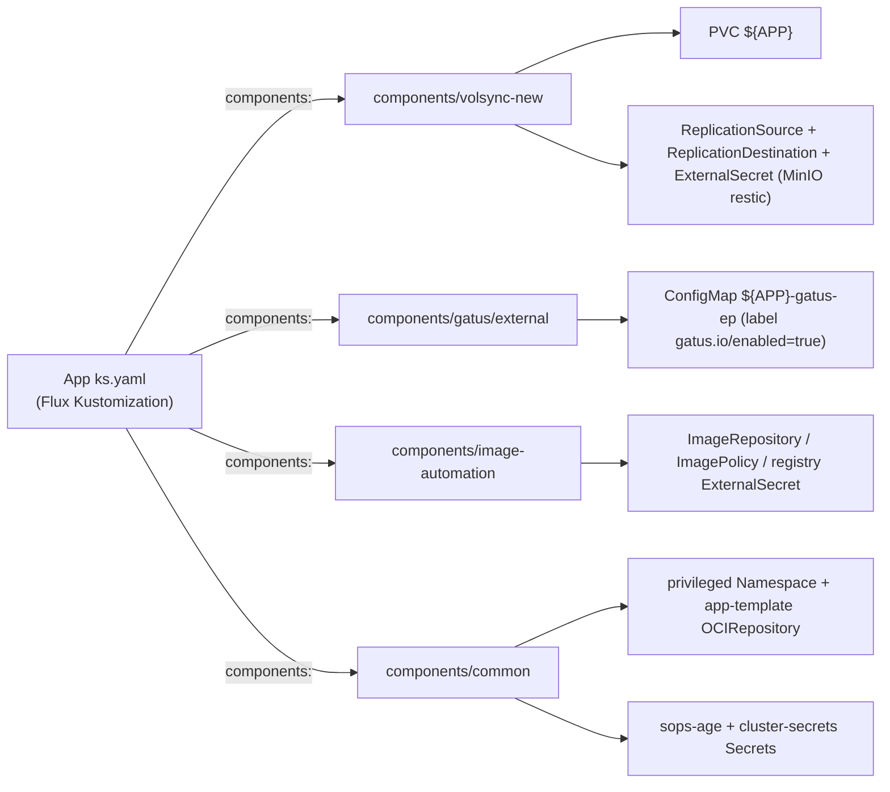

# Reusable Kustomize Components

Kustomize [Components](https://github.com/kubernetes-sigs/kustomize/blob/master/examples/components.md) (`kind: Component`, `apiVersion: kustomize.config.k8s.io/v1alpha1`) are optional resource bundles that a Flux `Kustomization` can opt into with a `spec.components:` list of relative paths. In this repo they live under `kubernetes/components/` and act as the shared "attachment points" that give an app storage backups, uptime checks, image automation, or cluster-wide prerequisites without duplicating manifests per app.



## How components are referenced

An app's `ks.yaml` lists component paths relative to the app directory, e.g. in `kubernetes/apps/default/gitea/ks.yaml`:

```yaml
components:
  - ../../../../components/volsync-new
  - ../../../../components/gatus/external
```

The same Kustomization also sets `postBuild.substitute` variables (such as `APP: *app` and `VOLSYNC_CAPACITY: 10Gi`) which the component templates consume via `${APP}`, `${VOLSYNC_CAPACITY:-1Gi}`-style placeholders. Apps using image-automation (e.g. `epub-translator`, `fava`, `growth-tracker`) supply additional substitutes like `REGISTRY_URL`, `REGISTRY_HOST`, `NAMESPACE`, and `BW_ID`.

## common/ — cluster prerequisites

`kubernetes/components/common/kustomization.yaml` bundles three pieces:

- **namespace.yaml** — a `not-used` Namespace labeled `pod-security.kubernetes.io/enforce: privileged` and annotated `kustomize.toolkit.fluxcd.io/prune: disabled`. It exists only to establish cluster-wide privileged pod security enforcement early; Flux never prunes it.
- **repos/** — the [app-template](https://github.com/bjw-s-labs/helm-charts) OCIRepository (`oci://ghcr.io/bjw-s-labs/helm/app-template`, tag `5.2.1`, 1h interval, helm-chart layer selector), which most app HelmReleases source their chart from.
- **sops/** — SOPS-encrypted Secrets applied by the bootstrap: `sops-age` (the age private key Flux uses for `decryption.provider: sops`, `secretRef: sops-age` in every app Kustomization) and `cluster-secrets` (the Secret substituted via `substituteFrom` in ks.yaml, providing `${SECRET_DOMAIN}` and friends).

Because these resources are cluster-level prerequisites rather than per-app, `common/` is typically applied by the bootstrap/cluster Kustomization rather than attached per app.

## volsync-new/ — PVC + restic backup

`kubernetes/components/volsync-new/kustomization.yaml` (and its predecessor `volsync/`, same resource list) injects two files:

- **claim.yaml** — a PersistentVolumeClaim named `${APP}` with substitutable `VOLSYNC_ACCESSMODES` (default `ReadWriteOnce`), `VOLSYNC_CAPACITY` (default `1Gi`), and `VOLSYNC_STORAGECLASS` (default `topolvm-thin-provisioner`).
- **minio.yaml** — three objects that together implement backup and restore against MinIO over S3:
  - an **ExternalSecret** `${APP}-volsync` (ClusterSecretStore `bitwarden-login`) synthesizing a `${APP}-volsync-secret` containing `RESTIC_REPOSITORY` (`s3:http://192.168.50.220:9010/volsync/dev/${APP}`), `RESTIC_PASSWORD`, and MinIO credentials pulled from the `cold-minio` Bitwarden item;
  - a **ReplicationSource** running restic backups of `sourcePVC: ${APP}` every 6 hours (`0 */6 * * *`) with `copyMethod: Direct`, 7-day prune interval, retention of 24 hourly / 7 daily / 5 weekly snapshots, and mover UID/GID 1000;
  - a **ReplicationDestination** `volsync-dst-${APP}` with `trigger: manual: restore-once` for one-shot restores, with cache/capacity/snapshotclass all overridable via `VOLSYNC_*` variables.

Apps must therefore define `APP` (and usually `VOLSYNC_CAPACITY`) in `postBuild.substitute` before attaching this component.

## gatus/ — health-check injection

Each gatus variant is a Component whose `kustomization.yaml` uses a **configMapGenerator** named `${APP}-gatus-ep`, loading its `config.yaml` into a ConfigMap labeled `gatus.io/enabled: "true"` (name hash disabled). A cluster-scoped [Gatus deployment](observability.md) discovers and hot-reloads these ConfigMaps, so attaching the component to an app is all that is needed to get a check. Variants:

- **gatus/external** — HTTP endpoint check against `https://${GATUS_SUBDOMAIN:=${APP}}.${SECRET_DOMAIN}${GATUS_PATH:=/}` every 1m via DNS resolver `tcp://223.5.5.5:53`, expecting `${GATUS_STATUS:=200}`; group `external`.
- **gatus/external-tailscale** — same HTTP shape but group `tailscale` and a separate `GATUS_SUBDOMAIN_TAILSCALE` override for hostnames that only resolve inside the tailnet.
- **gatus/guarded** — a DNS A-record check of `${GATUS_SUBDOMAIN:=${APP}}.${SECRET_DOMAIN}` against `223.5.5.5` with UI hostname/URL hidden, useful behind auth guards where direct HTTP probes would hit a login page.

## image-automation/ — Flux Image Automation

`kubernetes/components/image-automation` (documented in its own README) injects three templated objects, all namespaced to `${NAMESPACE}`:

- **registry-externalsecret.yaml** — an ExternalSecret (`bitwarden-login` store, item key `${BW_ID}`) producing a `kubernetes.io/dockerconfigjson` Secret `${APP}-registry-secret` for `${REGISTRY_HOST}`.
- **imagerepository.yaml** — an ImageRepository scanning `${REGISTRY_URL}` every minute using that pull secret.
- **imagepolicy.yaml** — an ImagePolicy labeled `image-automation: enabled` that filters tags matching `^.+-[a-f0-9]+-(?P<ts>[0-9]+)$`, extracts the timestamp, and picks the numerically greatest — i.e. the newest `sha-<digest>-<timestamp>` tag. The label lets a single repo-wide ImageUpdateAutomation discover and update every app's policy.

Apps consume the result in their HelmRelease values via the marker `tag: "sha-xxx" # {"$imagepolicy": "NAMESPACE:APP:tag"}`.

## Usage summary

| Component | Attach when you need | Required substitutes |
| --- | --- | --- |
| `components/common` | Cluster bootstrap (namespace, app-template repo, SOPS keys) | — (applied centrally) |
| `components/volsync-new` | A PersistentVolumeClaim + scheduled restic backups/restores to MinIO | `APP` (plus optional `VOLSYNC_*`) |
| `components/gatus/external` | Public HTTPS uptime check | `APP`, `SECRET_DOMAIN` (via cluster-secrets) |
| `components/gatus/external-tailscale` | Tailnet-only HTTPS check | `APP` / `GATUS_SUBDOMAIN_TAILSCALE` |
| `components/gatus/guarded` | DNS reachability check behind an auth guard | `APP` |
| `components/image-automation` | Auto-deploy on new image pushes to your registry | `APP`, `NAMESPACE`, `REGISTRY_URL`, `REGISTRY_HOST`, `BW_ID` |

## Related pages

- [Flux GitOps](flux-gitops.md) — how Kustomizations, dependencies, and SOPS decryption fit the reconcile loop.
- [Observability](observability.md) — the Gatus instance consuming the generated ConfigMaps.
- [Storage](storage.md) — TopoLVM storage classes and VolSync backup/restore lifecycle.
