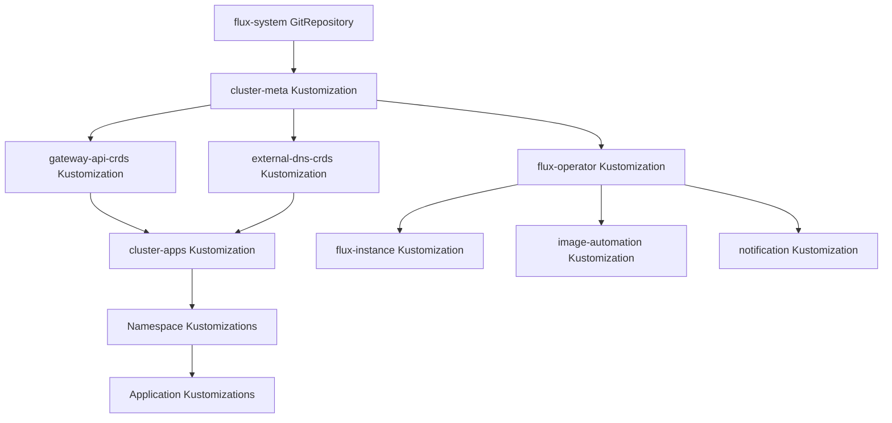

# Flux GitOps Architecture

Flux serves as the GitOps operator for the Talos Linux cluster, continuously reconciling the cluster state with the Git repository. This document describes the reconciliation hierarchy, Kustomization structure, source management, resource types, SOPS decryption integration, and the automated image update system.

## Bootstrap Handoff

The cluster bootstrapping process begins with Helmfile, which deploys critical infrastructure components before Flux takes over:

1. **Cilium** (CNI) - Installed first with atomic upgrade and wait-for-jobs
2. **CoreDNS** - Depends on Cilium, provides cluster DNS
3. **cert-manager** - Depends on CoreDNS, provisions TLS certificates
4. **flux-operator** - Depends on cert-manager, installs the Flux operator
5. **flux-instance** - Depends on flux-operator, deploys the Flux controllers

The Helmfile releases use `atomic: true` for safe upgrades and define explicit dependencies via the `needs` field. Once flux-instance is deployed, Flux begins reconciling from `kubernetes/flux/cluster/ks.yaml`, taking over cluster management.

## Reconciliation Hierarchy

Flux manages the cluster through a hierarchical Kustomization structure that enforces dependency ordering and enables phased rollouts.



*Figure: Flux reconciliation flow showing dependency ordering from cluster-meta through application deployment*

### Top-Level Kustomizations

The entry point is defined in `kubernetes/flux/cluster/ks.yaml`, which establishes the reconciliation hierarchy:

**cluster-meta** (`kubernetes/flux/cluster/ks.yaml#L5-L23`)
- First reconciled Kustomization
- Deploys all source repositories (HelmRepository, GitRepository, OCIRepository) from `./kubernetes/flux/meta`
- Enables SOPS decryption using the `sops-age` secret
- Hardcodes `flux-system` namespace for Renovate bot compatibility

**gateway-api-crds** (`kubernetes/flux/cluster/ks.yaml#L29-L44`)
- Depends on: `cluster-meta`
- Deploys Gateway API experimental CRDs from the Gateway API GitRepository
- Uses dedicated Gateway API GitRepository source with tag-based versioning

**external-dns-crds** (`kubernetes/flux/cluster/ks.yaml#L50-L65`)
- Depends on: `cluster-meta`
- Deploys External DNS standard CRDs from the external-dns-crds GitRepository
- Ensures CRD availability before External DNS installation

**cluster-apps** (`kubernetes/flux/cluster/ks.yaml#L71-L94`)
- Depends on: `cluster-meta`, `gateway-api-crds`, `external-dns-crds`
- Deploys all namespace-level and application Kustomizations from `./kubernetes/apps`
- Enables SOPS decryption for application secrets
- Ensures all sources and CRDs are available before applications deploy

The dependency ordering ensures that:
1. Source repositories are available first (cluster-meta)
2. Required CRDs are installed next (gateway-api-crds, external-dns-crds)
3. Applications can safely deploy with all dependencies in place (cluster-apps)

## Source Management

Flux sources are organized under `kubernetes/flux/meta/` and deployed by the cluster-meta Kustomization.

### GitRepository Sources

The primary `flux-system` GitRepository sources cluster configuration from `github.com/tomyail/talos-cluster.git` (main branch) with a 1-hour interval.

For automated image updates, a separate `flux-system-https` GitRepository with 1-minute interval and authentication token enables ImageUpdateAutomation to push changes back to Git.

GitRepository sources include:
- `gateway-api` - Kubernetes Gateway API CRDs (tag-based, 15-minute interval)
- `external-dns-crds` - External DNS CRDs (tag-based, 1-hour interval)

### OCIRepository Sources

OCI repositories are used for Helm charts from OCI registries:

- `flux-operator` - `ghcr.io/controlplaneio-fluxcd/charts/flux-operator` (tag-based)
- `flux-instance` - `ghcr.io/controlplaneio-fluxcd/charts/flux-instance` (tag-based)
- `app-template` - `ghcr.io/bjw-s-labs/helm/app-template` (tag-based, used by applications)

### HelmRepository Sources

Approximately 30 HelmRepository sources are defined in `kubernetes/flux/meta/repos/`, including:

**OCI Protocol Repositories:**
- `bitnami` - `oci://registry-1.docker.io/bitnamicharts` (1-hour interval)

**HTTP Protocol Repositories:**
- `jetstack` - `https://charts.jetstack.io` (1-hour interval, cert-manager charts)
- `prometheus-community`, `grafana`, `ingress-nginx`, `external-dns`, and many others

## Cluster-Meta vs Cluster-Apps Separation

The separation between cluster-meta and cluster-apps serves distinct purposes:

**cluster-meta** (Infrastructure)
- Deploys source repositories (HelmRepository, GitRepository, OCIRepository)
- Establishes the foundation for all subsequent reconciliations
- Runs once sources are available, then enables dependent Kustomizations

**cluster-apps** (Applications)
- Deploys namespace-level Kustomizations and applications
- Depends on cluster-meta and CRD Kustomizations
- Contains the bulk of cluster workloads

This separation ensures:
1. Sources are established before any application attempts to use them
2. CRDs are installed before applications require them
3. Clear infrastructure/application boundary
4. Efficient reconciliation (sources change less frequently than applications)

## Namespace-Level Kustomization Patterns

Namespace-level Kustomizations in `kubernetes/apps/<namespace>/kustomization.yaml` aggregate individual application Kustomizations. For example, the default namespace Kustomization includes applications like echo, fava, navidrome, jellyfin, and many others.

Each namespace Kustomization:
- Applies the `common` component (namespace creation, repository definitions, SOPS configuration)
- Lists all application Kustomizations as resources
- Sets the target namespace

### Application Kustomizations

Individual application Kustomizations (e.g., `kubernetes/apps/default/echo/ks.yaml`) consistently configure:

- **wait: true** - Ensures health checks pass before marking reconciliation successful
- **prune: true** - Removes resources deleted from Git
- **interval: 1h** - Reconciles every hour
- **timeout: 5m** - 5-minute timeout for reconciliation operations
- **retryInterval: 2m** - Retries failed reconciliations every 2 minutes
- **commonMetadata labels** - Adds `app.kubernetes.io/name` labels to all resources
- **decryption** - Enables SOPS decryption with `sops-age` secret (for applications with encrypted secrets)
- **postBuild substitution** - References cluster-secrets for variable expansion
- **components** - Includes reusable components (gatus, volsync, image-automation)

### Dependency Management

Applications declare dependencies via the `dependsOn` field. For example:

```yaml
dependsOn:
  - name: topolvm
    namespace: storage
  - name: external-secrets
    namespace: external-secrets
  - name: cloudnative-pg-cluster
    namespace: database
```

This ensures that storage, secrets, and database infrastructure are available before the application deploys.

## HelmRelease Management

HelmReleases are used for deploying Helm charts. Applications reference OCIRepository sources for modern OCI-based charts.

### Flux Self-Management

The flux-operator and flux-instance HelmReleases configure:
- **Rollback remediation** with 3 retries for failed upgrades
- **cleanupOnFail: true** to clean up failed installs
- **dependsOn** (flux-instance depends on flux-operator)

### Application HelmReleases

Application HelmReleases (e.g., fava, gitea, echo) use:
- **OCIRepository chartRef** for OCI-based charts
- **HelmRepository chartRef** for traditional HTTP chart repositories
- **Remediation strategies** (rollback with retries)
- **Interval: 1h** for reconciliation

## SOPS Decryption Integration

Flux integrates SOPS decryption at multiple levels:

### Cluster-Level Decryption

Both cluster-meta and cluster-apps enable SOPS decryption using the `sops-age` secret:

```yaml
decryption:
  provider: sops
  secretRef:
    name: sops-age
```

### Application-Level Decryption

Individual application Kustomizations also enable SOPS decryption when they contain encrypted secrets. The common component's `sops` subcomponent provides the `sops-age.sops.yaml` secret resource.

This multi-level decryption ensures:
1. Infrastructure secrets are decrypted during cluster-meta reconciliation
2. Application secrets are decrypted during their respective Kustomization reconciliations
3. Encrypted secrets in Git remain secure until decrypted by Flux

## Image Update Automation

Flux includes a comprehensive image update automation system that scans container registries, selects image versions, and updates Git manifests.

### Components

**ImageRepository** (`kubernetes/components/image-automation/imagerepository.yaml`)
- Scans container registries every 1 minute
- References secrets for private registry authentication
- Templated with `${APP}`, `${NAMESPACE}`, and `${REGISTRY_URL}` variables

**ImagePolicy** (`kubernetes/components/image-automation/imagepolicy.yaml`)
- Selects images using numerical ascending order
- Filters tags with regex pattern to extract timestamps for version sorting
- Labels policies with `image-automation: enabled` for automation discovery

**ExternalSecret** (`kubernetes/components/image-automation/registry-externalsecret.yaml`)
- Creates `docker-registry` secrets by fetching credentials from Bitwarden
- Templates `kubernetes.io/dockerconfigjson` format with username and password
- Generates `${APP}-registry-secret` for ImageRepository authentication

**ImageUpdateAutomation** (`kubernetes/apps/flux-system/image-automation/automation.yaml`)
- Runs every 5 minutes
- Uses Setters strategy to update image tags in manifests
- Commits changes via flux-bot to the main branch
- Matches policies with `image-automation: enabled` label

### Workflow

1. ImageRepository scans the registry for new tags
2. ImagePolicy selects the latest image based on numerical sorting and timestamp extraction
3. ImageUpdateAutomation detects policy changes and updates manifests in `./kubernetes/apps/default`
4. Changes are committed and pushed by flux-bot
5. Flux reconciles the updated manifests, triggering application deployments

## Notification System

Flux posts reconciliation status to GitHub via the notification controller.

**GitHub Provider** (`kubernetes/apps/flux-system/notification/github-provider.yaml`)
- Posts to `github.com/tomyail/talos-cluster`
- Uses `flux-github-token` secret for authentication

**GitHub Status Alert** (`kubernetes/apps/flux-system/notification/alert.yaml`)
- Monitors all Kustomizations across flux-system, default, database, storage, observability, network, kube-system, cert-manager, and external-server namespaces
- Posts reconciliation status as GitHub commit checks

## Webhook Integration

Flux integrates with GitHub webhooks for push-based reconciliation:

**GitHub Receiver** (`kubernetes/apps/flux-system/flux-instance/app/receiver.yaml`)
- Listens for `ping` and `push` events
- Uses `github-webhook-token-secret` for signature verification
- Triggers reconciliation of flux-system GitRepository and Kustomization

This enables immediate reconciliation on Git push, reducing the latency from the default 1-hour interval.

## Flux Controller Configuration

The Flux controllers are configured for performance and reliability via `flux-instance/app/helm/values.yaml`:

**Enabled Controllers:**
- source-controller
- kustomize-controller
- helm-controller
- notification-controller
- image-reflector-controller
- image-automation-controller

**Performance Optimizations:**
- Concurrent reconciles: 10-20 workers per controller
- Memory limits: 512Mi for kustomize, helm, and source controllers
- In-memory Kustomize builds (tmpfs volume)
- Helm caching: 20 charts, 60-minute TTL, 5-minute purge interval
- OOM detection for Helm controller (95% threshold, 500ms interval)

**Sync Configuration:**
- GitRepository: `https://github.com/tomyail/talos-cluster.git`
- Branch: `refs/heads/main`
- Path: `kubernetes/flux/cluster`

These settings ensure efficient reconciliation while preventing resource exhaustion.

## Common Component Structure

The `common` Kustomize component (`kubernetes/components/common/kustomization.yaml`) provides standardized resources for applications:

1. **namespace.yaml** - Creates namespace with pod-security annotation and prune-disabled marker
2. **repos/** - Adds repository definitions (e.g., app-template OCIRepository)
3. **sops/** - Adds SOPS decryption secret resource

This component is included by all namespace and application Kustomizations, ensuring consistency across the cluster.
