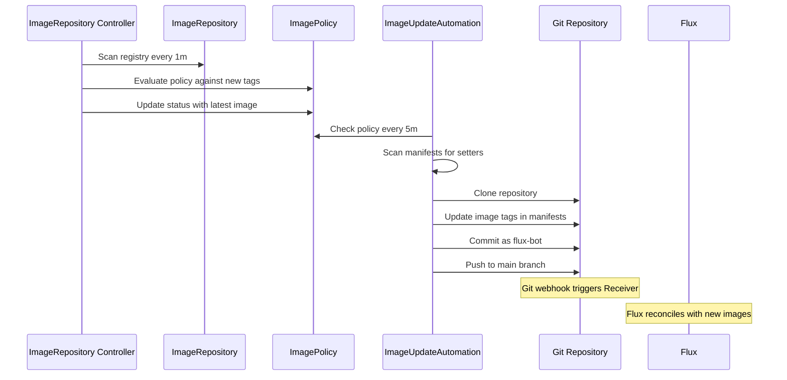

# Flux GitOps Architecture

Flux serves as the GitOps operator for the Talos Linux cluster, continuously reconciling the cluster state with the Git repository. This document describes the reconciliation hierarchy, Kustomization structure, source management, resource types, and the automated image update system.

## Reconciliation Hierarchy

Flux manages the cluster through a hierarchical Kustomization structure that enforces dependency ordering and enables phased rollouts.

<!-- openwiki: mermaid parse failed and this diagram was converted to a text fence so it does not break rendering. Fix the diagram source and restore the mermaid fence. Parser error: Heuristic: an unescaped angle bracket inside a label breaks rendering; rephrase the label. -->
```text
flowchart TD
    A[flux-system GitRepository<br/>github.com/tomyail/talos-cluster] --> B[cluster-meta Kustomization<br/>./kubernetes/flux/meta]
    B --> C[gateway-api-crds Kustomization<br/>Gateway API CRDs]
    B --> D[external-dns-crds Kustomization<br/>External DNS CRDs]
    B --> E[flux-operator Kustomization]
    C --> F[cluster-apps Kustomization<br/>./kubernetes/apps]
    D --> F
    E --> G[flux-instance Kustomization]
    E --> H[image-automation Kustomization]
    E --> I[notification Kustomization]
    F --> J[Namespace Kustomizations<br/>default, storage, etc.]
    J --> K[Application Kustomizations<br/>Helm Releases & Kustomize resources]
```

### Top-Level Kustomizations

The entry point is defined in `kubernetes/flux/cluster/ks.yaml`, which establishes the reconciliation hierarchy:

**cluster-meta** (`kubernetes/flux/cluster/ks.yaml#L5-L23`)
- First reconciled Kustomization
- Deploys all source repositories (HelmRepository, GitRepository, OCIRepository) from `./kubernetes/flux/meta`
- Enables SOPS decryption using the `sops-age` secret
- Hardcodes `flux-system` namespace for Renovate bot compatibility

**gateway-api-crds** (`kubernetes/flux/cluster/ks.yaml#L29-L44`)
- Depends on: `cluster-meta`
- Deploys Gateway API experimental CRDs from the Gateway API GitRepository
- Uses dedicated Gateway API GitRepository source with tag-based versioning

**external-dns-crds** (`kubernetes/flux/cluster/ks.yaml#L50-L65`)
- Depends on: `cluster-meta`
- Deploys External DNS standard CRDs from the external-dns-crds GitRepository
- Ensures CRD availability before External DNS installation

**cluster-apps** (`kubernetes/flux/cluster/ks.yaml#L71-L94`)
- Depends on: `cluster-meta`, `gateway-api-crds`, `external-dns-crds`
- Deploys all namespace-level Kustomizations from `./kubernetes/apps`
- Enables SOPS decryption for secrets
- Final application layer containing all workloads

This hierarchy ensures that source repositories are available before CRDs are installed, and CRDs are present before applications attempt to use them.

## Source Management

Flux manages three types of sources for fetching Kubernetes manifests and Helm charts.

### GitRepository Sources

**flux-system** (`kubernetes/flux/cluster/ks.yaml#L18-L19`)
- URL: `https://github.com/tomyail/talos-cluster.git`
- Branch: `main`
- Path: `kubernetes/flux/cluster`
- Interval: 1 hour
- Primary source for cluster configuration

**flux-system-https** (`kubernetes/apps/flux-system/image-automation/gitrepository.yaml#L3-L12`)
- URL: `https://github.com/tomyail/talos-cluster.git`
- Branch: `main`
- Interval: 1 minute
- Used by ImageUpdateAutomation for pushing changes back to Git
- Requires authentication token

**gateway-api** (`kubernetes/flux/meta/repos/gateway-api.yaml#L3-L13`)
- URL: `https://github.com/kubernetes-sigs/gateway-api`
- Tag-based versioning with Renovate annotation
- Interval: 15 minutes
- Filters to include only `/config/crd/experimental/` directory

**external-dns-crds** (`kubernetes/flux/meta/repos/external-dns-crds.yaml`)
- Dedicated GitRepository for External DNS CRDs
- Enables independent CRD versioning from application

### HelmRepository Sources

All HelmRepository sources are defined in `kubernetes/flux/meta/repos/` and deployed by the cluster-meta Kustomization (`kubernetes/flux/meta/repos/kustomization.yaml#L5-L45`).

Representative examples:

**bitnami** (`kubernetes/flux/meta/repos/bitnami.yaml#L3-L10`)
- Type: OCI registry
- URL: `oci://registry-1.docker.io/bitnamicharts`
- Interval: 1 hour

**jetstack** (`kubernetes/flux/meta/repos/jetstack.yaml#L2-L9`)
- Type: HTTP Helm repository
- URL: `https://charts.jetstack.io`
- Interval: 1 hour
- Used for cert-manager

**external-dns** (`kubernetes/flux/meta/repos/external-dns.yaml#L2-L10`)
- Type: HTTP Helm repository
- URL: `https://kubernetes-sigs.github.io/external-dns`
- Interval: 1 hour

The cluster-meta Kustomization includes approximately 30 HelmRepository sources covering major chart publishers (Bitnami, bjw-s, Prometheus Community, Grafana, etc.) and custom registries (Gitea, Tailscale, etc.).

### OCIRepository Sources

OCI repositories are used for Flux's own components:

**flux-operator** (`kubernetes/apps/flux-system/flux-operator/app/helmrelease.yaml#L2-L14`)
- URL: `oci://ghcr.io/controlplaneio-fluxcd/charts/flux-operator`
- Tag: `0.57.0`
- Layer selector for Helm chart content
- Interval: 1 hour

**flux-instance** (`kubernetes/apps/flux-system/flux-instance/app/helmrelease.yaml#L2-L14`)
- URL: `oci://ghcr.io/controlplaneio-fluxcd/charts/flux-instance`
- Tag: `0.57.0`
- Layer selector for Helm chart content
- Interval: 1 hour

**app-template** (`kubernetes/components/common/repos/app-template/ocirepository.yaml`)
- Used by application Kustomizations as a common component
- Provides standardized Helm chart template

## Kustomization Structure

### Namespace-Level Kustomizations

Each application namespace has a Kustomization that aggregates individual applications:

**default namespace** (`kubernetes/apps/default/kustomization.yaml#L5-L39`)
- Includes 34 application Kustomizations
- Applies common component (namespace, repos, sops)
- Examples: fava, echo, navidrome, jellyfin, paperless, n8n, home-assistant

**storage namespace** (`kubernetes/apps/storage/kustomization.yaml#L5-L17`)
- Includes storage infrastructure: snapshot-controller, topolvm, volsync, csi-driver-nfs, nextcloud
- Applies common component

**flux-system namespace** (`kubernetes/apps/flux-system/kustomization.yaml#L5-L12`)
- Includes: flux-instance, flux-operator, image-automation, notification
- Applies common component

### Application-Level Kustomizations

Each application is deployed via a dedicated Kustomization resource:

**Example: fava** (`kubernetes/apps/default/fava/ks.yaml#L5-L36`)
- Metadata: name `fava`, namespace `default`
- Components: gatus monitoring, image automation
- Path: `./kubernetes/apps/default/fava/app`
- Post-build substitution: injects cluster secrets and app-specific variables
- Target namespace: `default`
- Interval: 1 hour, timeout: 5 minutes, retry interval: 2 minutes

**Example: echo** (`kubernetes/apps/default/echo/ks.yaml#L5-L37`)
- Metadata: name `echo`, namespace `default`
- Components: gatus monitoring (external + tailscale)
- Decryption: SOPS with sops-age secret
- Post-build substitution: cluster secrets and app variables

Common features across application Kustomizations:
- `commonMetadata` adds `app.kubernetes.io/name` label
- `wait: true` ensures health checks pass before marking successful
- `prune: true` removes resources not in Git
- `sourceRef` points to `flux-system` GitRepository

## Helm vs Kustomize Resources

Flux supports both Helm releases and Kustomize-based manifests, with the choice depending on application complexity.

### Helm Resources

Used for complex applications with configurable charts:

**flux-operator** (`kubernetes/apps/flux-system/flux-operator/app/helmrelease.yaml#L16-L36`)
- Kind: `HelmRelease`
- Chart reference: OCIRepository `flux-operator`
- Values from: ConfigMap `flux-operator-values`
- Health checks configured
- Remediation strategy: rollback on failure, 3 retries
- Cleanup on failure enabled

**flux-instance** (`kubernetes/apps/flux-system/flux-instance/app/helmrelease.yaml#L16-L36`)
- Kind: `HelmRelease`
- Chart reference: OCIRepository `flux-instance`
- Values from: ConfigMap `flux-instance-values`
- Depends on: `flux-operator` Kustomization
- Remediation strategy: rollback on failure, 3 retries

**Application Helm Releases**
Most applications in the cluster use Helm releases, typically sourced from the bjw-s app-template or vendor-specific charts.

### Kustomize Resources

Used for simpler applications or when fine-grained manifest control is needed:

**Gateway API CRDs** (`kubernetes/flux/cluster/ks.yaml#L29-L44`)
- Kustomization applies raw CRD manifests from GitRepository
- Path: `./config/crd/experimental`
- No Helm chart needed for CRD installation

**Infrastructure Components**
- CoreDNS installation
- Cilium CNI manifests
- CSI drivers

## Image Automation System

Flux includes a fully automated image update system that scans registries, applies policies, and commits updates back to Git.

### Image Automation Components

**ImageRepository** (`kubernetes/components/image-automation/imagerepository.yaml#L2-L11`)
- Created per application via the `image-automation` component
- Specified registry URL (e.g., `gitea.tomyail.com/tomyail/beancount`)
- Interval: 1 minute for frequent scanning
- Secret reference for private registry authentication

**ImagePolicy** (`kubernetes/components/image-automation/imagepolicy.yaml#L2-L17`)
- Created per application via the `image-automation` component
- Policy type: numerical (ascending order)
- Filter pattern: extracts timestamp from image tags (e.g., `^.+-[a-f0-9]+-(?P<ts>[0-9]+)$`)
- Selects latest image by timestamp

**Registry Authentication** (`kubernetes/components/image-automation/registry-externalsecret.yaml#L2-L26`)
- ExternalSecret creates docker-registry secret
- Fetches credentials from Bitwarden via ClusterSecretStore
- Template creates `kubernetes.io/dockerconfigjson` secret
- Variables: `${REGISTRY_HOST}`, `${BW_ID}` (Bitwarden entry ID)

### ImageUpdateAutomation Objects

**apps automation** (`kubernetes/apps/flux-system/image-automation/automation.yaml#L3-L28`)
- Name: `apps`
- Interval: 5 minutes
- Update strategy: Setters (updates comments in manifests)
- Path: `./kubernetes/apps/default`
- Git commit author: `flux-bot`
- Policy selector: matches resources with `image-automation: enabled` label

**fava automation** (`kubernetes/apps/flux-system/fava-image-automation/automation.yaml#L3-L25`)
- Name: `fava`
- Interval: 5 minutes
- Update strategy: Setters
- Path: `./kubernetes/apps/default/fava`
- Git commit author: `flux-bot`

### Image Automation Flow



### Component Integration

The `image-automation` component (`kubernetes/components/image-automation/kustomization.yaml#L3-L6`) is composed of:
- `registry-externalsecret.yaml`: creates registry credentials
- `imagerepository.yaml`: configures image scanning
- `imagepolicy.yaml`: defines update policy

Applications opt into image automation by adding this component to their Kustomization (`kubernetes/apps/default/fava/ks.yaml#L14`).

## Notification System

Flux notifies external systems about reconciliation events via the notification controller.

**GitHub Provider** (`kubernetes/apps/flux-system/notification/github-provider.yaml#L2-L11`)
- Type: `github`
- Address: `https://github.com/tomyail/talos-cluster`
- Secret reference: `flux-github-token`
- Used for committing status updates

**GitHub Status Alert** (`kubernetes/apps/flux-system/notification/alert.yaml#L2-L39`)
- Provider: `github`
- Event severity: `info`
- Event sources: All Kustomizations in flux-system, default, database, storage, observability, network, kube-system, cert-manager, external-server namespaces
- Metadata: Includes kind, name, namespace in summary
- Updates Git commit status with reconciliation results

**Receiver for Webhooks** (`kubernetes/apps/flux-system/flux-instance/app/receiver.yaml#L2-L20`)
- Type: `github`
- Events: `ping`, `push`
- Secret: `github-webhook-token-secret`
- Triggers: `flux-system` GitRepository and Kustomization
- Enables Git push-based reconciliation

## Flux Components Configuration

The Flux instance is configured via Helm values (`kubernetes/apps/flux-system/flux-instance/app/helm/values.yaml`):

**Installed Components** (`kubernetes/apps/flux-system/flux-instance/app/helm/values.yaml#L8-L14`)
- source-controller
- kustomize-controller
- helm-controller
- notification-controller
- image-reflector-controller
- image-automation-controller

**Sync Configuration** (`kubernetes/apps/flux-system/flux-instance/app/helm/values.yaml#L15-L19`)
- Kind: `GitRepository`
- URL: `https://github.com/tomyail/talos-cluster.git`
- Ref: `refs/heads/main`
- Path: `kubernetes/flux/cluster`

**Performance Tuning** (`kubernetes/apps/flux-system/flux-instance/app/helm/values.yaml#L25-L95`)
- Concurrent reconciles: 10 for kustomize/helm/source controllers
- Requeue dependency: 5s
- Memory limits: 512Mi for controllers
- Kustomize in-memory builds: enabled with 20 concurrent workers
- Helm cache: 20 chart max size, 60m TTL, 5m purge interval
- OOM detection: enabled for helm-controller at 95% threshold
- Chart digest tracking: disabled to improve performance

## Common Components

Reusable components are applied across application Kustomizations to standardize configuration:

**common component** (`kubernetes/components/common/kustomization.yaml#L4-L7`)
- Creates namespace
- Adds repository definitions
- Adds SOPS configuration and secrets

**image-automation component** (`kubernetes/components/image-automation/kustomization.yaml#L3-L6`)
- Configures ImageRepository, ImagePolicy, and registry credentials
- Applied to applications needing automated image updates

**gatus components** (external, guarded, tailscale variants)
- Adds Gatus monitoring configuration
- Configures HTTP/TCP checks
- Applied based on application exposure requirements

## Operational Considerations

### Decryption Strategy

SOPS decryption is configured at multiple levels:
- **cluster-meta**: decrypts source repository manifests
- **cluster-apps**: decrypts application manifests
- **Application Kustomizations**: per-app decryption (e.g., echo)
- All use the same `sops-age` secret

### Dependency Management

Kustomization dependencies ensure proper ordering:
- CRDs install before applications (gateway-api-crds, external-dns-crds → cluster-apps)
- Flux operator installs before flux-instance (flux-operator → flux-instance)
- Repositories available before consuming resources (cluster-meta → all)

### Health Checks

Flux waits for resources to become healthy before marking reconciliation successful:
- `wait: true` on all Kustomizations
- `timeout: 5m` for application-level resources
- Health checks configured on flux-operator HelmRelease

### Prune Strategy

All Kustomizations enable `prune: true`, which:
- Removes resources deleted from Git
- Operates within the Kustomization's path and namespace
- Requires careful resource management to avoid unintended deletion

### Retry Configuration

Standard retry configuration across Kustomizations:
- Interval: 1 hour (reconciliation frequency)
- Retry interval: 2 minutes (on failure)
- Ensures transient failures don't prevent eventual reconciliation

## Related Documentation

- [Cluster Architecture Overview](/openwiki/concepts/cluster-architecture.md) - Overall cluster design and networking
- [Bootstrap Workflow](/openwiki/workflows/bootstrap.md) - Initial Flux installation
- [Daily Operations](/openwiki/operations/daily-operations.md) - Common Flux operational tasks
