# Flux GitOps Workflow

The Flux GitOps workflow defines how cluster configuration changes move from development to production. This document explains the day-to-day workflow for making changes, how reconciliation works, automated dependency management via Renovate, and how Flux ensures correct deployment ordering through dependencies.

## Workflow Overview

```mermaid
flowchart LR
    A["Developer makes change"] --> B["Commit to Git"]
    B --> C["Push to main branch"]
    C --> D["Flux detects change"]
    D --> E["Reconciliation starts"]
    E --> F["cluster-meta reconciles"]
    F --> G["CRD Kustomizations reconcile"]
    G --> H["cluster-apps reconciles"]
    H --> I["Namespace Kustomizations reconcile"]
    I --> J["Application Kustomizations reconcile"]
    J --> K["Resources applied to cluster"]
    K --> L["Health checks pass"]
    L --> M["Kustomization ready"]
    
    N["Renovate scans dependencies"] --> O["Creates PR with updates"]
    O --> P["Merge after approval"]
    P --> B
    
    Q["ImageUpdateAutomation runs"] --> R["Scans container registry"]
    R --> S["Updates image tags in Git"]
    S --> B
```



*Figure: Flux GitOps workflow showing manual changes, automated Renovate updates, and image automation flowing through reconciliation*

## Making Application Changes

### Change Flow

When you modify application configuration in the `kubernetes/apps/` directory, the following sequence occurs:

1. **Commit and Push**: Changes are committed to Git and pushed to the main branch
2. **Flux Detection**: The Flux GitRepository source (defined during bootstrap) detects the new commit via its polling interval
3. **Reconciliation Trigger**: Flux evaluates which Kustomizations are affected by the commit
4. **Dependency Chain**: Changes flow through the dependency hierarchy, respecting `dependsOn` constraints
5. **Application**: Resources are applied to the cluster, health checks run, and the Kustomization marks ready

### Manual Change Example

To update an application's Helm values:

```bash
# Edit the values file
vim kubernetes/apps/default/myapp/app/helm/values.yaml

# Commit and push
git add kubernetes/apps/default/myapp/app/helm/values.yaml
git commit -m "feat(myapp): increase replica count"
git push
```

Flux automatically detects the push and begins reconciliation within its configured interval.

## Reconciliation Loop

### Reconciliation Intervals

Each Kustomization defines how frequently it checks for changes:

**Standard Interval**: 1 hour (`kubernetes/flux/cluster/ks.yaml#L13`, `kubernetes/apps/default/paperless/ks.yaml#L36`)
- Cluster-meta, cluster-apps, and most applications reconcile hourly
- On-demand reconciliation occurs immediately when Git changes are detected

**Retry Interval**: 2 minutes (`kubernetes/flux/cluster/ks.yaml#L16`, `kubernetes/apps/default/paperless/ks.yaml#L37`)
- Failed reconciliations retry every 2 minutes with exponential backoff

**Timeout**: 5 minutes (`kubernetes/flux/cluster/ks.yaml#L93`, `kubernetes/apps/default/paperless/ks.yaml#L38`)
- Reconciliation operations timeout after 5 minutes
- CRD installations use extended timeouts (5 minutes) to accommodate slow API server operations

### Health Assurance

Flux waits for resources to become healthy before marking Kustomizations ready:

**Wait Behavior** (`kubernetes/flux/cluster/ks.yaml#L23`, `kubernetes/apps/default/paperless/ks.yaml#L35`)
- `wait: true` ensures Flux waits for all resources to be ready
- Only applies to resources created by the Kustomization
- Prevents cascading failures from incomplete deployments

**Prune Behavior** (`kubernetes/flux/cluster/ks.yaml#L15`, `kubernetes/apps/default/paperless/ks.yaml#L34`)
- `prune: true` enables garbage collection
- Resources deleted from Git are removed from the cluster
- Applies only to resources managed by the Kustomization

**Explicit Health Checks** (`kubernetes/apps/cert-manager/cert-manager/ks.yaml#L16-L28`)
Complex applications may define explicit health checks:

```yaml
healthChecks:
  - apiVersion: helm.toolkit.fluxcd.io/v2
    kind: HelmRelease
    name: cert-manager
    namespace: cert-manager
  - apiVersion: cert-manager.io/v1
    kind: ClusterIssuer
    name: letsencrypt-production
healthCheckExprs:
  - apiVersion: cert-manager.io/v1
    kind: ClusterIssuer
    failed: status.conditions.filter(e, e.type == 'Ready').all(e, e.status == 'False')
    current: status.conditions.filter(e, e.type == 'Ready').all(e, e.status == 'True')
```

This ensures not only that resources exist, but that they're actually ready to serve traffic.

## Automated Dependency Updates

### Renovate Integration

Renovate automatically updates dependencies across the cluster configuration. It scans the repository for:

- **Container images** in Helm values and YAML files (`.renovaterc.json5#L25-L27`)
- **Helm charts** referenced in HelmRepository and HelmRelease resources (`.renovaterc.json5#L19-L21`)
- **Kubernetes manifests** with inline image references (`.renovaterc.json5#L25-L27`)
- **GitHub Actions** in workflow files (`.renovaterc.json5#L70-L76`)
- **Custom annotations** in any YAML file (`.renovaterc.json5#L206-L228`)

**Schedule**: Runs every weekend (`.renovaterc.json5#L14`)

**Exclusions**: Core infrastructure components are excluded from auto-merge to prevent destabilizing the cluster (`.renovaterc.json5#L163-L199`)

### Auto-Merge Rules

Certain updates are automatically merged after a stabilization period:

**GitHub Actions** (`.renovaterc.json5#L69-L76`)
- Minor, patch, and digest updates auto-merge after 3 days
- Tests are ignored for GitHub Actions updates

**Mise Tools** (`.renovaterc.json5#L77-L84`)
- Minor and patch updates auto-merge
- Tests are ignored

**Application Updates** (`.renovaterc.json5#L161-L204`)
- Non-major updates auto-merge for most applications
- Core infrastructure (Cilium, cert-manager, storage, databases) requires manual approval

### Semantic Commit Convention

Renovate uses semantic commits to indicate update severity (`.renovaterc.json5#L86-L131`):

- **Major updates**: `feat(helm)!: cert-manager (v1.12.0 → v2.0.0)`
- **Minor updates**: `feat(helm): cert-manager (v1.12.0 → v1.13.0)`
- **Patch updates**: `fix(container): redis (7.0.0 → 7.0.1)`
- **Digest updates**: `chore(container): redis (abc123 → def456)`

Labels are applied automatically for filtering:
- `type/major`, `type/minor`, `type/patch` for update severity
- `renovate/container`, `renovate/helm`, `renovate/github-action` for dependency type

### Image Automation

Flux provides built-in image update automation that scans container registries and updates image tags in Git:

**ImageUpdateAutomation** (`kubernetes/apps/flux-system/image-automation/automation.yaml#L1-L28`)
- Scans registries every 5 minutes
- Uses the Setters strategy to update image tags in `./kubernetes/apps/default`
- Commits changes as `flux-bot`
- Updates only resources with ImagePolicies labeled `image-automation: enabled`

This works alongside Renovate: Renovate updates chart versions and pinned images, while ImageUpdateAutomation handles automated image tag policies.

## Dependency Management

### Dependency Ordering

Flux uses the `dependsOn` field to enforce correct deployment order across Kustomizations.

### Cluster-Level Dependencies

The `cluster-apps` Kustomization depends on infrastructure prerequisites (`kubernetes/flux/cluster/ks.yaml#L78-L84`):

```yaml
dependsOn:
  - name: cluster-meta
    namespace: flux-system
  - name: gateway-api-crds
    namespace: flux-system
  - name: external-dns-crds
    namespace: flux-system
```

This ensures:
1. Sources and decryption infrastructure are ready (cluster-meta)
2. CRDs are installed before applications use them (gateway-api-crds, external-dns-crds)
3. Application reconciliation only begins after prerequisites are satisfied

### Application-Level Dependencies

Individual applications declare dependencies on other namespaces or applications.

**Example: Paperless** (`kubernetes/apps/default/paperless/ks.yaml#L16-L24`)

```yaml
dependsOn:
  - name: topolvm
    namespace: storage
  - name: external-secrets
    namespace: external-secrets
  - name: cloudnative-pg-cluster
    namespace: database
  - name: dragonfly-cluster
    namespace: database
```

This dependency chain ensures:
- Storage provisioner (topolvm) is available before creating PVCs
- External Secrets Operator can create secrets before application starts
- Databases are ready before application attempts connections

**Example: Cilium Gateway** (`kubernetes/apps/kube-system/cilium/ks.yaml#L46-L48`)

```yaml
dependsOn:
  - name: cert-manager
    namespace: cert-manager
```

Cilium Gateway depends on cert-manager for TLS certificate management.

### Dependency Resolution

Flux evaluates dependencies in the following order:

1. **Namespace Resolution**: All Kustomizations in the same namespace are considered
2. **Cross-Namespace Dependencies**: Kustomizations can depend on resources in other namespaces by specifying the namespace field
3. **Transitive Dependencies**: Flux automatically handles transitive dependencies through the dependency graph
4. **Parallel Execution**: Kustomizations without dependencies on each other run in parallel
5. **Failed Dependencies**: If a dependency fails to become ready, dependent Kustomizations wait indefinitely

### Debugging Dependency Issues

When a Kustomization is stuck waiting for dependencies:

1. Check the dependency Kustomization's status: `kubectl get kustomization <dependency-name> -n <namespace> -o yaml`
2. Inspect the dependent Kustomization's conditions: `kubectl get kustomization <app-name> -n <namespace> -o yaml`
3. Look for `DependenciesNotReady` conditions in the status
4. Verify all dependencies are reporting `Ready: true` in their status

## Reconciliation Behavior

### Common Metadata

All application Kustomizations apply common labels for consistent resource identification (`kubernetes/apps/kube-system/cilium/ks.yaml#L9-L11`):

```yaml
commonMetadata:
  labels:
    app.kubernetes.io/name: cilium
```

This labels all resources managed by the Kustomization, making it easy to query and filter.

### Secret Decryption

Flux decrypts SOPS-encrypted secrets in-cluster during reconciliation (`kubernetes/apps/default/paperless/ks.yaml#L25-L28`):

```yaml
decryption:
  provider: sops
  secretRef:
    name: sops-age
```

The decryption process:
1. Flux reads the `sops-age` Secret from the cluster (deployed during bootstrap)
2. Uses the age private key to decrypt any `*.sops.yaml` files in the Kustomization path
3. Applies the decrypted manifests to the cluster

### Variable Substitution

The `postBuild.substituteFrom` mechanism injects cluster-wide configuration (`kubernetes/apps/default/paperless/ks.yaml#L39-L42`):

```yaml
postBuild:
  substituteFrom:
    - name: cluster-secrets
      kind: Secret
```

During reconciliation:
1. Flux reads the `cluster-secrets` Secret from the cluster
2. Replaces variables like `${SECRET_DOMAIN}` and `${TIMEZONE}` in manifests
3. Applies the substituted manifests to the cluster

This enables environment-specific configuration without duplicating secrets across applications.

### Additional Substitutions

Applications can define additional substitutions for app-specific values (`kubernetes/apps/default/paperless/ks.yaml#L43-L44`):

```yaml
postBuild:
  substitute:
    APP: paperless
    VOLSYNC_CAPACITY: 5Gi
```

These variables are replaced alongside cluster-secrets during the postBuild phase.

## Troubleshooting

### Common Issues

**Kustomization Not Reconciling**

Check the GitRepository source is syncing:
```bash
kubectl get gitrepository flux-system -n flux-system
```

Look for `Ready: True` in conditions.

**Dependency Stuck Waiting**

Check the dependency Kustomization status:
```bash
kubectl get kustomization <dependency-name> -n <namespace>
```

Look for `DependenciesNotReady` or failed conditions.

**Secret Decryption Failure**

Verify the sops-age secret exists and is valid:
```bash
kubectl get secret sops-age -n flux-system
```

Check that the age key in the secret matches the recipient in `.sops.yaml`.

**Health Check Timeout**

For complex applications with slow startup (like databases), consider:
- Increasing the `timeout` value
- Adding explicit `healthChecks` for critical resources
- Checking application logs for startup issues

### Monitoring Reconciliation

Watch reconciliation in real-time:
```bash
# Watch all Kustomizations
kubectl get kustomizations -A -w

# Watch specific namespace
kubectl get kustomizations -n flux-system -w

# Check reconciliation events
kubectl get events -n <namespace> --field-selector reason=ReconciliationFailed
```

## Related Pages

- [Flux GitOps Architecture](/openwiki/concepts/flux-architecture.md) - Detailed reconciliation hierarchy and Kustomization structure
- [Application Deployment Workflow](/openwiki/workflows/app-deployment.md) - Application deployment patterns and app-template usage
- [Secrets Management](/openwiki/concepts/secrets-management.md) - SOPS encryption and External Secrets Operator integration
