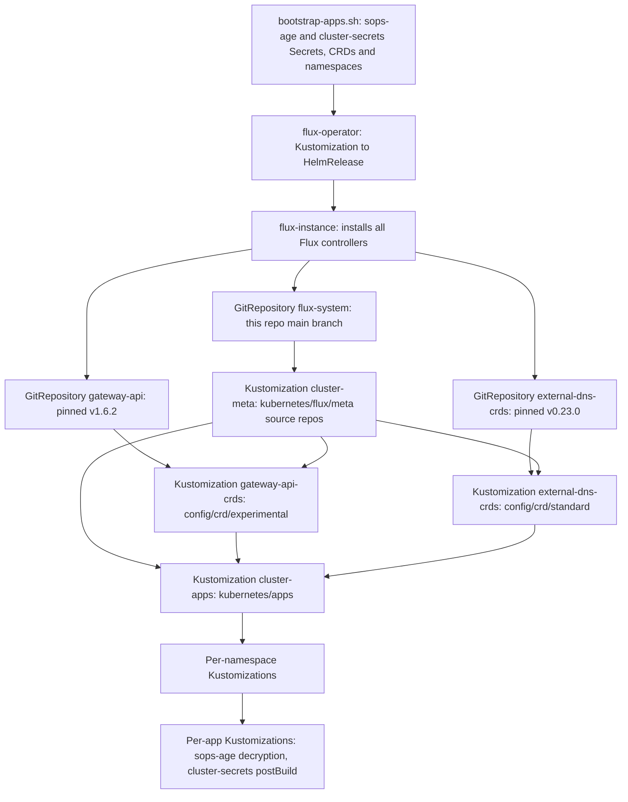

# Flux GitOps Model

This cluster runs Flux as a managed "Flux instance": the `flux-operator` HelmRelease deploys the ControlPlane Flux operator, and a `flux-instance` HelmRelease asks the operator to install and configure all Flux controllers. Flux then reconciles the repository through a small tree of root Kustomizations in `kubernetes/flux/cluster/ks.yaml` — `cluster-meta` (sources), two upstream CRD Kustomizations (`gateway-api-crds`, `external-dns-crds`), and `cluster-apps` (every application).

## Dependency Chain Overview


```mermaid
flowchart TD
    BR["bootstrap-apps.sh: sops-age and cluster-secrets Secrets, CRDs and namespaces"] --> FI["flux-operator: Kustomization to HelmRelease"]
    FI --> INST["flux-instance: installs all Flux controllers"]
    INST --> GIT["GitRepository flux-system: this repo main branch"]
    INST --> GA["GitRepository gateway-api: pinned v1.6.2"]
    INST --> ED["GitRepository external-dns-crds: pinned v0.23.0"]
    GIT --> META["Kustomization cluster-meta: kubernetes/flux/meta source repos"]
    GA --> GAC["Kustomization gateway-api-crds: config/crd/experimental"]
    ED --> EDC["Kustomization external-dns-crds: config/crd/standard"]
    META --> GAC
    META --> EDC
    META --> APPS["Kustomization cluster-apps: kubernetes/apps"]
    GAC --> APPS
    EDC --> APPS
    APPS --> NS["Per-namespace Kustomizations"]
    NS --> APP["Per-app Kustomizations: sops-age decryption, cluster-secrets postBuild"]
```

*Figure: from bootstrap secrets through the Flux instance to per-app Kustomizations*

## The Commit → Reconcile Loop

The operating model is: every change to cluster state is a commit to `main`, and Flux — not a human — applies it. The loop works like this:

1. source-controller polls the `flux-system` GitRepository for new commits and snapshots each one as an artifact.
2. A new artifact triggers `cluster-meta`, the CRD Kustomizations, and `cluster-apps` to rebuild and apply in `dependsOn` order; each Kustomization also re-reconciles on its own `interval` even without new commits.
3. A GitHub webhook (the `Receiver` in `kubernetes/apps/flux-system/flux-instance/app/receiver.yaml`) short-circuits step 1's polling delay on push, so a merged commit normally applies within seconds instead of at the next poll.

To force the loop by hand — e.g. after a failed apply or to verify connectivity — `task reconcile` (defined in `Taskfile.yaml`) runs `flux --namespace flux-system reconcile kustomization flux-system --with-source`, which re-fetches the Git source and reconciles the `flux-system` root Kustomization immediately. It requires the repo-local `kubeconfig` to exist (its preconditions check for the file and the `flux` binary).

Reconciliation can be paused per object with `spec.suspend: true` on a Kustomization/HelmRelease (or `flux suspend kustomization <name>`), which Flux honors by skipping the object entirely — changes in Git stop applying until resumed. In this repo the namespace-root Kustomizations explicitly pin `suspend: false` (e.g. `kubernetes/apps/database/namespace.yaml`, `kubernetes/apps/storage/namespace.yaml`), so a previously suspended namespace can be re-enabled by a Git commit alone.

## Bootstrap: flux-operator and flux-instance

Flux itself is not installed by `flux bootstrap`. Instead it is delivered through GitOps inside `kubernetes/apps/flux-system/`:

- **flux-operator** (`kubernetes/apps/flux-system/flux-operator/ks.yaml`): a Kustomization that installs the operator via HelmRelease and declares an explicit `healthChecks` entry on its own HelmRelease, so the Kustomization is only Ready once the operator deployment is healthy.
- **flux-instance** (`kubernetes/apps/flux-system/flux-instance/ks.yaml`): `dependsOn: flux-operator`, renders values via a `configMapGenerator` (`app/helm/values.yaml` → `flux-instance-values` ConfigMap), and deploys the `flux-instance` chart (`oci://ghcr.io/controlplaneio-fluxcd/charts/flux-instance`, pinned `0.60.0` with a Renovate tag comment) from `app/helmrelease.yaml` with install remediation `retries: -1` (infinite) and upgrade rollback with 3 retries.

The instance values (`kubernetes/apps/flux-system/flux-instance/app/helm/values.yaml`) are where Flux's behavior is configured:

- `distribution.version: 2.9.5` (Renovate-managed) selects the Flux distribution the operator installs.
- All six controllers are enabled: source-, kustomize-, helm-, notification-, image-reflector-, and image-automation-controller.
- `sync` points at `https://github.com/tomyail/talos-cluster.git`, `refs/heads/main`, `path: kubernetes/flux/cluster` — this is what creates the root Kustomizations from `kubernetes/flux/cluster/ks.yaml`.
- Kustomize patches tune the controllers: `--concurrent=10` and `--requeue-dependency=5s` on kustomize/helm/source controllers, in-memory kustomize builds (`emptyDir: medium: Memory`, `--concurrent=20`), Helm chart caching (`--helm-cache-*`), OOM-watch for Helm (95% threshold), and 512Mi memory limits.

The same Kustomization also ships a GitHub `Receiver` (`app/receiver.yaml`) and its SOPS-encrypted webhook token (`app/secret.sops.yaml`), so GitHub `push`/`ping` webhooks trigger immediate reconciliation of the `flux-system` GitRepository instead of waiting for polling.

## The Root Kustomization Hierarchy

`kubernetes/flux/cluster/ks.yaml` defines four root Kustomizations in `flux-system`:

| Kustomization | Source | Path | Depends on |
|---|---|---|---|
| `cluster-meta` | GitRepository `flux-system` | `./kubernetes/flux/meta` | — |
| `gateway-api-crds` | GitRepository `gateway-api` | `./config/crd/experimental` | `cluster-meta` |
| `external-dns-crds` | GitRepository `external-dns-crds` | `./config/crd/standard` | `cluster-meta` |
| `cluster-apps` | GitRepository `flux-system` | `./kubernetes/apps` | `cluster-meta`, `gateway-api-crds`, `external-dns-crds` |

### cluster-meta

`cluster-meta` reconciles `kubernetes/flux/meta`, which currently contains only `repos/` — roughly thirty `GitRepository` objects (`kubernetes/flux/meta/repos/kustomization.yaml`) registering upstream Helm repositories (cilium, cloudnative-pg, grafana, jetstack, etc.). These sources must exist before any application HelmRelease can resolve its chart, which is why `cluster-apps` depends on `cluster-meta`. `cluster-meta` also sets `targetNamespace: flux-system` (the Kustomizations here note this hardcoded namespace is needed for Renovate lookups).

### Upstream CRD Kustomizations

Two CRD sets are pulled straight from upstream release tags rather than vendored:

- **gateway-api** (`kubernetes/flux/meta/repos/gateway-api.yaml`): `https://github.com/kubernetes-sigs/gateway-api`, Renovate-pinned tag `v1.6.2`, 15m interval, `ignore` excluding everything (`/**`) except `/config/crd/experimental/`. The `gateway-api-crds` Kustomization applies that path with a 5m timeout.
- **external-dns-crds** (`kubernetes/flux/meta/repos/external-dns-crds.yaml`): `https://github.com/kubernetes-sigs/external-dns`, Renovate-pinned tag `v0.23.0`, `ignore` restricted to `/config/crd/standard/`. Applied by the `external-dns-crds` Kustomization with a 5m timeout.

The ignore scoping keeps the served manifest set stable across releases — bumping a CRD set only changes the pinned tag. `cluster-apps` `dependsOn` both, so no application (e.g. Cilium's Gateway API integration or external-dns) reconciles until the CRDs exist. As belt-and-braces, `scripts/bootstrap-apps.sh` also applies these CRDs directly during first-time bootstrap, before Flux is running.

### cluster-apps

`cluster-apps` reconciles `kubernetes/apps`, whose namespace-root Kustomizations (e.g. `kubernetes/apps/observability/kustomization.yaml`, which also splice in the shared `common` component and list every per-app `ks.yaml`) fan out to per-app `ks.yaml` files. Each app Kustomization typically declares `dependsOn` on its infrastructure — e.g. gitea (`kubernetes/apps/default/gitea/ks.yaml`) depends on `topolvm` (storage), `external-secrets`, and `cloudnative-pg-cluster` (database) — plus `commonMetadata` labels, SOPS decryption, and postBuild substitution (see below).

## Adding or Reordering a Kustomization

To add an app: create `kubernetes/apps/<ns>/<app>/ks.yaml` following an existing app (gitea is a good template), list it in the namespace `kustomization.yaml` (e.g. `kubernetes/apps/observability/kustomization.yaml`), and — if the app needs an upstream Helm chart — add the chart's `OCIRepository`/`HelmRepository` under `kubernetes/flux/meta/repos/` and register it in that directory's `kustomization.yaml` so it is reconciled by `cluster-meta` first. Declare `dependsOn` for any infrastructure the app requires; because `cluster-apps` depends on `cluster-meta` and both CRD Kustomizations, CRDs and chart sources are guaranteed present before your app builds. `dependsOn` edges are the only ordering mechanism — file/directory order inside a `kustomization.yaml` does not create Flux dependencies, so to reorder or gate an app, change its `dependsOn` (or another app's), not the list order. Reordering entries in `resources:` only changes build output order, not reconciliation order.

## Secret Decryption via sops-age

Both `cluster-meta` and `cluster-apps` (and the flux-operator/flux-instance Kustomizations) configure:

```yaml
decryption:
  provider: sops
  secretRef:
    name: sops-age
```

The `sops-age` Secret is itself SOPS-encrypted in Git (`kubernetes/components/common/sops/sops-age.sops.yaml`, holding an `age.agekey` for recipient `age1shkd7…`), and is seeded out-of-band by `scripts/bootstrap-apps.sh` (`apply_sops_secrets` decrypts it with the local `age.key` and applies it into `flux-system` before Flux can reconcile anything). It is also bundled in the shared `common` Kustomize component (`kubernetes/components/common/sops/kustomization.yaml`) so it re-applies on every reconciliation once decryption works. During reconciliation, kustomize-controller uses this age private key to decrypt every `*.sops.yaml` file in a Kustomization's path; decryption failure fails the whole Kustomization, which is the first thing to check when `*.sops.yaml` content goes missing in-cluster (see `task reconcile` in `Taskfile.yaml` and the troubleshooting section of [Secrets Management](secrets-management.md)).

## postBuild Substitution from cluster-secrets

Application Kustomizations (and the flux-system Kustomizations) inject environment configuration via:

```yaml
postBuild:
  substituteFrom:
    - name: cluster-secrets
      kind: Secret
```

The `cluster-secrets` Secret is SOPS-encrypted at `kubernetes/components/common/sops/cluster-secrets.sops.yaml`, seeded by `bootstrap-apps.sh` alongside `sops-age`, and shipped in the `common` component. Its keys (`SECRET_DOMAIN`, `TIMEZONE`, etc.) replace `${VAR}` references in every manifest built by the Kustomization, so environment-specific values live in exactly one place. Apps add per-app variables with inline `postBuild.substitute` entries — gitea, for example, sets `APP: gitea` (YAML anchor shared with `metadata.name` and `commonMetadata` labels) and `VOLSYNC_CAPACITY: 10Gi` — and Kustomize components (such as `components/volsync-new` and `components/gatus/external`) inherit the substitution because their resources are spliced into the referencing Kustomization.

## prune / retry / wait Semantics

Every root Kustomization — and virtually every app `ks.yaml` — uses the same triple:

- **`prune: true`** — garbage collection: resources deleted from Git are removed from the cluster (scoped to what the Kustomization created).
- **`retryInterval: 2m`** — a failed reconciliation is retried every 2 minutes (with backoff) instead of waiting for the full interval.
- **`wait: true`** — Flux health-waits all created resources before marking the Kustomization Ready; dependents stay in `DependenciesNotReady` until then. Since `--requeue-dependency=5s` is set on kustomize-controller, dependency readiness is re-checked quickly.

`interval: 1h` is the steady-state reconciliation cadence (reduced immediately by webhook pushes via the Receiver), and `timeout: 5m` bounds each reconcile attempt — used on the CRD and `cluster-apps` Kustomizations where API-server operations are slow. Some app Kustomizations add explicit `healthChecks`/`healthCheckExprs` (e.g. cert-manager's ClusterIssuer readiness) beyond the default wait behavior. For day-to-day effects of these semantics, see [Daily Operations](../operations/daily-operations.md).

## Automated Dependency Updates

Renovate keeps the pinned versions in this model current: the `flux-instance` chart tag, Flux `distribution.version`, and the gateway-api/external-dns tags all carry `# renovate: datasource=github-releases` markers, so upgrades arrive as PRs that only change a pinned tag. Renovate ignores `**/*.sops.*` files, so encrypted manifests are never rewritten, and runs on a weekend schedule with grouped PRs (e.g. a single "Flux Operator" group for flux-operator/flux-instance) — see `.renovaterc.json5`.

## Image Automation Writing Back to Git

Self-built application images skip Renovate: Flux's image controllers update the repo themselves, closing the loop commit → cluster → new image → commit.

- **Per-app pieces** come from the `components/image-automation` Kustomize component (referenced in an app's `ks.yaml`, e.g. `kubernetes/apps/default/fava/ks.yaml`). It ships an `ExternalSecret` (registry credentials from Bitwarden), an `ImageRepository` scanning the image's tags every 1m, and an `ImagePolicy` that picks the latest tag matching `^.+-[a-f0-9]+-(?P<ts>[0-9]+)$` (build SHA + timestamp, newest timestamp wins). The app's `ks.yaml` supplies `APP`, `NAMESPACE`, and `REGISTRY_URL` via `postBuild.substitute`.
- **The HelmRelease marker**: the image tag in each app's `helmrelease.yaml` carries a setter comment, e.g. `tag: "main-49e593937d85-1791349225" # {"$imagepolicy": "default:fava:tag"}` — this is the location image-automation-controller rewrites.
- **The write-back**: two `ImageUpdateAutomation` objects (`kubernetes/apps/flux-system/image-automation/automation.yaml` for all of `./kubernetes/apps/default`, plus a dedicated `fava` one scoped to `./kubernetes/apps/default/fava`) run every 5m with the `Setters` strategy. They check out `main` via the `flux-system-https` GitRepository (an HTTPS clone of this repo with a `flux-github-token`), replace every `$imagepolicy` setter with its policy's latest tag, and push commits authored by `flux-bot` straight back to `main` — which then re-enters the reconcile loop above. Only policies labeled `image-automation: enabled` are picked up by the fleet-wide automation.

The end-to-end effect: CI pushes a `sha-<commit>-<timestamp>` tag to the Gitea registry, the `ImageRepository`/`ImagePolicy` notice it, `ImageUpdateAutomation` commits the new tag into `kubernetes/apps/<ns>/<app>/app/helmrelease.yaml` as `flux-bot`, and the webhook-triggered reconcile rolls the app to the new image.

## Related Pages

- [Secrets Management](secrets-management.md) — SOPS encryption and External Secrets Operator integration
- [Daily Operations](../operations/daily-operations.md) — forcing reconciliation and watching Kustomization state
- [Application Deployment Workflow](../workflows/app-deployment.md) — app-template usage and image automation details
