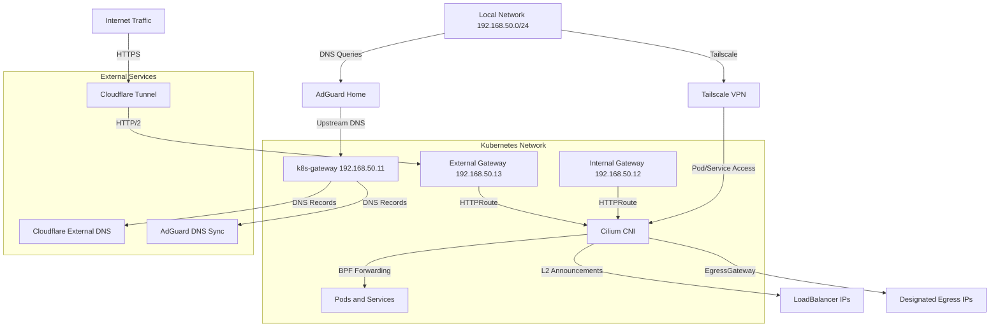

# Networking Architecture

The cluster implements a comprehensive networking stack that provides secure external access, internal service discovery, controlled egress traffic, and mesh networking across multiple environments. This layered approach combines Cilium as the foundational CNI with specialized services for DNS management, ingress, and VPN connectivity.

## Architecture Overview



*Network layers and traffic flow through the cluster networking stack*

## Cilium CNI

Cilium serves as the cluster's Container Network Interface, providing eBPF-based networking, security, and observability. It replaces traditional kube-proxy with advanced data plane features.

### Core Configuration

Cilium operates with the following foundational settings:

- **IPAM Mode**: Kubernetes-native IP address management
- **Routing Mode**: Native routing with IPv4 native routing CIDR set to `10.42.0.0/16`
- **Kube-proxy Replacement**: Fully enabled, replacing kube-proxy with eBPF-based service forwarding
- **Socket LB**: Host namespace only for optimal performance
- **BPF Masquerade**: Enabled for network address translation
- **Host Legacy Routing**: Enabled for compatibility (see [Talos issue #10002](https://github.com/siderolabs/talos/issues/10002))
- **CNI Exclusive Mode**: Disabled to support pairing with Multus CNI
- **Cgroup Automount**: Disabled with host root set to `/sys/fs/cgroup`

### Load Balancing

Cilium implements sophisticated load balancing:

- **Algorithm**: Maglev consistent hashing for even distribution
- **Mode**: Direct Server Return (DSR) for optimal performance
- **Endpoint Routes**: Enabled for direct pod-to-pod routing
- **Local Redirect Policy**: Enabled for hairpinned traffic

### Gateway API Integration

Cilium implements the Kubernetes Gateway API specification, providing modern ingress routing:

- **Gateway API**: Fully enabled with `cilium` gateway class
- **External Gateway**: Listens on `192.168.50.13` for public-facing services
- **Internal Gateway**: Listens on `192.168.50.12` for cluster-internal services

Both gateways support HTTP (port 80) and HTTPS (port 443) with wildcard hostname matching (`*.${SECRET_DOMAIN}`). The external gateway allows routes from all namespaces for HTTPS traffic, while the internal gateway restricts HTTP routes to the same namespace but allows all namespaces for HTTPS.

### L2 Announcements

Cilium advertises LoadBalancer IPs via L2 announcements:

- **Enabled**: L2 announcements are active
- **Mechanism**: BPF-based IP advertisement without requiring kube-proxy
- **Use Case**: Provides LoadBalancer functionality in bare-metal environments without cloud provider LB

This allows services of type LoadBalancer to receive IP addresses from the local network segment without external cloud provider integration.

### Egress Gateway

Cilium Egress Gateway enables controlled egress traffic routing through designated nodes:

- **Enabled**: Egress Gateway functionality is active
- **Purpose**: Allows specific workloads to use dedicated egress IPs
- **Implementation**: `CiliumEgressGatewayPolicy` CRDs select pods and route their external traffic through specified nodes

For example, qBittorrent uses egress gateway to route all external traffic through IP `192.168.50.10`, excluding cluster-internal CIDRs (`10.0.0.0/8`, `172.16.0.0/12`, `192.168.50.145/32`, `192.168.50.10/32`).

### Observability

- **Hubble**: Currently disabled (network observability layer)
- **Prometheus**: Enabled with ServiceMonitor for metrics collection
- **Dashboards**: Grafana dashboards enabled for visualization

## Cloudflare Tunnel

Cloudflare Tunnel provides secure inbound access to cluster services without opening external ports.

### Tunnel Configuration

- **Image**: `docker.io/cloudflare/cloudflared:2026.7.3`
- **Protocol**: HTTP/2 with tunnel metrics exposed on `0.0.0.0:8080`
- **Origin HTTP/2**: Enabled for better performance
- **Resources**: 10m CPU request, 256Mi memory limit
- **Security**: Non-root user (65534:65534), read-only filesystem, all capabilities dropped

### Ingress Rules

The tunnel routes traffic to the external Cilium Gateway:

- **Primary Routes**: `${SECRET_DOMAIN}` and `*.${SECRET_DOMAIN}` → `https://cilium-gateway-external.kube-system.svc.cluster.local`
- **Fallback**: HTTP 404 for unmatched routes
- **Origin Server Name**: `external.${SECRET_DOMAIN}`

Traffic flows: Internet → Cloudflare Edge → Cloudflare Tunnel (HTTP/2) → Cilium External Gateway → Kubernetes Services.

### DNS Configuration

Cloudflare Tunnel endpoint is registered via DNSEndpoint:

- **DNS Name**: `external.${SECRET_DOMAIN}`
- **Record Type**: CNAME
- **Target**: Cloudflare Tunnel unique ID (`5b7a9006-79aa-4f8d-a157-fde642c738fe.cfargotunnel.com`)

This creates a DNS record that points to the Cloudflare Tunnel, enabling edge-to-origin traffic routing.

## DNS Management

The cluster implements a dual DNS strategy for external and internal service discovery.

### Cloudflare External DNS

External DNS management for public-facing services:

- **Provider**: Cloudflare
- **Sources**: CRD (`DNSEndpoint`) and `gateway-httproute`
- **Policy**: Sync (creates and updates records)
- **Domain Filter**: `${SECRET_DOMAIN}` only
- **TXT Prefix**: `k8s.` for ownership verification
- **Gateway Name**: `external`
- **Proxied**: Records are proxied through Cloudflare's network
- **Records Per Page**: 1000 for batch operations

External DNS watches for Gateway and HTTPRoute resources, creating corresponding DNS records in Cloudflare. The external gateway annotation (`external-dns.alpha.kubernetes.io/target: "external.${SECRET_DOMAIN}"`) ensures proper DNS targeting.

### AdGuard DNS Integration

Internal DNS synchronization with AdGuard Home:

- **Provider**: Webhook provider using `ghcr.io/muhlba91/external-dns-provider-adguard:v11.1.1`
- **AdGuard URL**: `http://192.168.50.1:3000`
- **Sources**: `gateway-httproute` and `gateway-tlsroute`
- **Policy**: Sync
- **Gateway Name**: `internal`
- **Dry Run**: Disabled (actual changes applied)

AdGuard DNS connects to the AdGuard Home instance, creating DNS records for internal services exposed via the internal Gateway. This enables local DNS resolution for cluster services without external exposure.

### k8s-gateway Internal DNS

Cluster-internal DNS resolution for Kubernetes resources:

- **Domain**: `${SECRET_DOMAIN}`
- **Service Type**: LoadBalancer with static IP `192.168.50.11`
- **TTL**: 1 second for fresh records
- **Port**: 53 (standard DNS)
- **External Traffic Policy**: Cluster
- **Watched Resources**: `HTTPRoute` and `Service`

k8s-gateway provides DNS records for Kubernetes services and HTTPRoutes, resolving them to their cluster IPs. It's exposed via a LoadBalancer with a static IP assigned via Cilium's IPAM annotation (`lbipam.cilium.io/ips: "192.168.50.11"`).

### CoreDNS

The cluster uses a custom CoreDNS deployment for standard Kubernetes service discovery:

- **Cluster IP**: `10.43.0.10` (standard kube-dns address)
- **Replicas**: 2, scheduled on control-plane nodes
- **Plugins**: errors, health, ready, hosts, kubernetes, autopath, forward, cache, loop, reload, loadbalance, prometheus, log
- **Hosts Plugin**: Custom host mappings for gitea.${SECRET_DOMAIN} (192.168.50.12)
- **Forward Plugin**: Forwards to `/etc/resolv.conf` for external resolution
- **Scheduling**: Restricted to control-plane nodes with critical addons toleration

CoreDNS provides standard DNS resolution for Kubernetes services (`cluster.local`) and forwards external queries upstream.

## Tailscale VPN

Tailscale provides secure mesh networking for cluster access and multi-cluster connectivity.

### Operator Configuration

- **Chart**: `tailscale-operator` v1.98.9
- **Hostname**: `tailscale`
- **API Server Proxy**: Enabled (`mode: 'true'`)
- **OAuth**: Client ID and secret from `tailscale-secret`

The Tailscale operator manages Tailscale resources within the cluster, enabling pod-to-pod and node-to-tailnet connectivity.

### Egress Proxy

Tailscale egress proxy allows accessing external Tailscale resources from within the cluster:

- **Example Service**: `prod-cluster-mosquitto` mapped to Tailnet IP `100.123.28.51`
- **Type**: ExternalName service with `tailscale.com/tailnet-ip` annotation
- **Use Case**: Access services in remote clusters or networks via Tailscale mesh

This enables Kubernetes workloads to reach services in other Tailscale networks using native Tailnet IPs.

### Multi-Cluster Connectivity

Tailscale enables secure connectivity between clusters and external networks:

- **Mesh Networking**: All nodes and pods can communicate via Tailscale overlay
- **NAT Traversal**: Works through firewalls and NAT without port forwarding
- **Authentication**: OAuth-based with secret management
- **API Server Access**: API server proxy enabled for remote cluster management

## Traffic Flows

### External Ingress Flow

1. User requests `https://service.${SECRET_DOMAIN}`
2. DNS resolves to Cloudflare Tunnel endpoint
3. Traffic flows: User → Cloudflare Edge → Cloudflare Tunnel → External Gateway (192.168.50.13)
4. Gateway routes HTTPRoute to backend service
5. Cilium forwards traffic to pod via BPF load balancing
6. Cloudflare DNS creates/updates DNS records for the service

### Internal Service Flow

1. Internal client requests `https://service.${SECRET_DOMAIN}`
2. DNS query to k8s-gateway (192.168.50.11) or CoreDNS (10.43.0.10)
3. k8s-gateway resolves to Internal Gateway (192.168.50.12) or service ClusterIP
4. Gateway routes HTTPRoute to backend service
5. Cilium forwards traffic to pod via BPF load balancing
6. AdGuard DNS creates records in AdGuard Home for local resolution

### Egress Flow

1. Pod initiates external connection
2. CiliumEgressGatewayPolicy matches pod selector
3. Traffic routed through designated egress node with specific IP
4. Excluded CIDRs bypass egress gateway (cluster-internal traffic)
5. External traffic appears from designated egress IP (e.g., 192.168.50.10 for qBittorrent)

### Tailscale VPN Flow

1. User connects via Tailscale client
2. Tailscale authenticates via OAuth
3. User accesses cluster services via Tailnet IPs or DNS
4. Tailscale operator manages routing and NAT traversal
5. Egress proxy enables access to external Tailnet resources

## Security Considerations

### Network Policies

- Cilium Network Policies should define microservices segmentation
- Hubble (when enabled) provides visibility into pod-to-pod traffic
- Egress Gateway policies control which IPs workloads can use externally

### TLS Termination

- Gateway TLS: CertificateRefs reference `${SECRET_DOMAIN/./-}-production-tls` secret
- Cloudflare Tunnel: TLS terminated at Cloudflare Edge, re-encrypted to origin
- Services: Can terminate TLS directly or rely on gateway passthrough

### DNS Security

- External DNS: TXT records (`k8s.` prefix) verify ownership
- AdGuard DNS: Credentials stored in `adguard-dns-secret`
- Cloudflare DNS: API token stored in `cloudflare-dns-secret`
- Secrets: Managed via SOPS encryption and External Secrets Operator

### Access Control

- Gateway namespaces: External gateway allows routes from all namespaces, internal from same/all depending on protocol
- Tailscale: OAuth-based authentication with secret management
- Cloudflare Tunnel: No open ports, outbound-only connection

## Operational Aspects

### Monitoring

All networking components expose Prometheus metrics:

- **Cilium**: ServiceMonitor enabled, metrics on `/metrics`
- **Cloudflare Tunnel**: Metrics on port 8080
- **External DNS**: ServiceMonitor with `/metrics` endpoint
- **k8s-gateway**: Service annotations for monitoring

### High Availability

- **Cilium**: Multiple agent replicas, rolling updates enabled
- **CoreDNS**: 2 replicas on control-plane nodes
- **Gateways**: Static IPs ensure stable endpoints
- **LoadBalancer IPs**: L2 announcements provide redundancy

### Troubleshooting

Key endpoints for debugging network issues:

- **Cilium Status**: `cilium status` via CLI or check Cilium pods
- **Tunnel Health**: `http://cloudflare-tunnel:8080/ready`
- **DNS Resolution**: Test via CoreDNS (10.43.0.10) or k8s-gateway (192.168.50.11)
- **Gateway Routes**: Inspect Gateway and HTTPRoute resources
- **Tailscale**: Check operator logs and tailnet status

#### Common Network Issues

**DNS Resolution Failures**

```bash
# Check CoreDNS pods
kubectl get pods -n kube-system -l k8s-app=kube-dns

# Test DNS resolution
kubectl run -it --rm debug --image=busybox --restart=Never -- nslookup kubernetes.default

# Check k8s-gateway
kubectl get svc -n network k8s-gateway
dig @192.168.50.11 service.${SECRET_DOMAIN}
```

**Gateway Routing Issues**

```bash
# List gateways
kubectl get gateway -A

# Check HTTPRoutes
kubectl get httproute -A

# View gateway status
kubectl describe gateway external -n kube-system
```

**Cloudflare Tunnel Connectivity**

```bash
# Check tunnel pod
kubectl get pods -n network -l app.kubernetes.io/name=cloudflare-tunnel

# View tunnel logs
kubectl logs -n network deployment/cloudflare-tunnel

# Test tunnel endpoint
curl http://cloudflare-tunnel.network.svc.cluster.local:8080/ready
```

**Cilium Connectivity Problems**

```bash
# Check Cilium status
kubectl exec -n kube-system cilium-xxxx -- cilium status

# View connectivity test
kubectl exec -n kube-system cilium-xxxx -- cilium connectivity test

# Check for policy issues
kubectl get ciliumpolicy -A
```

**Tailscale VPN Issues**

```bash
# Check operator status
kubectl get pods -n network -l app.kubernetes.io/name=tailscale

# View tailscale logs
kubectl logs -n network deployment/tailscale

# Check subnet router
kubectl get tailscaleshaper -A
```

## Configuration References

### IP Address Allocation

- **Pod Network**: 10.42.0.0/16 (Cilium native routing)
- **Service Network**: 10.43.0.0/16 (CoreDNS cluster IP: 10.43.0.10)
- **External Gateway**: 192.168.50.13
- **Internal Gateway**: 192.168.50.12
- **k8s-gateway DNS**: 192.168.50.11
- **Cluster VIP**: 192.168.50.10 (also used for qBittorrent egress)
- **Local Network**: 192.168.50.0/24

### Related Components

- **Cluster Architecture**: See [Cluster Architecture Overview](/openwiki/concepts/cluster-architecture.md) for overall cluster design
- **Storage**: Network storage access via NFS CSI and TopoLVM
- **Observability**: Prometheus, Grafana, and Loki monitor network performance
- **Security**: SOPS and External Secrets manage networking credentials

### Future Enhancements

- **Hubble**: Enable for real-time network observability and flow visualization
- **Network Policies**: Define comprehensive microservices segmentation rules
- **Mesh Services**: Expand Tailscale egress proxy for multi-cluster service discovery
- **IPv6**: Evaluate IPv6 native routing support in Cilium
