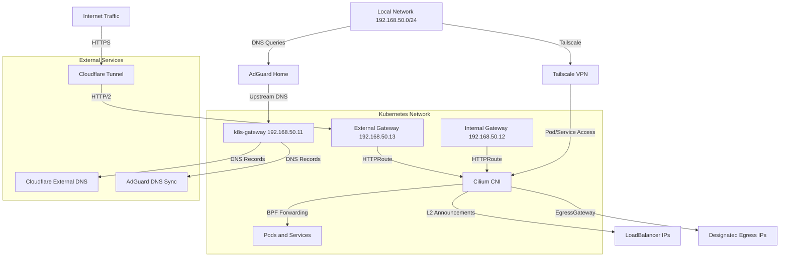

# Networking Architecture

The cluster implements a comprehensive networking stack that provides secure external access, internal service discovery, controlled egress traffic, and mesh networking across multiple environments. This layered approach combines Cilium as the foundational CNI with specialized services for DNS management, ingress, and VPN connectivity.

## Architecture Overview

*Network layers and traffic flow through the cluster networking stack*

## Network Addressing

The cluster uses distinct IP ranges across its networking layers:

- **Pod Network**: `10.42.0.0/16` (Cilium native routing mode)
- **Service Network**: `10.43.0.0/16` with CoreDNS at `10.43.0.10`
- **LoadBalancer Pool**: `192.168.50.0/24` for static IP assignments
  - External Gateway: `192.168.50.13`
  - Internal Gateway: `192.168.50.12`
  - k8s-gateway DNS: `192.168.50.11`
  - Cluster VIP/qBittorrent egress: `192.168.50.10`

## Cilium CNI

Cilium serves as the cluster's Container Network Interface, providing eBPF-based networking, security, and observability. It replaces traditional kube-proxy with advanced data plane features.

### Core Configuration

Cilium operates with the following foundational settings:

- **IPAM Mode**: Kubernetes-native IP address management
- **Routing Mode**: Native routing with IPv4 native routing CIDR set to `10.42.0.0/16`
- **Kube-proxy Replacement**: Fully enabled, replacing kube-proxy with eBPF-based service forwarding
- **Socket LB**: Host namespace only for optimal performance
- **BPF Masquerade**: Enabled for network address translation
- **Host Legacy Routing**: Enabled for compatibility (see [Talos issue #10002](https://github.com/siderolabs/talos/issues/10002))
- **CNI Exclusive Mode**: Disabled to support pairing with Multus CNI
- **Cgroup Automount**: Disabled with host root set to `/sys/fs/cgroup`

### Load Balancing

Cilium provides advanced load balancing capabilities:

- **Algorithm**: Maglev hashing for consistent load distribution
- **Mode**: Direct Server Return (DSR) for optimal performance by allowing responses to bypass the load balancer
- **L2 Announcements**: Enabled to advertise LoadBalancer service IPs on the local network segment, providing bare-metal LoadBalancer functionality without cloud provider integration
- **LoadBalancer IP Pool**: Configured for the `192.168.50.0/24` block with policy restricting use of first/last IPs

### Gateway API Integration

Cilium implements the Kubernetes Gateway API specification with two gateway instances using the `cilium` gatewayClass:

**External Gateway** (`192.168.50.13`):
- Public-facing services accessible via Cloudflare Tunnel
- HTTP (port 80) and HTTPS (port 443) listeners
- Wildcard hostname matching for `*.SECRET_DOMAIN`
- TLS termination using cluster wildcard certificate
- Route namespace policy: Same namespace for HTTP, all namespaces for HTTPS

**Internal Gateway** (`192.168.50.12`):
- Cluster-internal services for local network access
- HTTP (port 80) and HTTPS (port 443) listeners
- Wildcard hostname matching for `*.SECRET_DOMAIN`
- TLS termination using cluster wildcard certificate
- Route namespace policy: Same namespace for HTTP, all namespaces for HTTPS

Both gateways leverage Cilium's eBPF data plane for high-performance HTTPRoute routing to backend pods.

### Egress Gateway

Cilium Egress Gateway is enabled, allowing controlled egress traffic routing through designated nodes using `CiliumEgressGatewayPolicy` CRDs. This feature enables workloads to use specific egress IPs for external traffic.

Example configuration for qBittorrent:
- **Selectors**: Targets pods with `app.kubernetes.io/name: qbittorrent`
- **Destination CIDRs**: `0.0.0.0/0` (all external traffic)
- **Excluded CIDRs**: Cluster internal networks (`10.0.0.0/8`, `172.16.0.0/12`, specific local IPs) to ensure only true external traffic uses the gateway
- **Egress IP**: `192.168.50.10` (designated egress address)

## External Ingress

### Cloudflare Tunnel

Cloudflare Tunnel (cloudflared) provides secure inbound access without opening external ports on the cluster.

**Configuration**:
- **Image**: `docker.io/cloudflare/cloudflared:2026.7.3`
- **Protocol**: HTTP/2 for optimized tunnel performance
- **Ingress Rules**: Routes `SECRET_DOMAIN` and `*.SECRET_DOMAIN` to the external Cilium Gateway service (`cilium-gateway-external.kube-system.svc.cluster.local`)
- **DNS Registration**: Tunnel endpoint registered as CNAME record `external.SECRET_DOMAIN` pointing to Cloudflare Tunnel unique ID
- **Origin Server Name**: Configured as `external.SECRET_DOMAIN`
- **Metrics**: Exposed on port 8080 with ServiceMonitor integration

**Traffic Flow**:
1. External users resolve `*.SECRET_DOMAIN` to Cloudflare endpoints
2. Traffic traverses Cloudflare's global network
3. Cloudflare Tunnel terminates the connection and forwards via HTTP/2 to the external Cilium Gateway
4. Gateway routes HTTPRoutes to backend services via Cilium's BPF load balancing

### Cloudflare External DNS

External DNS management with Cloudflare provider automates DNS record creation for exposed services.

**Configuration**:
- **Provider**: Cloudflare with API token from `cloudflare-dns-secret`
- **Sources**: CRD (DNSEndpoint) and Gateway API (gateway-httproute)
- **Policy**: Sync mode (ensures DNS records match Kubernetes resources)
- **Proxied Records**: Enabled via Cloudflare proxy
- **TXT Prefix**: `k8s.` for ownership verification
- **Domain Filter**: `SECRET_DOMAIN` only
- **Gateway Target**: External gateway (`external.SECRET_DOMAIN`)

This integration automatically creates Cloudflare DNS records for services exposed via Gateway API HTTPRoutes, maintaining synchronization between Kubernetes and Cloudflare DNS.

## Internal DNS Resolution

### k8s-gateway

k8s-gateway provides internal DNS resolution for Kubernetes resources, enabling cluster-internal service discovery.

**Configuration**:
- **Service Type**: LoadBalancer with static IP `192.168.50.11` assigned via Cilium IPAM annotation (`lbipam.cilium.io/ips`)
- **Port**: 53 (standard DNS)
- **Domain**: `SECRET_DOMAIN`
- **TTL**: 1 second for rapid updates
- **Watched Resources**: HTTPRoute and Service resources

k8s-gateway automatically generates DNS records for Kubernetes services and HTTPRoutes, allowing internal clients to resolve service names without relying on external DNS providers.

### AdGuard DNS Integration

AdGuard DNS integration synchronizes internal service DNS records to an AdGuard Home instance for local network resolution.

**Configuration**:
- **Provider**: Webhook provider using `ghcr.io/muhlba91/external-dns-provider-adguard:v11.1.1`
- **AdGuard Home URL**: `http://192.168.50.1:3000`
- **Sources**: Gateway API (gateway-httproute, gateway-tlsroute)
- **Policy**: Sync mode
- **Gateway Target**: Internal gateway (`internal.SECRET_DOMAIN`)
- **Credentials**: Stored in `adguard-dns-secret`
- **TXT Prefix**: `k8s.` for ownership verification

This integration allows local network clients to resolve cluster service names through the AdGuard Home DNS server, which can then use k8s-gateway as an upstream DNS resolver for Kubernetes-specific records.

### CoreDNS

CoreDNS provides standard Kubernetes service discovery with cluster IP `10.43.0.10`.

**Configuration**:
- **Replicas**: 2 scheduled on control-plane nodes
- **Plugins**: errors, health, ready, hosts, kubernetes, autopath, forward, cache, loop, reload, loadbalance, prometheus, log
- **Custom Host Mappings**: Static entries for internal services (e.g., `192.168.50.12 gitea.SECRET_DOMAIN`)
- **Upstream Forwarding**: `/etc/resolv.conf` for external resolution

CoreDNS handles standard Kubernetes service discovery (cluster.local domains) while k8s-gateway provides enhanced resolution for Gateway API resources and custom domain names.

## Mesh Networking

### Tailscale Operator

Tailscale operator provides secure mesh networking capabilities, enabling cluster access from anywhere in the Tailscale network (tailnet).

**Configuration**:
- **Operator Version**: v1.98.9
- **Authentication**: OAuth client credentials from `tailscale-secret`
- **Hostname**: `tailscale`
- **API Server Proxy**: Enabled for remote cluster administration
- **Egress Proxy**: Enabled for accessing external Tailnet resources via ExternalName services

**Egress Proxy Configuration**:
- ExternalName services annotated with Tailnet IPs enable cluster workloads to reach services in other clusters or external networks
- Example: Mosquitto service accessible via Tailnet IP `100.123.28.51`
- Services configured with `tailscale.com/tailnet-ip` annotation for proxy class routing

This integration enables secure, private connectivity to cluster resources from Tailscale clients without requiring VPN configuration on individual services.

## Traffic Flow Examples

### External Ingress Flow

1. User requests `https://app.SECRET_DOMAIN`
2. DNS resolves to Cloudflare endpoint
3. Traffic flows through Cloudflare's global network
4. Cloudflare Tunnel forwards via HTTP/2 to external Cilium Gateway (`192.168.50.13`)
5. Gateway routes HTTPRoute to backend pods via Cilium BPF load balancing
6. Response returns through the same path

### Internal Service Flow

1. Internal client queries `app.SECRET_DOMAIN`
2. AdGuard Home receives DNS query
3. AdGuard forwards to k8s-gateway (`192.168.50.11`) for Kubernetes records
4. k8s-gateway resolves to internal gateway (`192.168.50.12`) or service ClusterIP
5. Gateway routes HTTPRoute to backend pods via Cilium BPF load balancing
6. Response returns directly via pod network

### Egress Traffic Flow

1. qBittorrent pod initiates external connection
2. CiliumEgressGatewayPolicy matches pod selector
3. Traffic destined for `0.0.0.0/0` (excluding internal CIDRs) is routed through egress gateway
4. Source IP translated to designated egress IP (`192.168.50.10`)
5. External traffic appears from egress IP, not pod IP
6. Return traffic routed back through egress gateway

### Tailscale Mesh Flow

1. Tailscale client on external network initiates connection to cluster service
2. Traffic encrypted via Tailscale mesh network
3. Tailscale operator routes to appropriate Kubernetes service
4. Service accessible via Tailnet IP or hostname
5. For external Tailnet resources, egress proxy routes via ExternalName services annotated with Tailnet IPs

## Security Considerations

- **No Open Ports**: Cloudflare Tunnel eliminates need for external port exposure
- **Network Policies**: Cilium enables fine-grained network policy enforcement
- **Egress Control**: CiliumEgressGatewayPolicy provides controlled egress routing
- **TLS Termination**: Gateways handle TLS with cluster-managed certificates
- **Private Mesh**: Tailscale provides encrypted, private connectivity
- **DNS Security**: AdGuard Home provides DNS filtering and security at network edge

## Operational Notes

- **L2 Announcements**: Cilium advertises LoadBalancer IPs on local network; ensure no IP conflicts
- **Gateway Routes**: HTTPRoute namespaces must match gateway allowedRoutes policy
- **DNS Propagation**: k8s-gateway TTL of 1 second enables rapid updates but may increase DNS query load
- **Tunnel Configuration**: Cloudflare Tunnel credentials stored in `cloudflare-tunnel-secret`; rotation requires secret update
- **Egress IP**: Ensure designated egress IPs (`192.168.50.10`) are not assigned to other services
- **Multus Compatibility**: Cilium CNI exclusive mode disabled for potential Multus pairing
