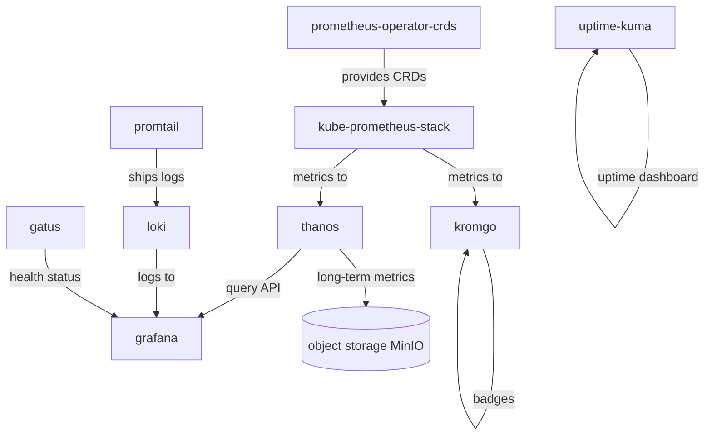

The observability stack provides complete visibility into system health, performance, and availability through integrated metrics, logs, and uptime monitoring. It follows a layered architecture with clear dependency chains, long-term storage capabilities, and automated alert routing.

## Architecture Overview

*Figure: Observability stack component relationships and data flow*

## Component Dependency Chain

The observability components follow a strict installation order enforced by Flux Kustomization dependencies:

1. **prometheus-operator-crds** - Installs Prometheus Operator Custom Resource Definitions (Prometheus, Alertmanager, ServiceMonitor, PrometheusRule, ScrapeConfig)
2. **kube-prometheus-stack** - Deploys Prometheus Operator, Prometheus, Alertmanager, and default monitoring rules
3. **thanos** - Provides long-term metrics storage and querying, depends on kube-prometheus-stack
4. **grafana** - Visualization layer, depends on thanos and kube-prometheus-stack for datasources
5. **kromgo** - Prometheus metrics badge service, depends on kube-prometheus-stack for metrics queries

### Core CRDs

The `prometheus-operator-crds` kustomization installs the foundational CRDs at version 31.0.0. These custom resources define the monitoring behavior:

- **Prometheus**: Configured Prometheus instances with retention, scraping, and remote storage settings
- **Alertmanager**: Alert routing and receiver configuration
- **ServiceMonitor**: Kubernetes service-based scrape target discovery
- **PrometheusRule**: Alerting and recording rule definitions
- **ScrapeConfig**: Advanced scraping configurations for static and custom targets

The kube-prometheus-stack explicitly skips CRD installation (`crds.enabled: false`, `install.crds: Skip`) and depends on the separate CRD deployment, ensuring CRD version control independent of the stack.

## Metrics Collection

### Prometheus and kube-prometheus-stack

The kube-prometheus-stack (Helm chart 88.1.3) provides a complete Prometheus monitoring stack:

- **Prometheus Operator**: Manages Prometheus and Alertmanager resources through Kubernetes CRDs
- **Scraping Configuration**: Monitors Kubernetes components (kubelet, API server) with high-cardinality label dropping
- **Default Rules**: Pre-configured alerting rules for Kubernetes components, with etcd, controller manager, and scheduler disabled for k3s environments
- **Alertmanager**: Integrated alert routing with persistent storage (1Gi) on TopoLVM

The stack enables Thanos sidecar injection for long-term storage integration and provides HTTPRoute ingress for internal access.

### Custom Scrape Configurations

Additional scrape targets are configured via `ScrapeConfig` CRDs for external and infrastructure metrics:

- **smartctl-exporters**: Scrapes disk health metrics from external nodes (192.168.50.100, 192.168.50.220) at 30-minute intervals
- **node-exporter-raspberry-pi**: Collects system metrics from Raspberry Pi (192.168.50.1) at 30-second intervals
- **borgmatic-exporter**: Monitors backup status daily (24-hour intervals) from the backup host

These configurations use static targets with relabeling to set appropriate job and instance labels.

### SMART Device Monitoring

The smartctl-exporter includes comprehensive PrometheusRule alerts for disk health:

- **SmartDeviceHighTemperature**: Fires when drive temperature exceeds 65°C for 5 minutes
- **SmartDeviceTestFailed**: Alerts when SMART tests fail
- **SmartDeviceCriticalWarning**: Critical state detection
- **SmartDeviceMediaErrors**: Media error detection
- **SmartDeviceAvailableSpareUnderThreshold**: Spare capacity threshold warnings
- **SmartDeviceInterfaceSlow**: Interface speed degradation detection

These alerts provide early warning of storage device failures across external nodes.

### Kubelet and API Server Monitoring

Kubernetes component monitoring applies metric relabeling to reduce cardinality:

- **Kubelet**: Drops `uid` and `id|name` labels, excludes high-cardity request duration metrics
- **API Server**: Drops high-cardinality duration bucket metrics and response size distributions

This optimization prevents metric explosion while maintaining observability of critical component health.

## Long-term Metrics Storage

### Thanos Integration

Thanos (chart 17.3.1, image v0.42.4) extends Prometheus with long-term retention and global querying:

- **Query Frontend**: Provides query API and caching, exposed as Grafana datasource at `thanos-query-frontend:9090`
- **Query Service**: Discovers Prometheus sidecars via DNS service `kube-prometheus-stack-thanos-discovery`
- **Store Gateway**: Serves historical metrics from object storage with 10Gi local cache
- **Compactor**: Downsamples and compacts metrics with tiered retention (14d raw, 30d at 5m, 60d at 1h)
- **Ruler**: Evaluates recording and alerting rules against historical data
- **Bucket Web**: Provides object storage inspection UI

Thanos stores metrics in MinIO object storage (bucket: `thanos-dev`, endpoint: 192.168.50.220:9010) using credentials injected via ExternalSecret from Bitwarden.

### Storage Architecture

Metrics flow through the Thanos components:

1. Prometheus sidecar uploads blocks to object storage every 2 hours
2. Compactor downsamples data and creates compacted blocks
3. Store gateway queries object storage for historical data
4. Query service merges real-time (Prometheus) and historical (store gateway) data

Grafana queries Thanos Query Frontend as the unified Prometheus datasource, enabling seamless querying of recent and historical metrics.

## Log Aggregation

### Loki

Loki (chart 7.2.0) provides horizontally-scalable, cost-effective log aggregation:

- **Deployment Mode**: SingleBinary with filesystem storage
- **Storage**: 8Gi persistent volume on TopoLVM
- **Retention**: 7-day retention period
- **Schema**: TSDB object store format (v13) with 24-hour index periods
- **Encoding**: Snappy chunk compression

Loki runs without authentication for internal cluster access and exposes a headless service for Promtail connectivity.

### Promtail

Promtail (chart 6.17.1) ships Kubernetes pod logs to Loki:

- **Client Configuration**: Sends logs to `loki-headless.observability.svc.cluster.local:3100/loki/api/v1/push`
- **Service Monitor**: Enabled for scraping Promtail's own metrics
- **Dependency**: Requires Loki to be running before startup

Promtail automatically discovers pod logs through Kubernetes APIs and applies label enrichment for log filtering in Grafana.

### Log Querying in Grafana

Grafana's Loki datasource enables log queries using LogQL (Log Query Language):

- **Label-based filtering**: `{namespace="default", pod="my-app"}`
- **Full-text search**: `|~ "error"`
- **Metric queries**: `count_over_time({namespace="default"}[5m])`

The datasource is configured with 250 max lines per query to balance detail and performance.

## Alerting

### Alertmanager Configuration

The kube-prometheus-stack includes Alertmanager with custom routing configured via `AlertmanagerConfig`:

- **Default Receiver**: Pushover notifications for critical alerts
- **Grouping**: Groups by alertname and job with 10-minute intervals
- **Inhibition**: Critical alerts inhibit warning alerts for the same namespace and alertname
- **Special Handling**: InfoInhibitor alerts are silenced (routed to null receiver)

Alertmanager stores configuration in persistent storage (1Gi) and is exposed via internal HTTPRoute.

### Alert Routing

Alerts are routed to Pushover with templated messages including:

- Alert description, summary, or message
- All labels as formatted key-value pairs
- Firing count in title for ongoing incidents
- Critical severity filtering to reduce notification noise

The integration uses ExternalSecret to retrieve Pushover API token and user key from Bitwarden.

### Gatus Health Monitoring

Gatus provides automated endpoint health checking with Prometheus metrics:

- **Endpoint Configuration**: Kubernetes ConfigMaps discovered by k8s-sidecar init container
- **Health Checks**: HTTP/ICMP connectivity tests with configurable intervals and conditions
- **Metrics Export**: Exposes `gatus_results_endpoint_success` metric for Prometheus scraping
- **Status Page**: Public status dashboard at `status-dev.{SECRET_DOMAIN}`

Gatus configuration checks:
- Local network infrastructure (ISP modems via ICMP)
- External endpoints (flux webhook via HTTPS with external DNS resolver)

### PrometheusRule Integration

Gatus exposes alerting rules via PrometheusRule CRD:

- **GatusEndpointDown**: Fires when external endpoints fail for 5 minutes (critical severity)
- **GatusEndpointExposed**: Fires when guarded endpoints become publicly accessible (critical severity)

These rules integrate Gatus health status into the central Alertmanager notification pipeline.

## Visualization

### Grafana Dashboards

Grafana (chart 10.5.15) provides unified visualization for metrics and logs:

- **Authentication**: Anonymous viewer access with admin credentials from ExternalSecret
- **Datasources**: Pre-configured Prometheus (Thanos), Loki, and Alertmanager
- **Dashboard Providers**: File-based provider for dashboards deployed via ConfigMaps
- **Plugins**: Unsigned plugins allowed (natel-discrete-panel, pr0ps-trackmap-panel, panodata-map-panel)
- **Explore Mode**: Enabled for ad-hoc querying

Grafana deployment uses Recreate strategy and depends on Thanos, kube-prometheus-stack, and external-secrets for datasource connectivity.

### Uptime Kuma

Uptime Kuma provides user-friendly uptime monitoring with public status pages:

- **HTTPRoute**: Exposed at `uptime-kuma.{SECRET_DOMAIN}` via external and internal gateways
- **Persistence**: Uses VolSync for backup and restore of configuration data
- **Gatus Monitoring**: External component monitoring via Gatus
- **Notifications**: Built-in notification channels for alert delivery

Uptime Kuma complements Gatus by providing browser-based monitoring configuration and status visualization.

### Kromgo

Kromgo provides Prometheus metrics badges for quick cluster health visualization:

- **Metrics Source**: Queries Prometheus directly at `prometheus-operated.observability.svc.cluster.local:9090`
- **Badge Types**: Configurable metrics including cluster CPU, memory, network usage, pod counts, node counts, and power consumption
- **Color Coding**: Threshold-based coloring (green/orange/red) for visual status indication
- **HTTPRoute**: Exposed at `kromgo.{SECRET_DOMAIN}` via external gateway
- **Configuration**: ConfigMap-based metric definitions with customizable queries, labels, and display options

Kromgo exposes key cluster metrics as lightweight SVG badges suitable for embedding in dashboards, documentation, or status pages. Metrics include Talos version, Kubernetes version, cluster resource usage, pod counts, and active alerts.

## Storage and Persistence

All observability components use TopoLVM thin-provisioned storage for persistence:

- **Alertmanager**: 1Gi for alert state and notification queues
- **Loki**: 8Gi for log index and chunk storage
- **Thanos Compactor**: 20Gi for compaction working set and downsampling
- **Thanos Store Gateway**: 10Gi for object store cache
- **Uptime Kuma**: PVC backed by VolSync for backup

Gatus uses SQLite for health check result storage with caching enabled.

## Security Configuration

### Network Exposure

Components expose different access patterns:

- **Internal-only**: Alertmanager (via internal HTTPRoute)
- **External with authentication**: Grafana, Uptime Kuma (via external HTTPRoute)
- **Public status pages**: Gatus, Uptime Kuma (read-only dashboards)

### Secrets Management

Sensitive credentials are injected via ExternalSecret from Bitwarden:

- **Grafana**: Admin username and password
- **Thanos**: MinIO S3 credentials for object storage
- **Alertmanager**: Pushover token and user key

This approach avoids storing secrets in Git and enables automated credential rotation.

### Pod Security

Observability pods run with hardened security contexts:

- **Non-root**: Run as non-privileged user (UID/GID 1000)
- **ReadOnlyRootFilesystem**: Containers use immutable root filesystems
- **Capabilities**: Drop all capabilities except specific requirements (NET_RAW for Gatus)
- **Seccomp**: Runtime default profiles applied

## Operational Considerations

### Metric Retention and Costs

The tiered retention strategy balances storage cost and query performance:

- **Recent data (14 days)**: Raw resolution in Thanos for detailed debugging
- **Medium-term (30 days)**: 5-minute resolution for trend analysis
- **Long-term (60 days)**: 1-hour resolution for capacity planning

Compaction runs continuously with 30-minute delete delay to prevent accidental data loss.

### Log Retention

Loki retains logs for 7 days, balancing storage cost with debugging needs. The 7-day window covers most incident investigation scenarios while limiting storage consumption.

### Alert Fatigue Prevention

The alerting configuration includes several anti-fatigue measures:

- **Inhibition rules**: Critical alerts suppress warning duplicates
- **Severity filtering**: Only critical alerts trigger Pushover notifications
- **Grouping**: Related alerts group together to reduce notification volume
- **Null routing**: Informational alerts (InfoInhibitor) are silenced

### High Cardinality Protection

Metric relabeling prevents cardinality explosion from Kubernetes metadata:

- **Kubelet**: Drops `uid` label and high-cardinality duration buckets
- **API Server**: Drops request duration buckets and response size buckets
- **Consistent relabeling**: All scrapes apply job and instance label normalization

## Scaling and Performance

### Query Performance

Thanos Query Frontend provides query caching and parallelization:

- **Split queries**: Large time ranges split into smaller parallel queries
- **Query caching**: Repeated queries served from cache (1Gi memory limit)
- **Frontend API**: Separate service prevents overload of query backend

### Log Ingestion

Loki SingleBinary handles log ingestion with:

- **Chunk encoding**: Snappy compression reduces storage requirements
- **Index period**: 24-hour periods balance index size and query performance
- **TSDB backend**: Optimized for high-volume write workloads

### Monitoring the Monitoring

The stack monitors itself via:

- **Prometheus Operator ServiceMonitors**: Scrapes Prometheus, Alertmanager, and Thanos components
- **Gatus self-monitoring**: Health checks for all observability endpoints
- **Gatus PrometheusRule**: Alerts when monitoring components fail
