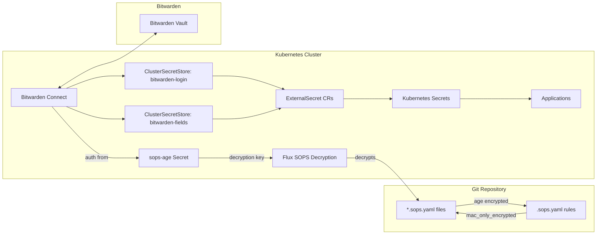

# Secrets Management

The cluster employs a dual-layer secrets architecture that separates Git repository encryption from runtime secret injection. This approach ensures secrets stored in Git remain encrypted at rest while applications receive decrypted secrets at runtime through External Secrets Operator.

## Architecture Overview



*Figure: Complete secret management flow showing encrypted Git storage, Flux decryption, and Bitwarden runtime injection*

## Layer 1: Git Encryption with SOPS + age

SOPS (Secrets OPerationS) encrypts secrets at rest in the Git repository using age encryption. All secrets committed to the repository are stored as `*.sops.yaml` files with only the sensitive fields encrypted, maintaining YAML structure and Git diff readability.

### Encryption Configuration

The `.sops.yaml` file defines creation rules that determine which files are encrypted and how. These rules ensure different secret types receive appropriate encryption treatment.

**Talos Secrets** (`.sops.yaml#L3-L5`)
- Path pattern: `talos/.*\.sops\.ya?ml`
- Encrypts the entire file content
- Uses age recipient: `age1shkd7fsr66cnpkutpmpf7ffylcc2x4c9tlsdkapv6nmu5ceu0dzqdjtqc5`
- `mac_only_encrypted: true` preserves YAML structure

**Kubernetes and Bootstrap Secrets** (`.sops.yaml#L6-L9`)
- Path pattern: `(bootstrap|kubernetes)/.*\.sops\.ya?ml`
- Encrypts only `data` and `stringData` fields via `encrypted_regex: "^(data|stringData)$"`
- Uses the same age recipient
- `mac_only_encrypted: true` ensures only matching fields are encrypted

The `mac_only_encrypted: true` configuration ensures that only fields matching `encrypted_regex` are encrypted while preserving YAML structure and metadata. This allows SOPS files to coexist with normal Kubernetes resources and maintain Git diff readability.

### Key Management

The age private key for SOPS decryption is stored as a Kubernetes secret named `sops-age`, which is itself SOPS-encrypted in Git.

**sops-age Secret** (`kubernetes/components/common/sops/sops-age.sops.yaml#L1-L22`)
- Contains `age.agekey` field with the private key
- Encrypted in Git using the same age public key
- Decrypted by Flux during reconciliation
- Referenced by Kustomizations via `decryption.provider.sops` and `secretRef.name.sops-age`

**Flux Integration Example** (`kubernetes/apps/external-secrets/bitwarden-connect/ks.yaml#L15-L18`)
```yaml
decryption:
  provider: sops
  secretRef:
    name: sops-age
```

Flux Kustomizations that need to decrypt SOPS files reference this secret, enabling automatic decryption during reconciliation.

### Encrypted Secret Types

**Cluster Configuration Secrets** (`kubernetes/components/common/sops/cluster-secrets.sops.yaml`)
- Contains environment-wide values like `SECRET_DOMAIN` and `TIMEZONE`
- Shared across applications via `postBuild.substituteFrom`
- Enables environment-specific configuration without per-application secrets

**Application Credentials** (scattered across `kubernetes/apps/`)
- Bitwarden CLI credentials for External Secrets Operator
- Application-specific secrets (Cloudflare, Tailscale, etc.)
- All stored as SOPS-encrypted Kubernetes secrets

**Talos Cluster Secrets** (`talos/talsecret.sops.yaml`)
- Cluster ID, bootstrap tokens
- Etcd and Kubernetes certificates
- Trustd and service account keys

### postBuild Substitution

Flux Kustomizations use `postBuild.substituteFrom` to inject non-sensitive cluster-wide configuration from the `cluster-secrets` Secret into manifests during reconciliation. This pattern enables environment-specific configuration without per-application secrets.

**Example** (`kubernetes/apps/external-secrets/bitwarden-connect/ks.yaml#L19-L22`)
```yaml
postBuild:
  substituteFrom:
    - name: cluster-secrets
      kind: Secret
```

## Layer 2: Runtime Secret Injection with External Secrets

External Secrets Operator pulls secrets from Bitwarden and injects them as Kubernetes Secrets for applications to consume. This layer handles dynamic secret synchronization and removes sensitive values from the Git repository entirely.

### Bitwarden Connect Deployment

**HelmRelease** (`kubernetes/apps/external-secrets/bitwarden-connect/app/helmrelease.yaml#L1-L59`)
- Chart: `bitwarden-eso-provider` version 1.2.0
- Source: `bitwarden-eso-provider` HelmRepository
- Health checks: Configured with extended liveness probe (300s period, 30 failure threshold, 15s timeout)
- CRD installation: Enabled (`installCRDs: true`)
- Service monitors: Enabled for provider, webhook, and cert controller with 1m scrape intervals

**Authentication** (`kubernetes/apps/external-secrets/bitwarden-connect/app/helmrelease.yaml#L30-L46`)
- Uses existing Kubernetes Secret `bitwarden-cli` for authentication
- Secret key mappings:
  - `BW_USERNAME` → appID (prevents infinite login email notifications)
  - `BW_PASSWORD` → password (Bitwarden master password)
  - `BW_HOST` → host (supports self-hosted instances)
  - `BW_CLIENTID` and `BW_CLIENTSECRET` → Optional OAuth credentials (commented out)

**Bitwarden Credentials Secret** (`kubernetes/apps/external-secrets/bitwarden-connect/app/secret.sops.yaml#L1-L28`)
- SOPS-encrypted secret containing `BW_HOST`, `BW_USERNAME`, `BW_PASSWORD`, `BW_CLIENTID`, `BW_CLIENTSECRET`
- Encrypted in Git using the cluster's age recipient
- Decrypted by Flux during reconciliation before being used by Bitwarden Connect

### ClusterSecretStore Resources

The Bitwarden provider creates two ClusterSecretStore instances, each optimized for different Bitwarden data access patterns.

**bitwarden-login**
- Default store for most secrets
- Uses JSONPath: `login.<property>`
- Can access `username` and `password` fields from Bitwarden login entries
- Used for: database credentials, API tokens, app passwords

**bitwarden-fields**
- Alternative store for custom field access
- Uses JSONPath: `fields[?(@.name=="<property>")].value`
- Can access any custom field on any Bitwarden item type
- Used for: App Store Connect keys, API keys stored in custom fields, multi-field secrets

The `bitwarden-fields` ClusterSecretStore is required when accessing Bitwarden custom fields rather than login credentials, as `bitwarden-login`'s JSONPath is hardcoded to `login.username` and `login.password` only.

### ExternalSecret Usage Patterns

ExternalSecret resources define how secrets are pulled from Bitwarden and injected into Kubernetes Secrets.

#### Standard Login Secret Pattern

Most applications use the standard pattern accessing username/password from the `bitwarden-login` store:

```yaml
# kubernetes/apps/network/tailscale/app/externalsecret.yaml
spec:
  secretStoreRef:
    kind: ClusterSecretStore
    name: bitwarden-login
  target:
    name: tailscale-secret
    template:
      engineVersion: v2
      data:
        client_id: "{{ .client_id }}"
        client_secret: "{{ .client_secret }}"
  data:
    - secretKey: client_id
      remoteRef:
        key: tailscale_k8s_oauth
        property: username
    - secretKey: client_secret
      remoteRef:
        key: tailscale_k8s_oauth
        property: password
```

#### Template-based Secret Injection

Applications use the template engine to combine multiple secrets with static configuration:

```yaml
# kubernetes/apps/default/gitea/app/externalsecret.yaml
spec:
  target:
    name: gitea-secret
    template:
      engineVersion: v2
      data:
        GITEA__database__DB_TYPE: "postgres"
        GITEA__database__HOST: "dev-postgres16-rw.database.svc.cluster.local:5432"
        GITEA__database__USER: "{{ .GITEA__database__USER }}"
        GITEA__database__PASSWD: "{{ .GITEA__database__PASSWD }}"
        INIT_POSTGRES_SUPER_PASS: '{{ .POSTGRES_SUPER_PASS }}'
  data:
    - secretKey: POSTGRES_SUPER_PASS
      remoteRef:
        key: cloudnative-pg
        property: password
    - secretKey: GITEA__database__USER
      remoteRef:
        key: gitea-db
        property: username
    - secretKey: GITEA__database__PASSWD
      remoteRef:
        key: gitea-db
        property: password
```

The `target.template.engineVersion: v2` template engine injects secrets into structured data formats, combining multiple remote secrets with static configuration.

#### Multi-Store ExternalSecret

ExternalSecrets can source different data entries from different ClusterSecretStores within the same resource:

```yaml
# kubernetes/apps/default/growth-tracker/app/externalsecret.yaml
spec:
  secretStoreRef:
    kind: ClusterSecretStore
    name: bitwarden-login
  data:
    # From bitwarden-login (default)
    - secretKey: UMAMI_USERNAME
      remoteRef:
        key: umami.tomyail.com
        property: username

    # From bitwarden-fields (explicit storeRef)
    - secretKey: ASC_ISSUER_ID
      sourceRef:
        storeRef:
          name: bitwarden-fields
          kind: ClusterSecretStore
      remoteRef:
        key: growth-tracker-asc
        property: issuer_id
```

The `sourceRef` field allows specifying different ClusterSecretStores for individual secret keys within the same ExternalSecret, enabling mixed secret sourcing patterns where some keys come from `bitwarden-login` and others from `bitwarden-fields`.

#### Custom Field Access

When secrets are stored as custom fields rather than login credentials:

```yaml
# kubernetes/apps/network/smtp-relay/app/externalsecret.yaml
spec:
  secretStoreRef:
    kind: ClusterSecretStore
    name: bitwarden-login
  data:
    - secretKey: SMTP_RELAY_SERVER
      sourceRef:
        storeRef:
          name: bitwarden-fields
          kind: ClusterSecretStore
      remoteRef:
        key: e7305b42-14a8-4ed6-8594-0059051c4742
        property: HOST
    - secretKey: SMTP_RELAY_USERNAME
      remoteRef:
        key: smtp-relay
        property: username
```

## Secret Synchronization Workflow

### Initialization Flow

1. **Bootstrap**: age private key generated and stored in `sops-age` secret
2. **Bitwarden Setup**: OAuth credentials configured in `bitwarden-cli` secret
3. **ClusterSecretStore Creation**: Bitwarden Connect creates `bitwarden-login` and `bitwarden-fields` stores
4. **ExternalSecret Reconciliation**: External Secrets Operator reads ExternalSecret CRs and syncs secrets from Bitwarden

### Runtime Synchronization

External Secrets Operator continuously reconciles ExternalSecret resources at a configurable interval (default 1 hour per HelmRelease configuration). Changes to secrets in Bitwarden are not immediately reflected in the cluster until the next reconciliation cycle.

**Sync Process**:
1. Polls Bitwarden for changes at configured interval
2. Updates target Kubernetes Secrets when remote values change
3. Triggers rollout of dependent workloads (when annotated with `reloader.stakater.com/auto`)

### Secret Update Process

1. Update secret in Bitwarden cloud or self-hosted instance
2. External Secrets Operator detects change on next interval
3. Updates target Kubernetes Secret
4. Applications using the secret receive updated values (via mounted volumes or environment variables)
5. Some applications require pod restart to pick up new values

## Secret Rotation Procedures

### Age Key Rotation

Age keys must be rotated by updating `.sops.yaml` and re-encrypting all files:

1. **Generate new age keypair**: `age-keygen -o age-new.txt`
2. **Update .sops.yaml**: Replace the age recipient with the new public key
3. **Re-encrypt all SOPS files**: Iterate through all `*.sops.yaml` files and re-encrypt with the new key
4. **Update sops-age secret**: Encrypt the new private key in `kubernetes/components/common/sops/sops-age.sops.yaml`
5. **Commit and push**: Flux will reconcile with the new decryption key

**No automated key rotation mechanism exists** - this is a manual process requiring careful coordination to avoid decryption failures.

### Bitwarden Credential Rotation

Bitwarden credentials must be updated when:

- Bitwarden master password changes
- OAuth credentials expire or are compromised
- Switching between Bitwarden Cloud and self-hosted instances

**Procedure**:
1. Update credentials in Bitwarden
2. Update `kubernetes/apps/external-secrets/bitwarden-connect/app/secret.sops.yaml` with new values
3. Re-encrypt the secret file: `sops --encrypt --encrypted-regex '^(data|stringData)$' secret.sops.yaml > secret.sops.yaml.tmp && mv secret.sops.yaml.tmp secret.sops.yaml`
4. Commit and push changes
5. Flux reconciles the updated secret
6. Bitwarden Connect pod restarts automatically to pick up new credentials

### Application Secret Rotation

Application secrets (database passwords, API keys, etc.) stored in Bitwarden can be rotated independently:

1. Update secret in Bitwarden vault
2. Wait for External Secrets Operator reconciliation interval (default 1 hour)
3. Verify updated Kubernetes Secret reflects new values
4. Trigger application restart if needed (or rely on automatic rollout annotations)

**For immediate sync**, manually restart the External Secrets Operator pod or use the ESO CLI to force reconciliation.

## Security Best Practices

### Access Control

- **Git repository**: Contains encrypted secrets only (no plaintext)
- **Bitwarden credentials**: Stored as encrypted Kubernetes secret
- **ClusterSecretStore resources**: Cluster-scoped but accessible only to External Secrets Operator
- **ExternalSecrets**: Namespace-scoped, limiting secret access to their namespace

### Key Security

- **Age private key**: Must be backed up independently (stored in Git encrypted)
- **Single recipient**: `.sops.yaml` uses a single age recipient - consider adding backup recipients
- **Key separation**: Age keys for Git encryption, Bitwarden for runtime secrets

### Audit Trail

- **Bitwarden**: Maintains audit logs of secret access via Bitwarden Connect
- **Git commit history**: Tracks all SOPS-encrypted secret changes
- **External Secrets Operator**: Logs all sync operations to stdout

### Failure Handling

**Secret Decryption Failure**:
- Flux fails reconciliation if `sops-age` secret is missing or invalid
- Bitwarden Connect fails authentication if credentials are incorrect
- External Secrets Operator logs errors for missing Bitwarden items or properties

**Secret Sync Latency**:
- External Secrets Operator default interval is 1 hour
- Critical secrets may require manual sync trigger or reduced interval
- Changes in Bitwarden not immediately reflected in cluster

**Backup and Recovery**:
- Age private key must be backed up independently
- Bitwarden serves as primary secret store - ensure Bitwarden backup
- Kubernetes secrets persist ExternalSecret sync results but are not source of truth

### Operational Considerations

**Encryption Rules and Invariants**:
- All `*.sops.yaml` files must match a creation rule in `.sops.yaml`
- Talos secrets encrypt entire file; Kubernetes secrets encrypt only `data`/`stringData`
- `mac_only_encrypted: true` ensures only specified fields are encrypted
- Age recipient is hardcoded to a single public key

**Secret Validation**:
- Test SOPS encryption/decryption before committing: `sops --decrypt --encrypted-regex '^(data|stringData)$' file.sops.yaml`
- Verify ExternalSecret resources reference valid Bitwarden items and properties
- Check External Secrets Operator logs for sync errors after creating new ExternalSecrets

**Disaster Recovery**:
- Store age private key backup in secure, offline location
- Document Bitwarden master password in secure password manager
- Maintain Bitwarden backup/export for critical secrets
- Test restoration process periodically
