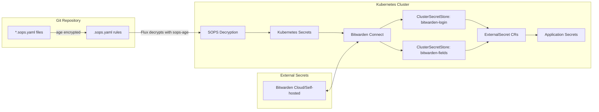

# Secrets Management

The cluster employs a dual-layer secrets architecture that separates Git repository encryption from runtime secret injection. This approach ensures secrets stored in Git remain encrypted at rest while applications receive decrypted secrets at runtime through External Secrets Operator.

## Architecture Overview



## Layer 1: Git Encryption with SOPS + age

SOPS (Secrets OPerationS) encrypts secrets at rest in the Git repository using age encryption. All secrets committed to the repository are stored as `*.sops.yaml` files with only the sensitive fields encrypted.

### Encryption Configuration

The `.sops.yaml` file defines creation rules that determine which files are encrypted and how:

**Talos Secrets** (`.sops.yaml#L2-L5`)
- Path pattern: `talos/.*\.sops\.ya?ml`
- Encrypts entire file content
- Uses age recipient: `age1shkd7fsr66cnpkutpmpf7ffylcc2x4c9tlsdkapv6nmu5ceu0dzqdjtqc5`
- `mac_only_encrypted: true`

**Kubernetes and Bootstrap Secrets** (`.sops.yaml#L6-L9`)
- Path pattern: `(bootstrap|kubernetes)/.*\.sops\.ya?ml`
- Encrypts only `data` and `stringData` fields
- Uses same age recipient
- `encrypted_regex: "^(data|stringData)$"`
- `mac_only_encrypted: true`

### Key Management

The age private key is stored as a Kubernetes secret named `sops-age`:

**sops-age Secret** (`kubernetes/components/common/sops/sops-age.sops.yaml`)
- Contains `age.agekey` field with the private key
- Encrypted in Git using the same age public key
- Decrypted by Flux during reconciliation
- Referenced by Kustomizations that need SOPS decryption

**Flux Integration** (`kubernetes/apps/external-secrets/bitwarden-connect/ks.yaml#L15-L18`)
```yaml
decryption:
  provider: sops
  secretRef:
    name: sops-age
```

### Encrypted Secret Types

**Cluster Configuration Secrets** (`kubernetes/components/common/sops/cluster-secrets.sops.yaml`)
- Contains environment-wide values like `SECRET_DOMAIN` and `TIMEZONE`
- Shared across applications via `postBuild.substituteFrom`

**Application Secrets** ( scattered across `kubernetes/apps/`)
- Bitwarden CLI credentials for External Secrets Operator
- Application-specific secrets (Cloudflare, Tailscale, etc.)

**Talos Cluster Secrets** (`talos/talsecret.sops.yaml`)
- Cluster ID, bootstrap tokens
- Etcd and Kubernetes certificates
- Trustd and service account keys

## Layer 2: Runtime Secret Injection with External Secrets

External Secrets Operator pulls secrets from Bitwarden and injects them as Kubernetes Secrets for applications to consume. This layer handles dynamic secret synchronization and removes sensitive values from the Git repository entirely.

### Bitwarden Connect Deployment

**HelmRelease** (`kubernetes/apps/external-secrets/bitwarden-connect/app/helmrelease.yaml`)
- Chart: `bitwarden-eso-provider` version 1.2.0
- Source: `bitwarden-eso-provider` HelmRepository
- Uses existing Kubernetes Secret `bitwarden-cli` for authentication
- Secret keys mapped:
  - `BW_USERNAME` → appID
  - `BW_PASSWORD` → password
  - `BW_HOST` → host

**Bitwarden Credentials Secret** (`kubernetes/apps/external-secrets/bitwarden-connect/app/secret.sops.yaml`)
- SOPS-encrypted secret containing:
  - `BW_HOST`: Bitwarden server URL
  - `BW_USERNAME`: Bitwarden username/email
  - `BW_PASSWORD`: Bitwarden master password
  - `BW_CLIENTID` and `BW_CLIENTSECRET`: OAuth credentials (commented out in HelmRelease)

### ClusterSecretStore Resources

The Bitwarden provider creates two ClusterSecretStore instances (defined by the Helm chart):

**bitwarden-login**
- Default store for most secrets
- Uses JSONPath: `login.<property>`
- Can access `username` and `password` fields from Bitwarden login entries
- Used for: database credentials, API tokens, app passwords

**bitwarden-fields**
- Alternative store for custom field access
- Uses JSONPath: `fields[?(@.name=="<property>")].value`
- Can access any custom field on any Bitwarden item type
- Used for: App Store Connect keys, API keys stored in custom fields, multi-field secrets

### ExternalSecret Usage Patterns

**Standard Login Secret Pattern**

Most applications use the standard pattern accessing username/password:

```yaml
# kubernetes/apps/network/tailscale/app/externalsecret.yaml
secretStoreRef:
  kind: ClusterSecretStore
  name: bitwarden-login
data:
  - secretKey: client_id
    remoteRef:
      key: tailscale_k8s_oauth
      property: username
  - secretKey: client_secret
    remoteRef:
      key: tailscale_k8s_oauth
      property: password
```

**Template-based Secret Injection**

Applications use templates to combine multiple secrets and add configuration:

```yaml
# kubernetes/apps/default/gitea/app/externalsecret.yaml
target:
  template:
    data:
      GITEA__database__DB_TYPE: "postgres"
      GITEA__database__HOST: "dev-postgres16-rw.database.svc.cluster.local:5432"
      GITEA__database__USER: "{{ .GITEA__database__USER }}"
      GITEA__database__PASSWD: "{{ .GITEA__database__PASSWD }}"
      INIT_POSTGRES_SUPER_PASS: '{{ .POSTGRES_SUPER_PASS }}'
data:
  - secretKey: POSTGRES_SUPER_PASS
    remoteRef:
      key: cloudnative-pg
      property: password
  - secretKey: GITEA__database__USER
    remoteRef:
      key: gitea-db
      property: username
```

**Multi-Store ExternalSecret**

Some ExternalSecrets pull from both ClusterSecretStores:

```yaml
# kubernetes/apps/default/growth-tracker/app/externalsecret.yaml
data:
  # From bitwarden-login
  - secretKey: UMAMI_USERNAME
    remoteRef:
      key: umami.tomyail.com
      property: username

  # From bitwarden-fields
  - secretKey: ASC_ISSUER_ID
    sourceRef:
      storeRef:
        name: bitwarden-fields
        kind: ClusterSecretStore
    remoteRef:
      key: growth-tracker-asc
      property: issuer_id
```

**Custom Field Access**

When secrets are stored as custom fields rather than login credentials:

```yaml
# kubernetes/apps/network/smtp-relay/app/externalsecret.yaml
data:
  - secretKey: SMTP_RELAY_SERVER
    sourceRef:
      storeRef:
        name: bitwarden-fields
        kind: ClusterSecretStore
    remoteRef:
      key: e7305b42-14a8-4ed6-8594-0059051c4742
      property: HOST
```

## Secret Synchronization Workflow

### Initialization Flow

1. **Bootstrap**: age private key generated and stored in `sops-age` secret
2. **Bitwarden Setup**: OAuth credentials configured in `bitwarden-cli` secret
3. **ClusterSecretStore Creation**: Bitwarden Connect creates `bitwarden-login` and `bitwarden-fields` stores
4. **ExternalSecret Reconciliation**: External Secrets Operator reads ExternalSecret CRs and syncs secrets from Bitwarden

### Runtime Synchronization

External Secrets Operator continuously reconciles ExternalSecret resources:

- Polls Bitwarden for changes (configurable interval)
- Updates target Kubernetes Secrets when remote values change
- Triggers rollout of dependent workloads (when annotated with `reloader.stakater.com/auto`)

### Secret Update Process

1. Update secret in Bitwarden cloud or self-hosted instance
2. External Secrets Operator detects change on next interval
3. Updates target Kubernetes Secret
4. Applications using the secret receive updated values (via mounted volumes or environment variables)
5. Some applications require pod restart to pick up new values

## Encryption Rules and Invariants

**SOPS Configuration Rules** (`.sops.yaml`)
- All `*.sops.yaml` files must match a creation rule
- Talos secrets encrypt entire file; Kubernetes secrets encrypt only `data`/`stringData`
- `mac_only_encrypted: true` ensures only specified fields are encrypted
- Age recipient is hardcoded to a single public key

**Key Rotation Requirements**
- Age keys must be rotated by updating `.sops.yaml` and re-encrypting all files
- Bitwarden credentials must be updated in `bitwarden-cli` secret and Bitwarden Connect restarted
- No automated key rotation mechanism exists

**Access Control**
- Git repository contains encrypted secrets only (no plaintext)
- Bitwarden credentials stored as encrypted Kubernetes secret
- ClusterSecretStore resources cluster-scoped but accessible only to External Secrets Operator
- ExternalSecrets namespace-scoped, limiting secret access to their namespace

## Operational Considerations

**Secret Decryption Failure**
- Flux fails reconciliation if `sops-age` secret is missing or invalid
- Bitwarden Connect fails authentication if credentials are incorrect
- External Secrets Operator logs errors for missing Bitwarden items or properties

**Secret Sync Latency**
- External Secrets Operator default interval is 1 hour (HelmRelease configurable)
- Critical secrets may require manual sync trigger or reduced interval
- Changes in Bitwarden not immediately reflected in cluster

**Backup and Recovery**
- Age private key must be backed up independently (stored in Git encrypted)
- Bitwarden serves as primary secret store; ensure Bitwarden backup
- Kubernetes secrets persist ExternalSecret sync results but are not source of truth

**Audit Trail**
- Bitwarden maintains audit logs of secret access
- Git commit history tracks all SOPS-encrypted secret changes
- External Secrets Operator logs all sync operations
