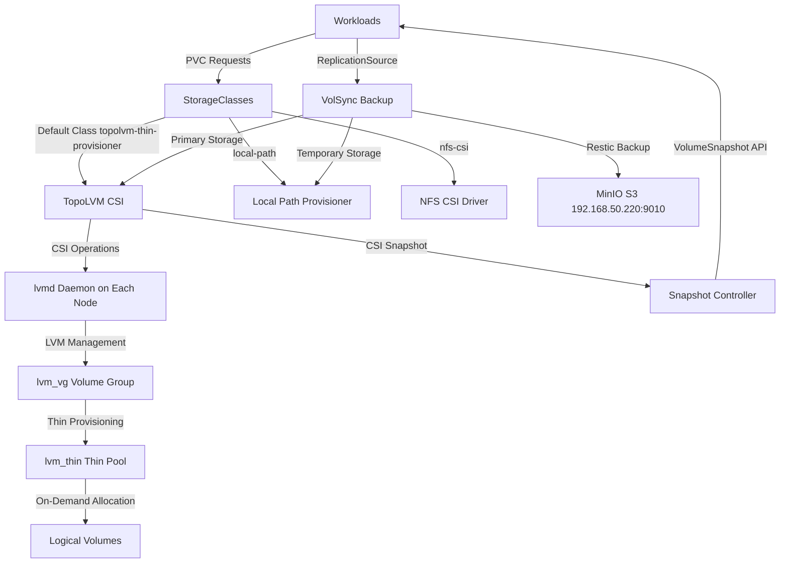
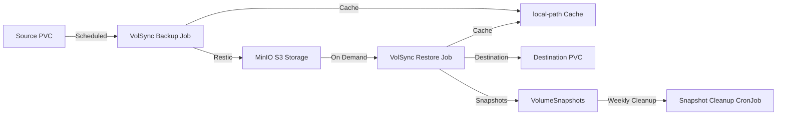

# Storage Architecture

The cluster's storage layer provides multiple provisioning options optimized for different workload requirements. The infrastructure combines high-performance local block storage via TopoLVM with LVM thin provisioning, automated backup/replication via VolSync, CSI snapshot support, NFS for network-attached storage, and host-local provisioning for smaller workloads.

## Storage Layer Architecture



*Figure: Storage layer architecture showing provisioning flow from workloads through storage classes to underlying storage implementations, with VolSync backup integration.*

## Component Deployment Order

Storage components deploy in strict dependency order to ensure proper initialization:

1. **snapshot-controller** deploys first, providing the VolumeSnapshot API and CRDs
2. **TopoLVM** deploys second, depending on snapshot-controller for CSI snapshot support
3. **local-path-provisioner** deploys independently for host-local storage
4. **VolSync** deploys after TopoLVM, depending on storage classes and CSI driver
5. **NFS CSI** deploys independently for network-attached storage

All components deploy to the `storage` namespace with standardized labels and resource management through Flux Kustomizations.

## TopoLVM: Primary Block Storage

TopoLVM serves as the cluster's default storage provisioner, providing high-performance local block storage through LVM thin provisioning. It combines the flexibility of Kubernetes CSI with the efficiency of LVM thin pools.

### Architecture

TopoLVM operates with an embedded lvmd daemon running on each node, managed by the TopoLVM controller:

- **Controller Deployment**: Single replica (`replicaCount: 1`) with Recreate update strategy and no anti-affinity for single-node cluster compatibility
- **Embedded lvmd**: Each node runs an embedded lvmd daemon (`lvmdEmbedded: true`) that manages LVM operations locally
- **CSI Driver**: TopoLVM CSI driver implements the Kubernetes CSI interface for volume provisioning
- **Metrics**: Prometheus metrics enabled on nodes for monitoring volume operations

### Single-Node Cluster Configuration

The TopoLVM deployment is optimized for single-node clusters to prevent upgrade failures. Default TopoLVM chart settings include pod anti-affinity rules and `replicaCount: 2`, which causes rolling upgrades to fail in single-node environments when the new replica cannot schedule.

The deployment prevents this through three configuration overrides:

- **Replica Count**: Set to 1 to prevent scheduling conflicts
- **Anti-Affinity**: Disabled (`affinity: ""`) to allow single-node scheduling
- **Update Strategy**: Recreate ensures old pod is deleted before new pod creation

### LVM Thin Pool Configuration

The storage infrastructure relies on a manually configured LVM setup that must be completed before TopoLVM can provision volumes. The manual LVM formatting process is documented in `lvm-format-manual.yaml`, which provides a privileged pod for disk initialization.

#### LVM Setup Procedure

```bash
# Install required tools in the privileged pod
apk add --no-cache findutils nvme-cli lvm2

# Wipe the disk (optional, for clean state)
nvme format --lbaf=0 /dev/disk/nvme0n1 --force
nvme format --block-size=4096 /dev/disk/nvme0n1 --force

# Create physical volume
pvcreate /dev/nvme0n1

# Create volume group for TopoLVM
vgcreate lvm_vg /dev/nvme0n1
vgchange -a y lvm_vg

# Create thin pool using all available space
lvcreate --thinpool -l 100%FREE -n lvm_thin lvm_vg
```

This setup creates:
- **Physical Volume**: `/dev/nvme0n1` as the base block device
- **Volume Group**: `lvm_vg` containing the physical volume
- **Thin Pool**: `lvm_thin` using 100% of free space for on-demand allocation

### Device Class Configuration

TopoLVM uses a single device class configured for thin provisioning:

- **Device Class Name**: `thin`
- **Volume Group**: `lvm_vg`
- **Thin Pool**: `lvm_thin`
- **Spare Capacity**: 10 GB reserved for metadata and operations
- **Overprovision Ratio**: 10.0 (allows provisioning up to 10x physical capacity)
- **Type**: Thin (allocates space on-demand as data is written)

The thin pool design enables efficient space utilization by allocating physical storage only as data is written, while the overprovision ratio allows the cluster to provision more logical storage than physically available (suitable for workloads that don't use full capacity simultaneously).

### Storage Class: topolvm-thin-provisioner

The default storage class provides these capabilities:

- **Filesystem**: XFS (high-performance, robust for databases)
- **Binding Mode**: Immediate (provisions before pod scheduling)
- **Volume Expansion**: Enabled (allows PVC resize without data loss)
- **Default Class**: Yes (used when no storage class specified)
- **Device Class Parameter**: `topolvm.io/device-class: thin`

Example usage in workloads:

```yaml
apiVersion: v1
kind: PersistentVolumeClaim
metadata:
  name: my-data
spec:
  storageClassName: topolvm-thin-provisioner
  accessModes:
    - ReadWriteOnce
  resources:
    requests:
      storage: 10Gi
```

### Volume Snapshot Support

TopoLVM integrates with the snapshot-controller for CSI volume snapshots:

- **Snapshot Class**: `topolvm-thin-provisioner`
- **Driver**: `topolvm.io`
- **Deletion Policy**: Delete (snapshots deleted when VolumeSnapshot resource deleted)
- **Default**: Yes (used when no snapshot class specified)

Snapshots enable instant point-in-time copies of volumes for backup or cloning operations, leveraging LVM's snapshot capabilities at the storage layer.

## VolSync: Backup and Replication

VolSync provides asynchronous backup and replication capabilities for Kubernetes persistent volumes, supporting both scheduled backups and manual restore operations through Taskfile task helpers.

### Architecture

VolSync operates through two custom resources that define backup and restore operations:

- **ReplicationSource**: Defines scheduled backup operations from a source PVC
- **ReplicationDestination**: Defines restore operations to a destination PVC

Both resources use the Restic format for efficient, deduplicated backups with support for retention policies.

### Backup Configuration (ReplicationSource)

Workloads define backup schedules through ReplicationSource resources. The nextcloud application provides a representative example:

```yaml
apiVersion: volsync.backube/v1alpha1
kind: ReplicationSource
metadata:
  name: nextcloud-nfs
spec:
  sourcePVC: nextcloud-nfs
  trigger:
    schedule: "0 */6 * * *"  # Every 6 hours
  restic:
    copyMethod: Direct
    storageClassName: topolvm-thin-provisioner
    accessModes: [ReadWriteOnce]
    pruneIntervalDays: 7
    repository: nextcloud-nfs-volsync-secret
    moverSecurityContext:
      runAsUser: 1000
      runAsGroup: 1000
      fsGroup: 1000
    cacheCapacity: 2Gi
    cacheStorageClassName: local-path
    retain:
      hourly: 24
      daily: 7
      weekly: 5
```

Key configuration elements:

- **Schedule**: Runs every 6 hours (configurable per application)
- **Copy Method**: Direct (copies data directly without intermediate snapshot)
- **Cache Storage**: Uses local-path provisioner for temporary scratch space during backups
- **Repository**: S3-compatible storage (MinIO) via external secret
- **Retention**: Keeps 24 hourly, 7 daily, and 5 weekly backups
- **Prune Interval**: Runs repository pruning every 7 days to remove expired snapshots

### Restore Configuration (ReplicationDestination)

Restore operations use ReplicationDestination for one-time or recurring restores. The template used by Taskfile helpers:

```yaml
apiVersion: volsync.backube/v1alpha1
kind: ReplicationDestination
metadata:
  name: ${job}
  namespace: ${ns}
spec:
  trigger:
    manual: restore-once
  restic:
    repository: ${app}-volsync-secret
    destinationPVC: ${claim}
    copyMethod: Direct
    storageClassName: topolvm-thin-provisioner
    previous: ${previous}  # Number of snapshots to restore
    moverSecurityContext:
      runAsUser: 1000
      runAsGroup: 1000
      fsGroup: 1000
```

The restore configuration uses the `previous` field to specify how many recent snapshots to restore, allowing point-in-time recovery.

### Storage Backend

VolSync backups are stored in MinIO S3-compatible storage:

- **Endpoint**: `http://192.168.50.220:9010`
- **Path**: `s3://volsync/dev/${APP}`
- **Compression**: Restic's built-in compression
- **Credentials**: Managed via External Secrets Operator from Bitwarden

The MinIO storage provides durable, scalable backup storage accessible from any cluster for disaster recovery scenarios.

### Taskfile Helpers

VolSync provides Taskfile helpers in `.taskfiles/volsync/Taskfile.yaml` for common backup/restore operations:

#### Manual Backup

```bash
task volsync:snapshot NS=default APP=myapp
```

Triggers an immediate on-demand backup by patching the ReplicationSource with a manual trigger timestamp, then waits for the backup Job to complete.

#### Restore Workflow

```bash
task volsync:restore NS=default APP=myapp previous=2
```

The restore task automates the complete restore sequence:

1. **Suspend**: Suspends Flux Kustomization and HelmRelease, scales down application
2. **Wipe**: Deletes all existing data from the PVC using a privileged Job
3. **Restore**: Creates ReplicationDestination with specified `previous` snapshot count
4. **Resume**: Resumes Flux resources and scales application back up

#### Backup Listing

```bash
task volsync:list NS=default APP=myapp
```

Creates a temporary Job to list available snapshots in the Restic repository, displaying snapshot metadata including timestamps and sizes.

#### Repository Unlock

```bash
task volsync:unlock
```

Unlocks all Restic repositories across all namespaces by patching ReplicationSources with the current Unix timestamp as the unlock value, resolving locked repository states.

#### VolSync State Control

```bash
task volsync:state-suspend   # Suspend VolSync components
task volsync:state-resume    # Resume VolSync components
```

Suspends or resumes the Flux Kustomization, HelmRelease, and VolSync deployment replicas for maintenance operations.

### Snapshot Cleanup

VolSync destination snapshots accumulate over time and require periodic cleanup. A CronJob runs weekly to delete snapshots older than 7 days:

```yaml
schedule: "0 2 * * 0"  # Sunday 2 AM
THRESHOLD_DAYS: 7
```

The cleanup job identifies snapshots by name pattern (`volsync-volsync-dst-`), checks their creation timestamps, and deletes those exceeding the retention threshold. This prevents unbounded storage consumption from temporary restore snapshots.



*Figure: VolSync backup and restore flow showing scheduled backups to MinIO, on-demand restores with snapshot intermediates, and periodic cleanup.*

### Dependencies

VolSync depends on TopoLVM for primary storage:

```yaml
dependsOn:
  - name: topolvm
    namespace: storage
```

This ensures TopoLVM CSI and storage classes are available before VolSync attempts backup or restore operations.

## Snapshot Controller

The snapshot-controller provides Kubernetes volume snapshot functionality, enabling instant point-in-time copies of persistent volumes.

### Capabilities

- **Version**: 5.2.0 from Piraeus charts
- **CRD Management**: CreateReplace strategy for CRD upgrades
- **Default Snapshot Class**: `topolvm-thin-provisioner` marked as cluster default
- **ServiceMonitor**: Prometheus metrics enabled for monitoring
- **Webhook**: Disabled (validation webhook not required for this deployment)

The snapshot-controller integrates with CSI drivers (TopoLVM, NFS) to create snapshots through the Kubernetes VolumeSnapshot API. It deploys without dependencies and must be available before TopoLVM to ensure snapshot support during volume provisioning.

## NFS CSI Driver

The NFS CSI driver provides network-attached storage capabilities for workloads requiring shared access to the same volume from multiple pods.

### Configuration

- **Version**: 4.13.4
- **Replicas**: 1 controller (single-node compatible)
- **External Snapshotter**: Disabled (snapshot-controller handles snapshots)

The NFS driver enables provisioning of PVs backed by NFS shares, supporting ReadWriteMany access modes for workloads that need concurrent read/write access from multiple pods. This is particularly useful for:

- Media libraries (Jellyfin, Navidrome)
- Document stores requiring multi-writer access
- Large datasets that don't require high IOPS

## Local Path Provisioner

The local-path-provisioner provides simple host-local storage for workloads that don't require the full capabilities of TopoLVM or need smaller volumes.

### Configuration

- **Version**: 0.0.37 from Containeroo charts
- **Default Path**: `/var/mnt/local-path-provisioner`
- **Node Path Map**: Single path for all non-listed nodes

This provisioner creates directories on the host node and mounts them into pods, providing fast local storage without LVM overhead. It's commonly used for:

- VolSync cache storage during backup/restore operations
- Temporary scratch space for data processing
- Smaller application data volumes that don't require thin provisioning

## Storage Class Selection

Workloads choose the appropriate storage class based on their requirements:

| Storage Class | Use Case | Access Mode | Features |
|--------------|----------|-------------|----------|
| `topolvm-thin-provisioner` | Primary storage for databases, applications | ReadWriteOnce | Thin provisioning, snapshots, expansion, XFS |
| `local-path` | Cache, temporary storage, small volumes | ReadWriteOnce | Fast host-local, no snapshots |
| `nfs-csi` | Shared storage, multi-writer workloads | ReadWriteMany | Network-attached, concurrent access |

## Operational Considerations

### LVM Management

The LVM volume group and thin pool must be manually created before TopoLVM can provision volumes. The `lvm-format-manual.yaml` provides a privileged pod for executing LVM commands:

```bash
# Enter the privileged pod
kubectl exec -it lvm-format-manual -- sh

# Install LVM tools
apk add --no-cache lvm2 nvme-cli

# Format and setup LVM
pvcreate /dev/nvme0n1
vgcreate lvm_vg /dev/nvme0n1
lvcreate --thinpool -l 100%FREE -n lvm_thin lvm_vg
```

After setup, TopoLVM's lvmd daemon will automatically detect the volume group and begin provisioning volumes on demand.

### Monitoring

Storage components expose Prometheus metrics for monitoring:

- **TopoLVM**: Node-level metrics for LVM operations, volume provisioning, and thin pool utilization
- **Snapshot Controller**: Snapshot creation, deletion, and error rates
- **VolSync**: Backup/restore job status, repository sizes, and mover performance

Monitor thin pool utilization to prevent overprovisioning issues, and track snapshot accumulation to ensure cleanup jobs are functioning correctly.

### Backup Verification

Regular backup verification ensures data recoverability:

```bash
# List snapshots for an application
task volsync:list NS=default APP=myapp

# Trigger test backup
task volsync:snapshot NS=default APP=myapp

# Verify MinIO storage contains backups
```

VolSync's retention policy (24 hourly, 7 daily, 5 weekly) provides multiple recovery points while the cleanup CronJob prevents unbounded snapshot growth.
