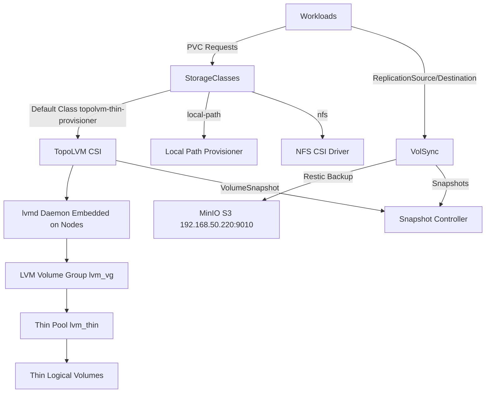

# Storage Architecture

The cluster's storage layer provides multiple provisioning options optimized for different workload requirements: high-performance local block storage via TopoLVM with LVM thin provisioning, automated backup/replication via VolSync, volume snapshot capabilities, NFS for network-attached storage, and host-local provisioning for smaller workloads.

## Storage Layer Overview



*Figure: Storage layer architecture showing provisioning flow from workloads through storage classes to underlying storage implementations, and VolSync backup integration with MinIO.*

## Component Deployment Order

Storage components deploy in strict dependency order to ensure proper initialization:

1. **snapshot-controller** deploys first, providing the VolumeSnapshot API and CRDs
2. **TopoLVM** deploys second, depending on snapshot-controller for CSI snapshot support
3. **VolSync** deploys third, depending on TopoLVM for storage classes and CSI driver
4. **NFS CSI** and **local-path-provisioner** deploy independently

All components deploy to the `storage` namespace with standardized labels and resource management through Flux Kustomizations.

## TopoLVM: Primary Block Storage

TopoLVM serves as the cluster's default storage provisioner, providing high-performance local block storage through LVM thin provisioning. It combines the flexibility of Kubernetes CSI with the efficiency of LVM thin pools.

### Architecture

TopoLVM operates with an embedded lvmd daemon running on each node, managed by the TopoLVM controller:

- **Controller Deployment**: Single replica (`replicaCount: 1`) with Recreate update strategy and anti-affinity disabled for single-node cluster compatibility
- **Embedded lvmd**: Each node runs an embedded lvmd daemon (`lvmdEmbedded: true`) that manages LVM operations locally
- **CSI Driver**: TopoLVM CSI driver implements the Kubernetes CSI interface for volume provisioning
- **Metrics**: Prometheus metrics enabled for monitoring volume operations

### Single-Node Cluster Configuration

The TopoLVM deployment is optimized for single-node clusters to prevent upgrade failures. Default TopoLVM chart settings include pod anti-affinity rules and `replicaCount: 2`, which causes rolling upgrades to fail in single-node environments when the new replica cannot schedule.

The deployment prevents this through three configuration overrides:

- **Replica Count**: 1 (prevents scheduling conflicts)
- **Anti-Affinity**: Disabled (`affinity: ""`)
- **Update Strategy**: Recreate (ensures old pod deleted before new pod created)

This configuration prevents the common single-node issue where default anti-affinity rules prevent controller pod scheduling during upgrades.

### LVM Configuration

The storage infrastructure relies on a manually configured LVM setup that must be completed before TopoLVM can provision volumes:

```bash
# Physical volume creation
pvcreate /dev/nvme0n1

# Volume group for TopoLVM
vgcreate lvm_vg /dev/nvme0n1
vgchange -a y lvm_vg

# Thin pool using all available space
lvcreate --thinpool -l 100%FREE -n lvm_thin lvm_vg
```

The manual LVM formatting process is documented in `lvm-format-manual.yaml`, which provides a privileged pod for disk initialization.

### Device Class Configuration

TopoLVM uses a single device class configured for thin provisioning:

- **Device Class Name**: `thin`
- **Volume Group**: `lvm_vg`
- **Thin Pool**: `lvm_thin`
- **Spare Capacity**: 10 GB reserved for metadata and operations
- **Overprovision Ratio**: 10.0 (allows provisioning up to 10x physical capacity)
- **Type**: Thin (allocates space on-demand)

The thin pool design enables efficient space utilization by allocating physical storage only as data is written, while the overprovision ratio allows the cluster to provision more logical storage than physically available (suitable for workloads that don't use full capacity simultaneously).

### Storage Class: topolvm-thin-provisioner

The default storage class provides these capabilities:

- **Filesystem**: XFS (high-performance, robust for databases)
- **Binding Mode**: Immediate (provisions before pod scheduling)
- **Volume Expansion**: Enabled (allows PVC resize without data loss)
- **Default Class**: Yes (used when no storage class specified)
- **Device Class**: `thin`

Example usage from CloudNative-PG cluster:

```yaml
storage:
  size: 10Gi
  storageClass: topolvm-thin-provisioner
```

### Volume Snapshot Support

TopoLVM integrates with the snapshot-controller for volume snapshots:

- **Snapshot Class**: `topolvm-thin-provisioner`
- **Driver**: `topolvm.io`
- **Deletion Policy**: Delete (snapshots deleted when VolumeSnapshot resource deleted)
- **Default**: Yes (used when no snapshot class specified)

Snapshots enable instant point-in-time copies of volumes for backup or cloning operations.

## VolSync: Backup and Replication

VolSync provides asynchronous backup and replication capabilities for Kubernetes persistent volumes, supporting both scheduled backups and manual restore operations through Taskfile task helpers.

### Architecture

VolSync operates through two custom resources that define backup and restore operations:

- **ReplicationSource**: Defines scheduled backup operations from a source PVC
- **ReplicationDestination**: Defines restore operations to a destination PVC

Both resources use the Restic format for efficient, deduplicated backups with support for retention policies.

### Backup Configuration (ReplicationSource)

Workloads define backup schedules through ReplicationSource resources:

```yaml
spec:
  sourcePVC: "${APP}"
  trigger:
    schedule: "0 */6 * * *"  # Every 6 hours
  restic:
    copyMethod: Direct
    storageClassName: topolvm-thin-provisioner
    accessModes: [ReadWriteOnce]
    pruneIntervalDays: 7
    repository: "${APP}-volsync-secret"
    cacheCapacity: 1Gi
    cacheStorageClassName: local-path
    retain:
      hourly: 24
      daily: 7
      weekly: 5
```

Key configuration elements:

- **Schedule**: Runs every 6 hours (configurable per application)
- **Copy Method**: Direct (copies data directly without intermediate snapshot)
- **Cache Storage**: Uses local-path provisioner for temporary scratch space
- **Repository**: S3-compatible storage (MinIO) via external secret
- **Retention**: Keeps 24 hourly, 7 daily, and 5 weekly backups

### Restore Configuration (ReplicationDestination)

Restore operations use ReplicationDestination for one-time or recurring restores:

```yaml
spec:
  restic:
    accessModes: [ReadWriteOnce]
    cacheCapacity: 1Gi
    cacheStorageClassName: local-path
    capacity: 1Gi
    cleanupCachePVC: true
    cleanupTempPVC: true
    enableFileDeletion: true
    copyMethod: Snapshot
    moverSecurityContext:
      runAsUser: 1000
      runAsGroup: 1000
      fsGroup: 1000
    repository: "${APP}-volsync-secret"
    storageClassName: topolvm-thin-provisioner
    volumeSnapshotClassName: topolvm-thin-provisioner
  trigger:
    manual: restore-once
```

The restore configuration includes automatic cleanup of cache and temporary PVCs after completion, preventing resource leaks.

### Storage Backend

VolSync backups are stored in MinIO S3-compatible storage:

- **Endpoint**: `http://192.168.50.220:9010`
- **Path**: `s3://volsync/dev/${APP}`
- **Compression**: bzip2 (for data and WAL in database backups)
- **Credentials**: Managed via External Secrets Operator from Bitwarden

The MinIO storage provides durable, scalable backup storage accessible from any cluster for disaster recovery scenarios.

### Taskfile Helpers

VolSync provides Taskfile helpers in `.taskfiles/volsync/Taskfile.yaml` for common backup/restore operations:

#### Manual Backup

```bash
task volsync:snapshot NS=default APP=myapp
```

Triggers an immediate on-demand backup by patching the ReplicationSource with a manual trigger timestamp.

#### Restore Workflow

```bash
task volsync:restore NS=default APP=myapp previous=2
```

The restore task automates the complete restore sequence:

1. **Suspend**: Suspends Flux Kustomization and HelmRelease, scales down application controller
2. **Wipe**: Deletes all existing data from the PVC using a privileged Job
3. **Restore**: Creates ReplicationDestination with specified `previous` snapshot count
4. **Resume**: Resumes Flux resources and scales application back up

#### Backup Listing

```bash
task volsync:list NS=default APP=myapp
```

Creates a temporary Job to list available snapshots in the Restic repository, displaying snapshot metadata.

#### Unlock Repository

```bash
task volsync:unlock
```

Unlocks all Restic repositories across all namespaces by patching ReplicationSources with the current Unix timestamp as the unlock value.

#### VolSync State Control

```bash
task volsync:state-suspend   # Suspend VolSync components
task volsync:state-resume    # Resume VolSync components
```

Suspends or resumes the Flux Kustomization, HelmRelease, and VolSync deployment replicas for maintenance operations.

### Snapshot Cleanup

VolSync destination snapshots accumulate over time and require periodic cleanup. A CronJob runs weekly to delete snapshots older than 7 days:

```yaml
schedule: "0 2 * * 0"  # Sunday 2 AM
THRESHOLD_DAYS: 7
```

The cleanup job identifies snapshots by name pattern (`volsync-volsync-dst-`) and deletes those exceeding the retention threshold, preventing unbounded storage consumption.

### Dependencies

VolSync depends on TopoLVM for primary storage:

```yaml
dependsOn:
  - name: topolvm
    namespace: storage
```

This ensures TopoLVM CSI and storage classes are available before VolSync attempts backup or restore operations.

### Common VolSync Component Pattern

Applications using VolSync follow a common component pattern visible in the cluster:

1. **ExternalSecret**: Creates `${APP}-volsync-secret` from Bitwarden credentials
2. **ReplicationSource**: Defines scheduled backup from `${APP}` PVC every 6 hours
3. **ReplicationDestination**: Template for manual restore operations (created on-demand via Taskfile)

The pattern standardizes backup configuration across applications while allowing per-app customization of security contexts, storage classes, and retention policies through template variables in `.taskfiles/volsync/templates/`.

## Snapshot Controller

The snapshot-controller provides Kubernetes volume snapshot functionality, enabling instant point-in-time copies of persistent volumes.

### Capabilities

- **Version**: 5.2.0 from Piraeus charts
- **CRD Management**: CreateReplace strategy for CRD upgrades
- **Default Snapshot Class**: `topolvm-thin-provisioner` marked as cluster default
- **ServiceMonitor**: Prometheus metrics enabled for monitoring
- **Webhook**: Disabled (validation webhook not required for this deployment)

The snapshot-controller integrates with CSI drivers (TopoLVM, NFS) to create snapshots through the Kubernetes VolumeSnapshot API.

## NFS CSI Driver

The NFS CSI driver provides network-attached storage capabilities for workloads requiring shared access to the same volume from multiple pods.

### Configuration

- **Version**: 4.13.4
- **Replicas**: 1 controller (single-node compatible)
- **External Snapshotter**: Disabled (snapshot-controller handles snapshots)

The NFS driver enables provisioning of PVs backed by NFS shares, supporting ReadWriteMany access modes for workloads that need concurrent read/write access from multiple pods.

## Local Path Provisioner

The local-path-provisioner provides simple host-local storage for workloads that don't require the full capabilities of TopoLVM or need smaller volumes.

### Configuration

- **Version**: 0.0.37
- **Chart Source**: Containeroo charts
- **Default Path**: `/var/mnt/local-path-provisioner`

This provisioner creates directories on the host node and mounts them into pods, providing fast local storage without LVM overhead. It's commonly used for:

- VolSync cache storage during backup/restore operations
- Temporary scratch space for data processing
- Smaller application data volumes that don't require thin provisioning

## Storage Class Selection

Workloads choose the appropriate storage class based on their requirements:

| Storage Class | Use Case | Access Mode | Features |
|--------------|----------|-------------|----------|
| `topolvm-thin-provisioner` | Primary storage for databases, applications | ReadWriteOnce | Thin provisioning, snapshots, expansion |
| `local-path` | Cache, temporary storage, small volumes | ReadWriteOnce | Fast host-local, no snapshots |
| `nfs` | Shared storage, multi-writer workloads | ReadWriteMany | Network-attached, concurrent access |

## Operational Considerations

### LVM Management

The LVM volume group and thin pool must be manually created before TopoLVM can provision volumes. The `lvm-format-manual.yaml` provides a privileged pod for executing LVM commands:

```bash
# Enter the privileged pod
kubectl exec -it lvm-format-manual -- sh

# Install LVM tools
apk add --no-cache lvm2 nvme-cli

# Format and setup LVM
pvcreate /dev/nvme0n1
vgcreate lvm_vg /dev/nvme0n1
lvcreate --thinpool -l 100%FREE -n lvm_thin lvm_vg
```

### Volume Expansion

TopoLVM supports online volume expansion through the `allowVolumeExpansion: true` storage class setting. Workloads can resize their PVCs without pod restart:

```bash
kubectl patch pvc my-pvc -p '{"spec":{"resources":{"requests":{"storage":"20Gi"}}}}'
```

### Backup Verification

VolSync backups should be verified periodically by:

1. Checking ReplicationSource status for successful backups
2. Confirming objects exist in MinIO storage
3. Testing restore procedure through ReplicationDestination
4. Validating restored data integrity

Use the Taskfile helpers for backup listing and restore testing:

```bash
task volsync:list NS=default APP=myapp
task volsync:restore NS=default APP=myapp-test previous=1
```

### Monitoring

Storage components expose Prometheus metrics:

- **TopoLVM**: Volume provisioning, thin pool utilization
- **VolSync**: Backup/restore operations, transfer sizes
- **Snapshot Controller**: Snapshot creation/deletion rates

These metrics enable monitoring storage health, capacity planning, and backup reliability.

### Troubleshooting TopoLVM Single-Node Issues

In single-node clusters, TopoLVM upgrades may fail due to pod anti-affinity rules preventing new controller pods from scheduling. Symptoms include:

- Controller pod stuck in `Pending` state with `node(s) didn't satisfy existing pods anti-affinity rules`
- HelmRelease timeout with `context deadline exceeded`
- Kustomization stuck in `Stalled` state

The current deployment prevents this by:
- Setting `replicaCount: 1` to prevent multi-replica scheduling conflicts
- Disabling anti-affinity with `affinity: ""`
- Using `Recreate` update strategy to force old pod deletion before new pod creation

If issues persist, manually delete pending pods or stale ReplicaSets:

```bash
kubectl -n storage delete pod topolvm-controller-xxxxxxxx
kubectl -n storage scale rs topolvm-controller-xxxxxxxx --replicas=0
```

Then reconcile the Flux resources:

```bash
flux reconcile kustomization topolvm -n storage --with-source
flux reconcile helmrelease topolvm -n storage
```
