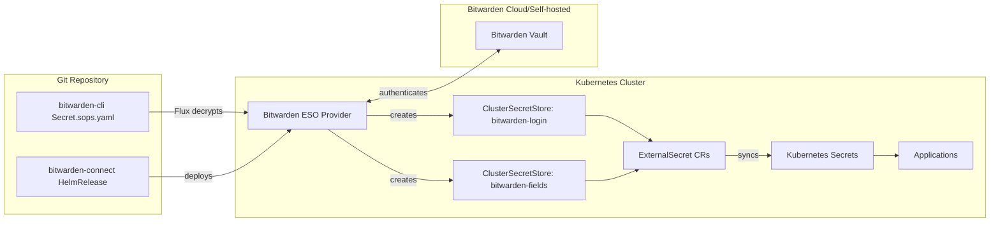

# Bitwarden Secrets Integration

The cluster uses Bitwarden as the external secrets provider for runtime secret management. The External Secrets Operator syncs secrets from Bitwarden into Kubernetes Secrets, which applications consume at runtime. This integration provides a centralized, secure secret management layer that separates Git repository encryption from runtime secret injection.

## Architecture



*Figure: Secret synchronization flow from Bitwarden to Kubernetes workloads*

## Components

### Bitwarden ESO Provider

The Bitwarden ESO Provider is deployed via Helm in the `external-secrets` namespace as `bitwarden-cli`. This chart deploys the Bitwarden External Secrets Operator provider that acts as the bridge between External Secrets Operator and the Bitwarden API.

**Chart Configuration** (`kubernetes/apps/external-secrets/bitwarden-connect/app/helmrelease.yaml#L4-L15`)
- Chart: `bitwarden-eso-provider` version 1.2.0
- Source: Custom Helm repository from `gh-pages` branch raw index
- Health checks: Extended liveness probe (300s period, 30 failure threshold, 15s timeout)
- CRD installation: Enabled (`installCRDs: true`)
- Service monitors: Enabled for provider, webhook, and cert controller (1m scrape intervals)

The provider authenticates to Bitwarden using credentials from an existing Kubernetes Secret:

**Authentication** (`kubernetes/apps/external-secrets/bitwarden-connect/app/helmrelease.yaml#L30-L46`)
- References existing Secret: `bitwarden-cli`
- Secret key mappings:
  - `BW_PASSWORD`: Bitwarden master password (required)
  - `BW_USERNAME`: Bitwarden email/app ID (required, prevents infinite login email notifications)
  - `BW_HOST`: Bitwarden server hostname (required, supports self-hosted instances)
  - `BW_CLIENTID` and `BW_CLIENTSECRET`: Optional OAuth credentials (commented out)

### Bitwarden Credentials Secret

The Bitwarden CLI credentials are stored in a SOPS-encrypted Secret at `kubernetes/apps/external-secrets/bitwarden-connect/app/secret.sops.yaml`:

**Secret Structure** (`kubernetes/apps/external-secrets/bitwarden-connect/app/secret.sops.yaml#L1-L12`)
- Name: `bitwarden-cli`
- Encrypted fields: `BW_HOST`, `BW_USERNAME`, `BW_PASSWORD`, `BW_CLIENTID`, `BW_CLIENTSECRET`
- Encryption: age-encrypted with the cluster's age recipient
- Decryption: Flux decrypts this secret during reconciliation using the `sops-age` key

Flux Kustomization handles decryption (`kubernetes/apps/external-secrets/bitwarden-connect/ks.yaml#L15-L18`):
```yaml
decryption:
  provider: sops
  secretRef:
    name: sops-age
```

### ClusterSecretStore Resources

The Bitwarden ESO Provider chart automatically creates two ClusterSecretStore resources that are cluster-wide and accessible from any namespace:

1. **bitwarden-login**: Extracts secrets from Bitwarden login credentials (username/password properties) using JSONPath `login.<property>`
2. **bitwarden-fields**: Extracts secrets from Bitwarden custom fields (arbitrary key-value pairs) using JSONPath `fields[?(@.name=="<property>")].value`

These stores are created by the Helm chart's CRDs and are referenced by ExternalSecret resources throughout the cluster.

### External Secrets Operator

The External Secrets Operator is deployed via Helm in the `external-secrets` namespace using the `external-secrets` chart version 2.8.0 with CRD installation enabled and service monitors for the webhook and cert controller (`kubernetes/apps/external-secrets/external-secrets/app/helmrelease.yaml`).

## Secret Synchronization

### ExternalSecret Resource Patterns

Applications define ExternalSecret resources that specify which Bitwarden items to sync and how to transform them. The External Secrets Operator continuously watches these resources and keeps the target Kubernetes Secrets synchronized.

#### Login Credentials Pattern

Use the `bitwarden-login` ClusterSecretStore for username/password authentication.

**Basic Example - AdGuard DNS** (`kubernetes/apps/network/adguard-dns/app/externalsecret.yaml#L1-L26`)
```yaml
spec:
  secretStoreRef:
    kind: ClusterSecretStore
    name: bitwarden-login
  target:
    name: adguard-dns-secret
    template:
      engineVersion: v2
      data:
        ADGUARD_USER: "{{ .username }}"
        ADGUARD_PASSWORD: "{{.password }}"
  data:
    - secretKey: password
      remoteRef:
        key: adguard-home
        property: password
    - secretKey: username
      remoteRef:
        key: adguard-home
        property: username
```

**Applicable For**
- Database credentials
- Service account authentication
- Basic auth for applications
- Any credentials stored as Bitwarden login username/password

#### Custom Fields Pattern

Use the `bitwarden-fields` ClusterSecretStore for structured data stored in Bitwarden custom fields.

**Example - Jellyseerr API Key** (`kubernetes/apps/default/jellyseerr/app/externalsecret.yaml#L42-L49`)
```yaml
- secretKey: JELLYSEERR_API_KEY
  sourceRef:
    storeRef:
      name: bitwarden-fields
      kind: ClusterSecretStore
  remoteRef:
    key: 9340af49-3add-4274-b2a0-7e6d16c84416
    property: JELLYSEERR_API_KEY
```

**Applicable For**
- API keys and tokens
- Application encryption keys
- Multi-part secrets (e.g., OAuth credentials)
- Configuration values that don't fit username/password pattern

#### Mixed Store Pattern

ExternalSecret resources can reference both ClusterSecretStore types in a single resource by using `sourceRef.storeRef` to override the default store for specific data entries.

**Example - Growth Tracker** (`kubernetes/apps/default/growth-tracker/app/externalsecret.yaml#L1-L95`)
- Uses `bitwarden-login` for database and service credentials (username/password)
- Uses `bitwarden-fields` for App Store Connect credentials (custom fields)
- Combines multiple Bitwarden items into a single Kubernetes Secret
- Demonstrates complex secret composition with template synthesis

The growth-tracker example shows the key distinction between the two stores (`kubernetes/apps/default/growth-tracker/app/externalsecret.yaml#L60-L95`):
- `bitwarden-login`: Uses JSONPath `login.<property>` to access username/password
- `bitwarden-fields`: Uses JSONPath `fields[?(@.name=="<property>")].value` to access custom fields

#### SMTP Relay Mixed Pattern

The SMTP relay ExternalSecret demonstrates using both stores for a single application (`kubernetes/apps/network/smtp-relay/app/externalsecret.yaml`):
- Uses `bitwarden-fields` for the SMTP server hostname
- Uses `bitwarden-login` for SMTP username and password

### Secret Template Engine

ExternalSecret resources use the template engine to transform Bitwarden data into application-specific formats:

**Template Capabilities**
- Combine multiple remote properties into single environment variables
- Construct connection strings (e.g., PostgreSQL URLs)
- Perform variable substitution within templates
- Support for `engineVersion: v2` template syntax

**PostgreSQL Connection String Example** (`kubernetes/apps/default/growth-tracker/app/externalsecret.yaml#L16-L17`):
```yaml
DATABASE_URL: "postgres://{{ .GT_POSTGRES_USER }}:{{ .GT_POSTGRES_PASS }}@dev-postgres16-rw.database.svc.cluster.local:5432/growth_tracker?sslmode=disable"
```

**Multi-Item Synthesis Example** (`kubernetes/apps/default/growth-tracker/app/externalsecret.yaml`):
- Combines database credentials, Umami credentials, and App Store Connect credentials
- Transforms them into application-specific environment variables
- References multiple Bitwarden items: `cloudnative-pg`, `growth-tracker-db`, `umami.tomyail.com`, `growth-tracker-asc`

## Deployment Dependencies

Applications that depend on Bitwarden-synchronized secrets must declare dependencies on the Bitwarden integration to ensure proper startup order:

**Dependency Declaration** (`kubernetes/apps/network/tailscale/ks.yaml#L22-L24`):
```yaml
dependsOn:
  - name: bitwarden-connect
    namespace: external-secrets
```

This pattern is used consistently across applications:
- `tailscale` depends on `bitwarden-connect`
- `adguard-dns` depends on `bitwarden-connect`
- `smtp-relay` depends on `bitwarden-connect`

The dependency ensures that:
1. The Bitwarden ESO Provider is deployed and healthy
2. ClusterSecretStore resources are created
3. Initial secret synchronization completes before application workloads start

## Operations

### Health Monitoring

The Bitwarden ESO Provider includes comprehensive health monitoring:

**Liveness Probe Configuration** (`kubernetes/apps/external-secrets/bitwarden-connect/app/helmrelease.yaml#L25-L29`)
- Initial delay: 20s
- Check period: 300s (5 minutes)
- Timeout: 15s
- Failure threshold: 30 (allows 150 minutes of Bitwarden API downtime before restart)

**Prometheus Monitoring**
- Provider service monitor: 1m scrape interval
- Webhook service monitor: 1m scrape interval
- Cert controller service monitor: 1m scrape interval

### Helm Repository

The Bitwarden ESO Provider chart is sourced from a custom Helm repository:

**Repository Configuration** (`kubernetes/flux/meta/repos/bitwarden-eso.yaml`)
- Name: `bitwarden-eso-provider`
- Namespace: `flux-system`
- URL: GitHub Pages from `gh-pages` branch raw index
- Note: The upstream repository is archived; this cluster uses the gh-pages branch raw index as the chart repository while chart tarballs are still pulled from archived GitHub releases

### Secret Rotation

Bitwarden secrets are automatically synchronized by External Secrets Operator:

1. When a secret changes in Bitwarden, the ESO Provider detects the change
2. External Secrets Operator updates the target Kubernetes Secret
3. Applications consuming the secret receive the updated value
4. For applications requiring restart on secret change, configure restart annotations or use a sidecar to watch for secret updates

No manual intervention is required for secret rotation after the initial setup. The synchronization interval is controlled by the ExternalSecret resource's refresh interval (if configured) or by the ESO Provider's polling behavior.

**Special Case - CloudNative PG** (`kubernetes/apps/database/cloudnative-pg/app/externalsecret.yaml#L13-L17`)
The CloudNative PG ExternalSecret includes a special label for automatic secret reload:
```yaml
template:
  engineVersion: v2
  metadata:
    labels:
      cnpg.io/reload: "true"
```

This label instructs the CloudNative PG operator to reload database connections when the secret changes, without requiring pod restart.

## Security Considerations

### Credential Storage

- Bitwarden CLI credentials are encrypted at rest in Git using SOPS + age
- The `bitwarden-cli` Secret exists only in the cluster, never in plain text in Git
- Flux decrypts the secret during reconciliation using the `sops-age` Secret
- The SOPS encryption uses `mac_only_encrypted: true` to preserve YAML structure

### Access Control

- ClusterSecretStore resources are cluster-scoped but access is controlled by Kubernetes RBAC
- The Bitwarden ESO Provider runs with minimal required permissions
- Each ExternalSecret can only access the specific Bitwarden items referenced in its `data` section
- Applications only receive the final Kubernetes Secret, not Bitwarden access

### Network Security

- The Bitwarden ESO Provider communicates with Bitwarden API over HTTPS
- For self-hosted Bitwarden instances, the `BW_HOST` field enables pointing to internal URLs
- All secret data is transmitted only between the provider and Bitwarden; Kubernetes Secrets store the synchronized values

### Audit Trail

- Bitwarden maintains audit logs of vault access
- Kubernetes Secret changes are tracked in the audit log
- ExternalSecret reconciliation events are visible in the ESO Operator logs

## Integration Patterns

### Database Credentials Pattern

Multiple applications use Bitwarden for database credentials:

**Common Pattern** (`kubernetes/apps/storage/nextcloud/app/externalsecret.yaml`)
- References database-specific Bitwarden item (e.g., `nextcloud-db`)
- Extracts `username` and `password` properties
- Transforms into `INIT_POSTGRES_USER` and `INIT_POSTGRES_PASS` environment variables
- Combines with superuser password from `cloudnative-pg` item

### Multi-Service Credential Pattern

Applications that require credentials for multiple services combine them into a single ExternalSecret:

**Example - CloudNative PG** (`kubernetes/apps/database/cloudnative-pg/app/externalsecret.yaml`)
- Combines PostgreSQL credentials from `cloudnative-pg` item
- Adds MinIO S3 credentials from `hot-minio` item
- Includes legacy credentials via `bitwarden-fields` for rotation scenarios

### OAuth Client Pattern

The Tailscale integration demonstrates OAuth client credential handling (`kubernetes/apps/network/tailscale/app/externalsecret.yaml`):
- Uses `bitwarden-login` store with OAuth client ID as `username`
- OAuth client secret stored as `password`
- Template transforms into `client_id` and `client_secret` keys

## Troubleshooting

### Common Issues

**1. Secret Synchronization Fails**
- Check Bitwarden ESO Provider logs: `kubectl logs -n external-secrets deployment/bitwarden-cli`
- Verify `bitwarden-cli` Secret exists and contains valid credentials
- Confirm Bitwarden API accessibility from the cluster
- Check that the referenced Bitwarden item name exists in your vault

**2. Application Fails to Start After Secret Sync**
- Verify ExternalSecret dependencies are declared in the application's Kustomization
- Check that ClusterSecretStore resources exist: `kubectl get clustersecretstore`
- Review ExternalSecret status: `kubectl get externalsecret -n <namespace> <name> -o yaml`
- Ensure target Secret was created: `kubectl get secret -n <namespace> <target-name>`

**3. Custom Fields Not Syncing**
- Confirm you're using `bitwarden-fields` ClusterSecretStore, not `bitwarden-login`
- Verify custom field names match exactly (case-sensitive)
- Check that the Bitwarden item type supports custom fields
- Use `sourceRef.storeRef` to override the default store if needed

**4. Liveness Probe Failures**
- The provider is configured with a 150-minute failure threshold for resilience
- Frequent failures may indicate Bitwarden API connectivity issues
- Consider increasing probe timeouts if Bitwarden API latency is consistently high

### Debug Commands

```bash
# Check Bitwarden ESO Provider status
kubectl get pods -n external-secrets -l app.kubernetes.io/name=bitwarden-cli

# View ClusterSecretStore resources
kubectl get clustersecretstore

# Inspect ExternalSecret synchronization status
kubectl get externalsecret -n <namespace> <name> -o yaml

# Check if target Secret exists and view its keys
kubectl get secret -n <namespace> <secret-name> -o jsonpath='{.data}' | jq 'keys'

# View Bitwarden ESO Provider logs
kubectl logs -n external-secrets deployment/bitwarden-cli --tail=100 -f

# View External Secrets Operator logs
kubectl logs -n external-secrets deployment/external-secrets --tail=100 -f
```

## Related Documentation

- [Secrets Management](/openwiki/concepts/secrets-management.md) - Complete overview of the dual-layer secrets architecture
- [Flux Architecture](/openwiki/concepts/flux-architecture.md) - How Flux reconciles and decrypts secrets
- [CI/CD Integration](/openwiki/integrations/ci-cd.md) - How external secrets integrate with deployment pipelines
