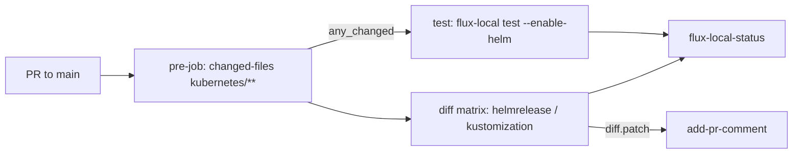

# Integrations: CI (flux-local) & Renovate

This repository is validated and kept up to date by two GitHub Actions–based integrations:

1. **flux-local CI** — on every pull request to `main`, the Flux manifests under `kubernetes/` are rendered and tested locally with [`flux-local`](https://github.com/allenporter/flux-local), and a rendered diff against the default branch is posted as a PR comment.
2. **Renovate** — dependency automation that scans the `kubernetes/` tree (plus shell/env files via custom managers) and opens grouped, scheduled, auto-mergeable update PRs.

## PR validation with flux-local

`.github/workflows/flux-local.yaml` runs on `pull_request` targeting `main` and has four jobs:

- **pre-job** — checks out the repo and uses `tj-actions/changed-files` with the `kubernetes/**` filter. Its `any_changed` output gates all other jobs, so workflow runs are skipped entirely when nothing under `kubernetes/` changed. Concurrency is keyed per PR with `cancel-in-progress: true` so only the latest run per PR executes.
- **test** — runs `flux-local test --enable-helm --all-namespaces --sources flux-system --path /github/workspace/kubernetes/flux/cluster` in the `ghcr.io/allenporter/flux-local:v8.4.0` container. This renders the full Kustomization/HelmRelease tree with Helm templating enabled and fails the PR if any manifest, HelmRelease values, or Helm chart cannot be rendered (i.e., it validates the same resources Flux will apply).
- **diff** — a matrix job over `helmrelease` and `kustomization` resources (`max-parallel: 4`, `fail-fast: false`). It checks out the PR branch at `pull/` and the default branch at `default/`, then runs `flux-local diff` comparing `/github/workspace/pull/kubernetes/flux/cluster` against `/github/workspace/default/kubernetes/flux/cluster`. Cosmetic attributes (`helm.sh/chart`, `checksum/config`, `app.kubernetes.io/version`, `chart`) are stripped, output is limited to 10,000 bytes per resource, and the unified diff is written to `diff.patch`. If the diff is non-empty, [mshick/add-pr-comment](https://github.com/mshick/add-pr-comment) posts it as a PR comment (one comment per resource type, keyed by `message-id`), and the diff also lands in the job summary. Comment posting is `continue-on-error`, so a comment failure alone does not fail the job.
- **flux-local-status** — an aggregator job (`if: always()`) that exits non-zero if either `test` or `diff` failed; otherwise it reports success. Branch protection can therefore require just this one check.



## Label automation

- `.github/labels.yaml` declares the canonical label set (colors included): `area/*` labels (bootstrap, docs, github, kubernetes, mise, renovate, scripts, talos, templates, taskfile), Renovate type labels (`renovate/container`, `renovate/github-action`, `renovate/helm`, `renovate/github-release`, `renovate/grafana-dashboard`), semantic update labels (`type/digest|patch|minor|major`), and `community` / `hold`.
- `.github/workflows/label-sync.yaml` applies this file via `EndBug/label-sync` (`delete-other-labels: true`) on pushes to `main` touching `.github/labels.yaml`, or manually. Because it deletes other labels, `labels.yaml` is the source of truth for the whole label set.
- `.github/labeler.yaml` maps paths to `area/*` labels (e.g., `kubernetes/**/*` → `area/kubernetes`, `.renovate/**/*` and `.renovaterc.json5` → `area/renovate`) for automatic PR labeling.

Renovate's package rules (below) apply the `renovate/*` and `type/*` labels to its PRs, so the labels defined here align with Renovate's output.

## Renovate dependency automation

`.renovaterc.json5` configures Renovate with `config:recommended` plus `docker:enableMajor`, `helpers:pinGitHubActionDigests`, `:automergeBranch`, `:dependencyDashboard`, `:disableRateLimiting`, and `:semanticCommits`.

### Scheduling and scope

- Updates run on schedule `every weekend`; the dependency dashboard issue ("Renovate Dashboard 🤖") tracks pending work.
- `ignorePaths: ["**/*.sops.*"]` excludes SOPS-encrypted files, so encrypted secrets are never parsed or rewritten.
- Manager file patterns (`flux`, `helm-values`, `helmfile`, `kubernetes`, `kustomize`) all target `kubernetes/**/*.ya?ml` (including `.j2` templated files), so Renovate discovers image tags, chart versions, and Flux sources throughout the `kubernetes/` tree rather than only in conventional filenames.

### Package rules

Grouping rules (all with docker datasource) roll related images into single PRs so components that must upgrade together move as one commit: **Cert-Manager**, **CoreDNS**, **Flux Operator** (`flux-operator` + `flux-instance`), and **Spegel**.

Auto-merge rules:

- GitHub Actions updates (minor/patch/digest) auto-merge to the branch after a `minimumReleaseAge` of 3 days, with tests ignored — the pinned SHAs (a result of `helpers:pinGitHubActionDigests`) make this safe.
- Mise tool updates (minor/patch) auto-merge similarly.
- A broad rule auto-merges **non-major app-layer updates** (minor/patch/digest) but `excludeDepPatterns` a long list of core infrastructure dependencies: storage/database operators (topolvm, local-path-provisioner, csi-driver-nfs, volsync, snapshot-controller, cloudnative-pg, dragonflydb/operator), networking/DNS/tunneling (cilium, external-dns, tailscale-operator, cloudflared, gateway-api, coredns, spegel), certificates/secrets (cert-manager, external-secrets, bitwarden-eso-provider), GitOps (flux-operator, flux-instance, controlplaneio-fluxcd), observability (kube-prometheus-stack, prometheus-operator, thanos, loki, metrics-server, k8s-sidecar, smartctl-exporter), node/cluster components (`siderolabs/installer`, `siderolabs/kubelet`), and the shared `app-template` chart. Core infra therefore always gets human-reviewed PRs while ordinary app updates merge themselves.

### Commit conventions and labels

Semantic-commit rules map update types to commit messages: `feat(...)!` for majors (with `currentVersion → newVersion` extras), `feat` for minors, `fix` for patches, `chore` for digests; scopes and topics differ per datasource (`container: image X`, `helm: chart X`, `ci(github-action): action X`, `github-release`, `mise: tool X`). Rules also add labels matching `.github/labels.yaml`: `type/major|minor|patch` by update type and `renovate/container|helm|github-action|github-release` by datasource.

### Custom managers (`# renovate:` pin comments)

A regex `customManagers` entry processes annotated dependencies in `.env`, `.sh`, and `.yaml` files (including `.j2` variants). Lines like:

```yaml
# renovate: datasource=docker depName=ghcr.io/siderolabs/kubelet
KUBERNETES_VERSION=v1.31.1
```

are updated by Renovate wherever the annotation is followed by `key: value` or `key=value`. Datasources default to `github-releases` when unspecified, and a second pattern captures versions embedded in URLs. Real usages include `talos/talenv.yaml` (Talos installer + kubelet images), the system-upgrade controller manifests under `kubernetes/apps/kube-system/system-upgrade/upgrades/`, CRD version pins in `kubernetes/flux/meta/repos/` (external-dns, gateway-api), and chart versions in `scripts/bootstrap-apps.sh`.

## Related pages

- [Daily Operations](../operations/daily-operations.md) — day-to-day workflow including handling Renovate PRs.
- [Validation](../testing/validation.md) — the broader validation strategy flux-local implements for PRs.
- [App Deployment](../workflows/app-deployment.md) — how Flux reconciles what these PRs contain.
