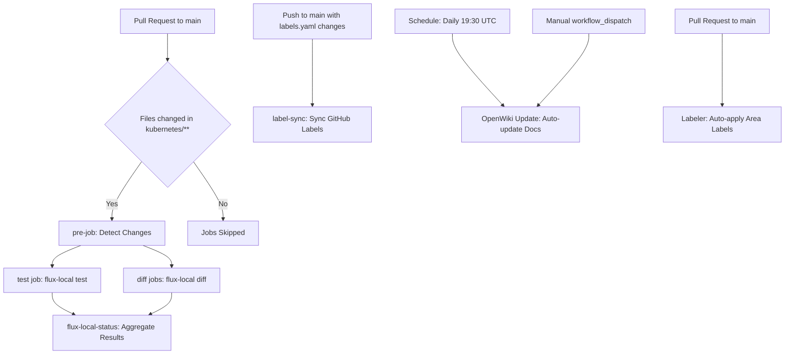
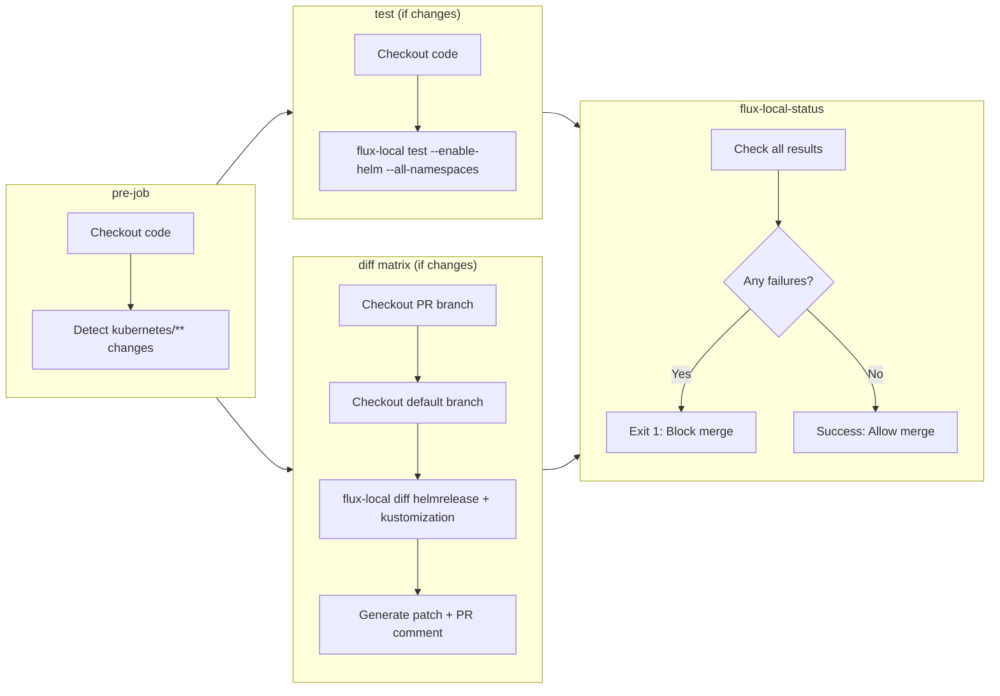

# CI/CD Integration

The repository uses GitHub Actions workflows to validate changes, maintain repository metadata, and automate documentation updates. These workflows enforce quality standards for Kubernetes manifests before they reach the cluster and ensure repository consistency.

## Workflow Overview



## Flux Local Workflow

The **Flux Local** workflow (`flux-local.yaml`) validates Kubernetes manifests on every pull request targeting the main branch. It performs pre-flight testing and generates readable diffs of proposed changes.

### Triggering Conditions

The workflow runs on pull requests to the `main` branch and uses concurrency control to cancel in-progress runs when new commits are pushed, preventing resource waste on outdated commits.

### Job Structure



#### pre-job

The **pre-job** acts as a gatekeeper, detecting whether the pull request actually modifies Kubernetes manifests:

- Uses `tj-actions/changed-files@v46.0.5` to check for changes in `kubernetes/**` path
- Outputs `any_changed` boolean that controls whether downstream jobs run
- Prevents unnecessary flux-local invocations on non-infrastructure changes

#### test Job

The **test** job validates Kubernetes manifests using flux-local:

- **Condition**: Only runs if `pre-job.outputs.any_changed == 'true'`
- **Action**: Runs `flux-local test` with arguments:
  - `--enable-helm`: Validates Helm releases including chart rendering
  - `--all-namespaces`: Checks manifests across all namespaces
  - `--path /github/workspace/kubernetes/flux/cluster`: Targets the Flux cluster configuration directory
  - `-v`: Enables verbose output for debugging
- **Container**: Uses `ghcr.io/allenporter/flux-local:v7.5.4` Docker image for consistent runtime environment
- **Purpose**: Catches syntax errors, invalid manifests, and Helm chart rendering failures before merge

#### diff Jobs

The **diff** job generates human-readable diffs showing the impact of changes. It runs as a matrix across two resource types:

**Matrix Strategy**:
- `resources`: ["helmrelease", "kustomization"]
- `max-parallel: 4`: Processes both resource types concurrently
- `fail-fast: false`: Continues all matrix jobs even if one fails

**Diff Generation Process**:

1. **Dual Checkout**:
   - Pull Request branch: Checked out to `/github/workspace/pull`
   - Default branch: Checked out to `/github/workspace/default`

2. **flux-local diff Command**:
   ```bash
   diff ${{ matrix.resources }}
   --unified 6
   --path /github/workspace/pull/kubernetes/flux/cluster
   --path-orig /github/workspace/default/kubernetes/flux/cluster
   --strip-attrs "helm.sh/chart,checksum/config,app.kubernetes.io/version,chart"
   --limit-bytes 10000
   --all-namespaces
   --sources "flux-system"
   --output-file diff.patch
   ```

   Key arguments:
   - `--unified 6`: Shows 6 lines of context for changes
   - `--strip-attrs`: Removes noisy attributes that change without functional impact:
     - `helm.sh/chart`: Helm chart version annotations
     - `checksum/config`: ConfigMap/Secret checksums
     - `app.kubernetes.io/version`: Application version labels
     - `chart`: Chart metadata that changes on re-rendering
   - `--limit-bytes 10000`: Caps output size to prevent overwhelming comments
   - `--sources "flux-system"`: Filters to only flux-system source resources

3. **Output Processing**:
   - Writes raw diff to `diff.patch`
   - Exports diff content to GitHub Output for step reuse
   - Appends formatted diff to GitHub Step Summary with markdown code block

4. **PR Comment**:
   - Uses `mshick/add-pr-comment@v2.8.2` to post diff as PR comment
   - Message ID includes PR number and resource type: `${{ github.event.pull_request.number }}/kubernetes/${{ matrix.resources }}`
   - `continue-on-error: true`: Avoids blocking PR on comment failures
   - Only posts comment if diff is non-empty

**Permissions**:
- `contents: read`: Required for checkout
- `pull-requests: write`: Required for posting comments

#### flux-local-status Job

The **flux-local-status** job aggregates results from test and diff jobs:

- **Condition**: `if: always()` - Runs regardless of upstream job failures
- **Dependency**: Requires both `test` and `diff` jobs
- **Logic**:
  - If any job failed: `exit 1` marks workflow failed
  - If all passed or skipped: Reports success with JSON results
- **Purpose**: Provides single status check for branch protection rules

## Label Sync Workflow

The **Label Sync** workflow (`label-sync.yaml`) maintains consistent GitHub issue/PR labels across the repository.

### Triggering Conditions

The workflow runs on:
- **Push to main branch**: Only when `.github/labels.yaml` changes
- **Manual workflow_dispatch**: On-demand execution

### Execution

The **label-sync** job:

1. **Checkout**: Uses `actions/checkout@v4.2.2` to access repository
2. **Sync Labels**:
   - Uses `EndBug/label-sync@v2.3.3` action
   - Reads configuration from `.github/labels.yaml`
   - `delete-other-labels: true`: Removes labels not defined in config

### Label Schema

The labels are organized into categories defined in `.github/labels.yaml`:

**Area Labels** (green, `0e8a16`):
- `area/bootstrap`, `area/docs`, `area/github`, `area/kubernetes`, `area/mise`, `area/renovate`, `area/scripts`, `area/talos`, `area/templates`, `area/taskfile`
- Categorize changes by domain or subsystem

**Renovate Type Labels** (blue, `027fa0`):
- `renovate/container`, `renovate/github-action`, `renovate/grafana-dashboard`, `renovate/github-release`, `renovate/helm`
- Indicate Renovate bot update types

**Semantic Version Labels**:
- `type/digest` (yellow, `ffeC19`): Digest-only updates
- `type/patch` (yellow, `ffeC19`): Patch releases
- `type/minor` (orange, `ff9800`): Minor releases
- `type/major` (red, `f6412d`): Major releases
- Indicate semantic versioning impact

**Special Labels**:
- `community` (purple, `370fb2`): Community contributions
- `hold` (red, `ee0701`): Changes on hold

This schema integrates with Renovate bot's automatic labeling and helps categorize pull requests by area and impact.

## Labeler Workflow

The **Labeler** workflow (`labeler.yaml`) automatically applies area labels to pull requests based on changed files.

### Triggering Conditions

The workflow runs on:
- **pull_request_target** targeting `main` branch: Runs for external contributors
- **Manual workflow_dispatch**: On-demand execution

### Execution

The **labeler** job:

- **Permissions**: `contents: read` and `pull-requests: write`
- Uses `actions/labeler@v5.0.0` with configuration from `.github/labeler.yaml`
- Applies labels based on file patterns:
  - `bootstrap/**/*` → `area/bootstrap`
  - `README.md` → `area/docs`
  - `.github/**/*` → `area/github`
  - `kubernetes/**/*` → `area/kubernetes`
  - `.mise.toml` → `area/mise`
  - `.renovate/**/*`, `.renovaterc.json5` → `area/renovate`
  - `scripts/**/*` → `area/scripts`
  - `talos/**/*` → `area/talos`
  - `.taskfiles/**/*`, `Taskfile.yaml` → `area/taskfile`
  - `templates/**/*` → `area/templates`

This automation ensures consistent labeling for triage and routing without manual intervention.

## OpenWiki Update Workflow

The **OpenWiki Update** workflow (`openwiki-update.yml`) automatically updates OpenWiki documentation on a scheduled basis.

### Triggering Conditions

The workflow runs on:
- **Schedule**: Daily at 19:30 UTC (03:30 Beijing, avoiding 03:00 conflict with other services)
- **Manual workflow_dispatch**: On-demand execution

### Permissions

The workflow requires:
- `contents: write`: For committing documentation changes back to repository

### Execution Pipeline

The **update** job:

1. **Repository Checkout**:
   - Uses `actions/checkout@v4`
   - `persist-credentials: true`: Required for git push

2. **Node.js Setup**:
   - Uses `actions/setup-node@v4`
   - Node version: `22`

3. **OpenWiki Installation**:
   - Installs `openwiki` globally via npm: `npm install --global openwiki`

4. **OpenWiki Execution**:
   - Command: `openwiki code --update --print`
   - Environment variables:
     - `OPENWIKI_PROVIDER`: anthropic
     - `ANTHROPIC_API_KEY`: GitHub Secret
     - `ANTHROPIC_BASE_URL`: https://open.bigmodel.cn/api/anthropic (custom API endpoint)
     - `OPENWIKI_MODEL_ID`: glm-4.7

5. **Commit & Push**:
   - Configures git user as `github-actions[bot]`
   - Stages changes: `git add openwiki AGENTS.md CLAUDE.md`
   - Checks for changes: `git diff --staged --quiet`
   - Only commits and pushes if actual changes exist to avoid empty commits
   - Commit message: `"docs: update OpenWiki"`

### Integration with Documentation

The workflow updates three key documentation artifacts:
- `openwiki/`: Wiki content directory
- `AGENTS.md`: Agent configuration documentation
- `CLAUDE.md`: AI assistant instructions

This automation ensures documentation stays synchronized with code changes without manual intervention.

## Relationship to Flux Architecture

These CI/CD workflows complement the Flux GitOps architecture described in [Flux GitOps Architecture](/openwiki/concepts/flux-architecture.md):

- **Validation Layer**: flux-local testing provides pre-deployment validation before Flux reconciles changes to the cluster
- **Change Visibility**: diff generation shows the exact impact of PR changes on cluster state
- **Documentation Sync**: OpenWiki updates keep architectural documentation aligned with actual Kubernetes manifests

The workflows specifically validate the `kubernetes/flux/cluster` directory structure that defines the Flux reconciliation hierarchy, ensuring that changes to Kustomizations, HelmReleases, and sources are syntactically valid before reaching the cluster.

## Operational Considerations

### Concurrency Management

The Flux Local workflow uses concurrency groups to prevent resource waste:
- Group key: `${{ github.workflow }}-${{ github.event.number || github.ref }}`
- `cancel-in-progress: true`: Old runs are canceled when new commits are pushed
- Ensures only the latest commit is validated

### Failure Handling

- **Test job failures**: Block PR merge via flux-local-status job
- **Diff job failures**: Marked as `continue-on-error: true` to avoid blocking on transient issues
- **Label sync failures**: No retry mechanism; manual re-run via workflow_dispatch
- **OpenWiki failures**: No retry; schedule will retry next day
- **Labeler failures**: Non-blocking; labels can be applied manually

### Resource Limitations

- **Diff size**: `--limit-bytes 10000` prevents overwhelming PR comments
- **Matrix parallelism**: `max-parallel: 4` balances speed with resource usage
- **Action versions**: Pinned to specific SHA tags for reproducibility

### Security

- **Minimal permissions**: Each workflow requests only necessary permissions
- **Secret management**: ANTHROPIC_API_KEY stored as GitHub Secret
- **Third-party actions**: Use pinned SHAs for supply chain security
- **pull_request_target**: Labeler uses this event for safe external contributor access

## Integration with Other Systems

### Renovate Integration

The label schema works with Renovate bot, which automatically applies `renovate/*` and `type/*` labels to dependency update PRs. See [Renovate Integration](/openwiki/integrations/renovate.md) for details on dependency automation.

### Application Deployment

These CI/CD workflows validate the manifests that drive the Flux deployment pipeline. The flux-local validation ensures that app-template HelmReleases and Kustomizations are valid before Flux reconciles them to the cluster.
