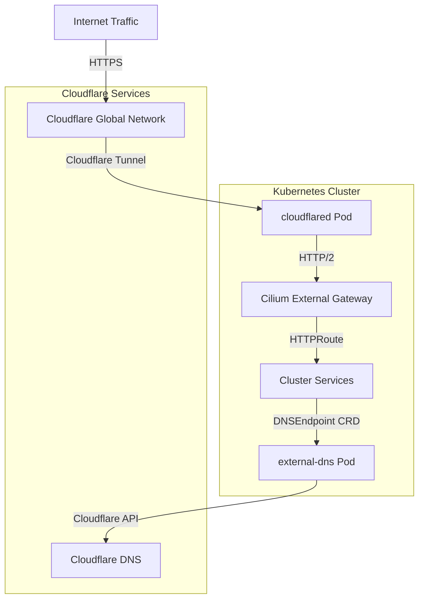

# Cloudflare Integration

The cluster integrates Cloudflare services for secure external ingress and automated DNS management. This integration combines Cloudflare Tunnel for inbound traffic without open ports and external-dns for synchronized DNS records between Kubernetes services and Cloudflare DNS.

## Architecture Overview



## Components

### Cloudflare Tunnel (cloudflared)

Cloudflare Tunnel provides secure inbound connectivity to the cluster without exposing ports to the internet. The tunnel runs as a DaemonSet using `cloudflared` containers that establish outbound connections to Cloudflare's edge network.

**Deployment:** `kubernetes/apps/network/cloudflare-tunnel/app/helmrelease.yaml`

**Key Configuration:**
- **Image:** `cloudflare/cloudflared:2026.7.3`
- **Transport Protocol:** HTTP/2 for efficient multiplexing
- **Origin HTTP/2:** Enabled for improved performance
- **Security:** Runs as non-root user (65534) with read-only root filesystem
- **Resources:** 10m CPU request, 256Mi memory limit
- **Metrics:** Exposes metrics on port 8080 for Prometheus scraping

**Ingress Rules:**

The tunnel configuration defines routing rules from Cloudflare to cluster services:

- **Primary Domain:** `${SECRET_DOMAIN}` → Cilium external gateway
- **Wildcard Subdomains:** `*.${SECRET_DOMAIN}` → Cilium external gateway
- **Default Service:** HTTP 404 for unmatched requests

The tunnel terminates at the Cilium external gateway service (`cilium-gateway-external.kube-system.svc.cluster.local`) which handles HTTPRoute-based routing to individual services.

**Authentication:**

The tunnel authenticates using a `TUNNEL_TOKEN` stored in the `cloudflare-tunnel-secret` Secret. This token is provisioned in Cloudflare and grants the tunnel permission to route traffic for the configured domain.

**Lifecycle:**
- **Probes:** Liveness and readiness checks query `/ready` endpoint on port 8080
- **Auto-update:** Disabled (`NO_AUTOUPDATE: true`) to ensure version control
- **Strategy:** RollingUpdate with restart annotations for config changes

### External DNS

External DNS synchronizes Kubernetes resources with Cloudflare DNS records. It watches for DNSEndpoint CRDs and Gateway API HTTPRoutes to automatically create and update DNS records.

**Deployment:** `kubernetes/apps/network/cloudflare-dns/app/helmrelease.yaml`

**Provider Configuration:**
- **Provider:** Cloudflare
- **Sources:** CRD (DNSEndpoint) and Gateway API HTTPRoute
- **Policy:** Sync (creates, updates, and removes records to match Kubernetes state)
- **Domain Filter:** Limited to `${SECRET_DOMAIN}` to prevent accidental modifications
- **TXT Prefix:** `k8s.` for ownership verification records
- **TXT Owner ID:** `default` for record management

**Cloudflare-Specific Settings:**
- **Proxied Records:** Enabled (`--cloudflare-proxied`) routes traffic through Cloudflare's proxy for DDoS protection and caching
- **DNS Records Per Page:** 1000 for efficient API pagination
- **Gateway Name:** `external` filters HTTPRoutes by parent Gateway reference

**Authentication:**

External DNS authenticates using a Cloudflare API token stored in the `cloudflare-dns-secret` Secret. The token requires DNS edit permissions for the configured domain.

**Reload Integration:**

The deployment integrates with Reloader to automatically restart when the API token Secret changes (`secret.reloader.stakater.com/reload: cloudflare-dns-secret`).

### DNSEndpoint Resources

DNSEndpoint CRDs define DNS records that external-dns synchronizes to Cloudflare. These resources provide a Kubernetes-native way to manage DNS records alongside service deployments.

**Example:** `kubernetes/apps/network/cloudflare-tunnel/app/dnsendpoint.yaml`

**Cloudflare Tunnel DNSEndpoint:**

```yaml
apiVersion: externaldns.k8s.io/v1alpha1
kind: DNSEndpoint
metadata:
  name: cloudflare-tunnel
spec:
  endpoints:
    - dnsName: "external.${SECRET_DOMAIN}"
      recordType: CNAME
      targets: ["5b7a9006-79aa-4f8d-a157-fde642c738fe.cfargotunnel.com"]
```

This DNSEndpoint creates a CNAME record pointing the external domain to the Cloudflare Tunnel address, enabling ingress traffic routing through the Cloudflare network.

**Record Types Supported:**
- **CNAME:** Alias records for services
- **A:** IPv4 address records
- **AAAA:** IPv6 address records
- **TXT:** Verification and metadata records

## Request Flow

External requests to cluster services follow this path:

1. **DNS Resolution:** Client resolves `${SECRET_DOMAIN}` to Cloudflare addresses
2. **TLS Termination:** Cloudflare handles TLS with edge certificates
3. **Tunnel Routing:** Request forwarded through Cloudflare Tunnel to `cloudflared` pod
4. **Gateway Forwarding:** `cloudflared` forwards via HTTP/2 to Cilium external gateway
5. **Route Matching:** Gateway matches HTTPRoute based on hostname and path
6. **Service Delivery:** Request routed to backend service pod

## Integration Patterns

### Exposing a New Service

To expose a service through Cloudflare:

1. **Deploy Service:** Create the service with a ClusterIP or LoadBalancer type
2. **Create HTTPRoute:** Define routing rules referencing the external Gateway:

```yaml
apiVersion: gateway.networking.k8s.io/v1
kind: HTTPRoute
metadata:
  name: my-service
spec:
  hostnames: ["my-service.${SECRET_DOMAIN}"]
  parentRefs:
    - name: external
      namespace: kube-system
      sectionName: https
  rules:
    - backendRefs:
        - name: my-service
          port: 80
```

3. **DNS Automation:** External-dns automatically creates DNS record for `my-service.${SECRET_DOMAIN}` when the HTTPRoute is created

### Custom DNS Records

For DNS records not tied to HTTPRoutes (e.g., CNAMEs to external services), create a DNSEndpoint:

```yaml
apiVersion: externaldns.k8s.io/v1alpha1
kind: DNSEndpoint
metadata:
  name: custom-record
spec:
  endpoints:
    - dnsName: "alias.${SECRET_DOMAIN}"
      recordType: CNAME
      targets: ["external-service.example.com"]
```

### Service Discovery via k8s-gateway

The integration works with k8s-gateway for internal DNS resolution. Services exposed through Cloudflare Tunnel are automatically resolvable within the cluster through the internal DNS resolver.

## Security Considerations

### Authentication Credentials

- **Tunnel Token:** Stored in `cloudflare-tunnel-secret`, provisioned from Cloudflare Zero Trust dashboard
- **DNS API Token:** Stored in `cloudflare-dns-secret`, requires Zone DNS Edit permissions
- **Secrets Management:** Encrypted with SOPS, mounted as environment variables

### Network Security

- **No Open Ports:** Tunnel eliminates need for public ingress ports
- **TLS Everywhere:** Cloudflare provides edge certificates, tunnel uses HTTP/2
- **Proxied Records:** Cloudflare proxy hides origin IP addresses
- **Access Control:** Cloudflare Access policies can restrict traffic before it reaches the cluster

### Pod Security

- **Non-Root:** cloudflared runs as user 65534 (nobody)
- **Read-Only Filesystem:** Prevents runtime modifications
- **Minimal Capabilities:** All capabilities dropped
- **Resource Limits:** Memory limit prevents resource exhaustion

## Operations

### Monitoring

Both Cloudflare Tunnel and external-dns expose Prometheus metrics:

- **cloudflared:** Metrics on port 8080 via ServiceMonitor
- **external-dns:** Metrics on service port via ServiceMonitor

Key metrics include tunnel connection status, request counts, and DNS synchronization operations.

### Troubleshooting

**Tunnel Connection Issues:**
- Check `cloudflared` pod logs for connection errors
- Verify TUNNEL_TOKEN is correct and not expired
- Ensure Cloudflare Tunnel is active in Zero Trust dashboard

**DNS Not Updating:**
- Verify `CF_API_TOKEN` has DNS edit permissions
- Check external-dns logs for API errors
- Confirm domain filter matches target domain

**Service Not Accessible:**
- Verify HTTPRoute parentRef matches external Gateway name
- Check Gateway accepts routes from service namespace
- Ensure Service port and backendRef port match

### Configuration Updates

**Tunnel Configuration:**
- Modify `config.yaml` in `kubernetes/apps/network/cloudflare-tunnel/app/resources/`
- Kustomize regenerates ConfigMap automatically
- Reloader annotation triggers pod restart

**DNS Settings:**
- Update Helm values in `kubernetes/apps/network/cloudflare-dns/app/helmrelease.yaml`
- Flux syncs changes automatically
- External-dns picks up new configuration on next sync interval

## Dependencies

- **Cilium Gateway:** External gateway must be running and accessible
- **Flux CD:** Manages Helm releases and Kubernetes resources
- **SOPS:** Encrypts sensitive configuration values
- **Secret Store:** Provides Cloudflare credentials to pods
- **Reloader:** Automates pod restarts on Secret changes
