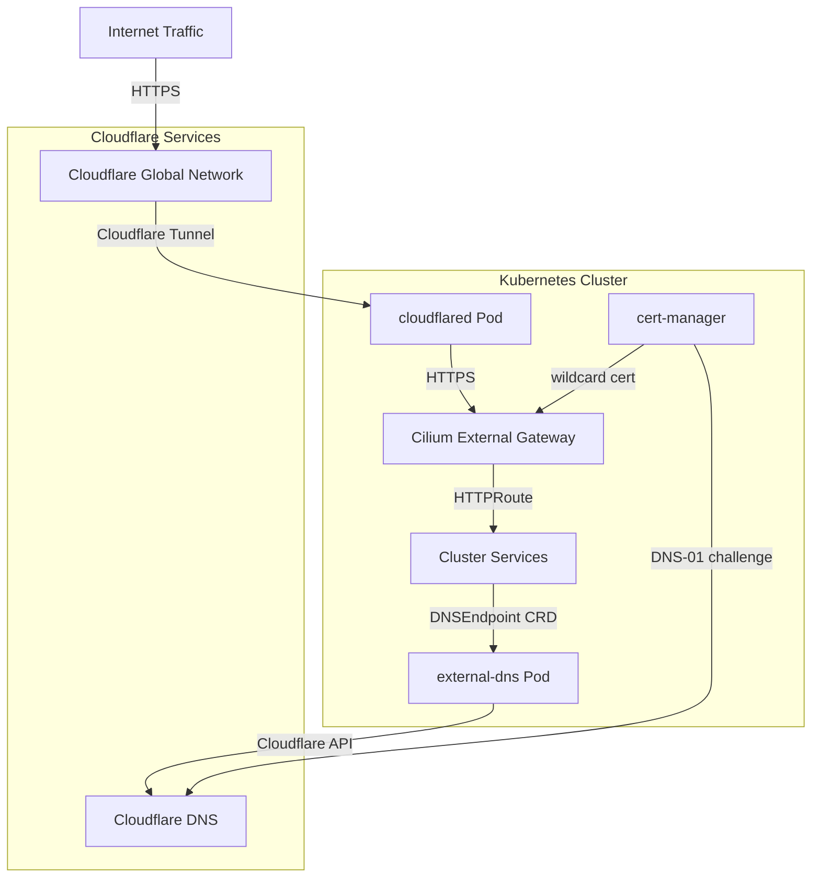

# Cloudflare Integration

The cluster integrates Cloudflare services for secure external ingress, automated DNS management, and TLS certificate issuance. This integration combines Cloudflare Tunnel for inbound traffic without open ports, external-dns for synchronized DNS records between Kubernetes resources and Cloudflare DNS, and cert-manager's Cloudflare DNS-01 solver for wildcard certificates.

## Architecture Overview

## Components

### Cloudflare Tunnel (cloudflared)

Cloudflare Tunnel provides secure inbound connectivity to the cluster without exposing ports to the internet. The tunnel runs as a Deployment using `cloudflared` containers that establish outbound connections to Cloudflare's edge network.

**Deployment:** `kubernetes/apps/network/cloudflare-tunnel/app/helmrelease.yaml`

**HelmRelease Pattern:** The tunnel deployment uses the `app-template` OCI chart pattern, providing a standardized Helm chart structure for application deployment. This pattern encapsulates common Kubernetes workload configurations including controllers, containers, pod options, services, and persistence in a reusable template.

**Key Configuration:**
- **Image:** `cloudflare/cloudflared:2026.7.3`
- **Transport Protocol:** HTTP/2 for efficient multiplexing (`TUNNEL_TRANSPORT_PROTOCOL: http2`)
- **Origin HTTP/2:** Enabled for improved performance (`TUNNEL_ORIGIN_ENABLE_HTTP2: true`)
- **Security:** Runs as non-root user (65534) with read-only root filesystem
- **Resources:** 10m CPU request, 256Mi memory limit
- **Metrics:** Exposes metrics on port 8080 for Prometheus scraping

**cloudflared Configuration:**

The tunnel container is configured with several environment variables that control its behavior:

- **TUNNEL_METRICS:** Set to `0.0.0.0:8080` to expose Prometheus metrics on all interfaces
- **TUNNEL_TRANSPORT_PROTOCOL:** Uses HTTP/2 as the transport protocol between cloudflared and Cloudflare edge
- **TUNNEL_ORIGIN_ENABLE_HTTP2:** Enables HTTP/2 communication from cloudflared to origin services
- **NO_AUTOUPDATE:** Disabled (`true`) to ensure version control through container image updates

**Tunnel Run Arguments:**

The container executes with `args: ["tunnel", "run"]`, which instructs cloudflared to:
1. Read the tunnel token from the `TUNNEL_TOKEN` environment variable
2. Establish an outbound connection to Cloudflare's edge network
3. Begin processing ingress requests forwarded through the tunnel

**Ingress Rules:**

The tunnel configuration (rendered from a kustomize `configMapGenerator` into `/etc/cloudflared/config.yaml`) defines routing rules from Cloudflare to cluster services:

- **Primary Domain:** `${SECRET_DOMAIN}` → Cilium external gateway
- **Wildcard Subdomains:** `*.${SECRET_DOMAIN}` → Cilium external gateway
- **Default Service:** HTTP 404 for unmatched requests

Requests to the gateway use HTTPS with `originServerName: "external.${SECRET_DOMAIN}"`, so the origin TLS handshake validates against the wildcard certificate presented by the Cilium external gateway. The tunnel terminates at the Cilium external gateway service (`cilium-gateway-external.kube-system.svc.cluster.local`) which handles HTTPRoute-based routing to individual services.

**Tunnel DNS Record:** A `DNSEndpoint` resource (`cloudflare-tunnel/app/dnsendpoint.yaml`) pins the apex-adjacent hostname `external.${SECRET_DOMAIN}` to a CNAME targeting `<tunnel-id>.cfargotunnel.com`. external-dns reconciles this record into Cloudflare, which is how public traffic is steered into the tunnel.

### external-dns (cloudflare-dns)

The `cloudflare-dns` Flux Kustomization deploys external-dns (chart version 1.21.1) with the Cloudflare provider (`kubernetes/apps/network/cloudflare-dns/app/helmrelease.yaml`).

**Key Configuration:**
- **Provider:** `cloudflare`, authenticated with `CF_API_TOKEN` from the `cloudflare-dns-secret` Secret (SOPS-encrypted; annotated for Stakater Reloader to restart on secret change)
- **Sources:** `crd` (DNSEndpoint) and `gateway-httproute`, so both explicit DNSEndpoint resources and Gateway API HTTPRoutes drive DNS records
- **Policy:** `sync` — external-dns deletes records it no longer manages, keeping Cloudflare DNS a projection of cluster state
- **Domain Filter:** Limited to `${SECRET_DOMAIN}`, scoping all changes to the cluster's zone
- **Proxying:** `--cloudflare-proxied` places created records behind Cloudflare's CDN/WAF proxy
- **Ownership:** `txtOwnerId: default` and `txtPrefix: k8s.` identify externally managed records via TXT registry entries
- **Reactivity:** `triggerLoopOnEvent: true` reacts to Kubernetes events instead of waiting for the full resync interval
- **Gateway naming:** `--gateway-name=external` restricts Gateway API watching to the `external` Gateway
- **Observability:** Prometheus `serviceMonitor` enabled

### Cilium External Gateway

The `external` Gateway (`kubernetes/apps/kube-system/cilium/gateway/external.yaml`, gatewayClassName `cilium`) is the origin that cloudflared forwards traffic to. It listens on HTTP (port 80, same-namespace routes) and HTTPS (port 443, routes allowed from all namespaces) for `*.${SECRET_DOMAIN}`, terminating TLS with the `${SECRET_DOMAIN/./-}-production-tls` Secret. Its annotations (`external-dns.alpha.kubernetes.io/target` and `.io/hostname` on `external.${SECRET_DOMAIN}`) feed the external-dns gateway-httproute source. The HTTPS listener's `allowedRoutes: from: All` is what lets HTTPRoutes from any namespace (apps in `default`, `observability`, `flux-system`, etc.) publish hostnames on this domain.

### Certificates

Wildcards for `${SECRET_DOMAIN}` and `*.${SECRET_DOMAIN}` are issued by cert-manager (`kubernetes/apps/kube-system/cilium/gateway/certificate.yaml`) using the `letsencrypt-production` ClusterIssuer. That issuer performs ACME DNS-01 challenges through Cloudflare (`kubernetes/apps/cert-manager/cert-manager/app/clusterissuer.yaml`), using an API token from the `cert-manager-secret` Secret, scoped by `dnsZones: ["${SECRET_DOMAIN}"]`. The resulting certificate Secret backs TLS on both the external and internal Cilium gateways — meaning certificate issuance is a Cloudflare-DNS-dependent control path for all HTTPS ingress.

## Request Flow

1. A client resolves a service hostname (e.g. `gitea.${SECRET_DOMAIN}`) via Cloudflare DNS; the record — proxied per `--cloudflare-proxied` — resolves through Cloudflare's edge, with apex and wildcard traffic steered via the tunnel CNAME.
2. Cloudflare's edge forwards the request over the established tunnel to the `cloudflared` pod.
3. cloudflared matches the hostname against its ingress rules and proxies HTTPS to `cilium-gateway-external.kube-system.svc.cluster.local`, validating the origin via `external.${SECRET_DOMAIN}` SNI.
4. The Cilium Gateway terminates TLS with the wildcard certificate and routes via the matching HTTPRoute to the backing service.
5. DNS records themselves are continuously reconciled by external-dns from DNSEndpoints and Gateway/HTTPRoute annotations.

## Deployment & Lifecycle

Both components are Flux-managed Kustomizations in the `network` namespace (`cloudflare-tunnel/ks.yaml`, `cloudflare-dns/ks.yaml`) with `interval: 1h`, `prune: true`, `wait: true`, and SOPS decryption via the `sops-age` Secret. `${SECRET_DOMAIN}` is injected at postBuild time from the `cluster-secrets` Secret. Secrets (`TUNNEL_TOKEN`, `CF_API_TOKEN`) are SOPS-encrypted in Git (`secret.sops.yaml`), so credentials never appear in plaintext; the tunnel deployment additionally auto-restarts on config/secret changes via Reloader annotations.

## Relationships

- **Related:** `/openwiki/concepts/networking.md` — overall network topology and gateway design; `/openwiki/integrations/tailscale.md` — complementary private-network ingress path.
