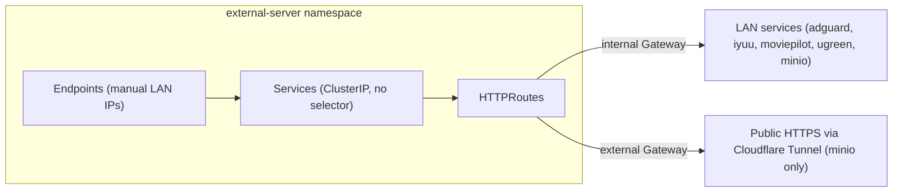

# External Identity

The cluster fronts a set of services that live **outside** Kubernetes — NAS web UIs, DNS, media tools, MinIO instances on other LAN hosts. The `external-server` namespace (`kubernetes/apps/external-server/`) gives those services Kubernetes-native DNS names and externally reachable HTTPS hostnames without running any workload inside the cluster: it uses plain `Service` + `Endpoints` pairs pointing at fixed LAN IPs, and [Gateway API](../concepts/networking.md) `HTTPRoute`s that attach them to the cluster's gateways.

The namespace holds no pods, no `HelmRelease`s, and no SOPS secrets. Its Flux `Kustomization` is a minimal resource bundle (see [Namespace and Application Organization](../architecture/namespace-structure.md)):

*How the external-server namespace wires Services/Endpoints to the cluster gateways.*

## Flux structure

- `kubernetes/apps/external-server/kustomization.yaml` sets `namespace: external-server`, applies `../../components/common` (repo labels, SOPS decryption, Flux prerequisites), and loads a single resource: `external-server/ks.yaml`.
- `external-server/ks.yaml` is a Flux `Kustomization` targeting the `external-server` namespace with `prune: true`, SOPS decryption (`sops-age`), postBuild substitution from the `cluster-secrets` Secret, 1h reconcile interval, and `wait: true`.

The Flux alert in `kubernetes/apps/flux-system/notification/alert.yaml` lists `external-server` among the watched namespaces, so reconciliation events there notify GitHub like every other app namespace.

## The Service + Endpoints pattern

Every proxied backend is a pair of resources in `external-server/app/services.yaml` and `external-server/app/endpoints.yaml`:

- A **selectorless `Service`** exposing the backend port (e.g. `adguard` port 3000).
- A **manual `Endpoints`** object with the same name, giving a fixed cluster IP (e.g. `192.168.50.1:3000` for AdGuard, `192.168.50.220` for the UGREEN NAS hosting IYUU, MoviePilot, UGREEN UI, and the MinIO instances).

Because nothing schedules pods, this is purely DNS/routing identity: the cluster's gateway can route `adguard.${SECRET_DOMAIN}` to a Kubernetes Service that transparently forwards to a LAN host. Adding a new external service means appending a Service, an Endpoints entry, and an HTTPRoute — all three must stay name- and port-consistent.

Proxied backends today:

| Service | LAN target | Port |
| --- | --- | --- |
| `adguard` | 192.168.50.1 | 3000 |
| `iyuu` | 192.168.50.220 | 8780 |
| `moviepilot` | 192.168.50.220 | 3000 |
| `ugreen` | 192.168.50.220 | 9999 |
| `cold-minio-api` / `cold-minio-console` | 192.168.50.220 | 9010 / 9011 |
| `hot-minio-api` / `hot-minio-console` | 192.168.50.220 | 9000 / 9001 |

## Gateway attachment: internal vs external

`external-server/app/httproute.yaml` declares eight HTTPRoutes, split by parent Gateway:

- **All routes** attach to the `internal` Gateway (`kube-system` namespace, `https` section), giving HTTPS hostnames on `${SECRET_DOMAIN}` that are reachable from the tailnet/LAN side. Hostnames: `adguard`, `iyuu`, `mp` (MoviePilot), `ugreen`, `cold-minio-api`, `cold-minio`, `hot-minio-api`, `hot-minio`.
- **Only the MinIO routes** additionally attach to the `external` Gateway — `cold-minio-api`, `cold-minio`, `hot-minio-api`, and `hot-minio` — making the S3 APIs and consoles reachable from the public internet (via the [Cloudflare](cloudflare.md) tunnel/DNS path). This is the deliberate exposure boundary: general NAS/admin tools stay internal; MinIO needs public S3 endpoints.

No authentication middleware is layered in this namespace — access control relies on each backend's own login (and on the external/internal Gateway split). If an app route ever needs an auth proxy, this namespace is where the route would gain that rule.

## Operations and extension points

- **Adding a backend**: add matching Service + Endpoints entries (same name, matching port) and an HTTPRoute in `app/httproute.yaml` attached to `internal` (add an `external` parent only if it must be public). Flux prunes removed resources automatically.
- **Failures**: a stale `Endpoints` IP yields gateway 502s — DNS and TLS still succeed because the hostname terminates at the gateway, not the backend. There are no health probes or metrics here; check Gatus externally-reachable endpoint monitors instead.
- **No secrets or pods** exist in this namespace, so token rotation and SOPS concerns don't apply; the Kustomization still enables SOPS decryption only as part of the shared `components/common` bundle.

Related: [Cloudflare](cloudflare.md) (public ingress path), [Tailscale](tailscale.md) (tailnet access and egress), [Networking](../concepts/networking.md).
