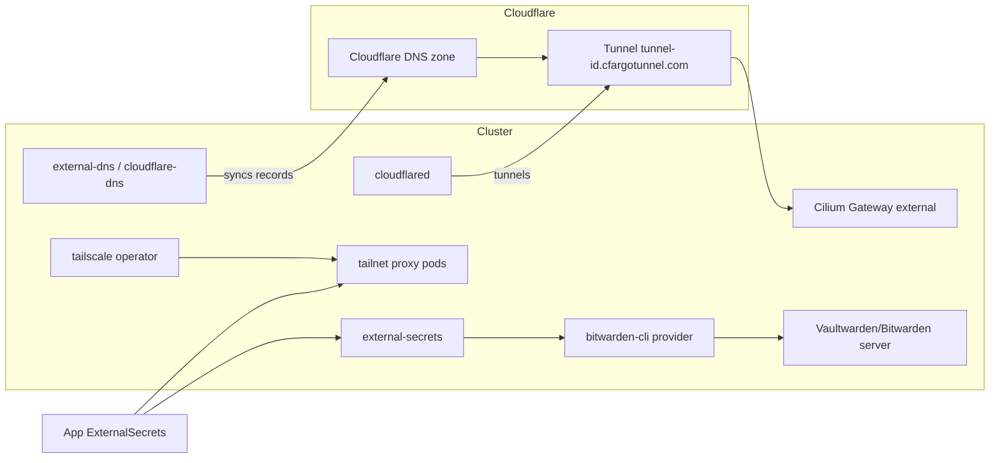

# Integrations: Cloudflare, Tailscale, Bitwarden

The cluster reaches the outside world and the outside world reaches the cluster through three external integrations, all deployed with Flux `HelmRelease`s under `kubernetes/apps/`:

- **Cloudflare** provides public DNS record management ([external-dns](https://github.com/kubernetes-sigs/external-dns) with the `cloudflare` provider) and inbound HTTPS ingress via a named Cloudflare Tunnel (`cloudflared`).
- **Tailscale** provides the tailnet operator, which provisions proxy pods for cluster egress/subnet access and a Kubernetes API server proxy.
- **Bitwarden** is the source of truth for nearly all cluster credentials, exposed through External Secrets Operator via the `bitwarden-eso-provider` ("bitwarden-connect") stack.

See [Networking](../concepts/networking.md) and [Secrets Management](../concepts/secrets-management.md) for the conceptual background.

## Cloudflare DNS — `kubernetes/apps/network/cloudflare-dns`

Flux Kustomization `cloudflare-dns` (in namespace `network`) deploys the `external-dns` Helm chart (v1.22.0 from the `external-dns` HelmRepository) with:

- `provider: cloudflare`, authenticating with `CF_API_TOKEN` injected from the SOPS-encrypted Secret `cloudflare-dns-secret` (key `api-token`, source `app/secret.sops.yaml`).
- Sources `crd` and `gateway-httproute` with `--gateway-name=external` and `--crd-source-kind=DNSEndpoint` (`--crd-source-apiversion=externaldns.k8s.io/v1alpha1`): records are created from both [Gateway API](../concepts/networking.md) HTTPRoutes attached to the `external` Gateway and from raw `DNSEndpoint` CRs.
- `policy: sync` (records deleted with their sources), `triggerLoopOnEvent: true`, `--cloudflare-proxied` (records are created orange-cloud/proxied), `txtPrefix: k8s.`, `txtOwnerId: default`, and `domainFilters: ["${SECRET_DOMAIN}"]`.
- A Pod annotation `secret.reloader.stakater.com/reload` on the Secret name restarts the pod when the API token Secret changes; a `ServiceMonitor` exposes metrics.

### Rotation

The API token lives only in `app/secret.sops.yaml` (SOPS/age-encrypted with `encrypted_regex: ^(data|stringData)$`). To rotate: re-encrypt a new token into that file (`sops app/secret.sops.yaml`), commit, and let Flux reconcile. Stakater Reloader then rolls the pod to pick up the new `CF_API_TOKEN`.

## Cloudflare Tunnel — `kubernetes/apps/network/cloudflare-tunnel`

Flux Kustomization `cloudflare-tunnel` runs the `cloudflare/cloudflared` image (tag `2026.9.3`) using the `app-template` OCI chart, in a single controller with args `tunnel run`:

- **Credentials**: `envFrom: secretRef: cloudflare-tunnel-secret` supplies `TUNNEL_TOKEN` (SOPS-encrypted in `app/secret.sops.yaml`). `reloader.stakater.com/auto: "true"` on the controller means any change to that Secret (e.g. a new tunnel token) triggers a rolling restart.
- **Tunnel config**: the ConfigMap `cloudflare-tunnel-configmap` (from `app/resources/config.yaml`) is mounted read-only at `/etc/cloudflared/config.yaml`. Its ingress sends `${SECRET_DOMAIN}` and `*.${SECRET_DOMAIN}` to `https://cilium-gateway-external.kube-system.svc.cluster.local` (the Cilium Gateway that fronts the cluster), with a `404` catch-all; `originRequest.originServerName` is `external.${SECRET_DOMAIN}`.
- **Public DNS tie-in**: `app/dnsendpoint.yaml` declares a `DNSEndpoint` named `cloudflare-tunnel` creating a CNAME `external.${SECRET_DOMAIN}` → `5b7a9006-79aa-4f8d-a157-fde642c738fe.cfargotunnel.com`. external-dns (above) syncs this record into Cloudflare; the token-embedded tunnel ID in `TUNNEL_TOKEN` must match this tunnel.
- **Operations**: environment sets `TUNNEL_TRANSPORT_PROTOCOL: http2`, `TUNNEL_METRICS: 0.0.0.0:8080`, `NO_AUTOUPDATE`; liveness/readiness probes hit `httpGet /ready` on port 8080; the pod runs non-root (`65534`), read-only rootfs, all capabilities dropped; a `ServiceMonitor` scrapes metrics.

### Rotation

A new tunnel token is obtained from the Cloudflare Zero Trust dashboard and re-encrypted into `app/secret.sops.yaml` under `TUNNEL_TOKEN`. Flux applies it and Reloader restarts `cloudflared`. The ingress rules in `app/resources/config.yaml` and the CNAME in `app/dnsendpoint.yaml` are version-controlled and must be updated if the tunnel or hostnames change.

## Tailscale — `kubernetes/apps/network/tailscale`

Flux Kustomization `tailscale` (namespace `network`, dependsOn `bitwarden-connect`) deploys `tailscale-operator` v1.102.4:

- **Credentials**: OAuth credentials come from the `tailscale-secret` Secret via `valuesFrom` mapping `client_id` → `oauth.clientId` and `client_secret` → `oauth.clientSecret`. That Secret is **not** checked in — it is generated by an `ExternalSecret` (`app/externalsecret.yaml`) that pulls from the Bitwarden store: `ClusterSecretStore bitwarden-login`, remote key `tailscale_k8s_oauth`, `username` → `client_id` and `password` → `client_secret`. The `podAnnotations` `reloader.stakater.com/auto` restarts the operator when the Secret changes.
- **API server proxy**: `apiServerProxyConfig.mode: 'true'` enables the Tailscale Kubernetes API server proxy, allowing authenticated tailnet devices to reach the API server.
- **Tailnet egress**: `app/egress-proxy.yaml` defines `ExternalName` Services annotated with `tailscale.com/tailnet-ip` so in-cluster workloads can reach remote tailnet hosts by Kubernetes Service DNS. The active example is `prod-cluster-mosquitto` → tailnet IP `100.123.28.51` (another cluster's Mosquitto); additional commented examples show the same pattern for API and Redis services with optional `tailscale.com/proxy-class` labels (`tailnet-egress`, `accept-routes`).

### Rotation

Rotate by updating the `tailscale_k8s_oauth` item in Bitwarden (OAuth clients from https://login.tailscale.com/admin/settings/oauth). ESO refreshes the `tailscale-secret`, and Reloader rolls the operator.

## Bitwarden Connect — `kubernetes/apps/external-secrets/bitwarden-connect`

The cluster's credential provider is the [bitwarden-eso-provider](https://github.com/akUser/bitwarden-eso-provider) stack ("bitwarden-connect"), deployed in the `external-secrets` namespace:

- `external-secrets` (`kubernetes/apps/external-secrets/external-secrets`) installs External Secrets Operator v2.11.0 with CRDs, webhook, cert-controller, and ServiceMonitors.
- `bitwarden-connect` (`ks.yaml` → `app/`) installs the `bitwarden-eso-provider` chart v1.2.0. It runs the Bitwarden CLI-backed provider plus webhook/cert-controller, all with `installCRDs: true` and 1-minute ServiceMonitors.
- **Authentication**: the provider reads the Secret `bitwarden-cli` (keys `BW_PASSWORD`, `BW_USERNAME` (app ID), `BW_HOST`; optional `BW_CLIENTID`/`BW_CLIENTSECRET` present but commented out of the chart values), SOPS-encrypted at `app/secret.sops.yaml`.
- **Consumption pattern**: application teams create `ExternalSecret`s referencing `secretStoreRef: {kind: ClusterSecretStore, name: bitwarden-login}` and `remoteRef.key: <Bitwarden item name>` (optionally `property`, e.g. `username`/`password` for login items, as in the Tailscale example above). This pattern is used cluster-wide (cloudnative-pg, gitea, home-assistant, volsync, image-automation, and many more).

### Rotation

1. Update the credential in the Bitwarden/Vaultwarden item (e.g. `tailscale_k8s_oauth`).
2. ESO's refresh loop (per-`ExternalSecret` `refreshInterval`) syncs the new value into the target Secret; for apps relying on Reloader annotations the workload rolls automatically — otherwise restart it.
3. To change the Bitwarden account the provider itself logs in with, re-encrypt `bitwarden-connect/app/secret.sops.yaml` (`sops kubernetes/apps/external-secrets/bitwarden-connect/app/secret.sops.yaml`) with new `BW_PASSWORD`/`BW_USERNAME`/`BW_HOST` values and commit; Flux reconciles and restarts the provider.

Note that external-dns and cloudflared tokens are *not* stored in Bitwarden — they are direct SOPS-encrypted Secrets (see above), whereas Tailscale and most app credentials flow through Bitwarden via ESO.
