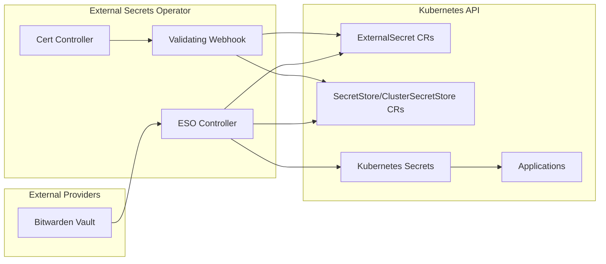

# External Secrets Integration

The External Secrets Operator (ESO) provides a Kubernetes-native way to pull secrets from external providers (Bitwarden in this cluster) and inject them as standard Kubernetes Secrets. This integration separates secret storage from Kubernetes, enabling centralized secret management and automated synchronization.

## Architecture Overview



*Figure: External Secrets Operator components and secret synchronization flow*

## Operator Deployment

### External Secrets Operator

The ESO core is deployed via Helm in the `external-secrets` namespace:

**HelmRelease** (`kubernetes/apps/external-secrets/external-secrets/app/helmrelease.yaml#L1-L36`)
- Chart: `external-secrets` version 2.8.0
- Source: `external-secrets` HelmRepository (charts.external-secrets.io)
- CRD installation: Enabled (`installCRDs: true`)
- Service monitors: Enabled for webhook and cert controller with 1m scrape intervals
- Remediation: Configured with rollback on failure and 3 retries

**Deployment Configuration**
```yaml
spec:
  interval: 1h
  chart:
    spec:
      chart: external-secrets
      version: 2.8.0
      sourceRef:
        kind: HelmRepository
        name: external-secrets
        namespace: flux-system
  values:
    installCRDs: true
    serviceMonitor:
      enabled: true
      interval: 1m
    webhook:
      serviceMonitor:
        enabled: true
    certController:
      serviceMonitor:
        enabled: true
```

**Flux Integration** (`kubernetes/apps/external-secrets/external-secrets/ks.yaml#L1-L22`)
- Managed by Flux Kustomization in the `external-secrets` namespace
- Prunes resources removed from Git
- Reconciliation interval: 1 hour with 2-minute retry interval
- Waits for resources to be ready before marking reconciliation complete

### Bitwarden Provider

The Bitwarden provider acts as the bridge between ESO and Bitwarden:

**HelmRelease** (`kubernetes/apps/external-secrets/bitwarden-connect/app/helmrelease.yaml#L1-L59`)
- Chart: `bitwarden-eso-provider` version 1.2.0
- Source: Custom HelmRepository from `gh-pages` branch (upstream is archived)
- Health checks: Extended liveness probe configuration
  - Initial delay: 20 seconds
  - Period: 300 seconds (5 minutes)
  - Failure threshold: 30 (allows 15-minute recovery window)
  - Timeout: 15 seconds
- CRD installation: Enabled for provider-specific resources
- Service monitors: Enabled for provider, webhook, and cert controller

**Authentication Configuration** (`kubernetes/apps/external-secrets/bitwarden-connect/app/helmrelease.yaml#L30-L46`)
```yaml
bitwarden_eso_provider:
  auth:
    existingSecret: "bitwarden-cli"
    secretKeys:
      password: "BW_PASSWORD"
      appID: "BW_USERNAME"
      host: "BW_HOST"
```

**Bitwarden Credentials Secret** (`kubernetes/apps/external-secrets/bitwarden-connect/app/secret.sops.yaml#L1-L12`)
- Name: `bitwarden-cli`
- Encrypted fields: `BW_HOST`, `BW_USERNAME`, `BW_PASSWORD`, `BW_CLIENTID`, `BW_CLIENTSECRET`
- Encryption: SOPS with age (cluster recipient)
- Decryption: Flux decrypts during reconciliation

**Flux Integration** (`kubernetes/apps/external-secrets/bitwarden-connect/ks.yaml#L15-L22`)
```yaml
decryption:
  provider: sops
  secretRef:
    name: sops-age
postBuild:
  substituteFrom:
    - name: cluster-secrets
      kind: Secret
```

## ClusterSecretStore Resources

The Bitwarden provider creates two cluster-wide SecretStore instances that enable ExternalSecret resources to pull secrets from Bitwarden:

### bitwarden-login ClusterSecretStore

**Purpose**: Extracts username/password credentials from Bitwarden login entries

**JSONPath**: `login.<property>`

**Access Pattern**:
```yaml
secretStoreRef:
  kind: ClusterSecretStore
  name: bitwarden-login
data:
  - secretKey: username
    remoteRef:
      key: bitwarden-item-name
      property: username
  - secretKey: password
    remoteRef:
      key: bitwarden-item-name
      property: password
```

**Use Cases**:
- Database credentials (PostgreSQL, MySQL, etc.)
- Service authentication (basic auth, username/password)
- Application login credentials
- API tokens stored as username/password pairs

### bitwarden-fields ClusterSecretStore

**Purpose**: Extracts custom field values from any Bitwarden item type

**JSONPath**: `fields[?(@.name=="<property>")].value`

**Access Pattern**:
```yaml
data:
  - secretKey: API_KEY
    sourceRef:
      storeRef:
        kind: ClusterSecretStore
        name: bitwarden-fields
    remoteRef:
      key: bitwarden-item-uuid-or-name
      property: API_KEY
```

**Use Cases**:
- API keys stored in custom fields
- Multi-part secrets (OAuth credentials, certificates)
- Structured configuration data
- App Store Connect keys, JWT secrets, encryption keys

**Key Distinction**: `bitwarden-login` only accesses `login.username` and `login.password` properties. Any secret requiring other properties must use `bitwarden-fields`.

## ExternalSecret Patterns

### Standard Login Secret

The most common pattern pulls username/password from Bitwarden login entries:

**Example: Tailscale OAuth** (`kubernetes/apps/network/tailscale/app/externalsecret.yaml#L1-L28`)
```yaml
apiVersion: external-secrets.io/v1
kind: ExternalSecret
metadata:
  name: tailscale-secret
spec:
  secretStoreRef:
    kind: ClusterSecretStore
    name: bitwarden-login
  target:
    name: tailscale-secret
    template:
      engineVersion: v2
      data:
        client_id: "{{ .client_id }}"
        client_secret: "{{ .client_secret }}"
  data:
    - secretKey: client_secret
      remoteRef:
        key: tailscale_k8s_oauth
        property: password
    - secretKey: client_id
      remoteRef:
        key: tailscale_k8s_oauth
        property: username
```

**Template Engine**: The `target.template.engineVersion: v2` template engine synthesizes multiple secret keys into structured data, enabling secret renaming and value transformation.

### Template-based Secret Composition

Applications combine multiple Bitwarden secrets with static configuration:

**Example: Gitea Database** (`kubernetes/apps/default/gitea/app/externalsecret.yaml#L10-L38`)
```yaml
spec:
  target:
    name: gitea-secret
    template:
      engineVersion: v2
      data:
        GITEA__database__DB_TYPE: "postgres"
        GITEA__database__HOST: "dev-postgres16-rw.database.svc.cluster.local:5432"
        GITEA__database__USER: "{{ .GITEA__database__USER }}"
        GITEA__database__PASSWD: "{{ .GITEA__database__PASSWD }}"
        INIT_POSTGRES_SUPER_PASS: '{{ .POSTGRES_SUPER_PASS }}'
  data:
    - secretKey: POSTGRES_SUPER_PASS
      remoteRef:
        key: cloudnative-pg
        property: password
    - secretKey: GITEA__database__USER
      remoteRef:
        key: gitea-db
        property: username
    - secretKey: GITEA__database__PASSWD
      remoteRef:
        key: gitea-db
        property: password
```

**Benefits**:
- Combines credentials from multiple Bitwarden items
- Adds static configuration (hostnames, ports)
- Renames secret keys to match application expectations
- Type-safe secret injection

### Multi-Store ExternalSecret

ExternalSecrets can source different keys from different ClusterSecretStores:

**Example: Growth Tracker** (`kubernetes/apps/default/growth-tracker/app/externalsecret.yaml#L36-L95`)
```yaml
spec:
  secretStoreRef:
    kind: ClusterSecretStore
    name: bitwarden-login  # Default store
  data:
    # From bitwarden-login (default)
    - secretKey: UMAMI_USERNAME
      remoteRef:
        key: umami.tomyail.com
        property: username

    # From bitwarden-fields (explicit storeRef)
    - secretKey: ASC_ISSUER_ID
      sourceRef:
        storeRef:
          name: bitwarden-fields
          kind: ClusterSecretStore
      remoteRef:
        key: growth-tracker-asc
        property: issuer_id
```

**Use Case**: Applications requiring both login credentials and custom fields combine both access patterns in a single ExternalSecret.

## Application Dependencies

### Flux Kustomization Dependencies

Applications that consume secrets from ExternalSecrets must declare dependencies on the Bitwarden provider to ensure proper initialization order:

**Example: Tailscale** (`kubernetes/apps/network/tailscale/ks.yaml#L22-L24`)
```yaml
spec:
  dependsOn:
    - name: bitwarden-connect
      namespace: external-secrets
```

**Dependency Chain**:
1. Flux reconciles `bitwarden-connect` Kustomization
2. Bitwarden ESO Provider pod starts and authenticates to Bitwarden
3. Provider creates `bitwarden-login` and `bitwarden-fields` ClusterSecretStores
4. Flux reconciles dependent Kustomizations (e.g., `tailscale`)
5. External Secrets Operator processes ExternalSecret resources
6. Target Kubernetes Secrets are created/updated

**Failure Impact**: Without the `dependsOn` declaration, applications may attempt to start before ClusterSecretStores exist, causing ExternalSecret synchronization failures.

### HelmRelease Integration

HelmReleases consume the synchronized Kubernetes Secrets via `valuesFrom`:

**Example: Tailscale** (`kubernetes/apps/network/tailscale/app/helmrelease.yaml#L27-L35`)
```yaml
valuesFrom:
  - kind: Secret
    name: tailscale-secret
    valuesKey: client_id
    targetPath: oauth.clientId
  - kind: Secret
    name: tailscale-secret
    valuesKey: client_secret
    targetPath: oauth.clientSecret
```

**Integration Flow**:
1. ExternalSecret creates `tailscale-secret` Kubernetes Secret
2. HelmRelease references the secret via `valuesFrom`
3. Helm template injects secret values into chart values
4. Helm renders manifests with secret values
5. Application pods receive credentials via environment variables or mounted volumes

## Secret Synchronization

### Reconciliation Behavior

External Secrets Operator continuously reconciles ExternalSecret resources at a configurable interval:

**Default Behavior**:
- Polls external provider (Bitwarden) for changes
- Compares remote values with existing Kubernetes Secrets
- Updates target Secrets when values differ
- Triggers workload rollout when annotated with `reloader.stakater.com/auto: "true"`

**Sync Interval**: Configured per ExternalSecret via `spec.refreshInterval` (defaults to operator-level setting if not specified)

### Secret Update Process

**Manual Rotation Workflow**:
1. Update secret in Bitwarden cloud or self-hosted instance
2. ESO detects change on next reconciliation cycle
3. Updates target Kubernetes Secret
4. Reloader (if annotated) triggers rolling restart of dependent pods
5. Applications receive updated values

**Automatic Rotation**: Not supported for Bitwarden provider - secrets update only when changed in Bitwarden vault.

## Troubleshooting

### Secret Synchronization Failures

**Symptom**: ExternalSecret shows `SecretSyncedError` or `NotFound` status

**Diagnosis Commands**:
```bash
# Check ExternalSecret status
kubectl get externalsecret -n <namespace> <name> -o yaml

# View ExternalSecret events for sync errors
kubectl describe externalsecret -n <namespace> <name>

# Check ESO Operator logs
kubectl logs -n external-secrets -l app.kubernetes.io/name=external-secrets

# Verify ClusterSecretStore exists
kubectl get clustersecretstore bitwarden-login -o yaml
kubectl get clustersecretstore bitwarden-fields -o yaml
```

**Common Causes**:

1. **Bitwarden item not found**
   - Symptom: `NotFound` status with item name in error message
   - Check: Verify Bitwarden item name matches `remoteRef.key` exactly
   - Fix: Create item in Bitwarden or correct the key name

2. **Property not accessible**
   - Symptom: `SecretSyncedError` with property path
   - Check: Verify property exists (username/password for login, custom field name for fields)
   - Fix: Use correct ClusterSecretStore or correct property name

3. **Authentication failure**
   - Symptom: Provider pod restarts, auth errors in logs
   - Check: `bitwarden-cli` Secret contains valid credentials
   - Fix: Update `BW_HOST`, `BW_USERNAME`, `BW_PASSWORD` in secret.sops.yaml

4. **ClusterSecretStore not ready**
   - Symptom: ExternalSecret pending, store not found
   - Check: `kubectl get clustersecretstore`
   - Fix: Ensure Bitwarden provider is running and ready

### Dependency Issues

**Symptom**: Application starts before ExternalSecret is synced

**Diagnosis**:
```bash
# Check Kustomization dependencies
kubectl get kustomization -n <namespace> <name> -o yaml | grep -A5 dependsOn

# Check ExternalSecret exists
kubectl get externalsecret -n <namespace>

# Check if target Secret exists
kubectl get secret -n <namespace> <secret-name>
```

**Fix**: Add `dependsOn` declaration to application's Kustomization referencing `bitwarden-connect` in the `external-secrets` namespace.

### Template Errors

**Symptom**: ExternalSecret synced but target Secret missing or malformed

**Diagnosis**:
```bash
# View target Secret
kubectl get secret -n <namespace> <secret-name> -o yaml

# Check ExternalSecret status for template errors
kubectl get externalsecret -n <namespace> <name> -o jsonpath='{.status.conditions}'
```

**Common Causes**:
- Invalid template syntax (unclosed braces, wrong engine version)
- Missing secret key references in `data` section
- JSONPath expression errors

### Verification Commands

**Check ESO Component Health**:
```bash
# Verify Bitwarden provider is running
kubectl get pods -n external-secrets -l app.kubernetes.io/name=bitwarden-cli

# Verify ESO controller is running
kubectl get pods -n external-secrets -l app.kubernetes.io/name=external-secrets

# Check ClusterSecretStores
kubectl get clustersecretstore

# List all ExternalSecrets and status
kubectl get externalsecret --all-namespaces
```

**Test Secret Sync**:
```bash
# Create test ExternalSecret
cat <<EOF | kubectl apply -f -
apiVersion: external-secrets.io/v1
kind: ExternalSecret
metadata:
  name: test-sync
  namespace: default
spec:
  secretStoreRef:
    kind: ClusterSecretStore
    name: bitwarden-login
  target:
    name: test-sync-secret
  data:
    - secretKey: test
      remoteRef:
        key: test-item
        property: username
EOF

# Watch sync status
kubectl get externalsecret test-sync -n default -w

# Check synced Secret
kubectl get secret test-sync-secret -n default -o yaml
```

## Security Considerations

### Access Control

- **ClusterSecretStore**: Cluster-wide, accessible from any namespace
- **SecretStore**: Namespace-scoped alternative (not used in this cluster)
- **ExternalSecret**: Namespace-scoped, limits secret access to their namespace

### Secret Persistence

- **Kubernetes Secrets**: Persist synced secret values in etcd
- **ExternalSecret CRs**: Store only references and templates, not actual secret values
- **Git Repository**: Stores only SOPS-encrypted Bitwarden credentials, not application secrets

### Rotation

- Bitwarden credentials (`BW_PASSWORD`, etc.) stored in `bitwarden-cli` Secret require manual rotation
- Update secret in `secret.sops.yaml`, commit, and Flux reconciliation updates the cluster
- Application secret rotation requires updating Bitwarden vault; ESO syncs changes on next reconciliation

## Related Documentation

- [Bitwarden Secrets Integration](../integrations/bitwarden.md) - Detailed Bitwarden provider configuration and patterns
- [Secrets Management](../concepts/secrets-management.md) - Overall secrets architecture including SOPS and age encryption
- [Networking Architecture](../concepts/networking.md) - Tailscale integration and network security
- [Application Deployment Workflow](../workflows/app-deployment.md) - ExternalSecret integration in app deployments
