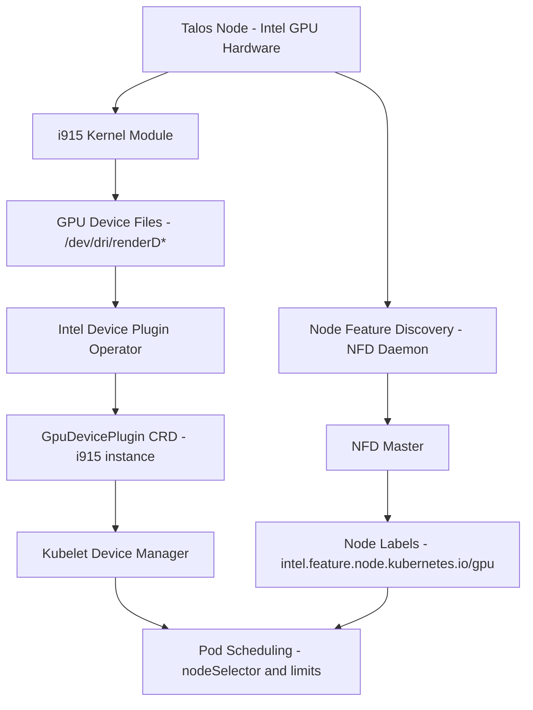

# Hardware and GPU Support

The cluster supports specialized hardware through Intel GPU device plugins, Node Feature Discovery (NFD) for automatic hardware labeling, and Talos kernel module configuration. This enables workloads requiring GPU acceleration to discover and schedule on nodes with appropriate hardware capabilities.

## Architecture Overview



*Figure: GPU support architecture from hardware through device plugins to pod scheduling*

## Intel GPU Support

### Kernel Module Configuration

Intel GPUs require the `i915` kernel module and supporting Direct Rendering Manager (DRM) modules. These are configured in Talos node definitions:

```yaml
kernelModules:
  - name: i915            # Intel GPU driver
  - name: drm             # Direct Rendering Manager
  - name: drm_kms_helper  # DRM KMS helper
```

**Required Modules** (`talos/talconfig.yaml#L35-L40`):

- **`i915`**: Intel integrated graphics driver supporting GPU compute workloads
- **`drm`**: Core DRM subsystem for device access and memory management
- **`drm_kms_helper`**: Kernel Mode Setting helper for display functionality

### Talos System Extension

The `siderolabs/i915` system extension provides the i915 kernel module and firmware for Intel GPU support:

```yaml
controlPlane:
  schematic:
    customization:
      systemExtensions:
        officialExtensions:
          - siderolabs/i915
```

**Extension Configuration** (`talos/talconfig.yaml#L78-L83`):

The extension is applied to control-plane nodes in the schematic customization, ensuring the GPU driver and firmware are available before the kernel module loads.

### Device Plugin Operator

The Intel Device Plugins Operator manages GPU device plugins through Kubernetes custom resources. It is deployed via Flux in the `kube-system` namespace:

```yaml
apiVersion: helm.toolkit.fluxcd.io/v2
kind: HelmRelease
metadata:
  name: intel-device-plugin-operator
  namespace: kube-system
spec:
  values:
    manager:
      devices:
        gpu: true
```

**Operator Configuration** (`kubernetes/apps/kube-system/intel-device-plugin-operator/app/helmrelease.yaml#L36-L38`):

The operator enables GPU device support and watches for `GpuDevicePlugin` custom resources.

### GPU Device Plugin Instance

The actual GPU device plugin is deployed as a separate Helm release that creates a `GpuDevicePlugin` custom resource:

```yaml
apiVersion: deviceplugin.intel.com/v1
kind: GpuDevicePlugin
metadata:
  name: i915
spec:
  deviceID: "i915"
  nodeFeatureRule: true
  sharedDevNum: 99
```

**Device Plugin Configuration** (`kubernetes/apps/kube-system/intel-device-plugin-operator/gpu/helmrelease.yaml#L34-L36`):

- **`name: i915`**: Identifies the Intel GPU device plugin instance
- **`nodeFeatureRule: true`**: Enables Node Feature Rule integration for automatic node labeling
- **`sharedDevNum: 99`**: Maximum number of clients that can share the GPU device simultaneously

**Deployment Dependency** (`kubernetes/apps/kube-system/intel-device-plugin-operator/ks.yaml#L38-L40`):

The GPU plugin depends on the operator being installed first, ensuring the CRD is available before creating the `GpuDevicePlugin` instance.

## Node Feature Discovery

Node Feature Discovery (NFD) automatically detects hardware features and labels nodes accordingly, enabling pod scheduling based on hardware capabilities.

### NFD Components

NFD runs as a DaemonSet with two components:

```yaml
master:
  resources:
    limits:
      memory: 512Mi
    requests:
      cpu: 10m
      memory: 128Mi
```

**Master Configuration** (`kubernetes/apps/kube-system/node-feature-discovery/app/helmrelease.yaml#L36-L42`):

- **NFD Master**: Runs as a deployment, processes discovered features and applies node labels
- **NFD Worker**: Runs as a DaemonSet, detects hardware features on each node

### GPU Node Label

NFD labels nodes with GPU capabilities using the Node Feature Rule configured in the GPU device plugin:

```yaml
nodeLabels:
  intel.feature.node.kubernetes.io/gpu: "true"
```

**Label Configuration** (`talos/talconfig.yaml#L32-L33`):

The label `intel.feature.node.kubernetes.io/gpu: "true"` is applied to nodes with Intel GPU hardware, enabling GPU-aware pod scheduling through `nodeSelector` or node affinity.

## Pod Scheduling with GPUs

Workloads requiring GPU acceleration use node selectors and resource limits to schedule on GPU-enabled nodes:

```yaml
apiVersion: v1
kind: Pod
metadata:
  name: gpu-workload
spec:
  nodeSelector:
    intel.feature.node.kubernetes.io/gpu: "true"
  containers:
  - name: app
    resources:
      limits:
        gpu.intel.com/i915: 1
```

**Scheduling Mechanism**:

1. **Node Selector**: Ensures pod only schedules on nodes with the GPU label
2. **Resource Limit**: Requests GPU device through the device plugin registered with Kubelet
3. **Device Allocation**: Kubelet assigns GPU device access to the pod container

## Example Workloads

Several applications in the cluster utilize Intel GPU acceleration:

- **Jellyfin**: Media transcoding with hardware acceleration (`kubernetes/apps/default/jellyfin/app/helmrelease.yaml#L60`)
- **Webtop**: Desktop environment with GPU-accelerated graphics (`kubernetes/apps/default/webtop/app/helmrelease.yaml#L41`)
- **Paper**: Document processing with GPU support (`kubernetes/apps/default/paper/app/helmrelease.yaml#L59`)
- **Playwright**: Browser automation with GPU acceleration (`kubernetes/apps/default/playwright/app/helmrelease.yaml#L41`)

These workloads specify `gpu.intel.com/i915: 1` in their resource limits and rely on the GPU node label for scheduling.

## Troubleshooting

### Verifying GPU Availability

Check if the GPU device plugin is running and ready:

```bash
kubectl get gpus deviceplugin.intel.com i915 -n kube-system
kubectl describe node <node-name> | grep -i gpu
```

**Health Checks** (`kubernetes/apps/kube-system/intel-device-plugin-operator/ks.yaml#L49-L53`):

Flux monitors the `GpuDevicePlugin` status, checking that `status.numberReady` matches `status.desiredNumberScheduled`.

### Checking Kernel Module Status

Verify required kernel modules are loaded on Talos nodes:

```bash
talosctl read /proc/modules
```

Expected modules include `i915`, `drm`, and `drm_kms_helper`.

### Node Label Verification

Confirm NFD has applied the GPU label:

```bash
kubectl get nodes -L intel.feature.node.kubernetes.io/gpu
```

Nodes with GPU hardware should show `true` for the label.

### Device Plugin Logs

Inspect device plugin operator and GPU plugin logs for errors:

```bash
kubectl logs -n kube-system deployment/intel-device-plugins-operator
kubectl logs -n kube-system daemonset/intel-device-plugin-gpu
```

### Common Issues

**GPU not detected**: Ensure the `siderolabs/i915` extension is installed in the Talos schematic and kernel modules are configured.

**Node label missing**: Verify NFD is running and the GPU device plugin has `nodeFeatureRule: true` enabled.

**Pod scheduling fails**: Confirm the pod specifies both the node selector for GPU capability and the resource limit for `gpu.intel.com/i915`.

## Configuration References

- **Talos Config**: `talos/talconfig.yaml` - Kernel modules, node labels, and system extensions
- **Intel Device Plugin Operator**: `kubernetes/apps/kube-system/intel-device-plugin-operator/`
- **Node Feature Discovery**: `kubernetes/apps/kube-system/node-feature-discovery/`
- **Related Pages**: [Talos Configuration Management](/openwiki/concepts/talos-config.md)
