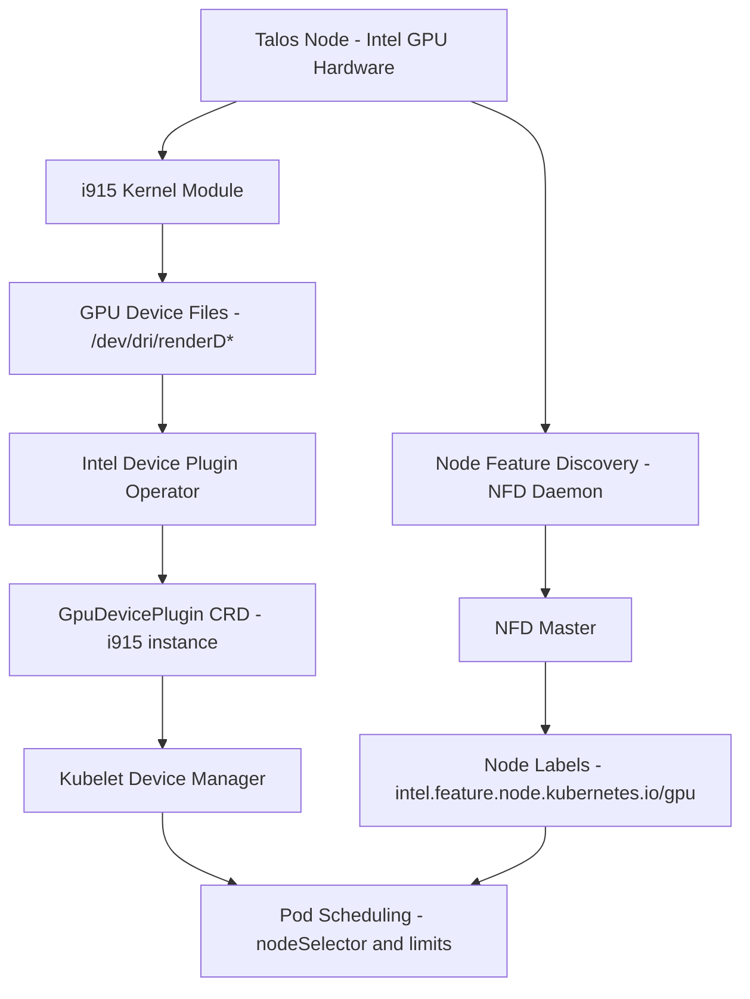

# Hardware and GPU Support

The cluster supports specialized hardware through Intel GPU device plugins, Node Feature Discovery (NFD) for automatic hardware labeling, and Talos kernel module/udev configuration. This enables workloads requiring GPU acceleration to discover and schedule on nodes with appropriate hardware capabilities.

## Architecture Overview



*Figure: GPU support architecture from hardware through device plugins to pod scheduling*

The cluster currently has a single node, `master0-nuc12` (control plane, secure boot enabled), which is the GPU-capable node. All GPU support below applies to it.

## Node Hardware Inventory

`talos/talconfig.yaml` defines the node `master0-nuc12` at `192.168.50.145`, which is the only node and provides the cluster's hardware specialization:

- **Intel GPU (i915 family)**: driver, firmware, and device access configured at the Talos layer (see below)
- **Secure boot** (`machineSpec.secureboot: true`) with a secure-boot installer image from `factory.talos.dev`
- **Thunderbolt and Intel microcode support** via the `siderolabs/thunderbolt` and `siderolabs/intel-ucode` system extensions

Because the node is both control plane and the only worker, GPU device plugin pods and GPU workloads all land on the control-plane node.

## Intel GPU Support

### Kernel Module Configuration

Intel GPUs require the `i915` kernel module and supporting Direct Rendering Manager (DRM) modules. These are configured in the Talos node definition alongside storage-related modules:

```yaml
kernelModules:
  - name: i915            # Intel GPU driver
  - name: drm             # Direct Rendering Manager
  - name: drm_kms_helper  # DRM KMS helper
```

**Required Modules** (`talos/talconfig.yaml#L35-L40`):

- **`i915`**: Intel integrated graphics driver supporting GPU compute and media workloads
- **`drm`**: Core DRM subsystem for device access and memory management
- **`drm_kms_helper`**: Kernel Mode Setting helper for display functionality

(The node also loads `dm_thin_pool` and `dm_mod`; these serve storage, not GPU.)

### Talos System Extensions

The `siderolabs/i915` system extension provides the i915 kernel module and firmware for Intel GPU support:

```yaml
controlPlane:
  schematic:
    customization:
      systemExtensions:
        officialExtensions:
          - siderolabs/i915
          - siderolabs/intel-ucode
          - siderolabs/thunderbolt
```

**Extension Configuration** (`talos/talconfig.yaml#L78-L84`):

The extensions are baked into the control-plane node's custom Talos installer schematic, ensuring the GPU driver and firmware are available before the kernel module loads. Changing the extension set changes the image digest and requires a Talos upgrade.

### Udev Rules for Device Access

Containerized GPU applications need access to `/dev/dri/renderD*` devices. A global Talos patch grants the video group (GID 44) access to DRM render devices:

```yaml
machine:
  udev:
    rules:
      - SUBSYSTEM=="drm", KERNEL=="renderD*", GROUP="44", MODE="0660"
```

**Udev Rule** (`talos/patches/global/machine-udev.yaml#L4-L9`):

This matches all DRM render nodes (`renderD128`, `renderD129`, ...) and sets group ownership to GID 44 with `0660` permissions. Pods consuming the GPU run with `supplementalGroups: [44]` (e.g. Jellyfin's `defaultPodOptions`) so their containers can open the render device.

### Device Plugin Operator

The Intel Device Plugins Operator manages GPU device plugins through Kubernetes custom resources. It is deployed via Flux in the `kube-system` namespace:

```yaml
apiVersion: helm.toolkit.fluxcd.io/v2
kind: HelmRelease
metadata:
  name: intel-device-plugin-operator
spec:
  values:
    manager:
      devices:
        gpu: true
```

**Operator Configuration** (`kubernetes/apps/kube-system/intel-device-plugin-operator/app/helmrelease.yaml#L35-L38`):

The operator enables GPU device support (chart `0.34.1`) and watches for `GpuDevicePlugin` custom resources. Its Flux Kustomization health-checks the operator HelmRelease before dependents reconcile.

### GPU Device Plugin Instance

The actual GPU device plugin is deployed as a separate Helm release whose values create a `GpuDevicePlugin` custom resource:

```yaml
apiVersion: deviceplugin.intel.com/v1
kind: GpuDevicePlugin
metadata:
  name: i915
spec:
  deviceID: "i915"
  nodeFeatureRule: true
  sharedDevNum: 99
```

**Device Plugin Values** (`kubernetes/apps/kube-system/intel-device-plugin-operator/gpu/helmrelease.yaml#L33-L36`):

- **`name: i915`**: Identifies the Intel GPU device plugin instance and the resource name exposed to pods (`gpu.intel.com/i915`)
- **`nodeFeatureRule: true`**: Creates a Node Feature Rule so nodes running the plugin are automatically labeled via NFD
- **`sharedDevNum: 99`**: Maximum number of clients that can share each physical GPU device simultaneously (device sharing/intelgmented time-slicing)

**Deployment Dependency** (`kubernetes/apps/kube-system/intel-device-plugin-operator/ks.yaml#L38-L40`):

The `intel-device-plugin-gpu` Kustomization `dependsOn` the `intel-device-plugin-operator` Kustomization, ensuring the CRDs exist before the `GpuDevicePlugin` instance is applied.

**Readiness Semantics** (`kubernetes/apps/kube-system/intel-device-plugin-operator/ks.yaml#L46-L53`):

The GPU Kustomization additionally health-checks the `GpuDevicePlugin/i915` resource directly: it is considered healthy only while `status.desiredNumberScheduled == status.numberReady`. If the device plugin DaemonSet is not fully ready (e.g. the i915 module failed to load), the Flux Kustomization reports unhealthy, surfacing hardware-level failures in GitOps reconciliation.

## Node Feature Discovery

Node Feature Discovery (NFD, chart `0.18.0`) automatically detects hardware features and labels nodes accordingly, enabling pod scheduling based on hardware capabilities.

### NFD Components

- **NFD Master**: Runs as a deployment, processes discovered features and applies node labels (`kubernetes/apps/kube-system/node-feature-discovery/app/helmrelease.yaml#L36-L42`)
- **NFD Worker**: Runs as a DaemonSet, detects hardware features (including PCI devices and kernel modules) on each node

The master is sized with a 512Mi memory limit and 10m CPU / 128Mi memory requests — NFD is deliberately lightweight.

### GPU Node Label

The GPU-capable node carries the label:

```yaml
nodeLabels:
  intel.feature.node.kubernetes.io/gpu: "true"
```

This label is set **statically** in the Talos machine config (`talos/talconfig.yaml#L32-L33`) for the node, and NFD complements it: `nodeFeatureRule: true` on the `GpuDevicePlugin` creates a NodeFeatureRule so NFD also applies the Intel GPU feature label based on detected hardware. Both mechanisms feed GPU-aware pod scheduling through `nodeSelector` or node affinity.

## Pod Scheduling with GPUs

Workloads requiring GPU acceleration use resource limits (and optionally node selectors) to schedule on GPU-enabled nodes:

```yaml
resources:
  limits:
    gpu.intel.com/i915: 1
```

**Scheduling Mechanism**:

1. **Resource Limit**: Requests a shared GPU device slot through the device plugin registered with the Kubelet (`gpu.intel.com/i915`)
2. **Device Allocation**: Kubelet assigns GPU device access (`/dev/dri/renderD*`) to the pod container via the device plugin
3. **Node placement**: Because the cluster has a single GPU-capable node, the resource request effectively pins the workload to `master0-nuc12`; the NFD label supports `nodeSelector` if more nodes are added later

## Example Workloads

Several applications in the cluster utilize Intel GPU acceleration by requesting `gpu.intel.com/i915: 1`:

- **Jellyfin**: Media transcoding with hardware acceleration (`kubernetes/apps/default/jellyfin/app/helmrelease.yaml#L60`)
- **Webtop**: Desktop environment with GPU-accelerated graphics (`kubernetes/apps/default/webtop/app/helmrelease.yaml#L41`)
- **Paper**: Document processing with GPU support (`kubernetes/apps/default/paper/app/helmrelease.yaml#L59`)
- **Playwright**: Browser automation with GPU acceleration (`kubernetes/apps/default/playwright/app/helmrelease.yaml#L41`)

## Troubleshooting

- **Plugin not scheduling / Kustomization unhealthy**: Check `GpuDevicePlugin i915` `status.numberReady` vs `desiredNumberScheduled`; the Flux health expression (`kubernetes/apps/kube-system/intel-device-plugin-operator/ks.yaml#L49-L53`) fails reconciliation until all plugin pods are ready.
- **Device permission errors in containers**: Verify the udev rule (`talos/patches/global/machine-udev.yaml`) and that the pod runs with `supplementalGroups: [44]`.
- **Module missing after node rebuild**: The `siderolabs/i915` extension must be in the installer schematic (`talos/talconfig.yaml#L78-L84`); verify the node boots the matching factory image digest.
