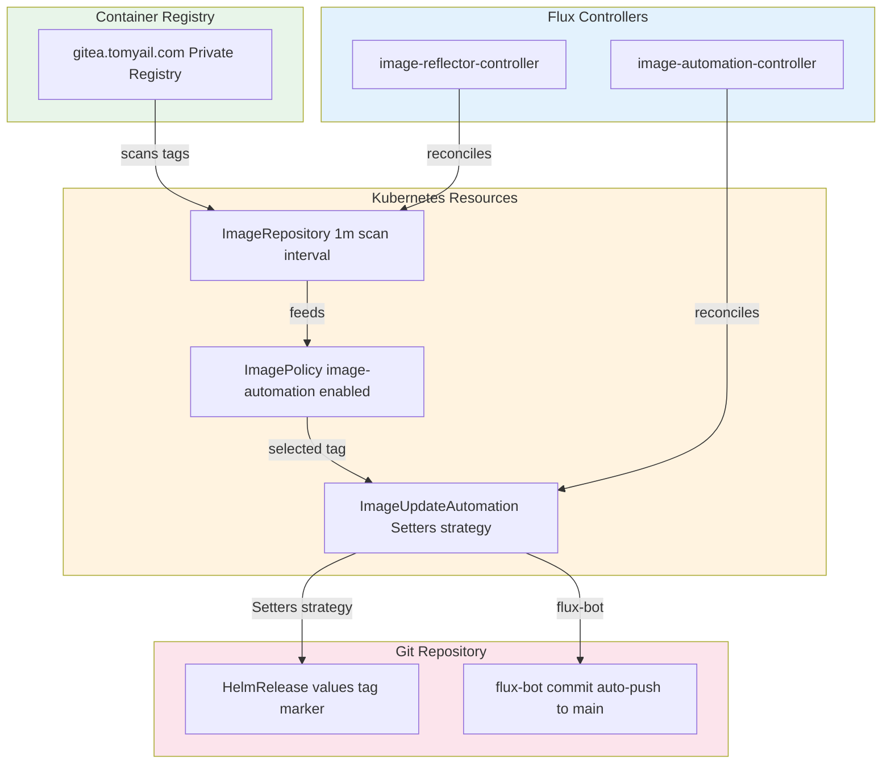

# Flux Image Automation

Flux Image Automation provides automated container image tag updates for applications in the default namespace. The system tracks image registry changes, selects the latest tags based on configurable policies, and commits updates back to the Git repository using the flux-bot identity.

## Architecture Overview



*Figure: Flux image automation flow from registry scanning through policy-based tag selection to automated Git commits*

## Core Components

### ImageRepository

The ImageRepository resource defines which container image repository to scan and how often to check for new tags.

**Template** (`kubernetes/components/image-automation/imagerepository.yaml`)
- **Interval**: 1 minute scan frequency
- **Image**: Variable `REGISTRY_URL` (e.g., `gitea.tomyail.com/tomyail/beancount`)
- **Secret reference**: Pull secret for private registry authentication

The ImageRepository is instantiated per application using Kustomize variable substitution in the app's `ks.yaml` postBuild configuration.

### ImagePolicy

The ImagePolicy resource defines how to select the appropriate image tag from the available tags scanned by ImageRepository.

**Template** (`kubernetes/components/image-automation/imagepolicy.yaml`)
- **Label selector**: `image-automation: enabled` (required for discovery)
- **Policy type**: Numerical ordering in ascending direction
- **Tag filter pattern**: `^.+-[a-f0-9]+-(?P<ts>[0-9]+)$` with timestamp extraction

**Example override** (`kubernetes/apps/default/omnifocus-sync-server/app/kustomization.yaml`)
- Alternative alphabetical policy in descending order
- Pattern: `^sha-[a-f0-9]+$` for pure SHA tags

The ImagePolicy evaluates tags against the filter pattern, extracts the timestamp from matching tags, and selects the newest tag based on the numerical policy.

### ImageUpdateAutomation

The ImageUpdateAutomation resource orchestrates the automated update process, discovering ImagePolicy resources and updating manifests with selected tags.

**Configuration** (`kubernetes/apps/flux-system/image-automation/automation.yaml`)
- **Interval**: 5 minutes between automation runs
- **Strategy**: Setters (replaces `{"$imagepolicy": ...}` markers)
- **Update path**: `./kubernetes/apps/default`
- **Git repository**: `flux-system-https` (main branch)
- **Commit author**: flux-bot with GitHub noreply email
- **Policy selector**: Matches `image-automation: enabled` label

The ImageUpdateAutomation scans the specified path for manifests containing image policy markers, replaces them with the latest selected tags, and commits changes back to Git.

## flux-bot Commit Workflow

The flux-bot identity handles all automated image updates:

1. **Discovery**: ImageUpdateAutomation finds all ImagePolicy resources with the `image-automation: enabled` label across namespaces
2. **Tag resolution**: Each ImagePolicy reports its latest selected tag based on the repository scan and policy logic
3. **Manifest update**: The Setters strategy replaces `{"$imagepolicy": "NAMESPACE:APP:tag"}` markers in YAML files
4. **Commit creation**: flux-bot creates a Git commit with the updated manifests
5. **Push**: Changes are pushed directly to the main branch

**Commit signature** (`kubernetes/apps/flux-system/image-automation/automation.yaml`)
- Author name: `flux-bot`
- Email: `flux-bot@users.noreply.github.com`

This workflow enables continuous deployment where new image builds trigger automatic updates without manual intervention.

## Integration with Applications

### Application Kustomization

Applications opt into image automation by including the image-automation component:

**Example** (`kubernetes/apps/default/fava/ks.yaml`)
```yaml
components:
  - ../../../../components/image-automation
```

The component provides:
1. **ExternalSecret** for registry credentials (from Bitwarden)
2. **ImageRepository** for scanning the image registry
3. **ImagePolicy** with the `image-automation: enabled` label

### Variable Substitution

Applications provide context via postBuild substitution:

**Variables** (`kubernetes/apps/default/fava/ks.yaml`)
- `APP`: Application name (e.g., `fava`)
- `NAMESPACE`: Target namespace (e.g., `default`)
- `REGISTRY_URL`: Full image repository path
- `REGISTRY_HOST`: Registry hostname for secret template
- `BW_ID`: Bitwarden credential ID

These variables instantiate the component templates with application-specific values.

### Image Policy Marker

HelmRelease values reference the ImagePolicy using the Setters syntax:

**Example** (`kubernetes/apps/default/fava/app/helmrelease.yaml`)
```yaml
tag: "main-786bccf17263-1785740665" # {"$imagepolicy": "default:fava:tag"}
```

The marker format is `{"$imagepolicy": "NAMESPACE:APP:tag"}`. When ImageUpdateAutomation runs, it replaces the entire tag value (including the comment placeholder) with the latest selected tag from the policy.

### Image Pull Secret

The component creates an image pull secret that is referenced in the HelmRelease:

**Example** (`kubernetes/apps/default/fava/app/helmrelease.yaml`)
```yaml
imagePullSecrets:
  - name: fava-registry-secret
```

The ExternalSecret template constructs a valid `dockerconfigjson` secret using credentials retrieved from Bitwarden.

## Relationship with Renovate

Flux Image Automation and Renovate operate as complementary dependency management systems:

| Aspect | Renovate | Flux Image Automation |
|--------|----------|----------------------|
| **Scope** | All dependency types (images, Helm, GitHub Actions, Talos/Kubernetes versions) | Container image tags only |
| **Trigger** | Scheduled runs (weekends) | Continuous (5-minute intervals) |
| **Output** | Pull requests for review | Direct commits to main branch |
| **Version selection** | Semantic versioning, group updates | Tag pattern matching and sorting |
| **Primary use** | Infrastructure and application dependency updates | Application CI/CD image promotion |

**Renovate** (`/.renovaterc.json5`) tracks version references across the repository and creates pull requests for updates, including container images. **Flux Image Automation** (`kubernetes/apps/flux-system/image-automation/automation.yaml`) provides a separate mechanism specifically for automated image tag updates in the default namespace, complementing Renovate's broader dependency management.

This separation allows Renovate to handle infrastructure and version drift while Flux handles continuous image promotion for production applications.

## Flux Controller Dependencies

Image Automation requires two Flux controllers to be installed:

**Components** (`kubernetes/apps/flux-system/flux-instance/app/helm/values.yaml`)
- `image-reflector-controller`: Reconciles ImageRepository and ImagePolicy resources
- `image-automation-controller`: Reconciles ImageUpdateAutomation resources

These controllers are part of the Flux instance deployment and run continuously to scan registries, evaluate policies, and update Git.

## Operational Behavior

### Scan Frequency

**ImageRepository** scans every 1 minute (`kubernetes/components/image-automation/imagerepository.yaml`), providing near-real-time detection of new image builds. The ImagePolicy evaluates these tags on each reconciliation to determine the latest version.

### Automation Interval

**ImageUpdateAutomation** runs every 5 minutes (`kubernetes/apps/flux-system/image-automation/automation.yaml`). During each run:
1. It queries all ImagePolicy resources matching the label selector
2. Scans manifests in the configured path for policy markers
3. Replaces markers with the current policy-selected tags
4. Creates a Git commit if any changes occurred

### Update Path

The automation is scoped to `./kubernetes/apps/default` (`kubernetes/apps/flux-system/image-automation/automation.yaml`), limiting updates to default namespace applications. This prevents unintended modifications to cluster infrastructure or system components.

### Failure Handling

If registry credentials are invalid or the registry is unreachable, the ImageRepository reports a `Ready: False` status. The ImagePolicy cannot select a tag in this state, and ImageUpdateAutomation will skip updates for that application until the repository becomes healthy again.

## Configuration Examples

### Standard Application (fava)

Uses the default numerical policy with timestamp-based tag filtering:

**Policy**: `^.+-[a-f0-9]+-(?P<ts>[0-9]+)$` (e.g., `main-786bccf17263-1785740665`)

This pattern matches CI/CD generated tags that embed timestamps, ensuring the chronologically newest build is selected.

### SHA-Based Application (omnifocus-sync-server)

Overrides to alphabetical policy for pure SHA tags:

**Policy**: `^sha-[a-f0-9]+$` with alphabetical descending order

This pattern matches git commit SHA tags and selects the highest SHA value (typically the newest commit in lexicographic sort).

### Private Registry

All configured applications use a private Gitea container registry (`gitea.tomyail.com`), requiring authentication via ExternalSecret from Bitwarden credentials. The registry hostname is substituted into the dockerconfigjson template to construct valid pull secrets.
