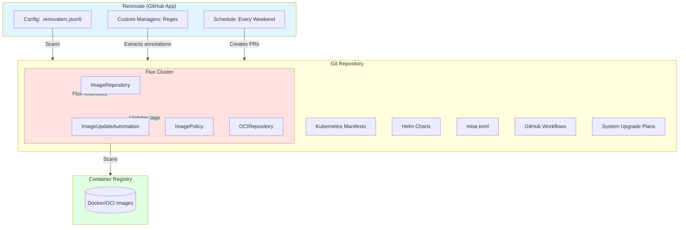

# Renovate Dependency Automation

Renovate provides automated dependency updates for the Talos cluster, handling container images, Helm charts, OCI repositories, Kubernetes manifests, Talos/Kubernetes versions, and development toolchains. The bot runs on a schedule and creates pull requests for dependency updates while supporting selective auto-merge policies.

## Architecture Overview



Renovate operates as the **upstream dependency tracking layer** that creates pull requests for version updates in Git, while **Flux handles downstream reconciliation** of those changes into the cluster. ImageUpdateAutomation provides a separate mechanism for automated image tag updates that complements Renovate's version reference tracking.

## Configuration

Renovate is configured via `.renovaterc.json5` in the repository root with the following core settings:

- **Schedule**: Runs every weekend
- **Dashboard**: Enabled with the title "Renovate Dashboard 🤖"
- **Ignore paths**: Excludes SOPS-encrypted files (`**/*.sops.*`)
- **Semantic commits**: Enabled with conventional commit messages
- **Dependency dashboard**: Tracks all pending updates

### Base Presets

The configuration extends these Renovate presets:

- `config:recommended`: Standard Renovate best practices
- `docker:enableMajor`: Enables major version updates for Docker images
- `helpers:pinGitHubActionDigests`: Pins GitHub Actions to digests
- `:automergeBranch`: Auto-merge via branch updates
- `:dependencyDashboard`: Enables the dependency dashboard
- `:disableRateLimiting`: Removes API rate limits
- `:semanticCommits`: Uses conventional commit format

## Renovate Managers

Renovate uses specialized managers to track different dependency types across the repository:

### Container Images

**Flux Helm Releases** (`flux` manager)
- Pattern: `/(^|/)kubernetes/.+\.ya?ml(?:\.j2)?$/`
- Updates images in HelmRelease resources

**Kubernetes manifests** (`kubernetes` manager)
- Pattern: `/(^|/)kubernetes/.+\.ya?ml(?:\.j2)?$/`
- Updates images in Deployment, StatefulSet, DaemonSet resources

**Helm values** (`helm-values` manager)
- Pattern: `/(^|/)kubernetes/.+\.ya?ml(?:\.j2)?$/`
- Updates image tags in Helm value files

**Kustomize** (`kustomize` manager)
- Pattern: `/^kustomization\.ya?ml(?:\.j2)?$/`
- Updates images referenced in Kustomization files

### Helm Charts and OCI Repositories

**Helm repositories** (`helmfile` manager)
- Pattern: `/(^|/)helmfile\.ya?ml(?:\.j2)?$/`
- Updates Helm chart versions

HelmRepository sources in `kubernetes/flux/meta/repos/` define the chart repositories that Renovate monitors. Each repository uses Renovate annotations on version tags:

```yaml
# kubernetes/flux/meta/repos/gateway-api.yaml#L12
# renovate: datasource=github-releases depName=kubernetes-sigs/gateway-api
tag: v1.6.1
```

```yaml
# kubernetes/flux/meta/repos/external-dns-crds.yaml#L12
# renovate: datasource=github-releases depName=kubernetes-sigs/external-dns
tag: v0.21.0
```

OCI repositories are tracked through Flux OCIRepository resources, such as the app-template chart used by most applications.

### Custom Datasource Annotations

Renovate uses a custom regex manager to process `# renovate:` annotations in `.env`, `.sh`, and `.ya?ml` files (`.renovaterc.json5#L206-L229`). This enables tracking dependencies that don't fit standard manager patterns.

**Kubernetes and Talos versions** are tracked via these annotations in system upgrade manifests:

**Kubernetes version** (`kubernetes/apps/kube-system/system-upgrade/upgrades/kubernetes.yaml#L9`)
```yaml
# renovate: datasource=docker depName=ghcr.io/siderolabs/kubelet
version: v1.35.4
```

**Talos version** (`kubernetes/apps/kube-system/system-upgrade/upgrades/talos.yaml#L9`)
```yaml
# renovate: datasource=docker depName=ghcr.io/siderolabs/installer
version: v1.12.7
```

**Talenv configuration** (`talos/talenv.yaml`)
```yaml
# renovate: datasource=docker depName=ghcr.io/siderolabs/installer
talosVersion: v1.12.7
# renovate: datasource=docker depName=ghcr.io/siderolabs/kubelet
kubernetesVersion: v1.35.4
```

The custom regex manager extracts four key fields from annotated comments:
- `datasource`: The type of dependency source (docker, github-releases, helm)
- `depName`: The dependency name/path
- `registryUrl`: Optional repository URL for Helm charts
- `currentValue`: The current version string

### GitHub Actions

**GitHub Actions** are tracked through the `github-actions` manager:
- File patterns: `.github/workflows/*.yml`, `.github/workflows/*.yaml`
- Auto-merge: Enabled for minor, patch, and digest updates
- Minimum release age: 3 days
- Commits pinned to digest references via `helpers:pinGitHubActionDigests` preset
- Semantic commit type: `ci`

### Toolchain Versions

**mise tools** (`mise` manager)
- Source: `.mise.toml`
- Auto-merge: Enabled for minor and patch updates
- Tracks: Python, aqua tools, Node.js, pipx versions

Example from `.mise.toml`:
```toml
[tools]
"python" = "3.14.7"
"aqua:budimanjojo/talhelper" = "3.1.17"
"aqua:cilium/cilium-cli" = "0.20.0"
node = "latest"
pipx = "latest"
```

## Package Grouping

Dependencies are grouped to reduce PR noise and ensure coordinated updates (`.renovaterc.json5#L31-L67`):

- **Cert-Manager**: All cert-manager container images
- **CoreDNS**: CoreDNS images
- **Flux Operator**: Flux operator and instance images
- **Spegel**: Spegel image cache images

Each group creates a single PR when multiple dependencies in the group have updates available.

## Semantic Commit Rules

Renovate applies semantic commit conventions based on update types (`.renovaterc.json5#L86-L131`):

| Update Type | Commit Type | Scope | Example |
|-------------|-------------|-------|---------|
| Major | `feat` | `container`, `helm`, etc. | `feat(container)!: nginx 1.0.0 → 2.0.0` |
| Minor | `feat` | `container`, `helm`, etc. | `feat(container): nginx 1.0.0 → 1.1.0` |
| Patch | `fix` | `container`, `helm`, etc. | `fix(container): nginx 1.0.0 → 1.0.1` |
| Digest | `chore` | `container`, `helm`, etc. | `chore(container): abc123 → def456` |
| GitHub Actions | `ci` | `github-action` | `ci(github-action): checkout v4.2.2 → v4.3.0` |

Datasource-specific scopes:
- Docker images: `container`
- Helm charts: `helm`
- GitHub Actions: `github-action`
- GitHub releases: `github-release`
- mise tools: `mise`

## Labeling Strategy

PRs are labeled for easy filtering (`.renovaterc.json5#L133-L159`):

**Update type labels**:
- `type/major`: Major version bumps
- `type/minor`: Minor version updates
- `type/patch`: Patch updates

**Datasource labels**:
- `renovate/container`: Container image updates
- `renovate/helm`: Helm chart updates
- `renovate/github-action`: GitHub Actions updates
- `renovate/github-release`: GitHub release updates

## Auto-Merge Policies

Renovate selectively auto-merges updates based on risk assessment:

**GitHub Actions** (`.renovaterc.json5#L69-L76`)
- Auto-merge: minor, patch, digest updates
- Minimum release age: 3 days
- Ignores tests

**mise tools** (`.renovaterc.json5#L77-L84`)
- Auto-merge: minor and patch updates
- Ignores tests

**Application layer** (`.renovaterc.json5#L161-L204`)
- Auto-merge: minor, patch, digest updates
- Excludes core infrastructure components:
  - Storage/database operators (topolvm, local-path-provisioner, csi-driver-nfs, volsync, snapshot-controller, cloudnative-pg, dragonflydb/operator)
  - Networking/CNI/DNS/tunnel (cilium, external-dns, tailscale-operator, cloudflared, gateway-api, coredns, spegel)
  - Certificates/secrets (cert-manager, external-secrets, bitwarden-eso-provider)
  - GitOps (flux-operator, flux-instance, controlplaneio-fluxcd)
  - Monitoring/observability (kube-prometheus-stack, prometheus-operator, smartctl-exporter, thanos, loki, metrics-server, k8s-sidecar)
  - Cluster components (siderolabs/installer, siderolabs/kubelet)
  - Shared charts (app-template)

## Flux Image Automation

While Renovate updates version references in Git, Flux ImageUpdateAutomation handles the actual image tag updates for applications using the ImagePolicy mechanism.

### Image Automation Controller

The automation controller runs in the flux-system namespace (`kubernetes/apps/flux-system/image-automation/automation.yaml`):

```yaml
spec:
  interval: 5m
  update:
    strategy: Setters
    path: ./kubernetes/apps/default
  sourceRef:
    kind: GitRepository
    name: flux-system-https
  git:
    checkout:
      ref:
        branch: main
    commit:
      author:
        name: flux-bot
        email: flux-bot@users.noreply.github.com
    push:
      branch: main
  policySelector:
    matchLabels:
      image-automation: enabled
```

The controller:
- Scans the `./kubernetes/apps/default` directory every 5 minutes
- Updates image tags using the Setters strategy
- Commits changes as `flux-bot`
- Only processes ImagePolicy resources with the `image-automation: enabled` label

### ImagePolicy Component

Applications using image automation include the `image-automation` component in their Kustomization (`kubernetes/components/image-automation/`):

**Example usage** from component README:
```yaml
components:
  - ../../../../components/image-automation
postBuild:
  substitute:
    APP: myapp
    NAMESPACE: default
    REGISTRY_URL: gitea.tomyail.com/tomyail/myapp
    REGISTRY_HOST: gitea.tomyail.com
    BW_ID: d01d04c2-30c2-4afe-b19b-10dfaced8670
```

The component provides:
- **ExternalSecret**: Fetches registry credentials from Bitwarden
- **ImageRepository**: Scans the registry for new image tags every minute
- **ImagePolicy**: Selects the latest image based on policy rules with numerical sorting (ascending)

**HelmRelease integration** (`kubernetes/apps/default/fava/app/helmrelease.yaml#L28`):
```yaml
image:
  repository: gitea.tomyail.com/tomyail/beancount
  tag: "main-786bccf17263-1785740665" # {"$imagepolicy": "default:fava:tag"}
```

The `{"$imagepolicy": "NAMESPACE:APP:tag"}` marker syntax enables ImageUpdateAutomation to replace image tags with values from ImagePolicy resources.

### Policy Customization

Applications can override default ImagePolicy behavior via Kustomization patches. For example, changing from numerical to alphabetical sorting for SHA-based tags (`kubernetes/apps/default/omnifocus-sync-server/app/kustomization.yaml`):

```yaml
patches:
  - target:
      kind: ImagePolicy
      name: omnifocus-sync-server
    patch: |
      spec:
        policy:
          alphabetical:
            order: desc
        filterTags:
          pattern: "^sha-[a-f0-9]+$"
```

### Namespace Configuration

Flux repositories under the cluster-meta Kustomization must hardcode `flux-system` as their namespace to ensure Renovate can correctly locate and update them (`kubernetes/flux/cluster/ks.yaml#L21-L22`). Renovate searches in `flux-system` regardless of the manifest's specified namespace, so the targetNamespace must match this expectation.

## Integration Summary

Renovate and Flux provide complementary automation layers:

- **Renovate**: Tracks version references in Git manifests and creates PRs for updates
- **Flux ImageUpdateAutomation**: Automatically updates image tags based on registry scanning
- **Flux reconciliation**: Applies manifest changes to the cluster

This separation allows for flexible update policies—some dependencies can be auto-merged by Renovate, while image tags can be continuously updated by Flux based on registry availability.
