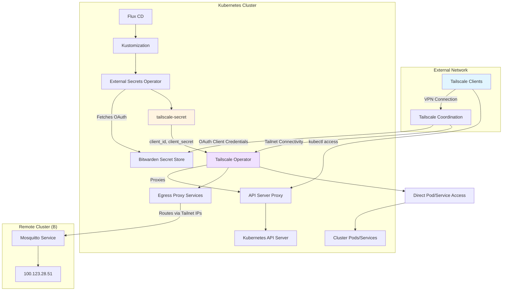

# Tailscale Integration

The cluster integrates Tailscale through the Tailscale Operator to provide mesh VPN networking capabilities. This integration enables secure access to cluster resources from anywhere in the Tailscale network (tailnet), OAuth-based authentication for operator management, Kubernetes API server proxy for remote cluster administration, and egress proxy configuration for routing traffic to services in other clusters.

## Architecture Overview



## Deployment Configuration

The Tailscale integration is deployed via a HelmRelease in the `network` namespace, managed by Flux CD.

### HelmRelease Configuration

The HelmRelease installs the `tailscale-operator` chart version 1.98.9 from the official Tailscale Helm repository.

**Core Settings** (helmrelease.yaml#L18-L26)
- **Hostname**: `tailscale` - Operator hostname identifier
- **API Server Proxy**: Enabled with mode `'true'` - Allows remote kubectl access through Tailscale
- **Pod Annotations**: Includes `reloader.stakater.com/auto: "true"` for automatic reloads on config changes

**OAuth Integration** (helmrelease.yaml#L27-L35)
- **Client ID**: Injected from `tailscale-secret` secret key `client_id` → `oauth.clientId`
- **Client Secret**: Injected from `tailscale-secret` secret key `client_secret` → `oauth.clientSecret`

### Kustomization Dependencies

The Kustomization (ks.yaml) declares dependencies on:
- **Bitwarden Connect**: Required for OAuth credentials retrieval
- **SOPS Decryption**: Uses `sops-age` secret for decrypting encrypted secrets
- **Cluster Secrets**: Substitutes `${SECRET_DOMAIN}` and other environment variables

## OAuth Authentication

The Tailscale Operator authenticates with the Tailscale coordination server using OAuth 2.0 credentials stored in Bitwarden and synchronized via External Secrets Operator.

### ExternalSecret Configuration

**Secret Store** (externalsecret.yaml#L8-L10)
- Uses `ClusterSecretStore` named `bitwarden-login`
- Retrieves credentials from Bitwarden login entry `tailscale_k8s_oauth`

**Data Mapping** (externalsecret.yaml#L20-L28)
- `client_id`: Mapped from `username` property in Bitwarden
- `client_secret`: Mapped from `password` property in Bitwarden

**Template Rendering** (externalsecret.yaml#L13-L17)
The ExternalSecret uses a template to inject credentials in the format expected by the HelmRelease:
```yaml
client_id: "{{ .client_id }}"
client_secret: "{{ .client_secret }}"
```

### OAuth Client Setup

The OAuth client credentials must be configured in the Tailscale admin console:
1. Navigate to https://login.tailscale.com/admin/settings/oauth
2. Create a new OAuth client for Kubernetes operator use
3. Store the `client_id` as the username and `client_secret` as the password in Bitwarden under entry `tailscale_k8s_oauth`

## API Server Proxy

The integration enables the Tailscale API Server Proxy, allowing secure remote administration of the Kubernetes cluster through the Tailscale network.

### Proxy Configuration

**Enabled** (helmrelease.yaml#L25-L26)
- Mode: `'true'` - Activates the API server proxy functionality
- The proxy creates a secure tunnel from the Tailscale network to the Kubernetes API server

### Access Pattern

Users with Tailscale authentication can access the cluster API server remotely:
1. Authenticate with Tailscale on local machine
2. Use `kubectl` with Tailscale credentials
3. Traffic flows: Client → Tailscale Network → API Server Proxy → Kubernetes API Server

This eliminates the need to expose the Kubernetes API server publicly or manage complex firewall rules for administrative access.

## Egress Proxy Configuration

The integration includes an egress proxy configuration that enables routing traffic from the cluster to services in other clusters via the Tailscale network.

### Proxy Service Pattern

The egress-proxy.yaml defines services using the Tailscale proxy pattern:

**Service Definition** (egress-proxy.yaml#L2-L11)
- **Type**: `ExternalName` - Creates a virtual service without a selector
- **ExternalName**: Set to `unused` (placeholder value, actual routing uses annotations)
- **Tailnet IP Annotation**: `tailscale.com/tailnet-ip` specifies the target IP in the tailnet

**Active Example: Mosquitto Service** (egress-proxy.yaml#L4-L11)
```yaml
metadata:
  name: prod-cluster-mosquitto
  annotations:
    tailscale.com/tailnet-ip: '100.123.28.51'
```

This configuration creates a DNS entry and routing rule that directs traffic to the Mosquitto broker in cluster B at Tailscale IP `100.123.28.51`.

### Commented Examples

The file includes commented examples demonstrating additional proxy configurations:

**API Service** (egress-proxy.yaml#L13-L27)
- Target IP: `100.64.0.11`
- Proxy class: `tailnet-egress`
- Port: 8080

**Redis Service** (egress-proxy.yaml#L29-L44)
- Target IP: `100.64.0.12`
- Proxy class: `accept-routes`
- Port: 6379

These examples show how to configure egress proxy services for different use cases and proxy classes.

### Multi-Cluster Routing

The egress proxy enables seamless communication between clusters:
1. Services in the local cluster reference the proxy service by name
2. Tailscale operator routes traffic through the tailnet to the target IP
3. Remote services receive traffic as if it originated from within their network

Use cases include:
- Accessing MQTT brokers across clusters
- Connecting to shared caching services
- Routing API requests to microservices in different environments
- Enabling disaster recovery with cross-cluster service failover

## Direct Pod and Service Access

Beyond the egress proxy configuration, the Tailscale operator enables direct access to Kubernetes pods and services from the Tailscale network.

### Access Capabilities

Once the operator is deployed, users authenticated to the tailnet can:
- Access individual pods via their Tailscale-assigned IPs
- Reach Kubernetes services through the mesh network
- Bypass traditional ingress for internal debugging and management
- Connect to services without exposing them to the public internet

This capability is particularly useful for:
- Development and debugging workflows
- Secure database access from development machines
- Connecting monitoring tools to cluster services
- Administering services without requiring VPN concentrators

## Operations and Management

### Monitoring

The Tailscale integration includes health monitoring via Gatus:

**Endpoint Configuration** (external-tailscale/config.yaml)
- Monitors Tailscale connectivity via HTTPS endpoint
- URL pattern: `https://${APP}.${SECRET_DOMAIN}/`
- DNS resolver: `tcp://223.5.5.5:53` (external DNS for independence)
- Check interval: 1 minute
- Expected status: 200 (configurable via `${GATUS_STATUS}`)

### Updates

The HelmRelease uses Flux CD's built-in update mechanisms:
- **Check Interval**: 30 minutes for chart updates
- **Chart Version**: Pinned to 1.98.9 for stability
- **Source Repository**: Official Tailscale Helm charts

To update to a new version:
1. Modify the `version` field in helmrelease.yaml
2. Commit and push to Git
3. Flux detects the change and updates the deployment

### Troubleshooting

**OAuth Authentication Failures**
- Verify Bitwarden credentials in `tailscale_k8s_oauth` entry
- Check ExternalSecret is successfully syncing (status should show "Ready")
- Confirm OAuth client is active in Tailscale admin console
- Review operator logs: `kubectl logs -n network deployment/tailscale-operator`

**API Server Proxy Not Working**
- Confirm `apiServerProxyConfig.mode` is set to `'true'`
- Verify client machine is authenticated to the correct tailnet
- Check Tailscale ACLs allow kubectl access
- Ensure client has valid `kubectl` configuration pointing to the proxy endpoint

**Egress Proxy Routing Issues**
- Verify target service's Tailscale IP is correct
- Check annotations match the pattern `tailscale.com/tailnet-ip: '<IP>'`
- Confirm remote cluster's Tailscale node is active
- Test connectivity: `kubectl exec -it <pod> -- curl <service-name>:<port>`

**Pod/Service Access Failures**
- Verify Tailscale operator pods are running
- Check user's email is added to the tailnet
- Review Tailscale ACLs for required access permissions
- Confirm pod/service is in a namespace the operator watches

## Security Considerations

### ACL Configuration

Tailscale ACLs control which users and devices can access cluster resources. The cluster operator should configure ACLs to:
- Restrict API server proxy access to authorized administrators
- Limit egress proxy access to specific service namespaces
- Control which users can reach pods and services directly
- Implement device posture checks for enhanced security

### Credential Management

OAuth credentials are stored in Bitwarden and injected at runtime:
- Credentials never appear in plaintext in Git
- External Secrets Operator handles rotation automatically
- Access is limited to the External Secrets Operator service account
- Bitwarden encryption provides an additional security layer

### Network Isolation

The egress proxy enables controlled cross-cluster access:
- Services remain isolated from the public internet
- Access is limited to authenticated tailnet members
- Network policies can further restrict which pods can reach proxy services
- Tailscale's NAT traversal works through most firewalls without configuration

## Integration with Network Architecture

The Tailscale integration is part of the cluster's broader network architecture:

**Relationship to Cilium CNI**
- Tailscale operates at a different layer than Cilium
- Cilium handles intra-cluster pod-to-pod networking
- Tailscale provides inter-cluster and remote access networking
- Both can coexist without conflicts

**DNS Integration**
- Services exposed via egress proxy resolve through standard Kubernetes DNS
- Tailscale nodes register in the cluster's internal DNS
- No special DNS configuration required for basic operation

**Ingress Coordination**
- Cloudflare Tunnel handles public ingress to the cluster
- Tailscale API server proxy handles administrative access
- The two ingress paths serve different purposes and do not interfere

For more details on the overall network architecture, see the [Network Architecture](/openwiki/concepts/networking.md) concept page.
