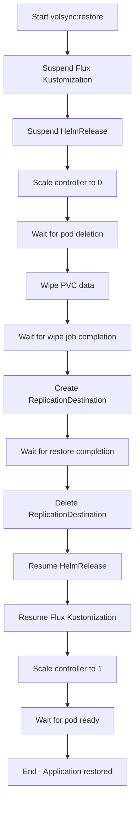

# Daily Operations

Common operational tasks for maintaining the Talos Kubernetes cluster, covering Flux GitOps operations, Talos node management, VolSync backup/restore workflows, and monitoring access.

## Flux Reconciliation

### Force Reconciliation

Force Flux to immediately pull changes from the Git repository:

```bash
task reconcile
```

This executes `flux --namespace flux-system reconcile kustomization flux-system --with-source`, which cascades to all downstream Kustomizations.

**Use cases:**
- After committing configuration changes
- When manual synchronization is needed before the automatic interval
- Verifying GitOps changes are propagating correctly

### Check Flux Status

View reconciliation status across all Flux resources:

```bash
flux get sources all
flux get kustomizations --all-namespaces
flux get helmreleases --all-namespaces
```

### Check Reconciliation Errors

View logs for debugging reconciliation failures:

```bash
flux --namespace flux-system logs kustomization flux-system --tail 50
flux --namespace <namespace> logs kustomization <name> --tail 50
flux --namespace <namespace> logs helmrelease <name> --tail 50
```

### Suspend/Resume Resources

Temporarily prevent reconciliation during maintenance:

```bash
flux suspend kustomization <name>
flux resume kustomization <name>
flux suspend helmrelease <name> -n <namespace>
flux resume helmrelease <name> -n <namespace>
```

## Talos Operations

### Generate Configuration

Regenerate Talos machine configurations after modifying `talos/talconfig.yaml` or `talos/talenv.yaml`:

```bash
task talos:generate-config
```

This runs `talhelper genconfig` and regenerates machine configs in `talos/clusterconfig/`.

**Important**: Never edit files in `talos/clusterconfig/` directly—they are auto-generated and will be overwritten.

### Apply Configuration to a Node

Apply updated Talos configuration to a specific node:

```bash
task talos:apply-node IP=<node-ip>
```

**Example:**
```bash
task talos:apply-node IP=192.168.50.145
```

The task applies machine config using `talhelper gencommand apply` with `--mode=auto` by default. Most configuration changes apply without rebooting.

**Prerequisites:**
- Node must be accessible via `talosctl`
- `talosconfig` must be configured
- Talos helper tools available

### Upgrade Talos OS

Upgrade Talos on a single node with minimal disruption:

```bash
task talos:upgrade-node IP=<node-ip>
```

The task:
- Retrieves the Talos image URL and version from `talconfig.yaml` and `talenv.yaml`
- Runs `talhelper gencommand upgrade` with the target image
- Performs a rolling upgrade with a 10-minute timeout

### Upgrade Kubernetes

Upgrade Kubernetes cluster-wide to the version specified in `talos/talenv.yaml`:

```bash
task talos:upgrade-k8s
```

This upgrades Kubernetes by applying updated kubelet configurations to all nodes via `talhelper gencommand upgrade-k8s`.

### Reset the Cluster

**DANGER**: This destroys all cluster state and returns nodes to maintenance mode.

```bash
task talos:reset
```

Only use for complete cluster rebuilds. The task:
- Prompts for confirmation
- Wipes STATE and EPHEMERAL system labels
- Performs a non-graceful reset without waiting

### View Talos Logs

View logs from Talos nodes:

```bash
talosctl --nodes <node-ip> logs
talosctl --nodes <node-ip> services <service-name>
```

## VolSync Backup and Restore

VolSync provides PVC backup and restore using Restic. The cluster organizes VolSync tasks under `.taskfiles/volsync/Taskfile.yaml`.

### Trigger Manual Backup

Create an on-demand snapshot of an application's PVC:

```bash
task volsync:snapshot APP=<app-name> NS=<namespace>
```

**Example:**
```bash
task volsync:snapshot APP=plex NS=default
```

The task:
1. Patches the ReplicationSource with a manual trigger timestamp
2. Waits for the sync job to start
3. Waits for job completion with a 120-minute timeout

### Restore from Backup

Restore an application's PVC from VolSync snapshots:

```bash
task volsync:restore APP=<app-name> NS=<namespace> PREVIOUS=<N>
```

**Parameters:**
- `APP`: Application name (required)
- `NS`: Namespace (default: `default`)
- `PREVIOUS`: Number of recent snapshots to restore (default: `2`)

**Example:**
```bash
task volsync:restore APP=plex NS=default PREVIOUS=2
```

The restore workflow performs these steps:



**Workflow details:**

1. **Suspend** (`task .suspend`):
   - Suspends Flux Kustomization for the app
   - Suspends the HelmRelease
   - Scales the controller (Deployment or StatefulSet) to 0 replicas
   - Waits for pods to terminate

2. **Wipe** (`task .wipe`):
   - Creates a Job that mounts the PVC and deletes all data using Alpine image
   - Waits for job completion with a 120-minute timeout
   - Displays job logs for verification

3. **Restore** (`task .restore`):
   - Creates a ReplicationDestination with `trigger.manual: restore-once`
   - Uses Restic to restore from the repository
   - Waits for the ReplicationDestination to complete with a 2-hour timeout
   - Deletes the ReplicationDestination after completion

4. **Resume** (`task .resume`):
   - Resumes the HelmRelease
   - Resumes the Flux Kustomization
   - Scales the controller back to 1 replica
   - Waits for pods to become ready

**Prerequisites:**
- ReplicationSource must exist for the application
- PVC must be configured as the source
- Restic repository secret must be available

### List Available Snapshots

View available Restic snapshots for an application:

```bash
task volsync:list APP=<app-name> NS=<namespace>
```

The task:
- Creates a temporary Job using the Restic container
- Runs `restic snapshots` using the app's repository credentials
- Displays the snapshot list
- Cleans up the Job after completion

### Unlock Restic Repositories

Unlock all Restic source repositories cluster-wide:

```bash
task volsync:unlock CLUSTER=main
```

This is useful when Restic has left stale locks from interrupted operations. The task:
- Lists all ReplicationSources across all namespaces
- Patches each with an unlock timestamp using the current Unix epoch

### Suspend/Resume VolSync

Temporarily disable VolSync operations:

```bash
task volsync:state-suspend  # Suspend VolSync
task volsync:state-resume   # Resume VolSync
```

The tasks:
- Suspend/resume the VolSync Flux Kustomization
- Suspend/resume the VolSync HelmRelease
- Scale the VolSync deployment to 0/1 replicas

## Cluster Access

### Access via Kubeconfig

The cluster uses a kubeconfig file for Kubernetes access. The root Taskfile sets `KUBECONFIG` environment variable to `{{.ROOT_DIR}}/kubeconfig`.

```bash
# The kubeconfig path is automatically set when running tasks
kubectl get nodes
kubectl get pods -A
```

### Access via Talosctl

Talos nodes are managed using `talosctl` with the `TALOSCONFIG` environment variable pointing to `talos/clusterconfig/talosconfig`.

```bash
# TALOSCONFIG is automatically set when running talos tasks
talosctl --nodes <node-ip> get machineconfig
talosctl --nodes <node-ip> services
```

## Node Operations

### Check Node Status

View node health and status:

```bash
kubectl get nodes -o wide
kubectl describe node <node-name>
talosctl --nodes <ip> get machineconfig
```

### Restart Node

Restart a Talos node:

```bash
talosctl --nodes <ip> reboot
```

### View Resource Usage

Check node resource consumption:

```bash
kubectl top nodes
kubectl describe node <node-name>
```

## Networking

The network stack is Cilium (CNI + Gateway API + LB-IPAM), Cloudflare Tunnel for public ingress, k8s-gateway/AdGuard/CoreDNS for DNS, and Tailscale for mesh access. Apps live under `kubernetes/apps/network/` and Cilium under `kubernetes/apps/kube-system/cilium/`.

### Cilium Status and Connectivity

```bash
kubectl get pods -n kube-system -l k8s-app=cilium
cilium status
kubectl logs -n kube-system -l k8s-app=cilium --tail=50 --follow
kubectl run debug --image=busybox --rm -it --restart=Never -- nslookup kubernetes.default.svc.cluster.local
```

LoadBalancer IPs come from a `CiliumLoadBalancerIPPool` covering `192.168.50.0/24` (first/last IPs excluded) with an L2 announcement policy. The Cilium Gateways use fixed addresses: `external` at `192.168.50.13` and `internal` at `192.168.50.12`.

```bash
kubectl get gateway -A
kubectl get httproute -A
kubectl get ciliumloadbalancerippool -n kube-system
kubectl get ciliuml2announcementpolicy -n kube-system
```

### Cloudflare Tunnel

cloudflared provides public ingress without open ports. Configuration is mounted from the `cloudflare-tunnel-configmap` ConfigMap; the tunnel authenticates with `TUNNEL_TOKEN` from `cloudflare-tunnel-secret`. Public DNS is registered via a `DNSEndpoint` that CNAMEs `external.${SECRET_DOMAIN}` to `<tunnel-id>.cfargotunnel.com`.

```bash
kubectl get pods -n network -l app.kubernetes.io/name=cloudflare-tunnel
kubectl logs -n network -l app.kubernetes.io/name=cloudflare-tunnel --tail=100 --follow
kubectl get configmap cloudflare-tunnel-configmap -n network -o jsonpath='{.data.config\.yaml}'
kubectl get dnsendpoint cloudflare-tunnel -n network -o yaml
```

To rotate tunnel credentials, create a new tunnel in Cloudflare, update `TUNNEL_TOKEN` in the app's `secret.sops.yaml`, and let Flux reconcile.

### DNS

- **k8s-gateway** (`192.168.50.11`) resolves `${SECRET_DOMAIN}` records for HTTPRoutes/Services with a 1-second TTL.
- **AdGuard Home** (`192.168.50.1:3000`) filters DNS for the local network; the `adguard-dns` app syncs records to it using Bitwarden credentials via ExternalSecret.
- **CoreDNS** (`10.43.0.10`) handles standard `cluster.local` discovery.

```bash
kubectl logs -n network -l app.kubernetes.io/name=k8s-gateway --tail=100 --follow
kubectl run debug --image=busybox --rm -it --restart=Never -- nslookup app.${SECRET_DOMAIN}. 192.168.50.11
kubectl get externalsecret adguard-dns-secret -n network
kubectl get pods -n kube-system -l k8s-app=kube-dns
```

### Tailscale

The Tailscale operator authenticates with OAuth credentials from Bitwarden (`tailscale-secret`) and can proxy the Kubernetes API for remote `kubectl` access. Remote cluster services are exposed through `ExternalName` services annotated with `tailscale.com/tailnet-ip`.

```bash
kubectl get pods -n network -l app.kubernetes.io/name=tailscale
kubectl logs -n network deployment/tailscale-operator --tail=100 --follow
kubectl get externalsecret tailscale-secret -n network
```

## Secrets

Secret management is SOPS + age for Git-encrypted files, with External Secrets / Bitwarden for in-cluster distribution.

### Editing Encrypted Files

`sops <file>` decrypts on open and re-encrypts on save using `.sops.yaml` rules:

- `talos/.*\.sops\.ya?ml`: whole-file encryption (`mac_only_encrypted: true`)
- `(bootstrap|kubernetes)/.*\.sops\.ya?ml`: field-level encryption of `data`/`stringData` only

```bash
sops kubernetes/components/common/sops/cluster-secrets.sops.yaml
sops talos/talsecret.sops.yaml
grep -c "ENC\[AES256_GCM" <file>   # verify still encrypted
```

All rules use the same age recipient; decryption requires `age.key` (set via `SOPS_AGE_KEY_FILE`).

### cluster-secrets Variable Substitution

`cluster-secrets` (containing `SECRET_DOMAIN`, `TIMEZONE`, etc.) is decrypted by Flux and consumed by Kustomizations via `postBuild.substituteFrom`, so `${SECRET_DOMAIN}` placeholders in manifests are replaced at render time. To add a variable: `sops` the cluster-secrets file, add the key, commit, and run `task reconcile`.

### Age Key Rotation (manual)

1. `age-keygen -o age-new.txt`
2. Back up the current `age.key`
3. Replace the recipient in both creation rules in `.sops.yaml`
4. Re-encrypt every `*.sops.yaml` file (`sops --encrypt --encrypted-regex '^(data|stringData)$' <file>` for kubernetes/bootstrap files)
5. Update `kubernetes/components/common/sops/sops-age.sops.yaml` with the new private key and the local `age.key`
6. Verify with `sops --decrypt` on several files, commit, and confirm Flux reconciles (`kubectl get secret sops-age -n flux-system`)

There is no automated rotation; keep old and new keys until verification is complete.

## Storage

Storage is TopoLVM (LVM thin provisioning on local NVMe) as the default class, with `local-path` for scratch/cache, snapshot-controller for CSI snapshots, NFS CSI, and VolSync for backups.

### LVM Thin Pool

Layers: physical volume `/dev/nvme0n1` → volume group `lvm_vg` → thin pool `lvm_thin` (100%FREE). TopoLVM's device class `thin` sets `spare-gb: 10` and an overprovision-ratio of 10.0, so PVCs can be scheduled up to 10x physical capacity. Monitor with `sudo lvs lvm_vg/lvm_thin`; keep Data% below ~80%. For a new node/disk, the `lvm-format-manual.yaml` pod runs `pvcreate`/`vgcreate lvm_vg`/`lvcreate --thinpool -l 100%FREE -n lvm_thin lvm_vg`.

### Storage Classes

| | `topolvm-thin-provisioner` (default) | `local-path` |
|---|---|---|
| Type | Block on NVMe, XFS | Host path `/var/mnt/local-path-provisioner` |
| Expansion | Yes (online) | No |
| CSI snapshots | Yes | No |
| Binding | Immediate | WaitForFirstConsumer |
| Use | Databases, production data | Cache (e.g. VolSync restic cache), scratch |

### Volume Snapshots

The default `VolumeSnapshotClass` is `topolvm-thin-provisioner` (driver `topolvm.io`, `deletionPolicy: Delete`). Create a `VolumeSnapshot` referencing a PVC, or restore by creating a PVC with `dataSource.kind: VolumeSnapshot`. Snapshots stay on the same storage system — they complement but do not replace VolSync for off-cluster backup.

### PVC Troubleshooting

```bash
kubectl describe pvc <name> -n <namespace>
kubectl get sc
kubectl get topolvmnode -A
kubectl get pods -n storage -l app.kubernetes.io/name=topolvm
```

Common causes: wrong storage class name, `InsufficientCapacity` (thin pool full), or TopoLVM controller/lvmd pods not ready. Note the TopoLVM HelmRelease pins `controller.replicaCount: 1` with `Recreate` strategy for single-node compatibility; if an upgrade leaves `topolvm-controller` Pending on anti-affinity, delete the pending pod and run `flux reconcile helmrelease topolvm -n storage`.

## Monitoring and Observability

The cluster runs comprehensive observability tools in the `observability` namespace.

### Grafana

Grafana is exposed at `https://grafana-dev.${SECRET_DOMAIN}` with anonymous Viewer access; admin credentials come from the `grafana-admin-secret` ExternalSecret (Bitwarden). Datasources are pre-provisioned and recreated on every deploy:

- **Prometheus (Thanos)**: `http://thanos-query-frontend.observability.svc.cluster.local:9090` (default)
- **Loki**: `http://loki-headless.observability.svc.cluster.local:3100` (max 250 lines/query)
- **Alertmanager**: `http://alertmanager-operated.observability.svc.cluster.local:9093`

### Loki / LogQL

Loki runs in SingleBinary mode with a 7-day retention on an 8Gi TopoLVM volume; Promtail ships pod logs to it. Query via Grafana Explore, e.g. `{namespace="my-namespace", app="my-app"} |= "search term"`.

### Gatus

Gatus health checks are discovered automatically: a k8s-sidecar watches all namespaces for ConfigMaps/Secrets labeled `gatus.io/enabled: "true"` and loads their `config.yaml` into `/config`. Add a check by creating such a ConfigMap (HTTP/HTTPS, `tcp://`, or `icmp://` endpoints). The status page is at `https://status-dev.${SECRET_DOMAIN}`.

### Alerting

Alertmanager routes alerts to Pushover (credentials from `alertmanager-secret` via ExternalSecret). Default receiver groups by `alertname`/`job` (group wait 1m, interval 10m, repeat 12h); critical alerts fire immediately, and critical inhibits warning for the same alertname/namespace. Gatus endpoint failures (external group down 5m) raise critical `GatusEndpointDown` alerts through the same pipeline. Custom rules are added as `PrometheusRule` CRDs.

### Available Tools

The observability stack includes:

- **Grafana**: Dashboards and visualization
- **Prometheus**: Metrics collection and alerting (via kube-prometheus-stack)
- **Loki**: Log aggregation
- **Promtail**: Log agent for shipping logs to Loki
- **Thanos**: Long-term metrics storage
- **Gatus**: Endpoint health monitoring
- **Uptime Kuma**: Status page and uptime tracking
- **smartctl-exporter**: Storage device health metrics

### Access Monitoring

Access monitoring interfaces through the cluster's Ingress or Tailscale network:

```bash
# Get Grafana credentials
kubectl --namespace observability get secret grafana-admin -o jsonpath='{.data.admin-user}' | base64 -d
kubectl --namespace observability get secret grafana-admin -o jsonpath='{.data.admin-password}' | base64 -d

# Port-forward for local access
kubectl --namespace observability port-forward svc/grafana 3000:80
```

### View Application Logs

View logs for applications:

```bash
kubectl logs <deployment-name> -n <namespace>
kubectl logs <deployment-name> -n <namespace> --previous  # Crash logs
kubectl logs -n <namespace> -l app.kubernetes.io/name=<app-name>  # All pods
kubectl logs -n <namespace> -l app.kubernetes.io/name=<app-name> --tail 100 --follow  # Stream logs
```

### Check Application Status

```bash
kubectl get pods -n <namespace>
kubectl get deployments -n <namespace>
kubectl get statefulsets -n <namespace>
kubectl get helmreleases -n <namespace>
kubectl get pvc -n <namespace>
```

### Debug Application Failures

1. Check pod status: `kubectl describe pod <pod-name> -n <namespace>`
2. View logs: `kubectl logs <pod-name> -n <namespace>`
3. Check events: `kubectl get events -n <namespace> --sort-by='.lastTimestamp'`
4. Check HelmRelease status: `flux -n <namespace> logs helmrelease <app-name> --tail 50`

## Common Workflows

### Update Application Configuration

1. Edit the HelmRelease or values files in `kubernetes/apps/<namespace>/<app>/`
2. Commit and push changes
3. Flux detects the change and updates the Helm release
4. For immediate reconciliation: `task reconcile`

### Emergency Application Restore

If an application's data becomes corrupted:

```bash
# 1. Trigger a backup first (to preserve current state)
task volsync:snapshot APP=<app> NS=<namespace>

# 2. Restore from a known-good snapshot
task volsync:restore APP=<app> NS=<namespace> PREVIOUS=3
```

The restore workflow handles suspending the application, wiping corrupted data, restoring from backup, and resuming with correct data.

### Maintenance Mode

Before performing cluster maintenance:

1. **Suspend critical applications**:
   ```bash
   flux suspend kustomization <app>
   ```

2. **Suspend VolSync** (if backup operations should pause):
   ```bash
   task volsync:state-suspend
   ```

3. **Perform maintenance tasks** (node upgrades, network changes, etc.)

4. **Resume operations**:
   ```bash
   flux resume kustomization <app>
   task volsync:state-resume
   ```

## Task Reference

The repository uses Task (taskfile) for operational commands. View all available tasks:

```bash
task                          # List all tasks
task --list <namespace>       # List tasks in a namespace (e.g., task --list talos)
task <namespace>:<task>       # Run a specific task
```

**Key task namespaces:**
- `reconcile`: Force Flux reconciliation
- `talos:*`: Talos cluster operations (generate-config, apply-node, upgrade-node, upgrade-k8s, reset)
- `volsync:*`: Backup and restore operations (snapshot, restore, list, unlock, state-suspend, state-resume)
- `bootstrap:*`: Cluster bootstrap operations (talos, apps)
