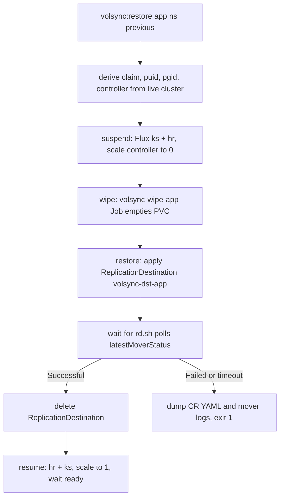

VolSync backs up each application's PVC to a [MinIO](https://min.io) S3 bucket via a Restic repository, driven by a per-app `ReplicationSource`. The `volsync:*` Taskfile tasks in `.taskfiles/volsync/Taskfile.yaml` wrap the kubectl commands that trigger, wait for, and inspect these backups, and perform full PVC restores through a temporary `ReplicationDestination`.

Background on storage classes and claims lives in [Storage Concepts](../concepts/storage.md); day-2 deployment flow is covered in [App Deployment Workflow](../workflows/app-deployment.md).

## Assumptions and invariants

The Taskfile documents its own limitations up front (`.taskfiles/volsync/Taskfile.yaml#L5-L8`):

1. The Kustomization, HelmRelease, PVC, and ReplicationSource must all share the app's name (e.g. `plex`).
2. Each ReplicationSource/ReplicationDestination is backed by a Restic repository.
3. Each application replicates exactly one PVC.

The Restic credentials for `<app>` live in a `<app>-volsync-secret`, provisioned from Bitwarden via an ExternalSecret in `kubernetes/components/volsync-new/minio.yaml`. The secret sets `RESTIC_REPOSITORY` (S3 endpoint under `volsync/dev/<app>`), `RESTIC_PASSWORD`, and MinIO access keys — the same env shape the `list` job expects.

## Tasks

All tasks require `kubectl` (and, where Flux state is touched, `flux`).

### `volsync:snapshot` — trigger a backup

```sh
task volsync:snapshot ns=media app=plex
```

- Patches `replicationsources/<app>` in `ns` with a **manual trigger**: `{"spec":{"trigger":{"manual":"<unix-epoch-now>"}}}`. This is the standard way to fire a backup outside the CronJob schedule.
- Polls until `job/volsync-src-<app>` exists, then `kubectl wait --for=condition=complete --timeout=120m`.

Preconditions check that the ReplicationSource exists before patching.

### `volsync:list` — list snapshots

```sh
task volsync:list ns=media app=plex
```

1. Renders `.taskfiles/volsync/templates/list.tmpl.yaml` with `envsubst` and applies it: a Job named `volsync-list-<app>` running the `restic/restic` image with args `["snapshots"]`, env sourced from `<app>-volsync-secret`.
2. Waits for the pod to leave `Pending` (`.taskfiles/volsync/scripts/wait-for-job.sh`), waits for completion (1m timeout), prints the `main` container's logs, and deletes the Job.

### `volsync:unlock` — unlock stale Restic locks

```sh
task volsync:unlock cluster=main
```

Discovers every ReplicationSource cluster-wide (`kubectl get replicationsources --all-namespaces`) and patches each with `spec.restic.unlock: <unix-epoch>`, which makes VolSync break stale Restic locks on the next run. `volsync:unlock-local` is an alternative that applies an `unlock.yaml.j2` resource to run a one-off `volsync-unlock-<app>` Job (requires `minijinja-cli` and `stern`).

### `volsync:restore` — restore a PVC

```sh
task volsync:restore ns=media app=plex previous=2
```

Runs three internal subtasks in order:

1. **`.suspend`** — suspends the Flux Kustomization (`flux-system/<app>`) and HelmRelease (`<ns>/<app>`), scales the controller (`deployment` or `statefulset`, auto-detected by `.taskfiles/volsync/scripts/which-controller.sh`) to 0, and waits for its pods to delete.
2. **`.wipe`** — applies a `volsync-wipe-<app>` Job (alpine, `find /config -delete` with the claim mounted) to empty the PVC, waits, prints logs, deletes the Job.
3. **`.restore`** — applies `replicationdestination.tmpl.yaml` as a `ReplicationDestination` named `volsync-dst-<app>` with `trigger: manual: restore-once`, `destinationPVC: <claim>`, `previous: <n>` (default 2), and waits via `.taskfiles/volsync/scripts/wait-for-rd.sh` until `status.latestMoverStatus.result` is `Successful` (timeout 2h; on failure or timeout it dumps the CR YAML and the last 50 lines of mover-pod logs). Then deletes the ReplicationDestination.
4. **`.resume`** — resumes the HelmRelease and Kustomization, scales the controller back to 1, and waits for readiness.

Dynamic vars are derived from the live cluster: `claim` from `spec.sourcePVC`, `puid`/`pgid` from `spec.restic.moverSecurityContext`, and the controller kind from `which-controller.sh`.

To restore all apps in parallel:

```sh
kubectl get replicationsources --all-namespaces --no-headers \
  | awk '{print $2, $1}' \
  | xargs --max-procs=4 -l bash -c 'task volsync:restore app=$0 ns=$1'
```

An alternate `volsync:restore-alert` task handles the special case of alertmanager: it suspends `kube-prometheus-stack` (Flux + scaled-down alertmanager StatefulSet), applies a hand-maintained `volsync-restore-alertmanager.yaml`, then resumes and force-reconciles.

For a first bootstrap, prefer `restoreAsOf` over `previous` in the ReplicationDestination: set it to the RFC3339 timestamp when the old cluster was destroyed so snapshots taken afterwards (from apps that bootstrapped with default data) are not restored.

### `volsync:state-*` — suspend/resume VolSync

`task volsync:state-suspend` suspends the `volsync` Kustomization and HelmRelease and scales the `volsync` deployment to 0; `state-resume` reverses it.

## Restore control flow



*End-to-end restore flow: suspend, wipe, restore via ReplicationDestination, resume.*

## Replication source conventions

Per-app resources (component `kubernetes/components/volsync-new`) create:

- A PVC named `<app>` (default `topolvm-thin-provisioner`, `1Gi`, overridable via `VOLSYNC_*` env vars).
- An ExternalSecret producing `<app>-volsync-secret` (Restic repo/password + MinIO keys).
- A `ReplicationSource` named `<app>` on a `0 */6 * * *` schedule, Restic mover with `copyMethod: Direct`, `pruneIntervalDays: 7`, and retention of 24 hourly / 7 daily / 5 weekly snapshots.
- A one-shot `ReplicationDestination` (`volsync-dst-<app>`, `manual: restore-once`) used for DR restores.

The volsync app itself is deployed via HelmRelease (chart `backube/volsync`) in `kubernetes/apps/storage/volsync`, with `manageCRDs: true` and metrics enabled.

## Snapshot cleanup

`kubernetes/apps/storage/volsync/app/snapshot-cleanup-cronjob.yaml` runs a weekly CronJob (Sunday 02:00, `concurrencyPolicy: Forbid`) that deletes `VolumeSnapshots` older than `THRESHOLD_DAYS` (7) whose names match `volsync-volsync-dst-` — i.e. leftover destination snapshots from restore operations — using a least-privilege ServiceAccount defined in `snapshot-cleanup-rbac.yaml`.

## Operational notes

- Manual-trigger patching uses the default field manager, so the patch survives Flux reconciliation of the HelmRelease-managed CRs only until the source manifest changes; re-patch as needed.
- Job naming is the wait convention: source snapshots use `volsync-src-<app>`, list `volsync-list-<app>`, wipe `volsync-wipe-<app>`, unlock `volsync-unlock-<app>`, destination restores `volsync-dst-<app>` (plus `-manual` in the alertmanager flow).
- Snapshot completion timeout is 120m for both snapshot and restore; the RD wait script defaults to 2h and polls every 15s.
