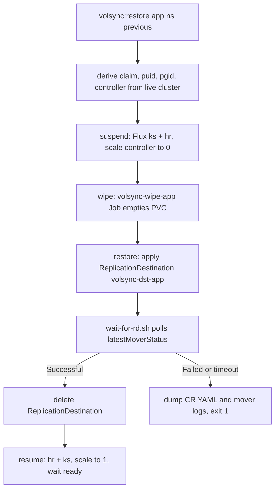

VolSync backs up each application's PVC to a [MinIO](https://min.io) S3 bucket via a Restic repository, driven by a per-app `ReplicationSource`. The `volsync:*` Taskfile tasks in `.taskfiles/volsync/Taskfile.yaml` wrap the kubectl commands that trigger, wait for, and inspect these backups, and perform full PVC restores through a temporary `ReplicationDestination`.

Background on storage classes and claims lives in [Storage Concepts](../concepts/storage.md); day-2 deployment flow is covered in [App Deployment Workflow](../workflows/app-deployment.md).

## Assumptions and invariants

The Taskfile documents its own limitations up front (`.taskfiles/volsync/Taskfile.yaml#L5-L8`):

1. The Kustomization, HelmRelease, PVC, and ReplicationSource must all share the app's name (e.g. `plex`).
2. Each ReplicationSource/ReplicationDestination is backed by a Restic repository.
3. Each application replicates exactly one PVC.

The Restic credentials for `<app>` live in a `<app>-volsync-secret`, provisioned from Bitwarden via an ExternalSecret in `kubernetes/components/volsync-new/minio.yaml`. The secret sets `RESTIC_REPOSITORY` (S3 endpoint `s3:http://192.168.50.220:9010/volsync/dev/<app>`), `RESTIC_PASSWORD`, and MinIO access keys (`AWS_ACCESS_KEY_ID` / `AWS_SECRET_ACCESS_KEY`) — the same env shape the `list` job expects via `envFrom`.

## Tasks

All tasks require `kubectl` (and, where Flux state is touched, `flux`). Namespaces default to `default` unless `ns=` is given.

### `volsync:snapshot` — trigger a backup

```sh
task volsync:snapshot ns=media app=plex
```

- Patches `replicationsources/<app>` in `ns` with a **manual trigger**: `{"spec":{"trigger":{"manual":"<unix-epoch-now>"}}}`. This is the standard way to fire a backup outside the CronJob schedule.
- Polls until `job/volsync-src-<app>` exists, then `kubectl wait --for=condition=complete --timeout=120m`.

Preconditions check that the ReplicationSource exists before patching.

### `volsync:list` — list snapshots

```sh
task volsync:list ns=media app=plex
```

1. Renders `.taskfiles/volsync/templates/list.tmpl.yaml` with `envsubst` and applies it: a Job named `volsync-list-<app>` running `docker.io/restic/restic:0.18.0` with args `["snapshots"]`, env sourced from `<app>-volsync-secret`.
2. Waits for the pod to leave `Pending` (`.taskfiles/volsync/scripts/wait-for-job.sh`), waits for completion (1m timeout), prints the `main` container's logs, and deletes the Job.

### `volsync:unlock` — unlock stale Restic locks

```sh
task volsync:unlock cluster=main
```

Discovers every ReplicationSource cluster-wide (`kubectl get replicationsources --all-namespaces`) and patches each with `spec.restic.unlock: <unix-epoch>` using `--field-manager=flux-client-side-apply`, which makes VolSync break stale Restic locks on the next run. `volsync:unlock-local` is an alternative that renders `unlock.yaml.j2` with `minijinja-cli` to run a one-off `volsync-unlock-<app>` Job, then streams logs with `stern` (requires `minijinja-cli` and `stern`).

### `volsync:restore` — restore a PVC

```sh
task volsync:restore ns=media app=plex previous=2
```

Derives dynamic vars from the live cluster before starting: `claim` from `spec.sourcePVC`, `puid`/`pgid` from `spec.restic.moverSecurityContext`, and the controller kind (`deployment` or `statefulset`) from `.taskfiles/volsync/scripts/which-controller.sh`. Then it runs four internal subtasks in order:

1. **`.suspend`** — suspends the Flux Kustomization (`flux-system/<app>`) and HelmRelease (`<ns>/<app>`), scales the auto-detected controller to 0, and waits for its pods to delete (2m timeout).
2. **`.wipe`** — applies a `volsync-wipe-<app>` Job (privileged alpine running `find . -delete` with the claim mounted at `/config`) to empty the PVC, waits, prints logs, deletes the Job.
3. **`.restore`** — applies `replicationdestination.tmpl.yaml` as a `ReplicationDestination` named `volsync-dst-<app>` with `trigger: manual: restore-once`, `destinationPVC: <claim>`, `previous: <n>` (default 2), and waits via `.taskfiles/volsync/scripts/wait-for-rd.sh` until `status.latestMoverStatus.result` is `Successful` (timeout 2h by default, polling every 15s; on `Failed` or timeout it dumps the CR YAML and the last 50 lines of the restore mover-pod logs, selected by labels `volsync.backube/replication-destination` and `volsync.backube/mover-type=restore`). Then deletes the ReplicationDestination.
4. **`.resume`** — resumes the HelmRelease and Kustomization, scales the controller back to 1, and waits for readiness (2m timeout).

To restore all apps in parallel:

```sh
kubectl get replicationsources --all-namespaces --no-headers \
  | awk '{print $2, $1}' \
  | xargs --max-procs=4 -l bash -c 'task volsync:restore app=$0 ns=$1'
```

An alternate `volsync:restore-alert` task handles the special case of alertmanager: it suspends `kube-prometheus-stack` (Flux Kustomization + HelmRelease), patches the `alertmanager kube-prometheus-stack` CR to `replicas: 0` and waits for pods to delete, applies a hand-maintained `volsync-restore-alertmanager.yaml` server-side, then restores replicas and force-reconciles.

For a first bootstrap, prefer `restoreAsOf` over `previous` in the ReplicationDestination: set it to the RFC3339 timestamp when the old cluster was destroyed so snapshots taken afterwards (from apps that bootstrapped with default data) are not restored. The template keeps this as a documented, commented-out option.

### `volsync:state-*` — suspend/resume VolSync

`task volsync:state-suspend` suspends the `volsync` Kustomization (in `flux-system`) and HelmRelease (in `volsync-system`) and scales the `volsync` deployment to 0; `state-resume` reverses it.

## Restore control flow



*End-to-end restore flow: suspend, wipe, restore via ReplicationDestination, resume.*

## Replication source conventions

Per-app resources (component `kubernetes/components/volsync-new`) create:

- A PVC named `<app>` (default `topolvm-thin-provisioner`, `ReadWriteOnce`, `1Gi`, overridable via `VOLSYNC_ACCESSMODES`, `VOLSYNC_CAPACITY`, `VOLSYNC_STORAGECLASS`).
- An ExternalSecret producing `<app>-volsync-secret` (Restic repo/password + MinIO keys, `ClusterSecretStore: bitwarden-login`).
- A `ReplicationSource` named `<app>` on a `0 */6 * * *` schedule, Restic mover with `copyMethod: Direct`, `pruneIntervalDays: 7`, and retention of 24 hourly / 7 daily / 5 weekly snapshots.
- A one-shot `ReplicationDestination` (`volsync-dst-<app>`, `manual: restore-once`) used for DR restores. Unlike the restore-time template, this one provisions its own volume (`VOLSYNC_CAPACITY`, default `1Gi`), uses `copyMethod: Snapshot` by default, `enableFileDeletion: true` so the destination volume is emptied before restore, and `cleanupCachePVC`/`cleanupTempPVC: true`.

The volsync app itself is deployed via HelmRelease (chart `backube/volsync` v0.16.0) in `kubernetes/apps/storage/volsync`, with `manageCRDs: true`, metrics enabled (auth disabled), and upgrade remediation set to rollback with 3 retries.

## Snapshot cleanup

`kubernetes/apps/storage/volsync/app/snapshot-cleanup-cronjob.yaml` runs a weekly CronJob (Sunday 02:00, `concurrencyPolicy: Forbid`) in the `storage` namespace that deletes `VolumeSnapshots` older than `THRESHOLD_DAYS` (7) whose names contain `volsync-volsync-dst-` — i.e. leftover destination snapshots from restore operations — using a least-privilege ServiceAccount (`get/list/watch/delete` on volumesnapshots only) defined in `snapshot-cleanup-rbac.yaml`. The container runs non-root with a read-only root filesystem and dropped capabilities.

## Operational notes

- The `snapshot` manual-trigger patch uses the default field manager, so it survives Flux reconciliation only until the source manifest changes; the `unlock` task explicitly patches with `--field-manager=flux-client-side-apply`. Re-patch as needed.
- Job naming is the wait convention: source snapshots use `volsync-src-<app>`, list `volsync-list-<app>`, wipe `volsync-wipe-<app>`, unlock `volsync-unlock-<app>`, destination restores `volsync-dst-<app>` (plus `-manual` in the alertmanager flow).
- Timeout conventions: 120m for snapshot and wipe jobs, 1m for list, 5m for unlock-local and restore-alert pod waits, and the RD wait script defaults to 2h polling every 15s.
