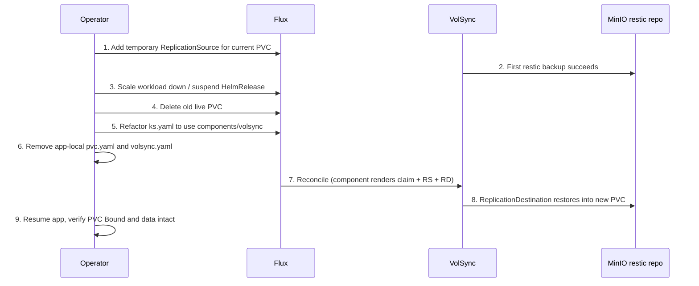

# VolSync PVC Migration Workflow

The cluster is migrating application data PVCs from per-app manifests (`app/pvc.yaml` plus optional app-local `app/volsync.yaml`) to the shared [Kustomize component](https://github.com/kubernetes-sigs/kustomize/blob/master/examples/components.md) at `kubernetes/components/volsync`. The shared component owns the whole VolSync lifecycle for an app: a restic-backed `ReplicationSource` (backup), a `ReplicationDestination` that restores into a freshly provisioned PVC, and an `ExternalSecret` supplying MinIO/S3 restic credentials.

Progress is tracked in `docs/volsync-migration-tracker.md` with status buckets `Done`, `Partial`, `Pending`, `Review`, and `N/A`.

## The shared VolSync component

`kubernetes/components/volsync/kustomization.yaml` declares a component with two resources:

- **`claim.yaml`** — creates a PVC named `${APP}` whose `dataSourceRef` points at the `ReplicationDestination` named `volsync-dst-${APP}`. Size, access mode, and storage class come from `VOLSYNC_CAPACITY` (default `1Gi`), `VOLSYNC_ACCESSMODES` (default `ReadWriteOnce`), and `VOLSYNC_STORAGECLASS` (default `topolvm-thin-provisioner`).
- **`minio.yaml`** — creates:
  - an `ExternalSecret` `${APP}-volsync` → `${APP}-volsync-secret`, pulling the restic password from the `volsync-minio-template` Bitwarden key and MinIO credentials from `cold-minio`; the templated `RESTIC_REPOSITORY` is `s3:http://192.168.50.220:9010/volsync/dev/${APP}` (MinIO-backed);
  - a `ReplicationSource` named `${APP}` backing up `sourcePVC: ${APP}` on a `0 */6 * * *` schedule, restic `copyMethod: Direct`, `pruneIntervalDays: 7`, cache on `local-path`, retention `hourly: 24 / daily: 7 / weekly: 5`, and a mover security context defaulting to UID/GID 1000 (overridable per app via `APP_UID`/`APP_GID` on the destination);
  - a `ReplicationDestination` `volsync-dst-${APP}` with `trigger: manual: restore-once`, `cleanupTempPVC`/`cleanupCachePVC`/`enableFileDeletion: true`, and defaults `VOLSYNC_COPYMETHOD: Snapshot`, `VOLSYNC_CACHE_CAPACITY: 1Gi`, `VOLSYNC_CACHE_SNAPSHOTCLASS: local-path`, `VOLSYNC_SNAPSHOTCLASS: topolvm-thin-provisioner`.

Apps opt in by adding `../../../../components/volsync` to `components:` in their `ks.yaml` and setting substitutes such as `APP` and `VOLSYNC_CAPACITY` (see `kubernetes/apps/default/openclaw/ks.yaml` for a migrated reference: `VOLSYNC_CAPACITY: 20Gi`, `VOLSYNC_CACHE_CAPACITY: 10Gi`).

A parallel component `kubernetes/components/volsync-new` exists with the same shape; `gitea`, `linkwarden`, `playwright`, `pgadmin`, `epub-translator`, and `prowlarr` currently reference it. The tracker's `Review` entry for `prowlarr` captures the open question of normalizing `volsync-new` back to the standard `components/volsync`.

## Standard migration flow (9 steps)

Use this for homelab apps where downtime is acceptable. The key safety property is that a restic backup must exist (step 2) before the live PVC is deleted (step 4); the new PVC is then hydrated from the `ReplicationDestination` restore.

Caption: the standard low-risk migration: back up first, tear down, rebuild via the shared component, then restore and verify.

Concretely:

1. Add a temporary `ReplicationSource` for the current PVC if the app is not already backed up by VolSync.
2. Wait until the first backup succeeds.
3. Scale the workload down or suspend the `HelmRelease`.
4. Delete the old live PVC.
5. Refactor the app to use `../../../../components/volsync` in `ks.yaml`.
6. Remove app-local `pvc.yaml` and app-local `volsync.yaml` if they exist.
7. Reconcile Flux (`cluster-apps` Kustomization, then the app Kustomization).
8. Wait for the `ReplicationDestination` restore to complete (its trigger is manual `restore-once`).
9. Resume the app and verify the restored PVC is `Bound`, pods are `Running`, and data exists in-container.

The tracker's "Per-App Checklist Template" reproduces this as a per-app checkbox block; copy it when starting a migration.

## Status tracking and current inventory

`docs/volsync-migration-tracker.md` (last updated 2026-03-17) is the source of truth for progress. Summary of where work stands, cross-checked against the current repository:

### Done

Apps already on shared VolSync with old manifests removed: `openclaw` (migrated 2026-03-17, restore verified) plus `cookiecloud`, `home-assistant`, `jellyseerr`, `lidarr`, `n8n`, `navidrome`, `paperless`, `qbittorrent`, `radarr`, `recyclarr`, `sonarr`, `wallos`, and others. Note that several of these ("Done" in the tracker) reference `components/volsync-new` rather than `components/volsync` in current `ks.yaml` files (e.g. `gitea`, `linkwarden`, `playwright`, `pgadmin`) — a normalization question to resolve alongside `prowlarr`.

### Partial — shared component referenced, app-local pvc.yaml still present

| App | Namespace | Caveat |
| --- | --- | --- |
| `calibre-web-automated` | `default` | `ks.yaml` has `components/volsync` + `VOLSYNC_CAPACITY: 20Gi`, but `app/pvc.yaml` still defines the `calibre-web-automated-nfs` claim — that NFS-adjacent claim is separate and must not be deleted blindly. |
| `jellyfin` | `default` | `ks.yaml` uses `components/volsync` (`VOLSYNC_CAPACITY: 10Gi`) and `helmrelease.yaml` mounts `existingClaim: jellyfin` at `/config`, but `app/pvc.yaml` still defines `jellyfin-cache` (50Gi, mounted at `/config/metadata`), and `/media` mounts the shared `nas-media` claim read-only. Migrate only the `jellyfin` app-data PVC; leave `jellyfin-cache` and `nas-media` alone. |
| `nextcloud` | `storage` | `ks.yaml` references `components/volsync`, but `app/pvc.yaml` still exists and `app/volsync-nfs.yaml` keeps a standalone `ReplicationSource` backing up the separate `nextcloud-nfs` PVC to its own MinIO repository (`volsync/dev/nextcloud-nfs`, 6-hourly, same retention). Only the app data PVC moves to the component; the NFS mount stays as-is. |

### Pending — still on the old pattern

- `webtop` (`default`) — `app/pvc.yaml` defines a 30Gi `webtop` claim; `ks.yaml` has **no** `components/volsync` yet. Straightforward single-PVC migration.
- `gatus` (`observability`) — `ks.yaml` has no VolSync component; `app/pvc.yaml` defines the data claim.
- `paper` (`default`) — `ks.yaml` already sets `VOLSYNC_CAPACITY: 10Gi` but does not include the component; `app/pvc.yaml` exists and the app also uses `paper-cache` and NFS mounts, so the scope must be split before migrating.

The tracker also lists `opencode` and `yt-audio` as Pending candidates and `ollama` as Partial, but those app directories no longer exist under `kubernetes/apps/default`; the tracker has drifted slightly and should be pruned on the next pass. Its "Recommended Next Order" starts with `calibre-web-automated`, `jellyfin`, `nextcloud`, then `webtop`/`gatus`.

### Review / N/A

- `prowlarr` uses `components/volsync-new`; decide whether to normalize.
- `rsshub` has `existingClaim` only in commented config — likely no PVC in use.
- `atuin` references shared VolSync in `ks.yaml` but main persistence is `emptyDir`; verify VolSync is actually needed.
- Non-stateful and infrastructure apps (cert-manager, cloudnative-pg, dragonfly, csi-driver-nfs, volsync itself, etc.) are marked N/A.

## Backup/restore semantics and operational notes

- **Backups**: the component's `ReplicationSource` restic-snapshots `${APP}` every 6 hours to `s3:http://192.168.50.220:9010/volsync/dev/${APP}` (MinIO) with credentials from External Secrets (Bitwarden `volsync-minio-template` + `cold-minio`). Restic pruning runs every 7 days; retention is 24 hourly / 7 daily / 5 weekly.
- **Restore-once lifecycle**: the new PVC from `claim.yaml` seeds itself via `dataSourceRef` → `volsync-dst-${APP}`, whose manual `restore-once` trigger means Flux applies it once per manifest change. The destination's mover runs as `APP_UID`/`APP_GID` (default 1000) — set these substitutes for apps with different UIDs.
- **Snapshot cleanup**: `kubernetes/apps/storage/volsync/app/snapshot-cleanup-cronjob.yaml` runs a weekly CronJob (Sundays 02:00, `storage` namespace) that deletes `VolumeSnapshots` across all namespaces whose names match `volsync-volsync-dst-` and whose age exceeds 7 days (`THRESHOLD_DAYS`), using kubectl as non-root with a locked-down security context. This garbage-collects destination snapshots VolSync leaves behind after copy-method snapshot restores.
- **Cluster prerequisites**: app `ks.yaml` files `dependsOn` the `topolvm` HelmRelease in `storage` because the component defaults to `topolvm-thin-provisioner` storage/snapshot classes; the VolSync operator itself is deployed in `storage` (`manageCRDs: true`, metrics auth disabled).

## Related pages

- `/openwiki/architecture/component-library.md` — how Flux Kustomize components are composed.
- `/openwiki/concepts/storage.md` — TopoLVM, NFS claims, storage classes.
- `/openwiki/operations/daily-operations.md` — reconciling Flux.
- `/openwiki/workflows/app-deployment.md` — general app scaffolding.
