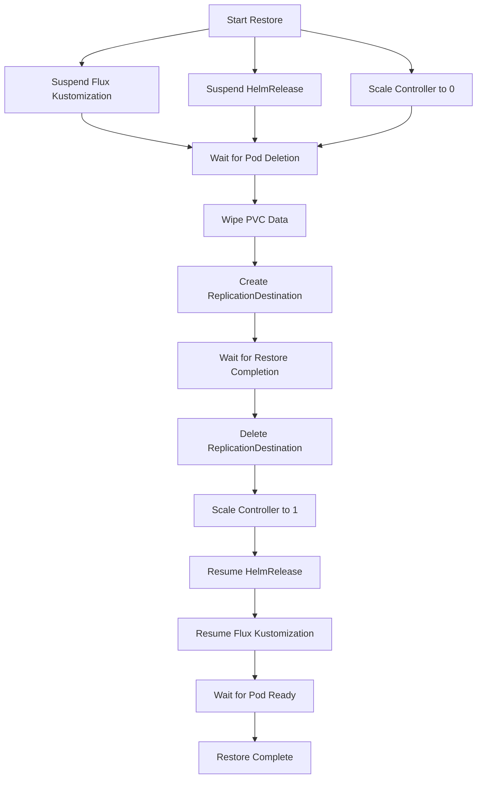

# VolSync Backup and Restore

VolSync provides automated backup and restore capabilities for Kubernetes persistent volumes through Restic repositories stored in MinIO. The Taskfile at `.taskfiles/volsync/Taskfile.yaml` defines operational tasks for manual snapshots, listing backups, restoring PVCs, repository maintenance, and controlling VolSync state.

## VolSync Taskfile Overview

The VolSync Taskfile assumes a standardized naming convention for applications using VolSync:

1. **Consistent naming**: Fluxtomization, HelmRelease, PVC, and ReplicationSource share the same name (e.g., `plex`)
2. **Restic repositories**: ReplicationSource and ReplicationDestination resources use Restic format
3. **Single PVC**: Each application has one PVC being replicated

Tasks support environment variables for runtime configuration: `app` (application name), `ns` (namespace, default: `default`), `claim` (PVC name), `previous` (number of snapshots to restore, default: 2), and `controller` (deployment or statefulset).

## Manual Snapshot Trigger

The `volsync:snapshot` task triggers an immediate backup for an application, bypassing the scheduled backup interval. This is useful for creating backups before maintenance operations or significant application changes.

### Execution

```bash
# Trigger a manual snapshot for an application
task volsync:snapshot APP=nextcloud NS=default
```

### Snapshot Workflow

The task executes the following steps:

1. **Patch ReplicationSource**: Applies a manual trigger with current Unix timestamp to the application's ReplicationSource
   ```bash
   kubectl patch replicationsources nextcloud --type merge \
     -p '{"spec":{"trigger":{"manual":"<timestamp>"}}}'
   ```

2. **Wait for job creation**: Polls until the backup job `volsync-src-<app>` appears

3. **Wait for completion**: Monitors the job until it completes successfully (120-minute timeout)

### How Manual Triggers Work

VolSync ReplicationSource resources support both scheduled and manual triggers:

- **Scheduled**: Specified via `spec.trigger.schedule` (e.g., `"0 */6 * * *"` for every 6 hours)
- **Manual**: Applied via `spec.trigger.manual` with a timestamp value

The manual trigger overrides the schedule and immediately initiates a backup job. The job name follows the pattern `volsync-src-<app>` and creates a Restic snapshot in MinIO.

### Snapshot Retention

Restic retention policies from the ReplicationSource determine how long snapshots are kept:

```yaml
retain:
  hourly: 24   # Keep 24 hourly snapshots
  daily: 7     # Keep 7 daily snapshots
  weekly: 5    # Keep 5 weekly snapshots
```

VolSync automatically prunes old snapshots according to these policies during scheduled backups. An automated cleanup job (`volsync-snapshot-cleanup`) removes VolumeSnapshots older than 7 days on a weekly schedule.

## Listing Available Snapshots

The `volsync:list` task enumerates all Restic snapshots available for an application, showing snapshot IDs, timestamps, and sizes. This helps identify which backup to restore from.

### Execution

```bash
# List snapshots for an application
task volsync:list APP=nextcloud NS=default
```

### List Workflow

The task creates a temporary Job that executes `restic snapshots`:

1. **Create Job**: Deploys a job using the `restic/restic:0.18.0` image
   - Job name: `volsync-list-<app>`
   - Loads credentials from `<app>-volsync-secret`
   - Runs `restic snapshots` command

2. **Wait for completion**: Waits up to 1 minute for job completion

3. **Display output**: Shows the Restic snapshots list with details

4. **Cleanup**: Deletes the job after displaying results

### Snapshot Output

The output shows all snapshots stored in MinIO for the application:

```
id        time                 host        tags
-----------------------------------------------
abc123    2024-01-15 10:30:00  volsync
def456    2024-01-15 04:30:00  volsync
ghi789    2024-01-14 22:30:00  volsync
```

Each snapshot represents a point-in-time backup of the application's PVC.

## Restoring a PVC from Backup

The `volsync:restore` task recovers an application's PVC from Restic snapshots stored in MinIO. This is critical for disaster recovery or data corruption scenarios.

### Execution

```bash
# Restore the most recent 2 snapshots (default)
task volsync:restore APP=nextcloud NS=default

# Restore a specific number of previous snapshots
task volsync:restore APP=nextcloud NS=default previous=3
```

### Restore Workflow

The restore process follows a carefully orchestrated sequence to prevent data conflicts:



### Restore Steps

#### 1. Suspend Application (`.suspend` task)

Suspends Flux reconciliation and scales down the application controller:

```bash
flux -n flux-system suspend kustomization <app>
flux -n <ns> suspend helmrelease <app>
kubectl -n <ns> scale <controller> --replicas 0
kubectl -n <ns> wait pod --for delete --selector="app.kubernetes.io/name=<app>"
```

The controller type (deployment or statefulset) is automatically detected via `which-controller.sh`.

#### 2. Wipe PVC Data (`.wipe` task)

Creates a privileged Job that deletes all data from the PVC:

```yaml
apiVersion: batch/v1
kind: Job
metadata:
  name: volsync-wipe-<app>
spec:
  template:
    spec:
      containers:
        - name: main
          image: alpine:latest
          command: ["/bin/sh", "-c", "cd /config; find . -delete"]
          volumeMounts:
            - name: config
              mountPath: /config
          securityContext:
            privileged: true
      volumes:
        - name: config
          persistentVolumeClaim:
            claimName: <claim>
```

This ensures the PVC is empty before restoration, preventing conflicts with existing data.

#### 3. Restore Data (`.restore` task)

Creates a ReplicationDestination that triggers VolSync to restore from MinIO:

```yaml
apiVersion: volsync.backube/v1alpha1
kind: ReplicationDestination
metadata:
  name: volsync-dst-<app>
spec:
  trigger:
    manual: restore-once
  restic:
    repository: <app>-volsync-secret
    destinationPVC: <claim>
    copyMethod: Direct
    storageClassName: topolvm-thin-provisioner
    previous: 2
    moverSecurityContext:
      runAsUser: <puid>
      runAsGroup: <pgid>
      fsGroup: <fsGroup>
```

The `previous` parameter specifies how many recent snapshots to restore (default: 2). Security context values (PUID, PGID) are extracted from the ReplicationSource to ensure correct file ownership.

The `wait-for-rd.sh` script monitors the ReplicationDestination status:

- Polls `latestMoverStatus.result` for "Successful" or "Failed"
- Defaults to 2-hour timeout
- Dumps YAML and mover pod logs on failure
- Checks status every 15 seconds

#### 4. Resume Application (`.resume` task)

After successful restore, resumes Flux reconciliation and scales up the application:

```bash
flux -n <ns> resume helmrelease <app>
flux -n flux-system resume kustomization <app>
kubectl -n <ns> scale <controller> --replicas 1
kubectl -n <ns> wait pod --for condition=ready --selector="app.kubernetes.io/name=<app>"
```

### Restore Options

The `previous` parameter controls restore behavior:

- **previous: 1** (not recommended): Restores only the most recent snapshot
- **previous: 2** (default): Restores the 2 most recent snapshots, providing recovery from recent corruption
- **previous: N**: Restores N snapshots, useful for deeper recovery needs

For bootstrap scenarios (new cluster), use `restoreAsOf` instead:

```yaml
restic:
  restoreAsOf: "2024-01-01T00:00:00-05:00"
```

This prevents restoring snapshots newer than the specified timestamp, avoiding default data conflicts.

## VolSync Suspend and Resume

The `volsync:state-suspend` and `volsync:state-resume` tasks control VolSync's operational state across the cluster. This is useful for cluster maintenance or troubleshooting.

### Execution

```bash
# Suspend all VolSync operations
task volsync:state-suspend

# Resume VolSync operations
task volsync:state-resume
```

### State Control Workflow

Both tasks operate on three levels:

1. **Flux Kustomization**: Suspends/resumes the `volsync` Kustomization in `flux-system`
2. **HelmRelease**: Suspends/resumes the `volsync` HelmRelease in `volsync-system`
3. **Deployment**: Scales the `volsync` deployment to 0 (suspend) or 1 (resume)

```bash
# Suspend sequence
flux --namespace flux-system suspend kustomization volsync
flux --namespace volsync-system suspend helmrelease volsync
kubectl --namespace volsync-system scale deployment volsync --replicas 0

# Resume sequence
flux --namespace flux-system resume kustomization volsync
flux --namespace volsync-system resume helmrelease volsync
kubectl --namespace volsync-system scale deployment volsync --replicas 1
```

### Use Cases

- **Cluster maintenance**: Pause backups during node upgrades or storage operations
- **Troubleshooting**: Temporarily stop VolSync to diagnose backup failures
- **Resource management**: Reduce load during high-demand periods

## Restic Repository Maintenance

The `volsync:unlock` task unlocks all Restic repositories across the cluster, resolving stale locks that prevent backup operations.

### Execution

```bash
# Unlock all Restic source repositories
task volsync:unlock CLUSTER=main
```

### Lock Scenarios

Restic repositories can become locked when:

- A backup job is terminated unexpectedly (pod eviction, node failure)
- The VolSync mover pod crashes during backup
- Network issues interrupt the backup operation

Stale locks prevent subsequent backups from proceeding, requiring manual unlock.

### Unlock Workflow

The task performs the following:

1. **Discover repositories**: Queries all ReplicationSources across all namespaces
   ```bash
   kubectl get replicationsources --all-namespaces --no-headers \
     --output=jsonpath='{range .items[*]}{.metadata.namespace},{.metadata.name}{"\n"}{end}'
   ```

2. **Apply unlock**: Patches each ReplicationSource with a unlock timestamp
   ```bash
   kubectl patch replicationsources <app> --type merge \
     -p '{"spec":{"restic":{"unlock":"<timestamp>"}}}'
   ```

3. **Trigger backup**: VolSync interprets the unlock as a manual trigger and runs a backup

### Local Machine Unlock

The `volsync:unlock-local` task unlocks a specific repository from a local machine with kubectl access:

```bash
# Unlock a specific application's repository
task volsync:unlock-local CLUSTER=main APP=nextcloud NS=default
```

This creates a one-time unlock job using `unlock.yaml.j2` template, waits for completion, and cleans up the job afterward.

## Integration with Storage Architecture

VolSync integrates with the cluster's storage layer through TopoLVM and MinIO:

- **Backup storage**: Restic snapshots stored in MinIO at `s3:http://192.168.50.220:9010/volsync/dev/<app>`
- **Temporary storage**: Uses `local-path` storage class for cache during backup/restore
- **Primary storage**: Uses `topolvm-thin-provisioner` for source and destination PVCs
- **CSI snapshots**: Leverages TopoLVM CSI snapshot support for efficient volume copies

The ReplicationSource template configures these integration points:

```yaml
restic:
  copyMethod: Direct
  storageClassName: topolvm-thin-provisioner
  cacheCapacity: 1Gi
  cacheStorageClassName: local-path
```

## Troubleshooting

### Backup Jobs Not Completing

Check the mover pod logs for errors:

```bash
# Find the backup job pod
kubectl get pods -n <ns> -l "job-name=volsync-src-<app>"

# View logs
kubectl logs -n <ns> <pod-name> --container main
```

Common issues:
- MinIO connectivity: Verify `RESTIC_REPOSITORY` URL and credentials
- Insufficient cache space: Increase `cacheCapacity` in ReplicationSource
- Repository lock: Run `task volsync:unlock` to clear stale locks

### Restore Failures

The `wait-for-rd.sh` script provides detailed diagnostics on timeout:

- Dumps ReplicationDestination YAML
- Shows mover pod logs (last 50 lines)
- Displays latest mover result and synchronization status

Check these outputs to identify the failure cause.

### Snapshot List Returns Empty

Verify the secret exists and contains correct credentials:

```bash
kubectl get secret -n <ns> <app>-volsync-secret -o yaml
```

Ensure the secret has:
- `RESTIC_REPOSITORY`: Correct MinIO S3 URL
- `RESTIC_PASSWORD`: Restic repository password
- `AWS_ACCESS_KEY_ID`: MinIO access key
- `AWS_SECRET_ACCESS_KEY`: MinIO secret key

### Manual Trigger Not Starting

Verify the ReplicationSource exists and is valid:

```bash
kubectl get replicationsources -n <ns> <app>
kubectl describe replicationsources -n <ns> <app>
```

Check for:
- Valid PVC reference in `spec.sourcePVC`
- Correct secret reference in `spec.restic.repository`
- No error conditions in status
