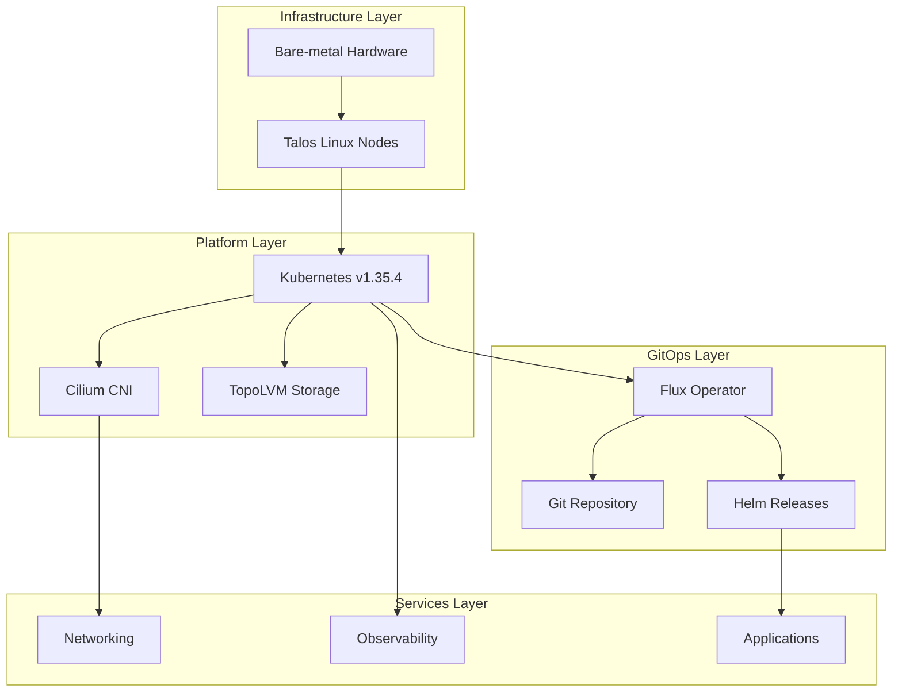

# Quick Start Guide

Welcome to the Talos Kubernetes cluster documentation. This repository contains the complete GitOps configuration for a homelab cluster running Talos Linux with ~30 applications across multiple namespaces.

## Architecture Overview

This cluster combines Talos Linux as the operating system with Flux for GitOps-based cluster management:



*Figure: Four-layer cluster architecture from bare-metal infrastructure through GitOps-managed services*

### Key Components

- **Operating System**: Talos Linux v1.12.7 (secure-boot enabled, immutable, API-managed)
- **Orchestration**: Flux for GitOps-based cluster management
- **Networking**: Cilium (CNI with L2 announcements), Cloudflare Tunnel (ingress), Tailscale (VPN/mesh)
- **Secrets**: SOPS + age for Git encryption, External Secrets Operator with Bitwarden for runtime secrets
- **Observability**: Prometheus, Grafana, Loki, Thanos, Gatus, Uptime Kuma
- **Storage**: TopoLVM (LVM thin provisioning), VolSync (backup/replication), snapshot-controller, NFS CSI

## Local Environment Setup

The repository uses [mise](https://mise.jdx.dev/) for toolchain management and environment configuration.

### Initial Setup

```bash
mise trust
mise install
```

This installs and configures the required tools: `task`, `talhelper`, `talosctl`, `kubectl`, `flux`, `helmfile`, `sops`, `age`, `yq`, `kubeconform`, `cilium-cli`, `cloudflared`, `cue`, `helm`, `jq`, `kustomize`, `python`, `makejinja`, `node`, and `pipx`.

### Environment Variables

mise automatically sets these essential environment variables:

- `KUBECONFIG=./kubeconfig` - Kubernetes client configuration
- `TALOSCONFIG=./talos/clusterconfig/talosconfig` - Talos client configuration
- `SOPS_AGE_KEY_FILE=./age.key` - Age private key for secret encryption/decryption

## Quick Reference

### Common Tasks

```bash
task                          # List all available tasks
task reconcile                # Force Flux to pull git changes
task talos:generate-config    # Regenerate Talos machine configs
task talos:apply-node IP=<ip> # Apply Talos config to one node
task talos:upgrade-node IP=<ip>  # Upgrade Talos OS on one node
task talos:upgrade-k8s        # Upgrade Kubernetes cluster-wide
task bootstrap:talos          # Full Talos cluster bootstrap
task bootstrap:apps           # Bootstrap apps (namespaces, secrets, CRDs, Helm releases)
```

### Initial Cluster Bootstrap

For new cluster installations, the bootstrap process is split into two phases:

1. **Prepare Talos configuration**: Edit `talos/talconfig.yaml` and `talos/talenv.yaml`
2. **Bootstrap Talos**: `task bootstrap:talos` (applies machine configs, bootstraps cluster, exports kubeconfig)
3. **Bootstrap base apps**: `task bootstrap:apps` (installs Cilium, CoreDNS, cert-manager, Flux)

After bootstrap, Flux takes over and manages all applications under `kubernetes/apps/`.

See [**Bootstrap Flow**](./architecture/bootstrap-flow.md) for detailed prerequisites, step-by-step instructions, and verification procedures.

## Repository Structure

```
.
├── bootstrap/              # Initial Helm charts installed during cluster bootstrap
├── kubernetes/
│   ├── apps/               # Flux-managed applications (one Kustomization per namespace)
│   ├── components/         # Reusable components and common configurations
│   └── flux/               # Flux cluster/meta Kustomizations
├── talos/
│   ├── talconfig.yaml      # Talhelper main configuration
│   ├── talenv.yaml         # Talos/Kubernetes version pins
│   ├── clusterconfig/      # Generated Talos machine configs (do not edit)
│   └── patches/            # Machine-level patches merged by talhelper
├── scripts/                # Bootstrap and utility scripts
├── .taskfiles/             # Task subcommand definitions (bootstrap, talos, volsync)
├── Taskfile.yaml           # Main task entrypoint
├── .mise.toml              # mise toolchain configuration
├── .sops.yaml              # SOPS encryption rules
└── .renovaterc.json5       # Renovate dependency automation configuration
```

## Application Organization

Applications are organized by namespace under `kubernetes/apps/`, with each namespace managed by its own Flux Kustomization:

- **`kube-system`**: Cilium, CoreDNS, metrics-server, node-feature-discovery, system-upgrade
- **`flux-system`**: Flux operator and instance, image automation
- **`network`**: Cloudflare Tunnel, AdGuard DNS, k8s-gateway, SMTP relay, Tailscale
- **`observability`**: Grafana, Prometheus, Loki, Thanos, Gatus, Uptime Kuma, promtail
- **`storage`**: TopoLVM, VolSync, NFS CSI, snapshot-controller, Nextcloud
- **`default`**: User applications (Gitea, growth-tracker, Paperless, Navidrome, Jellyfin, qBittorrent, RSSHub, n8n, Ollama, etc.)
- **`cert-manager`**: cert-manager installation and cluster issuers
- **`database`**: PostgreSQL, Redis operators
- **`external-secrets`**: External Secrets Operator and Bitwarden integration
- **`external-server`**: External-facing applications behind Cloudflare Tunnel

See [**Namespace and Application Organization**](./architecture/namespace-structure.md) for details on namespace organization and the Flux reconciliation hierarchy.

## Documentation Map

### Architecture

- **[Bootstrap Flow](./architecture/bootstrap-flow.md)** - Complete cluster initialization process from bare metal to GitOps-managed state
- **[Namespace and Application Organization](./architecture/namespace-structure.md)** - How applications are organized by namespace under kubernetes/apps and the Flux reconciliation hierarchy

### Concepts

- **[Flux GitOps Architecture](./concepts/flux-gitops.md)** - Flux reconciliation flow from cluster/ks.yaml through cluster-apps to namespace-level Kustomizations
- **[Networking Architecture](./concepts/networking.md)** - Cluster networking stack: Cilium CNI, Cloudflare Tunnel ingress, Tailscale VPN, k8s-gateway DNS, and AdGuard DNS
- **[Observability Stack](./concepts/observability.md)** - Monitoring, logging, and alerting systems: Prometheus, Grafana, Loki, Thanos, Gatus, Uptime Kuma
- **[Secrets Management with SOPS](./concepts/secrets-management.md)** - SOPS + age encryption strategy and how Flux decrypts secrets in the cluster
- **[Storage Architecture](./concepts/storage-architecture.md)** - Multi-provider storage system: TopoLVM for block storage, local-path-provisioner for host mounts, NFS CSI, and VolSync for backups
- **[Talos Configuration Management](./concepts/talos-config.md)** - Talos Linux configuration structure via talhelper, including nodes, patches, and machine configs

### Integrations

- **[External Secrets Integration](./integrations/external-secrets.md)** - External Secrets Operator integration with Bitwarden Connect for pulling external secrets into the cluster
- **[Hardware and GPU Support](./integrations/hardware-support.md)** - Intel GPU support, kernel modules, and node feature discovery for specialized hardware
- **[Flux Image Automation](./integrations/image-automation.md)** - Flux image update automation system for default namespace applications using ImageRepository and ImagePolicy
- **[Renovate Dependency Automation](./integrations/renovate.md)** - How Renovate handles automated updates for container images, Helm charts, Talos/Kubernetes versions, and tools

### Operations

- **[Daily Operations](./operations/daily-tasks.md)** - Common operational tasks: Flux reconciliation, log viewing, debugging app issues, and routine maintenance
- **[Network Operations](./operations/network-tasks.md)** - Network troubleshooting and configuration for Cilium, Cloudflare Tunnel, Tailscale, and DNS services
- **[Observability Operations](./operations/observability-tasks.md)** - Monitoring stack operations: accessing Grafana dashboards, querying Prometheus, checking Loki logs, and using Gatus
- **[Secrets Operations](./operations/secrets-tasks.md)** - Secret management workflows: editing encrypted secrets, rotating age keys, and verifying SOPS decryption
- **[Storage Operations](./operations/storage-tasks.md)** - Storage management tasks: LVM maintenance, snapshot creation, storage class usage, and troubleshooting
- **[Talos Operations](./operations/talos-tasks.md)** - Talos-specific operations: config generation, node upgrades, Kubernetes upgrades, and cluster reset
- **[Upgrade Workflow](./operations/upgrade-workflow.md)** - Complete upgrade process for Talos OS, Kubernetes, and cluster applications with proper ordering
- **[VolSync Backup and Restore](./operations/volsync-tasks.md)** - VolSync operations for manual snapshots, listing backups, and restoring PVCs from MinIO

## Key Architectural Patterns

### Flux GitOps Flow

Flux watches the Git repository and reconciles the cluster in two stages:

1. **`cluster-meta`** → Deploys source repositories (GitRepository, HelmRepository, OCIRepository) from `kubernetes/flux/meta/`
2. **`cluster-apps`** → Reconciles all application Kustomizations from `kubernetes/apps/`

Each namespace under `kubernetes/apps/` has its own Kustomization that Flux reconciles with SOPS decryption enabled.

See [**Flux GitOps Architecture**](./concepts/flux-gitops.md) for the complete reconciliation hierarchy and dependency ordering.

### Application Pattern

Most applications use the shared `app-template` OCI chart (`ghcr.io/bjw-s-labs/helm/app-template`) with this structure:

```
<namespace>/<app>/
  ks.yaml                # Flux Kustomization metadata
  app/
    helmrelease.yaml     # HelmRelease using shared app-template
    externalsecret.yaml  # ExternalSecret references (if needed)
    kustomization.yaml   # Resource aggregation
```

Common components like VolSync (backup), Gatus (uptime monitoring), and image automation are integrated through reusable components in `kubernetes/components/`.

### Secret Management

Two-layer encryption approach:

1. **Git Encryption** (`talos/*.sops.yaml`, `bootstrap/`, `kubernetes/`): SOPS + age encryption
   - Talos configs: Whole-file encryption
   - Kubernetes configs: Only `data`/`stringData` fields encrypted
   - Rules defined in `.sops.yaml`

2. **Runtime Secrets** (External Secrets Operator + Bitwarden): Application secrets injected at runtime
   - ClusterSecretStore connects to Bitwarden Connect
   - ExternalSecret CRs define which secrets to sync
   - Never stored in Git

Flux decrypts SOPS secrets using the `sops-age` Secret in `flux-system`. The local `age.key` file is required for editing secrets but never committed.

See [**Secrets Management with SOPS**](./concepts/secrets-management.md) for the complete architecture and workflows.

### Dependency Automation

Renovate handles automated dependency updates:

- **Container images**: Helm releases, Kubernetes deployments
- **Helm charts and OCI repositories**: Flux HelmRepository and OCIRepository resources
- **Talos/Kubernetes versions**: Version pins in `talos/talenv.yaml`
- **Toolchain versions**: mise packages in `.mise.toml`

**Schedule**: Runs on weekends only  
**Auto-merge**: Patch updates and minor mise/GitHub Actions updates

See [**Renovate Dependency Automation**](./integrations/renovate.md) for configuration details and custom datasource tracking.

## Project Origins

This cluster was originally initialized using the [onedr0p/cluster-template](https://github.com/onedr0p/cluster-template) and has been significantly customized for a personal homelab environment.

**Important**: The repository contains environment-specific configurations (domains, IPs, credentials). When reusing this setup, you must clean and reconfigure network settings, domains, secrets, and application manifests for your environment.

## Status and Monitoring

The cluster exposes status metrics at [kromgo.tomyail.com](https://kromgo.tomyail.com) showing:

- Cluster age and uptime
- Node count
- Running pods
- CPU/memory usage
- Network traffic

A status page is available at [status-dev.tomyail.com](https://status-dev.tomyail.com).
