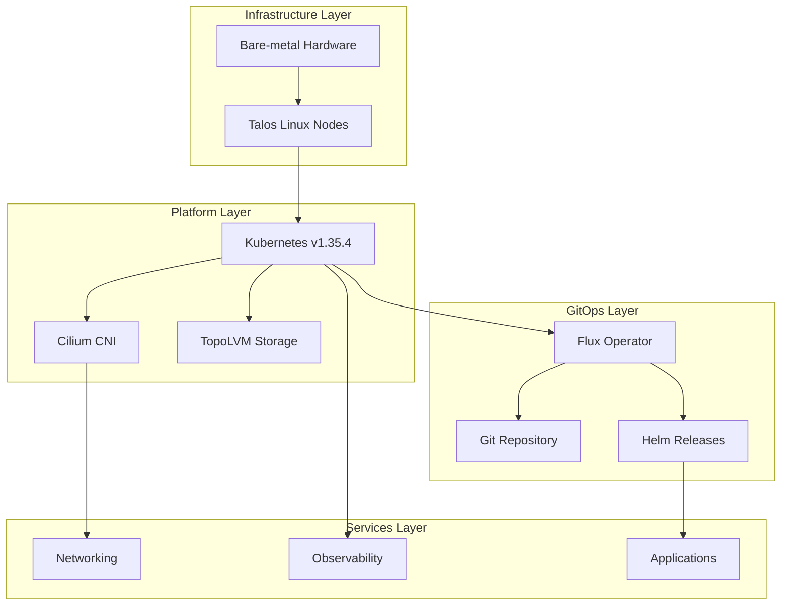

# Quick Start Guide

Welcome to the Talos Kubernetes cluster documentation. This repository contains the complete GitOps configuration for a homelab cluster running Talos Linux with ~30 applications across multiple namespaces.

## Architecture Overview

This cluster combines Talos Linux as the operating system with Flux for GitOps-based cluster management:



*Figure: Four-layer cluster architecture from bare-metal infrastructure through GitOps-managed services*

### Key Components

- **Operating System**: Talos Linux v1.12.7 (secure-boot enabled, immutable, API-managed)
- **Orchestration**: Flux for GitOps-based cluster management
- **Networking**: Cilium (CNI with L2 announcements), Cloudflare Tunnel (ingress), Tailscale (VPN/mesh)
- **Secrets**: SOPS + age for Git encryption, External Secrets Operator with Bitwarden for runtime secrets
- **Observability**: Prometheus, Grafana, Loki, Thanos, Gatus, Uptime Kuma
- **Storage**: TopoLVM (LVM thin provisioning), VolSync (backup/replication), snapshot-controller, NFS CSI

## Local Environment Setup

The repository uses [mise](https://mise.jdx.dev/) for toolchain management and environment configuration.

### Initial Setup

```bash
mise trust
mise install
```

This installs and configures the required tools: `task`, `talhelper`, `talosctl`, `kubectl`, `flux`, `helmfile`, `sops`, `age`, `yq`, `kubeconform`, `cilium-cli`, `cloudflared`, `cue`, `helm`, `jq`, `kustomize`, `gh`, `python`, `makejinja`, `node`, and `pipx`. Tool versions are pinned in `.mise.toml`; Renovate keeps them updated.

### Environment Variables

mise automatically sets these essential environment variables:

- `KUBECONFIG=./kubeconfig` - Kubernetes client configuration
- `TALOSCONFIG=./talos/clusterconfig/talosconfig` - Talos client configuration
- `SOPS_AGE_KEY_FILE=./age.key` - Age private key for secret encryption/decryption

## Make a Change (the core loop)

Most agent/operator changes touch only `kubernetes/` manifests and flow through Flux. The minimal loop:

1. **Edit manifests** under `kubernetes/apps/<namespace>/<app>/` (e.g. `helmrelease.yaml`, `externalsecret.yaml`, or the app's `ks.yaml`).
2. **Verify the build locally** with kustomize before committing:

   ```bash
   kustomize build kubernetes/apps/default/gitea/app | kubeconform -strict -summary
   ```

3. **Commit and push to `main`**. Flux polls the `flux-system` GitRepository on a 1h interval.
4. **Reconcile immediately** (optional but recommended):

   ```bash
   task reconcile   # flux reconcile kustomization flux-system --with-source
   ```

5. **Verify reconciliation**:

   ```bash
   flux get kustomizations -A            # app-level Kustomization status
   kubectl get kustomization <app> -n <namespace> -o yaml | yq '.status.conditions'
   flux get helmreleases -n <namespace>  # if you changed a HelmRelease
   kubectl get pods -n <namespace>       # workload health
   ```

6. **Roll back** by reverting the commit — Flux prunes removed resources (`prune: true` is set on the root and app Kustomizations) and re-applies the previous state.

If a change introduces a new dependency (CRDs, another app), model it with `dependsOn` in the app's `ks.yaml` like `kubernetes/apps/default/gitea/ks.yaml` does for `topolvm`, `external-secrets`, and `cloudnative-pg-cluster`.

For pull requests, CI runs `flux-local test` and posts `flux-local diff` comments for `helmrelease` and `kustomization` resources (`.github/workflows/flux-local.yaml`), so the rendered impact is visible before merge.

## Quick Reference

### Common Tasks

```bash
task                          # List all available tasks
task reconcile                # Force Flux to pull git changes
task talos:generate-config    # Regenerate Talos machine configs
task talos:apply-node IP=<ip> # Apply Talos config to one node
task talos:upgrade-node IP=<ip>  # Upgrade Talos OS on one node
task talos:upgrade-k8s        # Upgrade Kubernetes cluster-wide
task bootstrap:talos          # Full Talos cluster bootstrap
task bootstrap:apps           # Bootstrap apps (namespaces, secrets, CRDs, Helm releases)
task volsync:snapshot APP=<name> NS=<ns>  # Trigger VolSync backup
```

See [**Cluster & OS Upgrade Workflow**](./workflows/upgrade.md) for upgrade ordering and the automated tuppr upgrade controller.

### Initial Cluster Bootstrap

For new cluster installations, the bootstrap process is split into two phases:

1. **Prepare Talos configuration**: Edit `talos/talconfig.yaml` and `talos/talenv.yaml`
2. **Bootstrap Talos**: `task bootstrap:talos` (applies machine configs, bootstraps cluster, exports kubeconfig)
3. **Bootstrap base apps**: `task bootstrap:apps` (installs Cilium, CoreDNS, cert-manager, Flux)

After bootstrap, Flux takes over and manages all applications under `kubernetes/apps/`.

See [**Bootstrap Workflow**](./workflows/bootstrap.md) for detailed prerequisites, step-by-step instructions, and verification procedures.

## Repository Structure

```
.
├── bootstrap/              # Initial Helm charts installed during cluster bootstrap
├── kubernetes/
│   ├── apps/               # Flux-managed applications (one Kustomization per namespace)
│   ├── components/         # Reusable components and common configurations
│   └── flux/               # Flux cluster/meta Kustomizations
├── talos/
│   ├── talconfig.yaml      # Talhelper main configuration
│   ├── talenv.yaml         # Talos/Kubernetes version pins
│   ├── clusterconfig/      # Generated Talos machine configs (do not edit)
│   └── patches/            # Machine-level patches merged by talhelper
├── scripts/                # Bootstrap and utility scripts
├── .taskfiles/             # Task subcommand definitions (bootstrap, talos, volsync)
├── Taskfile.yaml           # Main task entrypoint
├── .mise.toml              # mise toolchain configuration
├── .sops.yaml              # SOPS encryption rules
└── .renovaterc.json5       # Renovate dependency automation configuration
```

## Application Organization

Applications are organized by namespace under `kubernetes/apps/`, with each namespace managed by its own Flux Kustomization:

- **`kube-system`**: Cilium, CoreDNS, metrics-server, node-feature-discovery, system-upgrade
- **`flux-system`**: Flux operator and instance, image automation
- **`network`**: Cloudflare Tunnel, AdGuard DNS, k8s-gateway, SMTP relay, Tailscale
- **`observability`**: Grafana, Prometheus, Loki, Thanos, Gatus, Uptime Kuma, promtail
- **`storage`**: TopoLVM, VolSync, NFS CSI, snapshot-controller, Nextcloud
- **`default`**: User applications (Gitea, growth-tracker, Paperless, Navidrome, Jellyfin, qBittorrent, RSSHub, n8n, Ollama, etc.)
- **`cert-manager`**: cert-manager installation and cluster issuers
- **`database`**: PostgreSQL, Redis operators
- **`external-secrets`**: External Secrets Operator and Bitwarden integration
- **`external-server`**: External-facing applications behind Cloudflare Tunnel

See [**Architecture Overview**](./architecture/overview.md) for details on namespace organization and the Flux reconciliation hierarchy.

## Documentation Map

The wiki is organized into six domains. Start here, then follow the links for depth:

| Domain | Page | What it covers |
| --- | --- | --- |
| **Architecture** | [Overview](./architecture/overview.md) | Cluster layers, namespace organization, and the Flux reconciliation hierarchy |
| **Architecture** | [Bootstrap Flow](./architecture/bootstrap-flow.md) | Control flow from bare Talos install to fully reconciled Flux cluster |
| **Concepts** | [Flux Architecture](./concepts/flux-architecture.md) | GitRepository source, Kustomization tree, dependency chain, drift behavior |
| **Concepts** | [Secrets Management](./concepts/secrets-management.md) | SOPS+age in Git, External Secrets + Bitwarden at runtime |
| **Concepts** | [Networking](./concepts/networking.md), [Storage](./concepts/storage.md), [Observability](./concepts/observability.md), [Cluster & Talos Architecture](./concepts/cluster-architecture.md), [Talos Config](./concepts/talos-config.md) | Domain deep dives |
| **Workflows** | [Bootstrap](./workflows/bootstrap.md) | Full cluster initialization from bare metal to GitOps-managed state |
| **Workflows** | [App Deployment](./workflows/app-deployment.md) | Standard app layout and Flux reconciliation path: `ks.yaml` → `helmrelease.yaml` → secrets, storage, routing, monitoring |
| **Workflows** | [Cluster & OS Upgrade](./workflows/upgrade.md) | Manual Talos/Kubernetes upgrade tasks plus the tuppr automated upgrade controller |
| **Operations** | [Daily Operations](./operations/daily-operations.md) | Routine tasks: Flux reconciliation, log viewing, debugging, and maintenance |
| **Operations** | [Troubleshooting](./operations/troubleshooting.md) | Symptom-driven playbook for stuck Kustomizations, HelmReleases, secrets, storage |
| **Integrations** | [Renovate](./integrations/renovate.md), [CI/CD](./integrations/ci-cd.md), [Tailscale](./integrations/tailscale.md), [Cloudflare](./integrations/cloudflare.md), [External Secrets](./integrations/external-secrets.md), [Bitwarden](./integrations/bitwarden.md), [Image Automation](./integrations/image-automation.md), [Hardware & Node Support](./integrations/hardware-support.md) | External system integrations |
| **Testing** | [Validation & Testing](./testing/validation.md) | kustomize builds, flux-local CI checks, dry-run reconciliation, post-deploy verification |

## Key Architectural Patterns

### Flux GitOps Flow

Flux watches the Git repository and reconciles the cluster in two root Kustomizations defined in `kubernetes/flux/cluster/ks.yaml`:

1. **`cluster-meta`** → Deploys source repositories (GitRepository, HelmRepository, OCIRepository) from `kubernetes/flux/meta/`
2. **`cluster-apps`** → Reconciles all application Kustomizations from `kubernetes/apps/`

`cluster-apps` additionally depends on `gateway-api-crds` and `external-dns-crds` Kustomizations, which install CRDs from their own GitRepository sources before any app is reconciled.

Each namespace under `kubernetes/apps/` has its own Kustomization that Flux reconciles with SOPS decryption enabled (the `sops-age` secret in `flux-system`).

See [**Flux GitOps Architecture**](./concepts/flux-architecture.md) for the complete reconciliation hierarchy and dependency ordering.

### Application Pattern

Most applications use the shared `app-template` OCI chart (`ghcr.io/bjw-s-labs/helm/app-template`) with this structure:

```
<namespace>/<app>/
  ks.yaml                # Flux Kustomization metadata
  app/
    helmrelease.yaml     # HelmRelease using shared app-template
    externalsecret.yaml  # ExternalSecret references (if needed)
    kustomization.yaml   # Resource aggregation
```

Common components like VolSync (backup), Gatus (uptime monitoring), and image automation are integrated through reusable components in `kubernetes/components/` (e.g. `components/volsync-new`, `components/gatus/external`), referenced via the `components:` field in each app's `ks.yaml`.

### Secret Management

Two-layer encryption approach:

1. **Git Encryption** (`talos/*.sops.yaml`, `bootstrap/`, `kubernetes/`): SOPS + age encryption
   - Talos configs: Whole-file encryption
   - Kubernetes configs: Only `data`/`stringData` fields encrypted
   - Rules defined in `.sops.yaml`

2. **Runtime Secrets** (External Secrets Operator + Bitwarden): Application secrets injected at runtime
   - ClusterSecretStore connects to Bitwarden Connect
   - ExternalSecret CRs define which secrets to sync
   - Never stored in Git

Flux decrypts SOPS secrets using the `sops-age` Secret in `flux-system`. The local `age.key` file is required for editing secrets but never committed.

See [**App Deployment Workflow**](./workflows/app-deployment.md) for how secrets are wired into applications, and [**Secrets Management**](./concepts/secrets-management.md) for the full model.

### Dependency Automation

Renovate handles automated dependency updates:

- **Container images**: Helm releases, Kubernetes deployments
- **Helm charts and OCI repositories**: Flux HelmRepository and OCIRepository resources
- **Talos/Kubernetes versions**: Version pins in `talos/talenv.yaml`
- **Toolchain versions**: mise packages in `.mise.toml`

**Schedule**: Runs on weekends only
**Auto-merge**: Patch updates and minor mise/GitHub Actions updates

See [**Renovate Dependency Automation**](./integrations/renovate.md) for configuration details and custom datasource tracking.

## Project Origins

This cluster was originally initialized using the [onedr0p/cluster-template](https://github.com/onedr0p/cluster-template) and has been significantly customized for a personal homelab environment.

**Important**: The repository contains environment-specific configurations (domains, IPs, credentials). When reusing this setup, you must clean and reconfigure network settings, domains, secrets, and application manifests for your environment.

## Status and Monitoring

The cluster exposes status metrics at [kromgo.tomyail.com](https://kromgo.tomyail.com) showing:

- Cluster age and uptime
- Node count
- Running pods
- CPU/memory usage
- Network traffic

A status page is available at [status-dev.tomyail.com](https://status-dev.tomyail.com).
