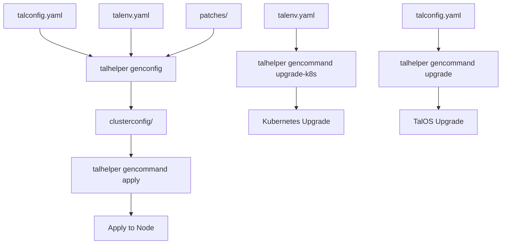

# Talos Configuration

How Talos Linux is configured and managed in this cluster.

## Configuration Architecture

### Talhelper

Talhelper is the tool that generates Talos machine configurations from a high-level YAML spec.

**Key files**:
- `talos/talconfig.yaml` - Main Talhelper configuration
- `talos/talenv.yaml` - Version pins (Talos and Kubernetes)
- `talos/talsecret.sops.yaml` - Encrypted cluster secrets (generated)
- `talos/clusterconfig/` - Generated machine configs (DO NOT EDIT)
- `talos/patches/` - Machine-level patches

### Version Management

The `talos/talenv.yaml` file pins versions:

```yaml
# renovate: datasource=docker depName=ghcr.io/siderolabs/installer
talosVersion: v1.12.7
# renovate: datasource=docker depName=ghcr.io/siderolabs/kubelet
kubernetesVersion: v1.35.4
```

**Why this matters**:
- Renovate tracks these files and updates them automatically via `datasource=docker` annotations
- Consistent versions across all nodes
- Kubernetes upgrades are coordinated through this file

**Update process**:
1. Wait for Renovate PR or manually update versions in `talos/talenv.yaml`
2. Run `task talos:generate-config`
3. Review generated configs in `talos/clusterconfig/`
4. Apply with `task talos:apply-node IP=<node-ip>` (for Talos changes)
5. Run `task talos:upgrade-k8s` (for Kubernetes version changes)

## Cluster Configuration

### talconfig.yaml Structure

The `talos/talconfig.yaml` file defines the cluster-wide configuration:

```yaml
clusterName: kubernetes
endpoint: https://192.168.50.10:6443
clusterPodNets: ["10.42.0.0/16"]
clusterSvcNets: ["10.43.0.0/16"]
cniConfig:
  name: none
```

**Key fields**:
- `clusterName`: Cluster identifier
- `endpoint`: Kubernetes API endpoint using VIP (192.168.50.10)
- `clusterPodNets`: Pod network CIDR
- `clusterSvcNets`: Service network CIDR
- `cniConfig`: Set to `none` to use Cilium instead of default CNI

### API Server Certificate SANs

Additional Subject Alternative Names (SANs) are configured for the API server:

```yaml
additionalApiServerCertSans: &sans
  - "127.0.0.1"
  - "192.168.50.10"
additionalMachineCertSans: *sans
```

This allows API access via localhost and the VIP address.

## Machine Configuration

### Node Definition

In `talos/talconfig.yaml`, nodes are defined with:

```yaml
nodes:
  - hostname: "master0-nuc12"
    ipAddress: "192.168.50.145"
    installDiskSelector:
      size: "<= 256GB"
      type: ssd
    machineSpec:
      secureboot: true
    talosImageURL: factory.talos.dev/installer-secureboot/a30c16a32db3c99cb35f22401fad96807f80896dfc86aa4ec716ed6b4aff09de
    controlPlane: true
    nodeLabels:
      intel.feature.node.kubernetes.io/gpu: "true"
```

**Key fields**:
- `hostname`: Node hostname
- `ipAddress`: Static IP configuration
- `installDiskSelector`: Disk selection criteria (size ≤256GB, SSD type)
- `machineSpec.secureboot`: Enable secure boot
- `talosImageURL`: Custom factory image with extensions
- `controlPlane`: Is this a control plane node?
- `nodeLabels`: Kubernetes labels (used for GPU scheduling)

### Disk Configuration

The cluster uses LVM-aware disk configuration:

**Install disk selector**:
- Size: ≤256GB (system disk)
- Type: SSD

**Custom volume provisioning** (via inline manifest):
```yaml
inlineManifests:
  - name: uservolume
    contents: |-
      apiVersion: v1alpha1
      kind: UserVolumeConfig
      name: local-path-provisioner
      provisioning:
        diskSelector:
          match: system_disk
        minSize: 2GB
        grow: true
```

This enables dynamic volume provisioning for local-path storage.

### Network Configuration

Each node defines network interfaces:

```yaml
networkInterfaces:
  - deviceSelector:
      hardwareAddr: "48:21:0b:58:14:f9"
    dhcp: false
    addresses:
      - "192.168.50.145/24"
    routes:
      - network: "0.0.0.0/0"
        gateway: "192.168.50.1"
    mtu: 1500
    vip:
      ip: "192.168.50.10"
```

**Key concepts**:
- Static IP assignment (no DHCP)
- Hardware address matching (MAC address)
- VIP for control plane API endpoint (192.168.50.10)
- MTU configuration for network optimization

### Kernel Modules

Required kernel modules are loaded per node:

```yaml
kernelModules:
  - name: dm_thin_pool    # LVM thin provisioning
  - name: dm_mod          # Device mapper
  - name: i915            # Intel GPU driver
  - name: drm             # Direct Rendering Manager
  - name: drm_kms_helper  # DRM KMS helper
```

**Why these modules**:
- `dm_*`: Required for TopoLVM (LVM storage)
- `i915/drm`: Intel GPU support for hardware acceleration

### Custom Extensions

Control plane nodes load system extensions:

```yaml
controlPlane:
  schematic:
    customization:
      systemExtensions:
        officialExtensions:
          - siderolabs/i915          # Intel GPU support
          - siderolabs/intel-ucode    # Intel microcode
          - siderolabs/thunderbolt   # Thunderbolt support
```

These extensions are built into the Talos factory image.

## Patches

### Patch Structure

Talhelper merges patches from `talos/patches/` into the final machine config:

```
talos/patches/
├── global/          # Applied to all nodes
│   ├── machine-api-access.yaml
│   ├── machine-files.yaml
│   ├── machine-kubelet.yaml
│   ├── machine-network.yaml
│   ├── machine-sysctls.yaml
│   ├── machine-time.yaml
│   └── machine-udev.yaml
└── controller/      # Applied to control plane nodes only
    └── cluster.yaml
```

Patches are referenced in `talos/talconfig.yaml`:

```yaml
patches:
  - "@./patches/global/machine-files.yaml"
  - "@./patches/global/machine-kubelet.yaml"
  # ... other global patches

controlPlane:
  patches:
    - "@./patches/controller/cluster.yaml"
```

### Global Patches

**machine-files.yaml** - Extra files on nodes:
```yaml
machine:
  files:
    - op: create
      path: /etc/cri/conf.d/20-customization.part
      permissions: 0o644
      content: |-
        [plugins."io.containerd.cri.v1.images"]
          discard_unpacked_layers = false
```
Configures containerd to keep unpacked image layers.

**machine-kubelet.yaml** - Kubelet configuration:
```yaml
machine:
  kubelet:
    extraConfig:
      serializeImagePulls: false
    nodeIP:
      validSubnets:
        - 192.168.50.0/24
    extraMounts:
      - destination: /var/mnt/local-path-provisioner
        type: bind
        source: /var/mnt/local-path-provisioner
        options:
          - bind
          - rshared
          - rw
```
Configures kubelet with optimized image pulling and local-path storage mounts.

**machine-network.yaml** - Network settings:
```yaml
machine:
  network:
    disableSearchDomain: true
    nameservers:
      - 1.1.1.1
      - 1.0.0.1
```
Sets DNS servers and disables search domain.

**machine-sysctls.yaml** - Kernel parameters:
```yaml
machine:
  sysctls:
    fs.inotify.max_user_watches: "1048576"
    fs.inotify.max_user_instances: "8192"
    net.core.rmem_max: "7500000"
    net.core.wmem_max: "7500000"
    user.max_user_namespaces: "65536"
```
Configures kernel parameters for file watching, network buffers (QUIC/Cloudflared), and user namespaces (rootless containers).

**machine-time.yaml** - Time synchronization:
```yaml
machine:
  time:
    disabled: false
    servers:
      - 162.159.200.1
      - 162.159.200.123
```
Sets NTP servers (Cloudflare).

**machine-udev.yaml** - udev rules:
```yaml
machine:
  udev:
    rules:
      - SUBSYSTEM=="drm", KERNEL=="renderD*", GROUP="44", MODE="0660"
```
Configures DRM device permissions for GPU access (video group GID 44).

**machine-api-access.yaml** - API access policies:
```yaml
machine:
  features:
    kubernetesTalosAPIAccess:
      enabled: true
      allowedRoles:
        - os:admin
      allowedKubernetesNamespaces:
        - kube-system
```
Enables Talos API access from Kubernetes pods.

### Controller Patches

**cluster.yaml** - Cluster-wide settings:
```yaml
cluster:
  allowSchedulingOnControlPlanes: true
  apiServer:
    extraArgs:
      enable-aggregator-routing: true
  controllerManager:
    extraArgs:
      bind-address: 0.0.0.0
  coreDNS:
    disabled: true
  etcd:
    extraArgs:
      listen-metrics-urls: http://0.0.0.0:2381
    advertisedSubnets:
      - 192.168.50.0/24
  proxy:
    disabled: true
  scheduler:
    extraArgs:
      bind-address: 0.0.0.0
```

**Key settings**:
- `allowSchedulingOnControlPlanes`: Allows workloads on control plane
- `coreDNS.disabled`: Using custom CoreDNS instead
- `proxy.disabled`: Using Cilium's kube-proxy replacement
- `etcd.advertisedSubnets`: Advertises etcd on local subnet
- `enable-aggregator-routing`: Enables API aggregator routing

## Configuration Generation Workflow

### Talhelper Tasks

The `.taskfiles/talos/Taskfile.yaml` defines the talhelper workflow:



**Configuration generation and application**

### generate-config Task

```bash
task talos:generate-config
```

This task:
1. Requires `talos/talconfig.yaml`, `.sops.yaml`, `SOPS_AGE_KEY_FILE`, and `talhelper` CLI
2. Expands variables from `talenv.yaml` (versions)
3. Merges patches from `talos/patches/`
4. Encrypts secrets with SOPS
5. Writes machine configs to `talos/clusterconfig/`

**Output structure**:
```
talos/clusterconfig/
├── talosconfig                    # Talosctl config
├── master0-nuc12.yaml            # Control plane config
└── ...                           # Worker node configs (if any)
```

The `clusterconfig/` directory is gitignored and should never be manually edited.

### apply-node Task

```bash
task talos:apply-node IP=192.168.50.145
```

This task:
1. Validates node connectivity via `talosctl get machineconfig`
2. Generates apply command via `talhelper gencommand apply`
3. Applies configuration to the specified node
4. Supports `MODE` flag: `auto`, `no-reboot`, or `reboot` (default: `auto`)

### upgrade-node Task

```bash
task talos:upgrade-node IP=192.168.50.145
```

This task:
1. Extracts `talosImageURL` from `talos/talconfig.yaml` for the specific node
2. Extracts `talosVersion` from `talos/talenv.yaml`
3. Executes `talhelper gencommand upgrade` with custom image and timeout flags
4. Upgrades Talos OS on the specified node

### upgrade-k8s Task

```bash
task talos:upgrade-k8s
```

This task:
1. Reads `kubernetesVersion` from `talos/talenv.yaml`
2. Executes `talhelper gencommand upgrade-k8s` with `--to` flag
3. Upgrades Kubernetes across the cluster

## Custom Factory Image

The cluster uses a custom Talos factory image with system extensions:

```yaml
talosImageURL: factory.talos.dev/installer-secureboot/a30c16a32db3c99cb35f22401fad96807f80896dfc86aa4ec716ed6b4aff09de
```

This image includes:
- Secure boot support (`installer-secureboot`)
- i915 GPU driver
- Intel microcode
- Thunderbolt support

**Why custom image**:
- Hardware acceleration support (GPU)
- Secure boot enforcement
- Built-in extensions without runtime loading

**Updating the image**:
1. Build new factory image via [Talos image factory](https://factory.talos.dev/)
2. Update `talosImageURL` in `talos/talconfig.yaml`
3. Regenerate configs: `task talos:generate-config`
4. Apply to nodes: `task talos:apply-node IP=<ip>`

## Cluster Secrets

### Secret Generation

The `talos/talsecret.sops.yaml` file contains:

- Cluster CA certificate and key
- API server certificate and key
- Etcd certificates
- Kubernetes service account keys
- Kubelet certificates
- Cluster encryption key

These are generated once during initial bootstrap and encrypted with age.

### Secret Storage

Secrets are encrypted using SOPS with age encryption:
- Encryption rules defined in `.sops.yaml`
- Private key stored in `age.key` (via `SOPS_AGE_KEY_FILE`)
- Encrypted file committed to git as `talos/talsecret.sops.yaml`

### Secret Rotation

To rotate cluster secrets (rare, destructive):

1. Delete `talos/talsecret.sops.yaml`
2. Re-run `talhelper genconfig` (generates new secrets)
3. Re-bootstrap the cluster (required because all certificates change)

**This is extremely disruptive** - only do this for critical security incidents.

## Related Workflows

- **[Cluster Bootstrap](/openwiki/workflows/bootstrap.md)** - Initial cluster setup from Talos configuration
- **[Cluster Upgrade](/openwiki/workflows/upgrade.md)** - Talos and Kubernetes upgrade procedures
- **[Cluster Architecture](/openwiki/concepts/cluster-architecture.md)** - Overall system design
