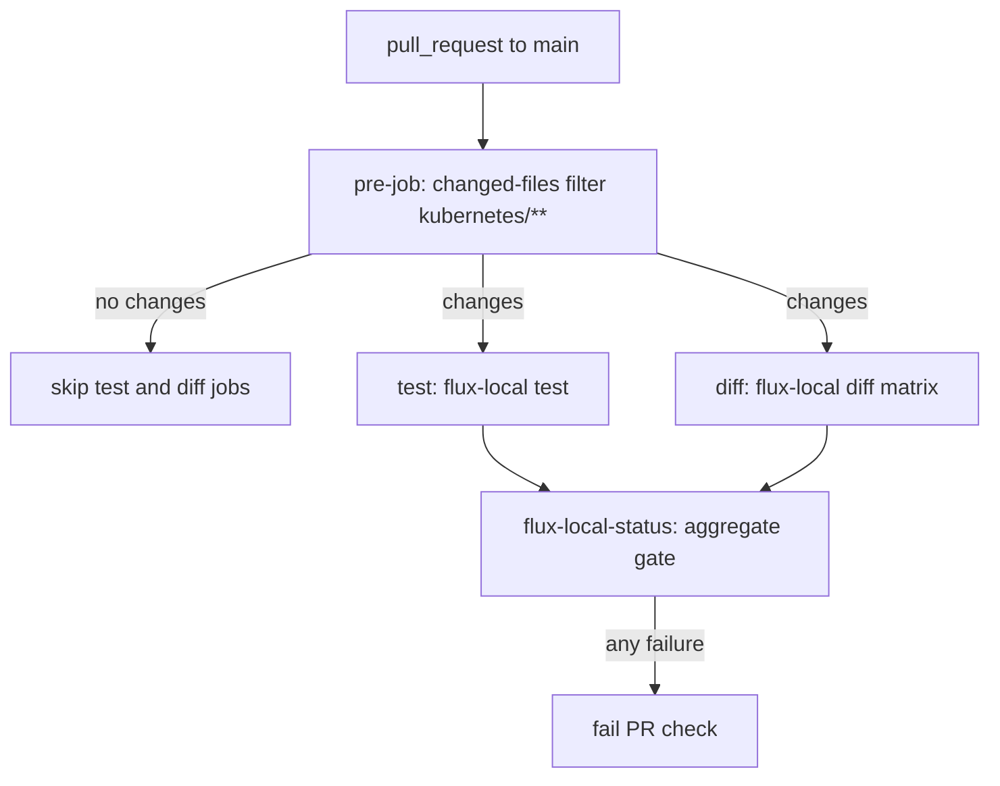

# Validation & Testing

This repository is a Flux-managed Talos Kubernetes cluster, so "testing" means: rendering manifests locally and in CI before merge, verifying that Flux can build and apply them, and confirming health after reconciliation. There is no unit test suite and no separate kubeconform/yamllint CI job; validation is declarative-render and cluster-convergence checking. `kubeconform`, `kustomize`, `yq`, and `sops` are pinned as local tools via mise and available for ad-hoc local checks (e.g. `kustomize build` against an app directory), but the only automated merge gate is the flux-local workflow plus Renovate's automerge rules.

## CI validation on pull requests (flux-local)

`.github/workflows/flux-local.yaml` is the primary merge gate. It runs on pull requests targeting `main` and consists of four jobs:



*Caption: Job structure of the flux-local pull-request workflow.*

- **pre-job** uses `tj-actions/changed-files` filtered to `kubernetes/**` and exposes `any_changed` as an output. Both validation jobs are skipped when no `kubernetes/` files changed, so workflow/bootstrap-only PRs stay fast.
- **test** runs `flux-local test --enable-helm --all-namespaces --sources flux-system --path .../kubernetes/flux/cluster` in the `ghcr.io/allenporter/flux-local:v8.4.0` container. This renders the full Kustomization tree starting at `kubernetes/flux/cluster/ks.yaml`, including Helm charts (HelmReleases referencing the `app-template` OCI chart) and SOPS decryption — so broken kustomizations, invalid HelmRelease values, or undecryptable manifests fail the PR.
- **diff** runs `flux-local diff` in a matrix over `helmrelease` and `kustomization` resources, checking out both the PR branch (`pull/`) and the default branch (`default/`). It strips volatile attributes (`helm.sh/chart`, `checksum/config`, `app.kubernetes.io/version`, `chart`) with `--strip-attrs`, limits output with `--limit-bytes 10000`, writes `diff.patch`, echoes it into the job summary, and posts the rendered diff as a PR comment via `mshick/add-pr-comment` (keyed per resource type, with `continue-on-error: true`). The diff job is informational — reviewers see exactly what rendered manifests will change on the cluster.
- **flux-local-status** runs with `if: always()` and fails if either `test` or `diff` failed, giving a single stable check name for branch protection.

Concurrency is configured with `cancel-in-progress: true`, so pushing new commits to a PR cancels superseded runs.

## Local validation with Taskfile

The root `Taskfile.yaml` includes `.taskfiles/bootstrap`, `.taskfiles/talos`, and `.taskfiles/volsync`. Every mutating task declares `preconditions` and `requires` that act as validation gates before anything touches the cluster:

- **Environment checks**: the local toolchain and config must exist — `talconfig.yaml`, `.sops.yaml`, `SOPS_AGE_KEY_FILE` (`./age.key`), `TALOSCONFIG`, and `KUBECONFIG` (both pinned by `.mise.toml`). Tasks also assert required binaries (`talhelper`, `talosctl`, `sops`, `flux`, `kubectl`, `yq`) are on `PATH`.
- **Cluster-state checks**: e.g. `talos:apply-node` and `talos:upgrade-node` first run `talosctl --nodes <IP> get machineconfig` and `talosctl config info` to prove connectivity before applying or upgrading.
- **Generated-config integrity**: `talos/clusterconfig/` is generated output (`talhelper genconfig`); never edit it directly — change `talconfig.yaml`/patches and regenerate via `task talos:generate-config`.

Because mise auto-exports `KUBECONFIG`, `TALOSCONFIG`, and `SOPS_AGE_KEY_FILE`, all task commands run against the repo-local kubeconfig, avoiding accidental changes to another cluster.

## Local toolchain and rendering checks

`.mise.toml` pins the complete toolchain used for local validation, including `kubeconform = 0.8.0`, `kustomize = 5.6.0`, `kubectl = 1.33.1`, `helm = 4.3.0`, `sops`, `talos`, `talhelper`, `flux`, `yq`, and `jq`. Two notes:

- Schema validation via `kubeconform` and rendering via `kustomize build` are manual, local practices — there is no repo config file for either and no CI step invokes them. The closest automated equivalent is the CI `flux-local test` job, which builds every Kustomization and applies the same helm/sops rendering pipeline.
- There is also no `yamllint` configuration in the repository; YAML style is instead governed by `.editorconfig`.

## Formatting and file conventions (.editorconfig)

`.editorconfig` (marked `root = true`) defines the baseline formatting expected of every file: LF line endings, UTF-8, trimmed trailing whitespace, final newline, and space indentation at 2 spaces for general files. Exceptions: Markdown files use 4-space indent and do not trim trailing whitespace (line breaks matter); shell scripts use 4-space indent; CUE files use tabs at width 4. Editors and formatters honoring this file keep PR diffs clean, which matters because the flux-local diff comments are diff-based.

## Dry-run validation patterns

Two dry-run patterns appear in the bootstrap path (`scripts/bootstrap-apps.sh`):

- Namespaces are created with `kubectl create namespace <ns> --dry-run=client --output=yaml | kubectl apply --server-side --filename -` — render the manifest locally, then server-side apply, skipping ones that already exist.
- SOPS secrets are checked with `sops exec-file <secret> "kubectl --namespace flux-system diff --filename {}"` before applying; only secrets whose decrypted output differs from the cluster are applied. This is the server-side diff used as an idempotency check during bootstrap.

## Dry-run reconciliation and post-deploy verification

After merging, changes reach the cluster through Flux's reconciliation of the `flux-system` GitRepository. The root Kustomizations in `kubernetes/flux/cluster/ks.yaml` (`cluster-meta`, `gateway-api-crds`, `external-dns-crds`, `cluster-apps`) all use `wait: true`, `timeout: 5m`, and `retryInterval: 2m`, so a bad change surfaces as a failed Kustomization rather than a silently divergent cluster.

- **Force a reconcile**: `task reconcile` runs `flux reconcile kustomization flux-system --with-source`, pulling the latest git revision immediately instead of waiting for the 1h interval.
- **Inspect convergence**:
  ```bash
  flux get kustomizations --all-namespaces     # ready state of every Kustomization
  flux get helmreleases --all-namespaces       # helm deploy/ready state
  kubectl get kustomization -n flux-system -o wide
  ```
- **Pre-apply a specific change locally**: run `kustomize build` (available via mise) against the app directory, or rely on the CI `flux-local diff` comment which shows the same rendering.
- **VolSync operations verify their own work**: `task volsync:snapshot APP=<name> NS=<ns>` patches the ReplicationSource to trigger a manual backup, then `kubectl wait job/volsync-src-<app> --for=condition=complete --timeout=120m` blocks until the backup job completes; `volsync:list` runs a job, streams its logs, and deletes it. Tasks assume the Kustomization/HelmRelease/PVC/ReplicationSource share the app's name and each app has one replicated PVC.

## Renovate and the CI gate

Renovate (`.renovaterc.json5`) is the main source of manifest churn, and its configuration interacts directly with validation:

- Managers for `flux`, `helm-values`, `kubernetes`, and `kustomize` match all `kubernetes/**/*.yaml` (including `.j2` templates), so HelmRelease values and Kustomization patches get dependency PRs. Encrypted files (`**/*.sops.*`) are ignored because Renovate cannot decrypt them.
- PRs land on a `every weekend` schedule, and updates are batched into groups (Cert-Manager, CoreDNS, Flux Operator, Spegel).
- **Automerge without tests**: GitHub Actions and mise tool updates (minor/patch/digest) have `automerge: true` with `ignoreTests: true`, meaning they merge without waiting for CI checks — Renovate deliberately bypasses the flux-local gate for these, relying on pinning (GitHub Actions are pinned to commit digests via `helpers:pinGitHubActionDigests`) and the 3-day `minimumReleaseAge` for actions as the safety net instead.
- Semantic commits encode risk class: `fix` for patches, `feat` for minors, and `feat(...)!:` for majors, so `git log`/release notes surface breaking updates at a glance.

## Failure semantics

- The `test` CI job fails the PR on any build/decrypt/render error; `diff` failures also propagate through `flux-local-status`, so a diff that cannot be produced blocks merge.
- In the cluster, Kustomizations with `wait: true` and `retryInterval: 2m` keep retrying and report `Ready=False`; downstream Kustomizations with `dependsOn` (e.g. `cluster-apps` depends on `cluster-meta` and both CRD sources) will not start until their dependencies are ready.
- Task preconditions fail fast with an explicit message before any cluster mutation (for example, `talos:reset` additionally prompts before destroying the cluster).
