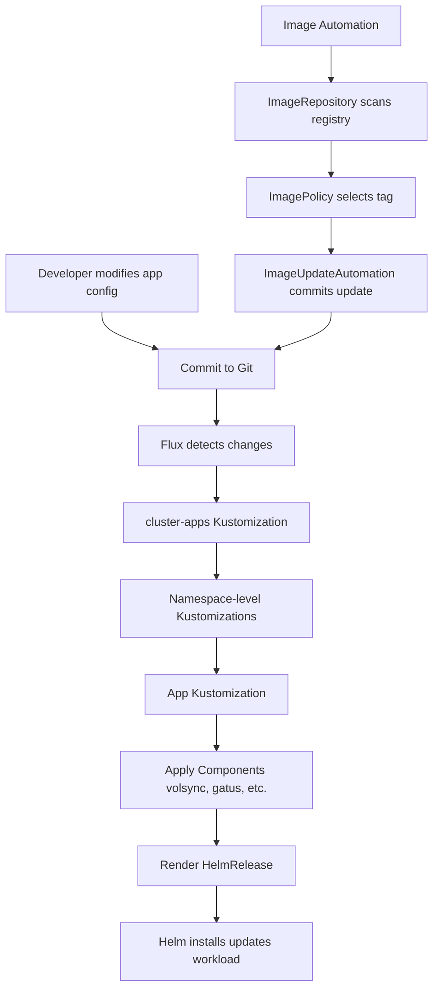

# Application Deployment Workflow

Applications in the Talos cluster are deployed through a structured Flux GitOps workflow that combines the app-template pattern, reusable components, dependency management, and namespace organization. This document explains how applications are deployed, configured, and managed.

## Overview



*Figure: Application deployment and image update automation flow*

## Namespace Organization

Applications are organized by namespace under `kubernetes/apps/`, with each namespace containing one or more applications:

**Namespace Structure**
- **default**: User applications (gitea, atuin, home-assistant, etc.)
- **database**: Database services (cloudnative-pg, dragonfly, pgadmin)
- **storage**: Storage infrastructure (topolvm, volsync, snapshot-controller)
- **kube-system**: Cluster services (cilium, coredns, metrics-server)
- **network**: Network services (tailscale, cloudflare-tunnel, adguard-dns)
- **observability**: Monitoring and logging (grafana, prometheus, gatus)
- **external-secrets**: Secret management (external-secrets, bitwarden-connect)
- **flux-system**: Flux infrastructure (flux-instance, image-automation)

The `cluster-apps` Kustomization defined in `kubernetes/flux/cluster/ks.yaml` reconciles all namespace-level Kustomizations from the `./kubernetes/apps` directory with SOPS decryption enabled.

## Application Resource Structure

Each application follows a standard directory structure under `kubernetes/apps/<namespace>/<app>/`:

```
kubernetes/apps/default/gitea/
├── ks.yaml                    # App Kustomization
├── app/
│   ├── kustomization.yaml     # Resources list
│   ├── helmrelease.yaml       # HelmRelease spec
│   └── externalsecret.yaml    # ExternalSecret for secrets
└── runner/                    # Optional: secondary component
    └── ks.yaml
```

**Example: Gitea**
- Main app Kustomization at `kubernetes/apps/default/gitea/app`
- Optional runner component at `kubernetes/apps/default/gitea/runner`
- Each component has its own Kustomization with dependencies

### App Kustomization

The application Kustomization (`ks.yaml`) defines how the app is deployed:

**Common Metadata**
- Labels all resources with `app.kubernetes.io/name: <app>` for identification

**Components**
- Reusable components added via `components` field
- Examples: `volsync-new`, `gatus/external`
- Components are Kustomize components that inject additional resources

**Dependencies**
- `dependsOn` field ensures proper ordering
- Storage dependencies (topolvm)
- Secret dependencies (external-secrets)
- Database dependencies (cloudnative-pg-cluster)

**Path and Source**
- Points to `app` subdirectory containing HelmRelease
- References `flux-system` GitRepository
- 1-hour reconciliation interval with retry logic

**Variable Substitution**
- `postBuild.substituteFrom`: Inject cluster-wide secrets (SECRET_DOMAIN, TIMEZONE)
- `postBuild.substitute`: App-specific variables (APP name, VolSync capacity)

**Pruning and Waiting**
- `prune: true` enables automatic resource deletion when removed from Git
- `wait: true` ensures resources are fully applied before marking success
- Timeout and retryInterval settings prevent indefinite hangs

## App-Template Pattern

Most applications use the standardized app-template Helm chart from bjw-s-labs, which provides a flexible schema for deploying containerized workloads.

### OCIRepository Source

The app-template chart is sourced via OCIRepository:
- URL: `oci://ghcr.io/bjw-s-labs/helm/app-template`
- Version: 5.0.1 (tag-based)
- Interval: 1 hour
- Deployed by `cluster-meta` Kustomization

### HelmRelease Structure

Applications reference app-template via `chartRef.kind: OCIRepository`. Helm values are inlined directly in the HelmRelease under `spec.values` — this repo does **not** use `spec.valuesFrom` or `spec.postRenderers`; configuration injection is done through PostBuild variable substitution at the Kustomization layer (e.g. `${SECRET_DOMAIN}`, `${TIMEZONE}`, `${APP}`) rather than Helm-level post-rendering. If a chart's values ever need restructuring that kustomize substitution cannot express, `postRenderers` (kustomize patches applied after Helm template rendering) is the extension point, but no app currently requires it.

**Example: Atuin**
```yaml
apiVersion: helm.toolkit.fluxcd.io/v2
kind: HelmRelease
metadata:
  name: atuin
spec:
  interval: 1h
  chartRef:
    kind: OCIRepository
    name: app-template
```

### Values Patterns: envFrom and YAML Anchors

Database-backed apps follow a shared secret-injection pattern built on YAML anchors:

```yaml
controllers:
  atuin:
    initContainers:
      init-db:                      # waits for Postgres and creates the DB/user
        image:
          repository: ghcr.io/home-operations/postgres-init
        envFrom: &envFrom           # anchor defined on the init container
          - secretRef:
              name: atuin-secret    # materialized by an app-level ExternalSecret
    containers:
      app:
        envFrom: *envFrom           # same secret injected into the main container
```

The `&envFrom` / `*envFrom` anchor pair guarantees the init container and the app container receive identical credentials, so a secret rotation is picked up by both. Pair this with the `reloader.stakater.com/auto: "true"` controller annotation so pods restart when the referenced Secret changes. Plain `env:` entries carry non-secret configuration and may interpolate PostBuild variables (`TZ: ${TIMEZONE}`).

### App-Template Values Schema

The app-template chart organizes configuration into logical sections:

**Controllers**
- Defines main container and init containers
- Container image, environment variables, probes
- Resource limits and security context
- Annotations (e.g., `reloader.stakater.com/auto: "true"`)

**Default Pod Options**
- Pod-level security context (runAsUser, fsGroup)
- seccomp profiles
- Applied to all containers in the pod

**Service**
- Service port definitions
- Controller reference

**Route**
- Gateway API HTTPRoute configuration
- Hostnames and parent Gateway references
- Backend service ports

**Persistence**
- PVC references or emptyDir volumes
- Advanced mount configurations with subPaths

**ServiceMonitor**
- Prometheus scraping configuration
- Endpoint definitions for metrics

## Common Components

Reusable components provide cross-cutting concerns for applications. Components are Kustomize components referenced in app Kustomizations.

### VolSync Component

VolSync provides automated backup and replication for application data.

**Component Resources**
- `claim.yaml`: PersistentVolumeClaim for application data
- `minio.yaml`: ReplicationSource, ReplicationDestination, and ExternalSecret

**PVC Template**
- Configurable capacity via `VOLSYNC_CAPACITY` variable (default: 1Gi)
- Storage class selection via `VOLSYNC_STORAGECLASS` (default: `topolvm-thin-provisioner`)
- Access modes configurable via `VOLSYNC_ACCESSMODES`

**Backup Configuration**
- Restic-based backups to MinIO S3 at `192.168.50.220:9010`
- Schedule: Every 6 hours (`0 */6 * * *`)
- Retention: 24 hourly, 7 daily, 5 weekly backups
- Prune interval: 7 days
- Direct copy method with snapshot support

**Restore Configuration**
- ReplicationDestination for restore operations
- Manual trigger (`restore-once`)
- Configurable cache capacity and storage class
- Cleanup of temporary PVCs after restore

**Secret Management**
- ExternalSecret fetches MinIO credentials from Bitwarden
- Template generates `RESTIC_REPOSITORY`, `RESTIC_PASSWORD`, AWS credentials
- Uses `bitwarden-login` ClusterSecretStore

**Usage**
```yaml
components:
  - ../../../../components/volsync
```
(Apps in this repo reference `components/volsync`; `components/volsync-new` is an alternative variant of the same pattern.)

### Gatus Component

Gatus provides automated health monitoring for applications.

**ConfigMap Generator**
- Creates ConfigMap with `gatus.io/enabled: "true"` label
- Gatus sidecar auto-discovers labeled ConfigMaps
- Variable substitution for APP name and domain

**Endpoint Configuration**
- URL template: `https://${APP}.${SECRET_DOMAIN}`
- 1-minute check interval
- DNS resolver: `223.5.5.5:53`
- HTTP status validation (default: 200)

**Gatus Deployment**
- Init container uses k8s-sidecar to watch labeled ConfigMaps
- METHOD: WATCH enables continuous monitoring
- Generates Gatus configuration from discovered endpoints

**Usage**
```yaml
components:
  - ../../../../components/volsync-new
  - ../../../../components/gatus/external
```

### Image Automation Component

Image automation automatically updates application image tags when new versions are available.

**Component Resources**
- `registry-externalsecret.yaml`: Fetches registry credentials from Bitwarden
- `imagerepository.yaml`: Scans container registry for new tags
- `imagepolicy.yaml`: Selects latest image tag based on policy

**Registry Credentials**
- ExternalSecret pulls username/password from Bitwarden
- Variables: `BW_ID` (Bitwarden item ID), `REGISTRY_HOST`
- Template generates dockerconfigjson secret for registry auth

**Image Repository**
- Scans `REGISTRY_URL` every minute
- Uses registry secret for authentication
- Namespace-scoped to application

**Image Policy**
- Numerical ordering (ascending)
- Tag pattern: `^.+-[a-f0-9]+-(?P<ts>[0-9]+)$` (SHA-based tags)
- Extracts timestamp for sorting
- Labeled with `image-automation: enabled` for discovery

**Update Automation**
- ImageUpdateAutomation scans policies with `image-automation: enabled` label
- Updates `./kubernetes/apps/default` directory using Setters strategy
- Commits changes via `flux-system-https` GitRepository with authentication
- 5-minute interval for checking updates

**Usage in App**
```yaml
image:
  repository: gitea.tomyail.com/tomyail/myapp
  tag: "sha-xxx" # {"$imagepolicy": "NAMESPACE:APP:tag"}
```

## Dependency Management

Flux Kustomizations support explicit dependency declarations to ensure proper ordering of resource creation.

### Multi-Level Dependencies

**Infrastructure Dependencies**
- `topolvm` (storage): Must be ready before provisioning PVCs
- `external-secrets`: Secret injection must be available
- `cloudnative-pg-cluster`: Database must be running

**Cluster-Level Ordering**
- `cluster-apps` depends on CRDs (gateway-api, external-dns)
- Ensures custom resources are defined before applications use them

**Database App Pattern**
- Two Kustomizations: operator and cluster
- `cloudnative-pg-cluster` depends on `cloudnative-pg` operator
- Operator must be installed before cluster resources

### Dependency Failure Behavior

When dependencies are specified:
- Flux waits for dependency Kustomizations to become ready
- Failed dependencies block downstream reconciliation
- `wait: true` ensures resources are fully applied before marking success
- Timeout and retry settings prevent indefinite hangs

## Secrets Management Integration

Applications integrate with the cluster's dual-layer secrets architecture.

### SOPS Decryption

**Kustomization-Level Decryption**
- SOPS provider decrypts `*.sops.yaml` files in path
- Uses `sops-age` secret for decryption key
- Applied before resource application

**Cluster-Wide Secrets**
- `postBuild.substituteFrom` injects `cluster-secrets` Secret
- Variables like `SECRET_DOMAIN` and `TIMEZONE` available to all apps

### External Secrets Operator

**App-Level ExternalSecrets**
- Fetch application-specific secrets from Bitwarden
- Template variables for configuration injection
- Referenced by deployments via `envFrom`

**Component Integration**
- VolSync component creates ExternalSecret for backup credentials
- Image automation component creates ExternalSecret for registry auth

## Application Lifecycle

### Deployment

1. **Commit Configuration**
   - Developer commits app HelmRelease and Kustomization
   - Changes pushed to main branch

2. **Flux Reconciliation**
   - `flux-system` GitRepository detects commit (1-hour interval)
   - `cluster-apps` Kustomization reconciles namespace Kustomizations
   - App Kustomization applies components and HelmRelease

3. **Component Application**
   - Kustomize components transform resources
   - VolSync adds PVC, ReplicationSource, and secrets
   - Gatus adds monitoring ConfigMap

4. **Helm Installation**
   - Helm controller installs/updates chart
   - Waits for resources to be ready
   - Remediation on failure (rollback with retries)

### Update

1. **Image Updates**
   - ImageRepository scans registry every minute
   - ImagePolicy selects latest tag
   - ImageUpdateAutomation commits tag update to Git
   - Flux reconciles new image tag

2. **Configuration Updates**
   - Modify HelmRelease values
   - Flux detects change and applies
   - Helm performs rolling update if needed

### Deletion

1. **Remove App Kustomization**
   - Delete or comment out Kustomization in parent namespace `kustomization.yaml`
   - Flux pruning removes resources

2. **Flux Pruning**
   - `prune: true` enables automatic resource deletion
   - Flux removes all resources owned by Kustomization

3. **Manual Cleanup**
   - VolSync ReplicationDestination may need manual deletion
   - PVCs may be retained based on reclaim policy

## Template Walkthrough: Atuin

A complete real app lives at `kubernetes/apps/default/atuin/`. Three files are involved:

**1. `ks.yaml` — Flux Kustomization** (`kubernetes/apps/default/atuin/ks.yaml`)
- `metadata.name: &app atuin` with `targetNamespace: default`; `commonMetadata` stamps `app.kubernetes.io/name: atuin` on every resource it applies.
- Composes two components: `../../../../components/volsync` (PVC + backups) and `../../../../components/gatus/external` (uptime checks).
- `dependsOn`: `topolvm` (storage), `external-secrets`, and `cloudnative-pg-cluster` (its Postgres database).
- Decrypts SOPS-encrypted files with the `sops-age` secret; pulls from the `flux-system` GitRepository; `prune: true`, `wait: true`, `interval: 1h`, `retryInterval: 2m`, `timeout: 5m`.
- `postBuild.substituteFrom` loads `cluster-secrets`; `postBuild.substitute` sets `APP: atuin` and `VOLSYNC_CAPACITY: 10Gi` for the components.

**2. `app/kustomization.yaml`** — plain Kustomize manifest listing `./externalsecret.yaml` and `./helmrelease.yaml`.

**3. `app/helmrelease.yaml`** — the workload itself, using app-template:
- `chartRef: {kind: OCIRepository, name: app-template}` with `interval: 1h`, `timeout: 10m`.
- Remediation: `install.remediation.retries: 3`; `upgrade.cleanupOnFail: true` with `strategy: rollback` and 3 retries.
- Values: `init-db` init container (`ghcr.io/home-operations/postgres-init`) plus the `atuin` container, both sharing the `&envFrom` secret anchor; probes on `/healthz`; `serviceMonitor` scraping `/metrics` every minute; a `service` exposing `http` and `metrics` ports; and a Gateway API `route` attaching to the `internal` and `external` Gateways in `kube-system` with hostname `atuin.${SECRET_DOMAIN}`.
- Persistence comes from the VolSync component's PVC, referenced via `existingClaim` in apps that need it; atuin's data lives in the database, so it relies on `atuin-secret` instead.

To add a new app, copy this directory, rename `*app`/`*namespace` anchors, adjust dependencies and values, then register the app's `ks.yaml` in the namespace-level `kubernetes/apps/<namespace>/kustomization.yaml` resources list.

## Verification After Reconcile

After Flux reconciles an app change, verify in order (each step fails at the layer above if a dependency is broken):

1. `flux get kustomizations -n flux-system` — `cluster-apps` and the app's Kustomization (e.g. `default/atuin`) should be `Ready: True`.
2. `flux get kustomization <app> -n <namespace> --show-conditions` or `flux reconcile kustomization <app> -n <namespace> --with-source` — forces a re-reconcile and surfaces apply errors.
3. `flux get helmrelease <app> -n <namespace>` — Helm controller state; a failed release shows remediation/rollback events under `flux get helmreleases -A --status-selector ready=false`.
4. `kubectl get pods,secret,httproute,pvc -n <namespace> -l app.kubernetes.io/name=<app>` — workloads running, ExternalSecret-synced Secret populated, route accepted, PVC bound (components stamp this label via `commonMetadata`).
5. Check Gatus endpoint status and Prometheus targets (`serviceMonitor`) for the app's metrics port.

## Best Practices

### Resource Naming
- Use YAML anchors for app name: `name: &app gitea`
- Reference with `*app` to maintain consistency
- Apply same pattern to namespace

### Component Configuration
- Set component variables via `postBuild.substitute`
- Example: `VOLSYNC_CAPACITY: 10Gi` for storage sizing

### Dependency Declaration
- Declare all infrastructure dependencies
- Include storage, secrets, and database dependencies
- Use namespace-qualified dependency names

### Security Context
- Set `readOnlyRootFilesystem: true` for containers
- Drop all capabilities with `drop: ['ALL']`
- Run as non-root user with `runAsNonRoot: true`

### Resource Management
- Set resource requests for scheduling
- Define limits for resource isolation
- Use small requests (10m CPU, appropriate memory)

### Monitoring
- Add ServiceMonitor for Prometheus scraping
- Include Gatus component for health checks
- Configure probes for liveness/readiness
