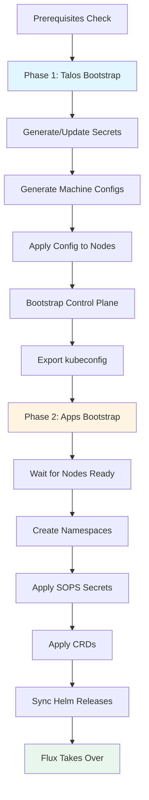

# Cluster Bootstrap Workflow

The cluster bootstrap process transforms fresh Talos nodes into a fully functional Kubernetes cluster managed by Flux GitOps. This workflow is deliberately split into two phases: **Talos cluster bootstrap** (`bootstrap:talos`) establishes the Kubernetes control plane, while **application bootstrap** (`bootstrap:apps`) installs essential infrastructure components and hands off management to Flux.

## Bootstrap Overview



## Phase 1: Talos Bootstrap (`bootstrap:talos`)

The first phase bootstraps the Talos Linux cluster from machine configuration generation through control plane initialization.

### Prerequisites

The `talos` task in `.taskfiles/bootstrap/Taskfile.yaml#L7-L21` enforces these preconditions:

**Required Files** (`.taskfiles/bootstrap/Taskfile.yaml#L16-L18`)
- `.sops.yaml` - SOPS encryption rules for secret generation
- `age.key` (via `SOPS_AGE_KEY_FILE`) - Age private key for decrypting/generating secrets
- `talos/talconfig.yaml` - Talhelper cluster configuration

**Required CLI Tools** (`.taskfiles/bootstrap/Taskfile.yaml#L20`)
- `talhelper` - Generates machine configs and Talos commands
- `talosctl` - Talos cluster management CLI
- `sops` - Secret encryption/decryption

### Execution Steps

The `talos` task executes the following sequence (`.taskfiles/bootstrap/Taskfile.yaml#L10-L15`):

**1. Generate or Update Talos Secrets** (`.taskfiles/bootstrap/Taskfile.yaml#L11`)
```bash
[ -f talsecret.sops.yaml ] || talhelper gensecret | sops --filename-override talos/talsecret.sops.yaml --encrypt /dev/stdin > talsecret.sops.yaml
```
- Checks if `talos/talsecret.sops.yaml` already exists
- If missing, generates new cluster secrets and encrypts them with age
- Secrets include cluster ID, bootstrap tokens, and encryption keys

**2. Generate Machine Configurations** (`.taskfiles/bootstrap/Taskfile.yaml#L12`)
```bash
talhelper genconfig
```
- Reads `talos/talconfig.yaml` and `talos/talenv.yaml`
- Merges patches from `talos/patches/` directory
- Generates node-specific machine configs in `talos/clusterconfig/`
- Applies global and controller-specific patches

**3. Apply Machine Configs to Nodes** (`.taskfiles/bootstrap/Taskfile.yaml#L13`)
```bash
talhelper gencommand apply --extra-flags="--insecure" | bash
```
- Applies generated machine configurations to each node defined in `talconfig.yaml`
- Uses `--insecure` flag for initial node communication (nodes not yet trusted)
- Establishes network configuration, disk partitioning, and base system settings

**4. Bootstrap the Control Plane** (`.taskfiles/bootstrap/Taskfile.yaml#L14`)
```bash
until talhelper gencommand bootstrap | bash; do sleep 10; done
```
- Initializes the Kubernetes control plane on the first control plane node
- Retries with 10-second intervals until successful
- Creates etcd cluster, initializes API server, and starts controller manager
- This is a one-time operation per cluster

**5. Export kubeconfig** (`.taskfiles/bootstrap/Taskfile.yaml#L15`)
```bash
until talhelper gencommand kubeconfig --extra-flags="{{.ROOT_DIR}} --force" | bash; do sleep 10; done
```
- Retrieves admin kubeconfig from the Talos API
- Writes to `./kubeconfig` in repository root
- Retries until control plane is ready to serve the request
- Sets `KUBECONFIG` environment variable for subsequent operations

### Talos Configuration Structure

The `talos/talconfig.yaml` file defines the cluster blueprint:

**Cluster Settings** (`talos/talconfig.yaml#L3-L15`)
- `clusterName`: Kubernetes cluster identifier
- `talosVersion` and `kubernetesVersion`: Pinned versions from `talenv.yaml`
- `endpoint`: VIP address for API server access
- `clusterPodNets` and `clusterSvcNets`: Pod and service CIDRs
- `cniConfig.name: none`: Disables built-in CNI (Cilium installed later)

**Node Definitions** (`talos/talconfig.yaml#L21-L64`)
Each node specifies:
- Hostname and IP address
- Disk selector for installation
- Secure boot configuration
- Kernel modules (e.g., `i915` for Intel GPU support)
- Network interfaces with VIP configuration
- Inline manifests for machine-level configuration

**Patches** (`talos/talconfig.yaml#L65-L84`)
- Global patches applied to all nodes (sysctls, time, udev, etc.)
- Controller patches for cluster-level settings
- System extensions for hardware support

## Phase 2: Application Bootstrap (`bootstrap:apps`)

After Talos bootstrap completes and `kubeconfig` is available, the second phase installs essential infrastructure components.

### Prerequisites

The `apps` task in `.taskfiles/bootstrap/Taskfile.yaml#L22-L31` validates:

**Environment Variables** (`scripts/bootstrap-apps.sh#L138`)
- `KUBECONFIG` - Points to valid Kubernetes credentials
- `TALOSCONFIG` - Required for Talos operations

**Required Files** (`.taskfiles/bootstrap/Taskfile.yaml#L28-L30`)
- `.sops.yaml` - SOPS configuration for secret decryption
- `scripts/bootstrap-apps.sh` - Bootstrap script
- `age.key` (via `SOPS_AGE_KEY_FILE`) - Age private key

**Required CLI Tools** (`scripts/bootstrap-apps.sh#L139`)
- `helmfile` - Helm release orchestration
- `kubectl` - Kubernetes cluster management
- `kustomize` - Kustomize rendering
- `sops` - Secret decryption
- `talhelper` - Talos helper commands
- `yq` - YAML processing

**macOS Bash Requirement** (`.taskfiles/bootstrap/Taskfile.yaml#L26-L27`)
- Modern bash from Homebrew (`/opt/homebrew/bin/bash` or `/usr/local/bin/bash`)
- macOS ships with bash 3.2 which is incompatible with the scripts

### Execution Steps

The `bootstrap-apps.sh` script executes this sequence (`scripts/bootstrap-apps.sh#L137-L148`):

**1. Wait for Nodes** (`scripts/bootstrap-apps.sh#L10-L24`)
```bash
wait_for_nodes
```
- Checks if all nodes are `Ready=True` (already operational)
- If not, waits for all nodes to reach `Ready=False` (Talos bootstrap phase)
- This accommodates Talos behavior where nodes report `Ready=False` during initial bootstrap
- Retries every 10 seconds with informative logging

**2. Create Namespaces** (`scripts/bootstrap-apps.sh#L27-L54`)
```bash
apply_namespaces
```
- Iterates through `kubernetes/apps/*/` directories
- Creates a namespace for each directory
- Uses server-side apply with dry-run client to generate manifests
- Skips namespaces that already exist
- Example: creates `kube-system`, `flux-system`, `cert-manager`, etc.

**3. Apply SOPS Secrets** (`scripts/bootstrap-apps.sh#L57-L85`)
```bash
apply_sops_secrets
```
Decrypts and applies these encrypted secrets (`scripts/bootstrap-apps.sh#L60-L64`):
- `bootstrap/github-deploy-key.sops.yaml` - Flux Git authentication
- `kubernetes/components/common/sops/cluster-secrets.sops.yaml` - Cluster-wide values
- `kubernetes/components/common/sops/sops-age.sops.yaml` - Age key for Flux decryption

Each secret:
- Checks if already up-to-date using `sops exec-file` with `kubectl diff`
- Applies with server-side apply to `flux-system` namespace if changed
- Uses `sops exec-file` to decrypt in-memory without writing plaintext to disk

**4. Apply CRDs** (`scripts/bootstrap-apps.sh#L88-L118`)
```bash
apply_crds
```
Installs essential CRDs before applications (`scripts/bootstrap-apps.sh#L91-L105`):
- **External DNS CRDs** (v0.21.0) - `dnsendpoints.externaldns.k8s.io`
- **Gateway API CRDs** (v1.6.1) - Experimental Gateway API resources
- Notes indicate these are also managed by Flux but duplicated here for bootstrap safety

Each CRD:
- Checks if up-to-date using `kubectl diff`
- Applies with server-side apply if changed
- Required for Cilium (Gateway API) and subsequent applications

**5. Sync Helm Releases** (`scripts/bootstrap-apps.sh#L121-L135`)
```bash
sync_helm_releases
```
Executes `bootstrap/helmfile.yaml` with `helmfile sync`:
- Installs Helm charts in dependency order
- Uses atomic updates (rollback on failure)
- Waits for resources to be ready
- Waits for jobs to complete

**Bootstrap Helm Releases** (`bootstrap/helmfile.yaml#L14-L52`)
- **Cilium** (kube-system) - CNI plugin, depends on Gateway API CRDs
- **CoreDNS** (kube-system) - Cluster DNS, depends on Cilium
- **cert-manager** (cert-manager) - Certificate management, depends on CoreDNS
- **flux-operator** (flux-system) - Flux operator, depends on cert-manager
- **flux-instance** (flux-system) - Flux instance, depends on flux-operator

After flux-instance starts, it begins reconciling the Git repository and takes over management of all resources under `kubernetes/apps/`.

### Completion

The script concludes with (`scripts/bootstrap-apps.sh#L148`):
```bash
log info "Congrats! The cluster is bootstrapped and Flux is syncing the Git repository"
```

At this point, the cluster is fully operational and Flux is continuously reconciling the cluster state with the Git repository.

## Bootstrap Commands Summary

**Full Cluster Bootstrap** (new installations)
```bash
task bootstrap:talos    # Phase 1: Talos cluster
task bootstrap:apps     # Phase 2: Infrastructure apps
```

**Regenerate Configuration Only** (after modifying `talconfig.yaml`)
```bash
task talos:generate-config
```

**Apply Configuration to Single Node** (rolling updates)
```bash
task talos:apply-node IP=<node-ip>
```

## Verification Steps

After completing both bootstrap phases:

**1. Verify Node Status**
```bash
kubectl get nodes -o wide
```
All nodes should show `Ready` status with correct versions.

**2. Verify Pod Operation**
```bash
kubectl get pods -A
```
All pods in `kube-system`, `cert-manager`, and `flux-system` should be running or completed.

**3. Verify Flux Reconciliation**
```bash
flux get kustomizations --all-namespaces
```
All Kustomizations should show `True` status.

**4. Verify Cluster Components**
```bash
kubectl get apiservices
kubectl get crds | grep -E 'gateway|externaldns|cert-manager'
```
Essential API services and CRDs should be available.

## Failure Recovery

**Talos Bootstrap Failures**

If `bootstrap:talos` fails:
1. Check node accessibility: `talosctl --nodes <node-ip> version`
2. Verify machine configs: `ls talos/clusterconfig/`
3. Check Talos bootstrap logs: `talosctl --nodes <node-ip> logs`
4. Re-run the task - it's idempotent and will retry until successful

**Apps Bootstrap Failures**

If `bootstrap:apps` fails:
1. Check `KUBECONFIG` is valid: `kubectl cluster-info`
2. Verify SOPS decryption: `sops decrypt bootstrap/github-deploy-key.sops.yaml`
3. Check namespace creation: `kubectl get namespaces`
4. Re-run the task - it checks resource state before applying

**Flux Failures After Bootstrap**

If Flux doesn't start syncing:
1. Check flux-instance logs: `kubectl logs -n flux-system deployment/flux-instance`
2. Verify Git repository credentials: `kubectl get secret -n flux-system`
3. Force reconciliation: `task reconcile`

## Relationship to Other Workflows

The bootstrap workflow integrates with several operational procedures:

- **Flux Architecture** ([`/openwiki/concepts/flux-architecture.md`](/openwiki/concepts/flux-architecture.md)) - After bootstrap, Flux manages all applications through the reconciliation hierarchy
- **Secrets Management** ([`/openwiki/concepts/secrets-management.md`](/openwiki/concepts/secrets-management.md)) - Bootstrap decrypts and applies SOPS secrets that Flux uses for runtime decryption
- **Daily Operations** ([`/openwiki/operations/daily-operations.md`](/openwiki/operations/daily-operations.md)) - Post-bootstrap, operational tasks like node upgrades and configuration updates use the same tools (`talhelper`, `talosctl`)

## Security Considerations

**Secret Management**
- Age private key (`age.key`) must exist before bootstrap starts
- Talos secrets (`talsecret.sops.yaml`) are encrypted at rest
- SOPS secrets are decrypted in-memory only during application
- Never commit plaintext secrets to the repository

**Network Security**
- Initial node communication uses `--insecure` flag
- After bootstrap, all communication uses mutually authenticated TLS
- VIP configuration ensures high availability for API server access

**Access Control**
- `kubeconfig` exported to repository root with admin permissions
- Restrict file permissions on `age.key` and `kubeconfig`
- Flux uses deploy key for Git repository access with minimal scope
