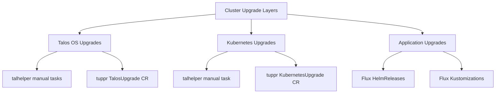
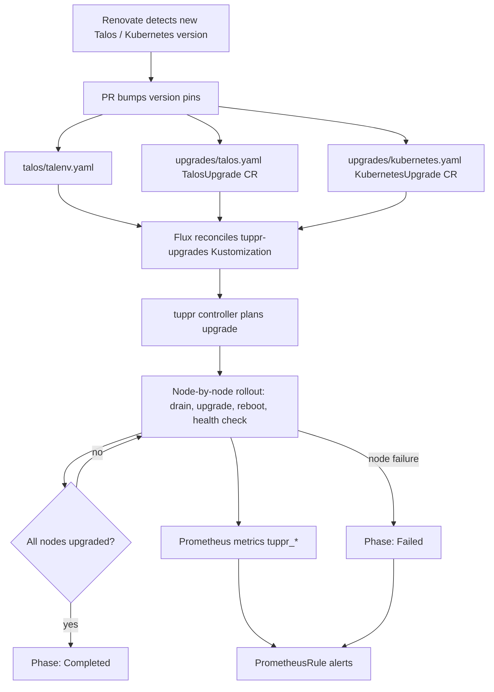
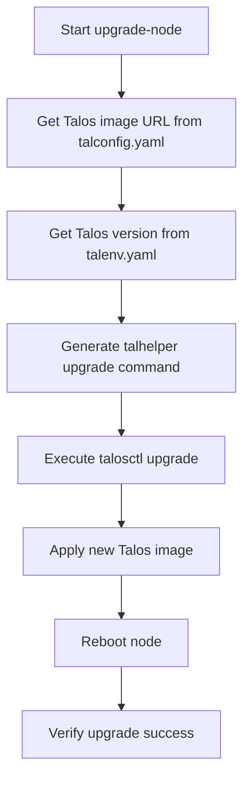
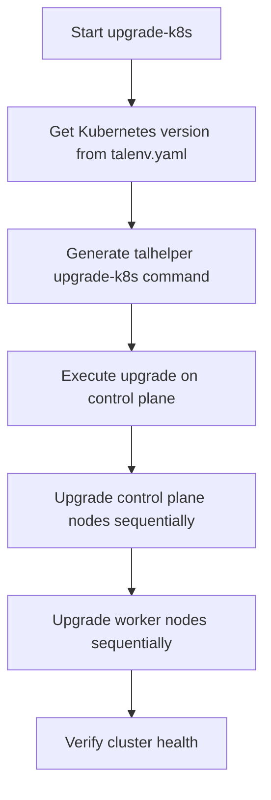
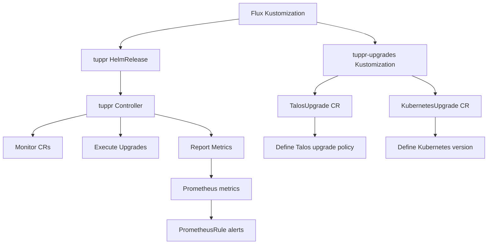
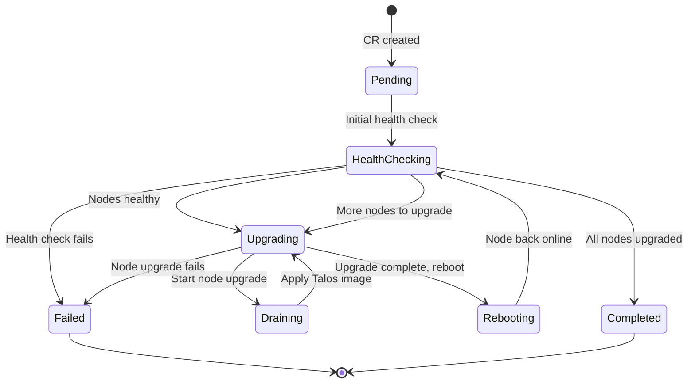
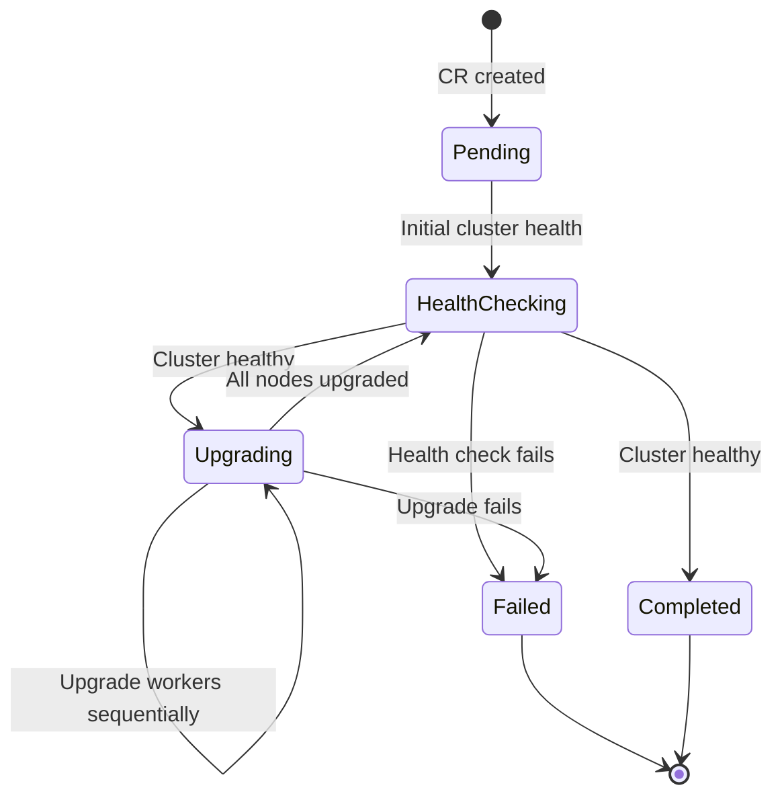

# Cluster Upgrade Workflow

This document describes the upgrade processes for the Talos Linux Kubernetes cluster, covering three main upgrade layers: Talos OS upgrades, Kubernetes upgrades, and application upgrades. The cluster uses both manual talhelper-based workflows and the tuppr automation system for coordinated upgrades.

## Upgrade Overview

The cluster supports rolling upgrades at multiple layers:



- **Talos Upgrades**: Per-node OS upgrades via `task talos:upgrade-node` or tuppr automation
- **Kubernetes Upgrades**: Cluster-wide via `task talos:upgrade-k8s` or tuppr automation
- **Application Upgrades**: Automated via Flux HelmRelease reconciliation

Version pins are maintained in `talos/talenv.yaml` and `talos/talconfig.yaml` with Renovate annotations for automated dependency tracking.

### End-to-End Automated Upgrade Flow

The automated path ties Renovate, the talenv/tuppr CR version pins, tuppr's plan-and-execute loop, and Prometheus alerting together:



*Figure: Renovate-driven version bump through tuppr planning, node-by-node upgrade, and PrometheusRule alerting on failure or stall.*

The manual path bypasses tuppr entirely: a Renovate-merged `talenv.yaml` bump is consumed directly by `task talos:upgrade-node` / `task talos:upgrade-k8s`, which read the versions via `yq` at execution time.

## Talhelper-Based Manual Upgrades

The cluster uses talhelper as a wrapper around Talos and Kubernetes upgrade operations. These tasks are defined in `.taskfiles/talos/Taskfile.yaml` and provide manual control over upgrade timing and scope.

### Talos OS Upgrade

Upgrade Talos on a single node with minimal disruption:

```bash
task talos:upgrade-node IP=<node-ip>
```

**Example:**
```bash
task talos:upgrade-node IP=192.168.50.145
```

#### Upgrade Process

The `upgrade-node` task performs a rolling upgrade with a 10-minute timeout:



**Task internals** (`.taskfiles/talos/Taskfile.yaml#L31-L46`):
- Retrieves the Talos image URL for the specific node from `talconfig.yaml`
- Retrieves the target Talos version from `talenv.yaml`
- Runs `talhelper gencommand upgrade` with `--image` and `--timeout=10m` flags
- Performs a rolling upgrade (drains if worker, applies, reboots, uncordons)

**Prerequisites:**
- Node must be accessible via `talosctl`
- `talosconfig` must be configured
- Talos helper tools (`talhelper`, `talosctl`, `yq`) must be available
- Node must be healthy before upgrade

**Best Practices:**
- Upgrade one node at a time in multi-node clusters
- Monitor upgrade progress with `talosctl --nodes <ip> version`
- Verify post-upgrade health: all pods running, no resource warnings
- Talos upgrades can be rolled back via `talosctl rollback` if needed

### Kubernetes Upgrade

Upgrade Kubernetes cluster-wide to the version specified in `talos/talenv.yaml`:

```bash
task talos:upgrade-k8s
```

#### Upgrade Process

The `upgrade-k8s` task upgrades Kubernetes across all nodes:



**Task internals** (`.taskfiles/talos/Taskfile.yaml#L48-L58`):
- Retrieves the target Kubernetes version from `talenv.yaml`
- Runs `talhelper gencommand upgrade-k8s` with `--to` flag
- Applies updated kubelet configurations to all nodes
- Upgrades control plane first, then workers

**Prerequisites:**
- All nodes must be healthy
- No ongoing upgrades
- Recent VolSync snapshots of critical data
- Sufficient cluster capacity during upgrade

**Best Practices:**
- Test in staging environment if possible
- Take VolSync snapshots before upgrading
- Schedule upgrades during low-traffic periods
- Monitor progress with `kubectl get nodes`
- Kubernetes upgrades are difficult to rollback (may require cluster re-bootstrap)

## Tuppr Automation System

The cluster uses tuppr, a Kubernetes controller for automated Talos and Kubernetes upgrades. Tuppr is deployed via Flux in the `kube-system` namespace and manages upgrade lifecycle through custom resources.

### Tuppr Architecture



**Components:**
- **OCIRepository** (`kubernetes/apps/kube-system/system-upgrade/tuppr/ocirepository.yaml`): Fetches the tuppr chart from `oci://ghcr.io/home-operations/charts/tuppr`, pinned to tag `0.5.4`, reconciling every 1h, with `layerSelector` copying only the Helm chart tarball layer (`application/vnd.cncf.helm.chart.content.v1.tar+gzip`)
- **HelmRelease** (`kubernetes/apps/kube-system/system-upgrade/tuppr/helmrelease.yaml`): Deploys the tuppr controller via `chartRef` pointing at the `tuppr` OCIRepository, reconciling every 30m with `replicaCount: 1` and a Prometheus `serviceMonitor` enabled
- **Custom Resources**: `TalosUpgrade` and `KubernetesUpgrade` CRs define upgrade specifications
- **PrometheusRule**: Monitors upgrade progress and fires alerts on failures

### Talos Upgrade Automation

The `TalosUpgrade` custom resource defines automated Talos OS upgrades:

```yaml
apiVersion: tuppr.home-operations.com/v1alpha1
kind: TalosUpgrade
metadata:
  name: talos
spec:
  talos:
    version: v1.12.7
  policy:
    rebootMode: powercycle
```

**Location:** `kubernetes/apps/kube-system/system-upgrade/upgrades/talos.yaml`

**Configuration:**
- `talos.version`: Target Talos version (tracked by Renovate via `# renovate: datasource=docker depName=ghcr.io/siderolabs/installer`)
- `policy.rebootMode`: Reboot strategy (`powercycle` for hard power cycle)

#### Tuppr Talos Upgrade Flow



**Upgrade phases:**
1. **Pending**: CR created, waiting for controller reconciliation
2. **HealthChecking**: Verifying node health before/after upgrades
3. **Upgrading**: Applying Talos image to nodes (one at a time)
4. **Draining**: Draining node if it's a worker
5. **Rebooting**: Rebooting node after upgrade
6. **Completed**: All nodes successfully upgraded
7. **Failed**: Upgrade failed, requires manual intervention

### Kubernetes Upgrade Automation

The `KubernetesUpgrade` custom resource defines automated Kubernetes upgrades:

```yaml
apiVersion: tuppr.home-operations.com/v1alpha1
kind: KubernetesUpgrade
metadata:
  name: kubernetes
spec:
  kubernetes:
    version: v1.35.4
```

**Location:** `kubernetes/apps/kube-system/system-upgrade/upgrades/kubernetes.yaml`

**Configuration:**
- `kubernetes.version`: Target Kubernetes version (tracked by Renovate via `# renovate: datasource=docker depName=ghcr.io/siderolabs/kubelet`)

#### Tuppr Kubernetes Upgrade Flow



**Upgrade phases:**
1. **Pending**: CR created, waiting for controller reconciliation
2. **HealthChecking**: Verifying cluster health before/after upgrades
3. **Upgrading**: Applying Kubernetes version to control plane, then workers
4. **Completed**: All nodes successfully upgraded
5. **Failed**: Upgrade failed, requires manual intervention

### Monitoring and Alerts

Tuppr exposes Prometheus metrics for monitoring upgrade progress and fires alerts on failures. The cluster deploys two PrometheusRule files for comprehensive monitoring:

**Detailed alerts** (`kubernetes/apps/kube-system/system-upgrade/tuppr/prometheusrule.yaml`):

**Talos upgrade alerts** (`tuppr/prometheusrule.yaml#L9-L49`):

| Alert | Condition | Severity | Description |
|-------|-----------|----------|-------------|
| `TalosUpgradeNodeFailed` | `tuppr_talos_upgrade_nodes_failed > 0` | Critical | Nodes failed to upgrade, upgrade stopped |
| `TalosUpgradeFailed` | `phase=Failed` | Critical | Upgrade entered Failed phase |
| `TalosUpgradeStuck` | In transient phase > 1h | Warning | Upgrade stuck in Draining/Rebooting/Upgrading |

**Kubernetes upgrade alerts** (`tuppr/prometheusrule.yaml#L51-L78`):

| Alert | Condition | Severity | Description |
|-------|-----------|----------|-------------|
| `KubernetesUpgradeFailed` | `phase=Failed` | Critical | Upgrade entered Failed phase |
| `KubernetesUpgradeStuck` | In transient phase > 45m | Warning | Upgrade stuck in Upgrading/HealthChecking |

**Upgrade job alerts** (`tuppr/prometheusrule.yaml#L80-L93`):

| Alert | Condition | Severity | Description |
|-------|-----------|----------|-------------|
| `UpgradeJobRunningTooLong` | Active job > 1h | Warning | Upgrade job exceeds expected duration |

**Simplified alerts** (`kubernetes/apps/kube-system/system-upgrade/upgrades/prometheusrule.yaml`):

| Alert | Condition | Severity | Description |
|-------|-----------|----------|-------------|
| `TupprUpgradeFailed` | `phase=Failed` for either upgrade type | Critical | Immediate alert on upgrade failure |
| `TupprUpgradeStuck` | In Progress phase with no node completions | Warning | Upgrade stuck for 30+ minutes |
| `TupprHealthCheckFailures` | Health check failure rate > 0.1/min | Warning | High health check failure rate |

### Recovering from Failed Tuppr Upgrades

When a tuppr upgrade fails:

1. **Identify the failure**:
   ```bash
   kubectl get talosupgrade talos -n kube-system
   kubectl get kubernetesupgrade kubernetes -n kube-system
   kubectl describe talosupgrade talos -n kube-system
   ```

2. **Check controller logs**:
   ```bash
   kubectl logs -n kube-system -l app.kubernetes.io/name=tuppr
   ```

3. **Fix the underlying issue** (network, node health, configuration)

4. **Reset the upgrade** with the reset annotation (see tuppr documentation for specific annotation format)

5. **Monitor recovery** via Prometheus metrics and alerts

## Application Upgrades

Application upgrades are automated through Flux GitOps reconciliation. No manual intervention is typically required.

### Flux HelmRelease Upgrades

Helm releases are automatically upgraded when:

1. Chart version changes in Git
2. Values change in Git
3. Image tags change (via Renovate PRs)

Flux handles the upgrade process:
- Pulls changes from Git
- Renders Helm templates
- Performs Helm upgrade
- Waits for resources to be ready
- Reports status via `flux get helmreleases`

### Manual Application Upgrade

To force an application upgrade outside the normal GitOps flow:

```bash
# Suspend automatic reconciliation
flux suspend helmrelease <name> -n <namespace>

# Make changes (e.g., update image tag manually)
kubectl set image deployment/<app> <container>=<image>:<tag> -n <namespace>

# Resume reconciliation
flux resume helmrelease <name> -n <namespace>
```

**Use cases:**
- Emergency hotfixes
- Testing specific versions
- Troubleshooting upgrade issues

## Upgrade Coordination and Best Practices

### Single-Node Architecture Constraints

The cluster's single-node architecture (`talos/talconfig.yaml` defines one control-plane node, `master0-nuc12`, with a VIP at `192.168.50.10` and Secure Boot enabled) imposes specific constraints on upgrades:

- **API server availability**: Control plane is unavailable during Talos upgrades
- **No rolling upgrades across control plane nodes**: Only one control plane node exists
- **Secure Boot image**: The node's `talosImageURL` is a `factory.talos.dev/installer-secureboot/...` image; upgrades must keep using the Secure Boot installer schematic
- **Downtime planning**: Schedule upgrades during low-traffic periods

**Mitigation strategies:**
- Use tuppr's health checking to verify cluster health before upgrades
- Ensure critical applications have VolSync backups before upgrades
- Monitor alerts closely during upgrade windows
- Plan for brief API server unavailability during Talos upgrades

### Pre-Upgrade Checklist

Before performing any upgrade:

1. **Verify cluster health**:
   ```bash
   kubectl get nodes
   kubectl get pods -A
   flux get kustomizations --all-namespaces
   ```

2. **Take VolSync snapshots** of critical applications:
   ```bash
   task volsync:snapshot APP=<app> NS=<namespace>
   ```

3. **Check for ongoing upgrades**:
   ```bash
   kubectl get talosupgrade -n kube-system
   kubectl get kubernetesupgrade -n kube-system
   ```

4. **Verify sufficient resources**:
   ```bash
   kubectl top nodes
   ```

5. **Review upgrade documentation** for target version

### Post-Upgrade Verification

After any upgrade, verify:

1. **Node versions**:
   ```bash
   talosctl --nodes <ip> version
   kubectl get nodes -o wide
   ```

2. **Pod health**:
   ```bash
   kubectl get pods -A
   ```

3. **Application functionality**:
   - Test critical applications
   - Check logs for errors
   - Verify connectivity

4. **Resource usage**:
   ```bash
   kubectl top nodes
   kubectl top pods -A
   ```

5. **Flux reconciliation status**:
   ```bash
   flux get kustomizations --all-namespaces
   flux get helmreleases --all-namespaces
   ```

### Rollback Procedures

**Talos rollback** (if upgrade fails):
```bash
talosctl --nodes <ip> rollback
```

**Kubernetes rollback** (difficult, may require cluster re-bootstrap):
- Not recommended
- Consider rebuilding cluster if Kubernetes upgrade fails catastrophically
- Always test Kubernetes upgrades in staging first

**Application rollback**:
```bash
# Via Flux (revert Git commit)
git revert <commit>
git push

# Via Helm (manual)
helm rollback <release> <revision> -n <namespace>
```

## Version Management

### Version Pins

Target versions are pinned in configuration files:

**Talos and Kubernetes versions** (`talos/talenv.yaml`):
```yaml
# renovate: datasource=docker depName=ghcr.io/siderolabs/installer
talosVersion: v1.12.7
# renovate: datasource=docker depName=ghcr.io/siderolabs/kubelet
kubernetesVersion: v1.35.4
```

**Tuppr CR versions** (synced with `talenv.yaml`):
- `kubernetes/apps/kube-system/system-upgrade/upgrades/talos.yaml#L9`: Talos version
- `kubernetes/apps/kube-system/system-upgrade/upgrades/kubernetes.yaml#L9`: Kubernetes version

### Renovate Integration

Renovate automatically tracks Talos and Kubernetes versions via `# renovate: datasource=docker depName=ghcr.io/siderolabs/installer` / `depName=ghcr.io/siderolabs/kubelet` annotations and opens PRs for updates. Its behavior is configured in `.renovaterc.json5`:

- **Schedule**: updates run `"every weekend"`; rate limiting is disabled and a dependency dashboard issue tracks pending updates
- **Ignore paths**: `**/*.sops.*` files are never touched (protecting encrypted secrets such as `talos/talsecret.sops.yaml`)
- **Semantic commits**: major updates produce `feat(...)!:` commits, minor `feat`, patch `fix`, with `currentVersion → newVersion` in the commit message
- **Auto-merge**: GitHub Actions and Mise tool updates auto-merge by branch for minor/patch/digest (Actions require 3-day release age); most other updates require review
- **Manager patterns**: flux/helm-values/kubernetes/kustomize managers scan `kubernetes/**/*.yaml` files

**PR validation** (`.github/workflows/flux-local.yaml`): pull requests touching `kubernetes/**` are validated with `flux-local test --enable-helm` and receive an automated `flux-local diff` comment for helmrelease/kustomization changes, so version-bump PRs are rendered and diffed before merge.

**Update workflow:**
1. Renovate detects new version
2. Creates PR with version bump
3. Review and test changes
4. Merge PR
5. Flux applies changes
6. tuppr or manual tasks execute upgrade

## Related Documentation

- **Talos Configuration**: `/openwiki/concepts/talos-config.md` - Talos configuration and version management
- **Talos Tasks**: `/openwiki/operations/talos-tasks.md` - Manual talhelper task details
